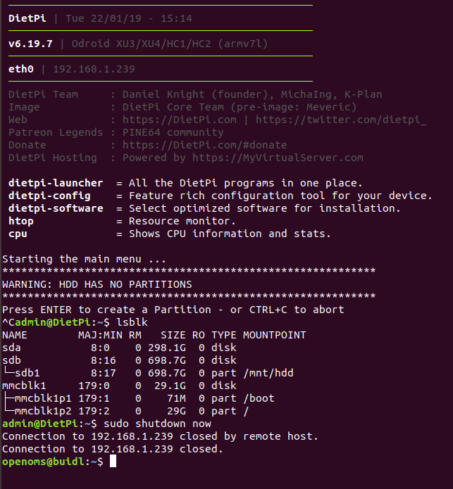

Working with the ODroid HC1 and this image: https://dietpi.com/downloads/images/DietPi_OdroidXU4-ARMv7-Stretch.7z

Getting started with DietPi: https://dietpi.com/phpbb/viewtopic.php?f=8&t=9#p9

Login to DietPi  
username = root  
password = dietpi  
DietPi also comes pre-installed with Dropbear SSH Server.

`ssh root@[IP-OF-DIETPI]`  
password: `dietpi`
Ok > Cancel > Cancel
automatic apt update & apt upgrade on first logon and reboots
Opt out of survey > Ok > Ok

`ssh root@[IP-OF-DIETPI]`

@@@@@@@@@@@@@@@@@@@@@@@@@@@@@@@@@@@@@@@@@@@@@@@@@@@@@@@@@@@
@    WARNING: REMOTE HOST IDENTIFICATION HAS CHANGED!     @
@@@@@@@@@@@@@@@@@@@@@@@@@@@@@@@@@@@@@@@@@@@@@@@@@@@@@@@@@@@

run (copy from the terminal output): `ssh-keygen -f "/home/buidl/.ssh/known_hosts" -R "dietpi.IP"`

`ssh root@[IP-OF-DIETPI]`  
Ok > Install fail2ban > Install > Ok  
Reboots again

`ssh root@[IP-OF-DIETPI]`
Now only the bash prompt opens

sudo apt install -y rsync (now added to the script)

use: wget https://raw.githubusercontent.com/[GITHUB-USERNAME]/raspiblitz/[BRANCH]/build.sdcard/raspbianStretchDesktop.sh && sudo bash raspbianStretchDesktop.sh [BRANCH] [GITHUB-USERNAME]

`wget https://raw.githubusercontent.com/openoms/HardwareNode/OdroidHC1Debug/build.sdcard/raspbianStretchDesktop.sh && sudo bash raspbianStretchDesktop.sh OdroidHC1Debug openoms`

password: raspiblitz

see my output: [sdcard_build_output](sdcard_build_output.html)  
The only fault appears to be with `fail2ban`
(this is solved if fail2ban is intalled from the DietPi software settings during the second boot)
 
`ssh admin@[IP-OF-DROIDBLITZ]`  
password: raspiblitz

The raspiblitz GUI and setup worked until it needed to get the blockchain data.

First attempted to connect the HDD of a RaspiBlitz with a powered USB to SATA adapter to the ODorid. 
The ODroid did not mount the 2nd HDD properly:
it appeared as `sdb` and as `sda` after reboot:


So instead just copied the blockchain manually on my main computer to the root /bitcoin folder. Reinserted the HDD to the ODroid and booted up

 
`ssh admin@[IP-OF-DROIDBLITZ]  
`./60finishHDD.sh` 

alternatively can edit the 50copyHDD.sh
`sudo nano 50copyHDD.sh`
change the 3 instances of `sdb1` to `sdb`


got this output here: [initial_setup_output](initial_setup_output.html)
and the same when tried again with a rebuilt sdcard.

Stuck here now (counting up linux time): 
```
Failed to connect to bus: No such file or directory
1548604569
LND not ready yet ... waiting another 60 seconds.
If this takes too long (more then 10min total) --> CTRL+c and report Problem
Failed to connect to bus: No such file or directory
1548604629
LND not ready yet ... waiting another 60 seconds.
If this takes too long (more then 10min total) --> CTRL+c and report Problem

```

