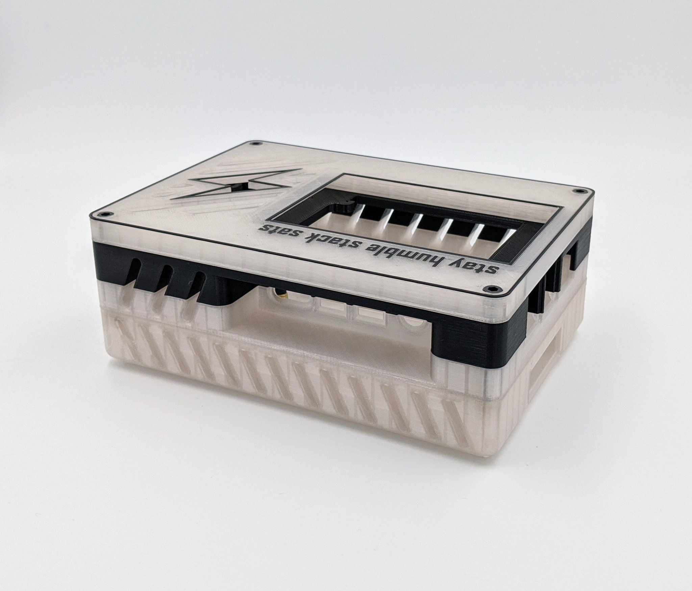
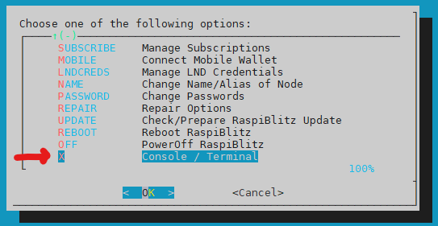
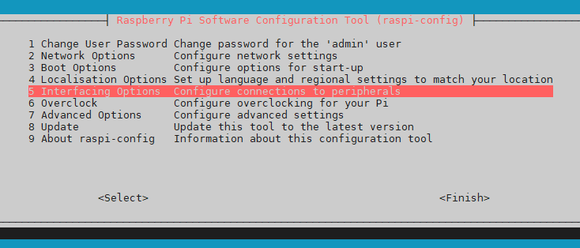
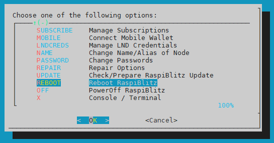
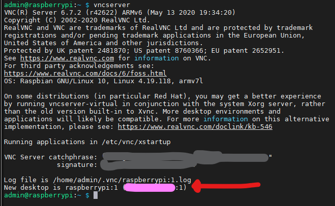

<!-- omit in toc -->
# FAQ - Frequently Asked Questions

- [Upgrade](#upgrade)
  - [Is using the prepared SD card image secure?](#is-using-the-prepared-sd-card-image-secure)
  - [What changed on every upgrade?](#what-changed-on-every-upgrade)
  - [How do I upgrade my RaspiBlitz?](#how-do-i-upgrade-my-raspiblitz)
  - [How to verify the SD card image after download?](#how-to-verify-the-sd-card-image-after-download)
  - [Why do I need to re-burn my SD card for an update?](#why-do-i-need-to-re-burn-my-sd-card-for-an-update)
  - [How can I update LND or bitcoind even before the next RaspiBlitz update?](#how-can-i-update-lnd-or-bitcoind-even-before-the-next-raspiblitz-update)

- [SSH](#ssh)
  - [What to do when on SSH I see "WARNING: REMOTE HOST IDENTIFICATION HAS CHANGED!"](#what-to-do-when-on-ssh-i-see-warning-remote-host-identification-has-changed)
  - [How do I unplug/shutdown safely without SSH](#how-do-i-unplugshutdown-safely-without-ssh)
  - [I cannot connect via SSH to my RaspiBlitz. What do I do?](#i-cannot-connect-via-ssh-to-my-raspiblitz-what-do-i-do)
  - [How to SSH over Tor?](#how-to-ssh-over-tor)
  - [How to setup port-forwarding with a SSH tunnel?](#how-to-setup-port-forwarding-with-a-ssh-tunnel)
  - [How do I setup just a port-forwarding user on my public server?](#how-do-i-setup-just-a-port-forwarding-user-on-my-public-server)
  - [How can I repair my SSH login?](#how-can-i-repair-my-ssh-login)

- [Debug](#debug)
  - [Can I flip the screen?](#can-i-flip-the-screen)
  - [How to fix my upside down LCD after update?](#how-to-fix-my-upside-down-lcd-after-update)
  - [Can I run the RaspiBlitz without a display/LCD?](#can-i-run-the-raspiblitz-without-a-displaylcd)
  - [I have the full blockchain on another storage. How do I copy it to the RaspiBlitz?](#i-have-the-full-blockchain-on-another-storage-how-do-i-copy-it-to-the-raspiblitz)
  - [How do I generate a Debug Report?](#how-do-i-generate-a-debug-report)
  - [Why is my "final sync" taking so long?](#why-is-my-final-sync-taking-so-long)
  - [How do I backup my Lightning Node?](#how-do-i-backup-my-lightning-node)
    - [1) Securing your On-Chain- and Channel-Funds during Operation](#1-securing-your-on-chain--and-channel-funds-during-operation)
    - [2) Making a complete LND data backup](#2-making-a-complete-lnd-data-backup)
  - [How can I recover my coins from a failing RaspiBlitz?](#how-can-i-recover-my-coins-from-a-failing-raspiblitz)
    - [1) Recover LND data](#1-recover-lnd-data)
    - [2) Recover from Wallet Seed](#2-recover-from-wallet-seed)
    - [How do I move funds & channels from RaspiBlitz to LND Lightning Desktop App?](#how-do-i-move-funds--channels-from-raspiblitz-to-lnd-lightning-desktop-app)
    - [How do I change the Name/Alias of my lightning node](#how-do-i-change-the-namealias-of-my-lightning-node)
    - [How do I change the public port LND/Lightning node is running on?](#how-do-i-change-the-public-port-lndlightning-node-is-running-on)
    - [How do I solve a "signature mismatch after caveat verification" error on LND?](#how-do-i-solve-a-signature-mismatch-after-caveat-verification-error)
  - [Why is my node not routing?](#why-is-my-node-not-routing)
  - [When using Auto-Unlock, how much security do I lose?](#when-using-auto-unlock-how-much-security-do-i-lose)
  - [I connected my HDD but it still says 'Connect HDD' on the display?](#i-connected-my-hdd-but-it-still-says-connect-hdd-on-the-display)
  - [How do I shrink the QR code for connecting my Shango/Zap/Zeus mobile phone?](#how-do-i-shrink-the-qr-code-for-connecting-my-shangozapzeus-mobile-phone)
  - [Why is my bitcoin IP on the display red?](#why-is-my-bitcoin-ip-on-the-display-red)
  - [Why is my node address on the display red?](#why-is-my-node-address-on-the-display-red)
  - [Why is my node address on the display yellow (not green)?](#why-is-my-node-address-on-the-display-yellow-not-green)
  - [How do I fix a displayed Error in my Config?](#how-do-i-fix-a-displayed-error-in-my-config)
  - [How do I find the IP address when running without a display?](#how-do-i-find-the-ip-address-when-running-without-a-display)
  - [Can I run the RaspiBlitz as Backend for BTCPayServer?](#can-i-run-the-raspiblitz-as-backend-for-btcpayserver)
  - [I don't have a LAN port on my Laptop - how do I connect to my RaspiBlitz?](#i-dont-have-a-lan-port-on-my-laptop---how-do-i-connect-to-my-raspiblitz)
  - [Is it possible to connect the Blitz over Wifi instead of using a LAN cable?](#is-it-possible-to-connect-the-blitz-over-wifi-instead-of-using-a-lan-cable)
  - [Can I directly connect the RaspiBlitz to my laptop?](#can-i-directly-connect-the-raspiblitz-to-my-laptop)
  - [How to attach the RaspberryPi to the HDD?](#how-to-attach-the-raspberrypi-to-the-hdd)
  - [What other case options do I have?](#what-other-case-options-do-i-have)
  - [Are those "Under-Voltage detected" warnings a problem?](#are-those-under-voltage-detected-warnings-a-problem)
  - [How do I return to the menu after exiting to the command line](#how-do-i-return-to-the-menu-after-exiting-to-the-command-line)
  - [How do I setup fresh/clean/reset and without going into recovery mode?](#how-do-i-setup-freshcleanreset-and-without-going-into-recovery-mode)
  - [My blockchain data is corrupted - what can I do?](#my-blockchain-data-is-corrupted---what-can-i-do)
  - [I have two RaspiBlitz in my network - can they both be public?](#i-have-two-raspiblitz-in-my-network---can-they-both-be-public)
  - [How can I enforce UASP mode for my SSD controller?])(#how-can-I-enforce-UASP-mode-for-my-SSD-controller)

- [Development](#development)
  - [What is the process of creating a new SD card image release?](#what-is-the-process-of-creating-a-new-sd-card-image-release)
  - [How can I customize my RaspiBlitz or add other software?](#how-can-i-customize-my-raspiblitz-or-add-other-software)
  - [Versioning](#versioning)
  - [GitHub Workflow](#github-workflow)
  - [Can I run RaspiBlitz on other computers than RaspberryPi?](#can-i-run-raspiblitz-on-other-computers-than-raspberrypi)
  - [How can I build an SD card from another branch?](#how-can-i-build-an-sd-card-from-another-branch)
  - [How can I build an SD card from my forked GitHub Repo?](#how-can-i-build-an-sd-card-from-my-forked-github-repo)
  - [How can I checkout a new branch from the RaspiBlitz repo to my forked repo?](#how-can-i-checkout-a-new-branch-from-the-raspiblitz-repo-to-my-forked-repo)
  - [How can I sync a branch of my forked GitHub with my local RaspiBlitz?](#how-can-i-sync-a-branch-of-my-forked-github-with-my-local-raspiblitz)
  - [How contribute a feature/change from my forked branch back to the RaspiBlitz repo?](#how-contribute-a-featurechange-from-my-forked-branch-back-to-the-raspiblitz-repo)
  - [How can I help testing a Pull Request?](#how-can-i-help-testing-a-pull-request)

- [Extras](#extras)
  - [How do I connect a UPS to the RaspiBlitz?](#how-do-i-connect-a-ups-to-the-raspiblitz)
  - [Can I run my RaspiBlitz on Solar Energy?](#can-i-run-my-raspiblitz-on-solar-energy)
  - [How to use the Let's Encrypt client](#how-to-use-the-lets-encrypt-client)
    - [Let's Encrypt - HTTP-01](#lets-encrypt---http-01)
    - [Let's Encrypt - DNS-01](#lets-encrypt---dns-01)
    - [Let's Encrypt - eMail Address](#lets-encrypt---email-address)
    - [Let's Encrypt - Installation details](#lets-encrypt---installation-details)
  - [What is this mnemonic seed word list?](#what-is-this-mnemonic-seed-word-list)
  - [How do I set up VNC?](#how-do-i-set-up-vnc)
  - [Why use BTRFS on RaspiBlitz?](#why-use-btrfs-on-raspiblitz)
    - [Storing your important Data in RAID1 with a USB Thumb Drive](#storing-your-important-data-in-raid1-with-a-usb-thumb-drive)
    - [Snapshotting the Blockchain](#snapshotting-the-blockchain)
    - [How do I use BTRFS on RaspiBlitz?](#how-do-i-use-btrfs-on-raspiblitz)
    - [How to recover a BTRFS partition?](#how-to-recover-a-btrfs-partition)
---

## Upgrade

### Is using the prepared SD card image secure?

Using pre-built software almost always shifts trust to the one who made the binary. But at least you can check with the SHA checksum after downloading to verify that the image downloaded is really the one offered by the GitHub repo. To do so, make a quick check that your browser is really on the correct GitHub page, and that the HTTPS of the GitHub page is signed by 'DigiCert'. Then compare the SHA-256 string (always next to the download link of the image on the README) with the result of the command `shasum -a 256 [DOWNLOADED-FILE-TO-CHECK]` (Mac/Linux). Still, this is not optimal and if at least some people from the community request it, I will consider signing the download as an author for the future.

The best way would be to build the SD card yourself. You use the script `build_sdcard.sh` for this. Take a few minutes to check if you see anything suspicious in that build script and then follow the [README](README.md#build-the-sd-card-image) on this.

### What changed on every upgrade?

See the [CHANGES.md](CHANGES.md) file for details.

### How do I upgrade my RaspiBlitz?

The upgrade should be quite simple - you don't need to close any channels:

- It would be best to get a second 16GB or 32GB SD card - but you can also reuse your old one
- In the SSH main menu of you RaspiBlitz choose `UPDATE` & follow the dialogs until shutdown
- Download the new RaspiBlitz image file from the [GitHub README](https://github.com/rootzoll/raspiblitz/blob/dev/README.md#installing-the-software)
- Write the new image to the (new) SD card with a tool like [balena etcher](https://www.balena.io/etcher/)
- RaspiBlitz with new SD card image - it now goes through a recover/update phase - this may take some time.
- Once that's done, login once via SSH and use the password raspiblitz and set a new password A (can be your old one or a new one).

After the final reboot your RaspiBlitz should be ready, running the new RaspiBlitz version.

### How to verify the SD card image after download?

You can do a quick check to verify that the sha256 hash of the file you downloaded is the same as the sha256 hash mentioned below the download link, or use the torrent download which will also check the file for a checksum after download. But this does not prove to you that the SD card image was actually built by the lead developer of the RaspiBlitz project.

To verify that the download was actually signed by [rootzoll](https://keybase.io/rootzoll) you need to use GPG and import the following public key:

```
curl https://keybase.io/rootzoll/pgp_keys.asc | gpg --import
```

Next, download the "signature file" for the SD card image. It's the same download link as for the image file - just added a `.sig` at the end. You should also always find the download link for the signature file in the README right below the image download link following the `SIGNATURE` link.

If you know have all the three elements needed - the imported public key, the image signature and the image file itself - you can verify the download with:

```
gpg --verify [SIGNATURE-FILE] [IMAGE-FILE]
```

As a result you should see a "good signature" message with a main fingerprint the same as you can find on the [keybase.io/rootzoll](https://keybase.io/rootzoll) that is ending on `1C73 060C 7C17 6461`. If that fingerprint is correct, the SD card image you downloaded is a original release RaspiBlitz.

### Why do I need to re-burn my SD card for an update?

I know it would be nicer to run just an update script and be ready to go. But then the scripts would need to be written in a much more complex way to be able to work with any versions of LND and Bitcoind (they are already complex enough with all the edge cases) and testing would become even more time consuming than it is now. That's not something that a single developer can deliver.

For some, it might be a pain point to make an update by re-burning a new SD card - especially if you added your own scripts or made changes to the system - but that's by design. It's a way to enforce a "clean state" with every update - the same state that I tested and developed the scripts with. The reason for that pain: I simply cannot write and support scripts that run on every modified system forever - that's simply too much work.

With the SD card update mechanism I reduce complexity, I deliver a "clean state" OS, LND/Bitcoind and the scripts tightly bundled together exactly in the dependency/combination like I tested them and it's much easier to reproduce bug reports and give support that way.

Of course, people should modify the system, add own scripts, etc ... but if you want to also have the benefit of the updates of the RaspiBlitz, you have two ways to do it:

1. Contribute your changes back to the main project as pull requests so that they become part of the next update - the next SD card release.

2. Make your changes so that they survive an SD card update easily - put all your scripts and extra data onto the HDD, AND document for yourself how to activate them again after an update. The file `/mnt/hdd/app-data/custom-installs.sh` runs with sudo rights after an update/recovery from a fresh SD card. This is the place to put all the install commands, cronjobs or editing of system configs for your personal modifications of RaspiBlitz.

*BTW there is a beneficial side effect when updating with a new SD card: You also get rid of any malware or system bloat that happened in the past. You start with a fresh system :)*

### How can I update LND or bitcoind even before the next RaspiBlitz update?

Try updating before a official RaspiBlitz at your own risk - you can find some info about that here:
https://stadicus.github.io/RaspiBolt/raspibolt_faq.html#how-to-upgrade-bitcoin-core


## SSH

### What to do when on SSH I see "WARNING: REMOTE HOST IDENTIFICATION HAS CHANGED!"

This means that he public SSH key of the RaspiBlitz has changed to the one you logged in with the last time under that IP.

It's OK when happening during an update - when you changed the SD card image. If it's really happening out of the blue - check your local network setup for a problem. Maybe the local IP of your RaspiBlitz changed? Is there a second RaspiBlitz connected? It's a security warning, so at least take some time to check if anything is strange. But also don't immediately panic - when it's in your local network, normally it's some network thing - not an intruder.

To fix this and to be able to login with SSH again, you have to remove the old public key for that IP from your local client computer. Just run the following command (with the replaced IP of your RaspiBlitz): `ssh-keygen -R IP-OF-YOUR-RASPIBLITZ` or remove the line for this IP manually from the known_hosts file (see the path to the file in the warning message).

After that, you should be able to login with SSH again.

### How do I unplug/shutdown safely without SSH

Just removing power from the RaspiBlitz can lead to data corruption if the HDD is right in the middle of a writing process. The safest way is always to SSH into the RaspiBlitz and use the "POWER OFF" option in the main menu.

But if cannot login with SSH and you need to power off at least remove the LAN cable (network connection)first for sometime (around 10-30 secs - until you can see no more blinking lights on the HDD) and then remove the power cable. This should minimize the risk if data corruption in this situations.

### I cannot connect via SSH to my RaspiBlitz. What do I do?

- Check the command again with how it shows on the display  - do you have it typed in correctly?
- Replace `ssh` with `sudo ssh` and try it (laptop admin password might be required).

If that doesn't work, try to ping the IP of the RaspiBlitz with `ping [IP-of-RaspiBlitz]`. If you get no response on the ping requests and the device is not reachable, try this check list:

- Make sure that your RaspiBlitz and your laptop are really on the same local network
- Check if you have a VPN running on your laptop - some VPNs block local network
- Some Routers have `IP Isolation` switched on - not allowing two devices to connect

If you've checked those and SSH is still not working: Join the conversation on [GitHub Issue #420](https://github.com/rootzoll/raspiblitz/issues/420).

### How to SSH over Tor?

SSH is already encrypted, why would I want to use it with Tor?
* Remote access when away from LAN.
* Anonymized access - Someone sniffing the traffic don't know where the server you are establishing a connection is, not the server side knows where the client is.

Create Hidden Service:
`bash /home/admin/config.scripts/internet.hiddenservice.sh ssh 22 22`

SSH over Tor:
`torsocks ssh admin@HiddenServiceAddress.onion`

Get the address:
`sudo cat /mnt/hdd/tor/ssh/hostname`

### How to setup port-forwarding with a SSH tunnel?

To use a public server for port-forwarding thru a SSH tunnel you can use the following experimental script on the RaspiBlitz (since v1.2):

`/home/admin/config.scripts/internet.sshtunnel.py`

But first you need to make sure that the public server you are using is supporting SSH reverse-tunneling and authentication by public authorized key. Check the `/etc/ssh/sshd_config` on the public server. It should contain the following settings:

```
RSAAuthentication yes
PubkeyAuthentication yes
GatewayPorts yes
AllowTcpForwarding yes
ClientAliveInterval 60
ClientAliveCountMax 2
```

*Last two parameters were added as used in the ssh tunnel demo at #GPN19 https://media.ccc.de/v/gpn19-76-einen-server-daheim-ohne-ffentliche-ipv4-adresse#t=911*

You can add those at the end of the file, save and reboot.

On the RaspiBlitz you can then setup for example to forward the gRPC port 10009 (internal port) to the port 20009 on the public server (external port) with the user = `test` and server address = `raspiblitz.com` with the following command:

`/home/admin/config.scripts/internet.sshtunnel.py on test@raspiblitz.com "10009<20009"`

You can even set multiple port forwardings like with:

`/home/admin/config.scripts/internet.sshtunnel.py on test@raspiblitz.com "10009<20009" "8080<9090"`

Please be aware that after you set such a port forwarding you will need to set the domain of the public server as a `DynamicDNS` name (leave update url empty) and then connect mobile wallets fresh, or export the macaroons/certs again. When connecting the mobile wallets you may need to adjust ports manually after QR code scan. And if you SSH tunnel the LND node port `9735` you may also need to set the custom LND port script and maybe also a manual set of the domain in the LND service would be needed. This all is very experimental at the moment ... better integration will come in the future.

To switch this SSH tunneling off again use:

`/home/admin/config.scripts/internet.sshtunnel.py off` and also deactivate the DynamicDNS again.

To check if a tunnel is running on the tunneling server check: `netstat -tulpn`

### How do I setup just a port-forwarding user on my public server?

Make sure the `/etc/ssh/sshd_config` has the following lines at the end:

```
RSAAuthentication yes
PubkeyAuthentication yes
GatewayPorts yes
AllowTcpForwarding yes
AuthorizedKeysFile  /etc/ssh/authorized_keys/%u
```

The last one stores all authorized_keys in one directory with a file per user. See https://serverfault.com/questions/313465/is-a-central-location-for-authorized-keys-a-good-idea#424659 To prepare this run:
```
mkdir /etc/ssh/authorized_keys
groupadd forwardings
```

To add a forwarding user run:
```
useradd -g forwardings -d /home [USERNAME]
echo 'command="date" [CONTENT-OF-RASPIBLITZ-ROOT-SSH-PUBKEY]' > /etc/ssh/authorized_keys/[USERNAME]
```

The `[CONTENT-OF-RASPIBLITZ-ROOT-SSH-PUBKEY]` you get when running the `internet.sshtunnel.py` script on the RaspiBlitz (see above). Now restart the RaspiBlitz. The server should not need a restart after adding a additional forwarding user.

To check if a tunnel is running on on server check: `netstat -tulpn`

To check for any errors on RaspiBlitz after restart check logs: `sudo journalctl -f -u autossh-tunnel.service`

### How can I repair my SSH login?

If you cannot login via SSH into your RaspiBlitz your SSH RaspiBlitz certs might be corrupted. To renew and reset those do the following (since version 1.5):

- shutdown the RaspiBlitz - if you dont have touchscreen activated, disconnect LAN cable, wait until HDD/SSD activity slows down (no constant blinking) and then cut the power
- take out the SD card and connect it to your laptop - it should appear as a `boot` drive
- in the root directory of that `boot` drive create a file called `ssh.reset`
- that file can be empty or just copy another file on that drive and rename it ()
- eject the drive from your laptop safely
- put SD card back into the RaspiBlitz (also make sure LAN cable is connected again)
- power up - the RaspiBlitz should boot up & reboot again
- then try again to SSH login

If you see a "REMOTE HOST IDENTIFICATION HAS CHANGED!" warning on login, that's what we wanted - the SSH cert of your RaspiBlitz changed - thats good. We just need to remove the old one from our laptop first - on OSX you can use `rm ~/.ssh/known_hosts` (deletes all cached server certs) or remove the line with your RaspiBlitz IP manually from the `~/.ssh/known_hosts` file with a text editor.

## Debug

### Can I flip the screen?

There is now an option under `SETTINGS` to rotate the screen.

To do it manually: For the default 3.5" LCD you need to edit the /boot/config.txt. Run `sudo nano /boot/config.txt`
Look for the line `dtoverlay=tft35a:rotate=270` towards the end. To flip the screen with 180 degrees change the line to `dtoverlay=tft35a:rotate=90` and reboot with `sudo reboot`. Reference: https://github.com/goodtft/LCD-show/issues/34

### How to fix my upside down LCD after update?

Some displays have a different orientation. To fix this activate/deactivate the LCD-ROTATION option in the MAINMENU > SERVICES and let it reboot. You might need to do this up to 3 times until your display works correctly.

### Can I run the RaspiBlitz without a display/LCD?

The display is one of the nice features of the RaspiBlitz but it can run without it. Maybe not all the add-on features can be used to the full extent, but you can get started without the LCD and if you wish, plug it on later.

If you want to use the HDMI output you can place a file called `hdmi` on the `boot` section of the RaspiBlitz sd card ... just connect the sd card to your laptop, create that file and then boot it up in the RaspberryPi.

If you are already logged in you can use on the console the commands:

- `hdmi` --> switch to HDMI
- `lcd` --> switch to LCD

### I have the full blockchain on another storage. How do I copy it to the RaspiBlitz?

Copying a already synced blockchain from another storage (e.g. your Laptop or external hard drive) can be a quick way to get the RaspiBlitz started or replacing a corrupted blockchain with a fresh one. Also that way you have synced and verified the blockchain yourself, and are not trusting the RaspiBlitz Torrent downloads (Don't trust, verify).

One requirement is that the blockchain is from another bitcoin-core client with version greater or equal to 0.17.1.

But we don't copy the data via USB to the device, because the HDD needs to be formatted in EXT4 and that is usually not read/writable by Windows or Mac computers. So I will explain a way to copy the data through your local network. This should work from Windows, Mac, Linux and even from another already synced RaspiBlitz.

Both computers (your RaspberryPi and the other computer with the full blockchain) need to be connected to the same local network. Make sure that bitcoind/bitcoin-qt is stopped on the computer containing the blockchain.
If your blockchain source is another RaspiBlitz v1.5 or higher - go to `REPAIR` > `COPY-SOURCE`.
If your RaspiBlitz is below v1.5 then on the terminal `sudo systemctl stop bitcoind` and then go to the directory where the blockchain data is with `cd /mnt/hdd/bitcoin` - when the copy/transfer is done later reboot a RaspiBlitz source with `sudo shutdown -r now`.

If everything described above is in order, start the setup of the new RaspiBlitz with a fresh SD card (like explained in the README) - it's OK that there is no blockchain data on your HDD yet - just follow the setup. When you get to the setup-point `Getting the Blockchain` choose the COPY option. Starting from version 1.0 of the RaspiBlitz this will give you further detailed instructions how to transfer the blockchain data onto your RaspiBlitz. In short: On your computer with the blockchain data source you will execute SCP commands that will copy the data over your local network to your RaspiBlitz.

Once you finished all the transfers, the Raspiblitz will make a quick-check on the data - but that will not guarantee that everything in detail was OK with the transfer. Check further FAQ answers if you get stuck or see a final sync with a value below 90%.

### How do I generate a Debug Report?

If your RaspiBlitz is not working correctly and you like to get help from the community, it's good to provide more debug information, so others can better diagnose your problem - please follow the following steps to generate a debug report:

- SSH into your raspiblitz as admin user with your password A
- If you see the menu - use CTRL+C to get to the terminal
- To generate debug report run: `debug`, optionally create a link with `debug -l`
- Then copy all output beginning with `*** RASPIBLITZ LOGS ***` and share this

*PLEASE NOTICE: It's possible that these logs can contain private information (like IPs, node IDs, ...) - just share publicly what you feel OK with.*

### Why is my "final sync" taking so long?

First of all if you see a final sync over 90% and you can see from time to time small increase - you should be OK ... this can take a looong time to catch up with the network. Only in the case that you actively choose the `SYNC` option in the `Getting the Blockchain` is a final sync under 90% OK. If you did a torrent or a copy from another computer and you are seeing under 90% something went wrong, and the setup process is ignoring your prepared Blockchain and doing a full sync - which can almost take forever on a raspberryPi.

If something is wrong (like mentioned above) then try again from the beginning. You need to reset your HDD for a fresh start: SSH in as admin user. Abort the final sync info with CTRL+c to get to the terminal. Then run `sudo /home/admin/XXcleanHDD.sh -all` and follow the script to delete all data in HDD. When finished power down with `sudo shutdown now`. Then make a fresh SD card from image and this time try another option to get the blockchain. If you run into trouble the second time, please report an issue on GitHub.


### How do I backup my Lightning Node?

There are two ways of performing a Backup:

#### 1) Securing your On-Chain- and Channel-Funds during Operation

This is best done by auto backing-up the 'channel.backup' file to a remote location. But it just secures the funds you have in your on-chain wallet or in your channels. On recovery the channels will get closed. For details on how to setup see the README:
https://github.com/rootzoll/raspiblitz/blob/v1.2/README.md#backup-for-on-chain---channel-funds

#### 2) Making a complete LND data backup

This backups all your LND data - including all open channels. But it's just intended to use when you move your LND data between computers, during update situations, or in rescue recoveries, because replaying out-dated backups can lead to the loss of all channel funds.

To backup LND data in a rescue situation see next question "How can I recover my coins from a failing RaspiBlitz?".

### How can I recover my coins from a failing RaspiBlitz?

On a RaspiBlitz you have coins in your on-chain wallet (bitcoin wallet) and also coins in lightning channels. First we will try to recover all of them while trying to keep your channels open with "Recover LND data". If that is not possible you can fall back to the second option "Recover from Wallet Seed".

#### 1) Recover LND data

The best chance to recover all your LND data/channels is when you still can SSH into the RaspiBlitz and the HDD is still usable/reachable (mounted) - even if it shows some errors. If this is not possible anymore you should skip to the second option "Recover from Wallet Seed" or try to recover the LND data from the HDD (directory `lnd`) from another computer.

If you still can SSH in and HDD is readable, we can try to rescue/export your LND data (funds and channels) from a RaspiBlitz to then be able to restore it back to a fresh one. For this you can use the following procedure ...

To rescue/export your Lightning data from a RaspiBlitz (since v1.1):

* SSH into your RaspiBlitz and EXIT to terminal from the menu.
* then run: `/home/admin/config.scripts/lnd.backup.sh lnd-export-gui`
* follow the instructions of the script.

This will create a lnd-rescue file (ends on gz.tar) that contains all the data from the LND. The script offers you a command to transfer the lnd-rescue file to your laptop. If the transfer was successful you can now setup a fresh RaspiBlitz. Do all the setup until you have a clean new Lightning node running - just without any funding or channels.

Then to restore your old LND data and to recover your funds and channels:

* SSH into your new RaspiBlitz and EXIT to terminal from the menu.
* then run: `/home/admin/config.scripts/lnd.backup.sh lnd-import-gui`
* follow the instructions of the script.

This script will offer you a way to transfer the lnd-rescue file from your laptop to the new RaspiBlitz and will restore the old data. LND then gets restarted for you, and after some time it should show you the status screen again with your old funds and channels.

**Be aware that if backup is some hours old, channels could have been closed by the other party and it may take some time until you see funds back on-chain. If backup is somewhat older then 1 day also the channel counter-parties may have used your offline time to cheat you with an old state. And if your backup was not the latest state it could also be happening that you are posting an old channel state (seen as cheating) and funds of that channel get forfeited as punishment. So again .. this backup method can be risky, use with caution. While it's recommended to try in recover and rescue situations - it's not for regular backups.**

#### 2) Recover from Wallet Seed

Remember those 24 words you were writing down during the setup? That's your "cipher seed" - These words are very important for recovering your wallet. If you don't have them anymore: go back to option "Recover LND data" (see above) and check all possible ways to recover data from the HDD. If you still have the word seed: good, but read the following carefully:

With the word seed you can recover the on-chain funds that LND was managing for you - but it does not contain all the details about the channels you have open - it's mostly the key to your funding wallet. If you were able to close all channels or never opened any, then you should be safe: The best results to recover on-chain funds from wallet seeds have been reported from people installing the Lightning Labs App on laptop and then using the wallet seed (and same wallet passwords): https://github.com/lightninglabs/lightning-app/releases. Other people were succesful in this process using the Zap Desktop wallet (OSX, Win, Linux): https://zap.jackmallers.com/download

If you had open channels it would be best to check if you have also the `channel.backup` file (Static-Channel-Backup feature) that is available since LND 0.6 (RaspiBlitz v1.2) and use it in the process below ... for more details on the `channel.backup` file see [README.md on backups](README.md#backup-for-on-chain---channel-funds).

- SetUp a fresh RaspiBlitz (fresh SD-Card image and clean HDD).
- During the new SetUp, when you get to the point of creating the LND wallet (see image below).
- Choose `OLD - I had an old Node I want to recover/restore`  option and then
- Choose `SEED+SCB - Seed & channel.backup file` option
- and follow the instructions to upload your `channel.backup` file and enter your seed

Then give LND some time to re-scan the blockchain. In the end you will have restored your funding wallet. You maybe need to wait for your old channel counterparts to force close the old channels until you see the coins displayed again.

If you don't have the `channel.backup` file but only the seed words there is a last hope - read this article:
https://medium.com/@guggero/did-you-lose-funds-on-the-lightning-network-because-of-a-disk-crash-8971b6a92494

*Important: If you see a zero balance for on-chain funds after restoring from seed ... see details discussed [here](https://github.com/rootzoll/raspiblitz/issues/278) - you might try setup fresh this time with bigger look-ahead number.*


### How do I move funds & channels from RaspiBlitz to LND Lightning Desktop App?

Before you start - download a LND-data-rescue file from your RaspiBlitz to your laptop `main menu -> UPDATE -> Update Anyway -> Start Update -> Download Backup -> FOLLOW INSTRUCTIONS and press Enter when ready with download -> START UPDATE`. Now your RaspiBlitz will power down.

Now install the LND Lightning Desktop App for your OS: https://github.com/lightninglabs/lightning-app/releases

Then start the App and create a new wallet - it's a throw-away wallet (will be deleted afterwards with no funds) - so you don't need to keep seeds safe. To get easily through the setup just make a photo of the seed with your mobile. If you get asked for funding - just click "done" until you reach the basic wallet screen. Then close the LND Desktop App.

Now find out the path where LND stores the wallet data on your computer.

Linux: [USER-DIRECTORY]/.config/lightning-app/lnd
OSX: [USER-DIRECTORY]/Library/Application Support/lightning-app/lnd
Windows: %USERPROFILE%\AppData\Roaming\lightning-app\lnd

Then open that directory on your local file manager and delete all data in the `lnd` directory.

Now unpack the lnd-rescue you made before and copy all the data from the `mnt/hdd/lnd` directory (including sub directories) into the LND-Path lnd directory. Delete the "lnd.conf" file.

Now start the Lightning App again. Your wallet password should now be your RaspIBlitz Password C.

**If it's working and you have access to your funds/channels on the Desktop App ... don't start the RaspiBlitz anymore. Delete SD card and HDD.**

### How do I change the Name/Alias of my lightning node

Use the "Change Name/Alias of Node" option in the Lightning - LND Wallet Options menu. The RaspiBlitz will automatically reboot after this.


### How do I change the public port LND/Lightning node is running on?

There is a experimental script you can call from the terminal that will make all changes for you ... see details here: https://github.com/rootzoll/raspiblitz/issues/100#issuecomment-466722712

### How do I solve a "signature mismatch after caveat verification" error?

If you get this error by LND it means that something is wrong with the macaroons being used to communicate with LND .. see: https://github.com/lightningnetwork/lnd/blob/master/docs/macaroons.md

Fixing this depends on where you get this error:

* If you get it in a mobile wallet, then redo the connection with the RaspiBlitz to get fresh macaroons.
* If you get this from RTL or from the scripts of the SSH menus of the RaspiBlitz, then go to "EXPORT Macacroons and TLS.cert" in SSH main menu and choose the the "RESET Macaroons & TLS" option.

Also make sure to check again on your power supply - it needs to deliver equal or more then 3A and should deliver a stable current. If you think your HDD is degrading - maybe this is a good time to replace it. See for details the FAQ question: [How can I recover my coins from a failing RaspiBlitz?](FAQ.md#how-can-i-recover-my-coins-from-a-failing-raspiblitz)

### Why is my node not routing?

1. You don't have inbound liquidity
2. Low uptime
3. Capital is committed to competitive destinations
4. Capital committed to destinations no one wants to send to
5. Fees are too high
6. Your inbound liquidity doesn't have good inbound liquidity itself

### When using Auto-Unlock, how much security do I lose?

The idea of the "wallet lock" in general, is that your private key / seed / wallet is stored in a encrypted way on your HDD. On every restart, you have to input the password once manually (unlock your wallet), so that the LND can read and write to the encrypted wallet again. This improves your security if your RaspiBlitz gets stolen or taken away - it loses power and then your wallet is safe - the attacker cannot access your wallet.

When you activate the "Auto-Unlock" feature of the RaspiBlitz, the password of the wallet gets stored on the RaspiBlitz. So if an attacker steals the RaspiBlitz physically, it's now possible for them to find the password and unlock the wallet.


### I connected my HDD but it still says 'Connect HDD' on the display?

Your HDD may have no partitions yet. SSH into the RaspiBlitz as admin (see command and password on display) and you should be offered the option to create a partition. If this is not the case:

Check/Exchange the USB cable. Connect the HDD to another computer and check if it shows up at all.

OSX: https://www.howtogeek.com/212836/how-to-use-your-macs-disk-utility-to-partition-wipe-repair-restore-and-copy-drives/

Windows: https://www.lifewire.com/how-to-open-disk-management-2626080

Linux/Ubuntu (desktop): https://askubuntu.com/questions/86724/how-do-i-open-the-disk-utility-in-unity

Linux/Raspbian (command line): https://www.addictivetips.com/ubuntu-linux-tips/manually-partition-a-hard-drive-command-line-linux/

### How do I shrink the QR code for connecting my Shango/Zap/Zeus mobile phone?

Make the fonts smaller until the QR code fits into your (fullscreen) terminal. In OSX use `CMD` + `-` key. In LINUX use `CTRL`+ `-` key. On WINDOWS Putty go into the settings and change the font size: https://globedrill.com/change-font-size-putty

### Why is my bitcoin IP on the display red?

The bitcoin IP is red when the RaspiBlitz detects that it cannot reach the port of bitcoin node from the outside. This means the bitcoin node can peer with other bitcoin nodes, but other bitcoin nodes cannot initiate a peering with you. Don't worry, you don't need a publicly reachable bitcoin node to run a (public) lightning node. If you want to change this however, you need to forward port 8333 on your router to the the RaspiBlitz. How to do this is different on every router.

Some routers support a feature called UPnP where devices can automatically request a forwarding to be publicly reachable. By turning on `BTC UPnP` in the main menu `SERVICES` section, you can try if your router supports this feature.

On details how to set port forwarding manually on your router model see: https://portforward.com

### Why is my node address on the display red?

The node address is red when the RaspiBlitz detects that it cannot reach the port of the LND node from the outside - when the device is behind a NAT or firewall of the the router. Your node is not publicly reachable. This means you can peer+openChannel with other public nodes, but other nodes cannot peer+openChannel with you. To change this you need to forward port 9735 on your router to the the RaspiBlitz. How to do this is different on every router.

Some routers support a feature called UPnP where devices can automatically request a forwarding to be publicly reachable. By turning on `LND UPnP` in the main menu `SERVICES` section, you can try if your router supports this feature.

On details how to set port forwarding manually on your router model see: https://portforward.com

Also the self-testing of the RaspiBlitz to see if the port is forwarded or not might not work if your router is not supporting [Hairpinning](https://en.wikipedia.org/wiki/Hairpinning).

### Why is my node address on the display yellow (not green)?

Yellow is OK. The RaspiBlitz can detect that it can reach a service on the port 9735 of your public IP - this is in most cases the LND of your RaspiBlitz. But the RaspiBlitz cannot 100% for sure detect that this is its own LND service on that port - that's why it's just yellow, not green.

For details on how to set port forwarding on your router model see: https://portforward.com

### How do I fix a displayed Error in my Config?

When the LCD display is telling you to do a config check:
- go to the RaspiBlitz terminal (X on main menu) and run 'patch'
- start reboot with command: 'restart'
- go to the RaspiBlitz terminal run the command: 'check'
- now edit the RaspiBlitz config and get rid of the errors: 'nano /mnt/hdd/raspiblitz.conf'
- save config with: CTRL+o
- exit nano editor with: CTRL+x
- start reboot with command: 'restart'

### How do I find the IP address when running without a display?

If you can login into your local internet router it should show you the IP address assigned to the RaspberryPi.

Another way is to use [Angry IP Scanner](https://angryip.org/) to find the IP address.

You can also put an empty file just called `hdmi` (without any ending) onto the sd card when connected to your laptop and then start it up on the RaspberryPi. This will activate the HDMI port and if you connect a HDMI monitor to the RaspberryPi it will show you the RaspiBlitz status screen containing the local IP address.

### Can I run the RaspiBlitz as Backend for BTCPayServer?

BTCPay Server is a solution to be your own payment processor to accept Lightning Payments for your online store: https://github.com/btcpayserver/btcpayserver

You can find setup instructions for a experimental setup here: https://goo.gl/KnTzLu

Thanks to @RobEdb (ask on twitter for more details) for running his demo store with RaspiBlitz: https://store.edberg.eu - buy a picture of [him and Andreas](https://store.edberg.eu/produkt/jag-andreas/) :)

### I don't have a LAN port on my Laptop - how do I connect to my RaspiBlitz?

You don't need a LAN port on your laptop as long as you can connect over WLAN to the same LAN router/switch the RaspiBlitz is connected to .. and you are on the same local network.

### Is it possible to connect the Blitz over Wifi instead of using a LAN cable?

A LAN cable is recommended because it reduces a possible source of error on the network connection side. But how to setup WLAN when you don't have a LAN-Router/Switch available see here:
https://stadicus.github.io/RaspiBolt/raspibolt_20_pi.html#prepare-wifi

### Can I directly connect the RaspiBlitz to my laptop?

If you have a LAN port on your laptop - or you have a USB-LAN adapter, you can connect the RaspiBlitz directly (without a router/switch) to your laptop and share the WIFI internet connection. You can follow this [guide for OSX](https://medium.com/@tzhenghao/how-to-ssh-into-your-raspberry-pi-with-a-mac-and-ethernet-cable-636a197d055).

In short for OSX:

* make sure all VPNs are off (can interfere with local LAN)
* connect with LAN directly
* Settings > Sharing/Freigaben > activate "internet sharing" from WLAN to Ethernet
* Settings > Network > Ethernet-Adapter > set to DHCP
* in terminal > `ifconfig` there you should see the IP of the bridge100
* in terminal > `arp -a` and check for an IP of a client to the bridge
* in terminal > ssh admin@[clientIP]

If anyone has experience on doing this in Linux/Win, please share.

### How to attach the RaspberryPi to the HDD?

Try a rubber band.

### What other case options do I have?

You can put the heatsink-case (top-part mentioned in the shopping lists) into a customized 3D printed case for the RaspiBlitz called "Lightning Shell" - great work by @CryptoCloaks

https://www.cryptocloaks.com/product/lightningshell/ (Delivery from USA)




Also there is the ZKDS metal case available that also needs some extra hardware (SATA-USB expansion board and USB bridge).

https://diynodes.com (delivery from UK)


### Are those "Under-Voltage detected" warnings a problem?

When your USB power adapter for the RaspiBlitz delivers too low of a power level, those messages with "Under-Voltage detected" (under-voltage) are shown on the display. This can lead to data loss/corruption on the HDD. If you see this just one or two times it's not OK, but can be in a tolerant window. Nevertheless it is important to make sure that your USB power adapter can deliver at least 3A (big and stable is good). If you still see those warnings maybe get a second USB Power adapter just for the HDD, and power the HDD through a Y-Cable - see https://en.wikipedia.org/wiki/Y-cable#USB or put a USB Hub with extra power between the Raspberry and the HDD.


### How do I return to the menu after exiting to the command line

Type the command `raspiblitz` to return to the main menu if you exited to the command line.

### How do I setup fresh/clean/reset and without going into recovery mode?

When you put in a SD card with a new/clean RaspiBlitz image the RaspiBlitz will go into recovery mode because it detects the old data on your HDD and assumes you just want to continue to work with this data.

But there might be cases where you want to start a totally fresh/clean RaspiBlitz from the beginning. To do so you need to delete the old data from the HDD. Choose the option `RESET-ALL` under `REPAIR` to delete all data and start fresh.

When the HDD is clean, then flash a new RaspiBlitz sd card and your setup should start fresh.

### My blockchain data is corrupted - what can I do?

You could try to re-index, but that can take a very long time - multiple days or even weeks. But there are other options:

1. Get new Blockchain

Use `REPAIR` in the SSH main menu and then choose `RESET-CHAIN`. Then you get offered multiple options to get new blockchain data.

2. Backup LND Data, make fresh Blitz, Replay LND Data

You can backup your channel and wallet data, make a complete fresh RaspiBlitz and after that is setup, you replace the LND data with your old data. Also make sure to check again on your power supply - it needs to deliver equal or more then 3A, and should deliver a stable current. If you think your HDD or SD card is degrading - maybe this is a good time to replace it. See for details the FAQ question: [How can I recover my coins from a failing RaspiBlitz?](FAQ.md#how-can-i-recover-my-coins-from-a-failing-raspiblitz)*

### I have two RaspiBlitz in my network - can they both be public?

Yes but you need to change the port number (for example to 9736) on at least one of your RaspiBlitzes - see how to change a port below. Then you can forward both ports from your home internet router to the matching RaspiBlitzes.

### How can I enforce UASP mode for my SSD controller?

By default just tested & selected SSD encasings/controller are running enabled with UASP in RaspiBlitz. UASP brings a speed up for the SSD but also if not well supported by the SSD encasing/controller can lead to system halts. If you know for sure that your SSD encasing/controller is supporting UASP fully you can place a file called `uasp.force` on the sd card boot section after flashing the image with your laptop. See details or report errors on issue [#2488](https://github.com/rootzoll/raspiblitz/issues/2488)


## Development

### What is the process of creating a new SD card image release?

Work notes for the process of producing a new SD card image release:

* Make sure you have the "Versioning" final in your RaspiBlitz Source Code
* Start [`Ubuntu LIVE`](http://releases.ubuntu.com/18.04.3/ubuntu-18.04.3-desktop-amd64.iso) from USB stick on the Build Computer (press F12 on startup)
* Connect to a secure WiFi (hardware switch on) or LAN
* Download the latest RaspiOS-64bit (zip & sig file) namend in the [build_sdcard.sh](./build_sdcard.sh) and note the SHA256 checksum
* From the browser `Show All Downloads` and from the context menu select `Open Containing Folder`
* On that file manager open context (right click) on the white-space and select `Open in Terminal`
* Compare the checksum with the one you just made note of, using `shasum -a 256 *.zip`
* Install curl if needed `sudo apt-get install -f curl net-tools`
* Check signature: `curl https://www.raspberrypi.org/raspberrypi_downloads.gpg.key | gpg --import && gpg --verify *.sig`
* The result should say "correct signature" and the fingerprint should end with `8738 CD6B 956F 460C`
* Insert an NTFS formatted USB stick and use the file manager to move all files to the USB
* Use in file manager context on NTFS USB stick `extract here` to unzip
* Connect SD card reader with a 8GB SD card
* In the file manager open context on the .img-file, select `Open With Disk Image Writer` and write the image to the SD card
* In the file manager open context on `boot` drive free space `open in terminal`
* Run the commands: `touch ssh` and `exit`
* Eject the `boot` and the `NTFS` volume
* Connect a RaspiBlitz (without HDD) to network, insert sd card and power up
* Find the IP of the RaspiBlitz (arp -a or check router)
* In terminal `ssh pi@[IP-OF-RASPIBLITZ]`
* Password is `raspberry`
* Run the following command BUT REPLACE `[BRANCH]` with the branch-string of your latest version
* `wget --no-cache https://raw.githubusercontent.com/rootzoll/raspiblitz/[BRANCH]/build_sdcard.sh && sudo bash build_sdcard.sh false true rootzoll [BRANCH] lcd true true`
* Monitor/Check outputs for warnings/errors - install LCD
* Login new with `ssh admin@[IP-OF-RASPIBLITZ]` (pw: raspiblitz) and run `release`
* Disconnect WiFi/LAN on build laptop (hardware switch off) and shutdown
* Remove `Ubuntu LIVE` USB stick and cut power from the RaspberryPi
* Connect USB stick with latest `TAILS` (make it stay offline)
* Power on the Build Laptop (press F12 for boot menu)
* Connect USB stick with GPG signing keys - decrypt drive if needed
* Open Terminal and cd into directory of USB Stick under `/media/amnesia`
* Run `gpg --import ./sub.key`, check and `exit`
* Disconnect USB stick with GPG keys
* Take the SD card from the RaspberryPi and connect with an external SD card reader to the laptop
* Click on `boot` volume once in the file manger
* Connect the NTFS USB stick, open in file manager and delete old files
* Open Terminal and cd into directory of NTFS USB stick under `/media/amnesia`
* Run `df` to check on the SD card device name (`boot` - ignore last partition number)
* `dd if=/dev/[sdcarddevice] | gzip > ./raspiblitz-vX.X-YEAR-MONTH-DAY.img.gz`
* When finished you should see that more then 7GB were copied
* Then run `shasum -a 256 *.gz > sha256.txt`
* Sign with `gpg --output raspiblitz-vX.X-YEAR-MONTH-DAY.img.gz.sig --detach-sign *.gz`
* Shutdown build computer
* Connect the NTFS USB stick to MacOS (it is just read-only)
* Run tests on the new image
* Upload the new image to the Download Server - put sig-file next to it
* Copy SHA256-String into GitHub README and update the download link


### How can I customize my RaspiBlitz or add other software?

The RaspiBlitz is your computer to experiment with. Feel free to add your own scripts, edit the system or install further software from the command line. Just keep in mind that after an update/recovery the RaspiBlitz starts with a fresh and clean operating system again. So all your editings and installs might be gone. To prevent this you should do the following:

- place your own scripts and data that should survive an update/recovery into the `/mnt/hdd/app-data` directory
- put all install commands & modification of the system into the script `/mnt/hdd/app-data/custom-installs.sh` which will be started automatically on a recovery/update.

### Versioning

* Major Updates: 1.0.0, 2.0.0, 3.0.0, ... are epic updates signaling that the software reached a new era.
* Main Updates: 1.1.0, 1.2.0, 1.3.0, ... are breaking updates - the reflashing of the sd ard is mandatory.
* Minor Updates: 1.1.0, 1.2.0, 1.3.0, ... are soft updates - can be done by 'patching' the scripts & code, but new sd card reflash is still advised.

### GitHub Workflow

- Development is done on the 'dev' branch, new features should be done on single feature branches and merged into 'dev' once ready.
- When a release of a new main-update (see above) comes closer, a new release branch gets created from 'dev' with the first release candidate - the RCs and the final release sd card will be build from this branch.
- All minor-releases will basically all work with the same 'build_sdcard.sh' script so that the code could be updated by just calling 'patch'. Emergency updates on lnd & bitcoin may break this guideline, but basic structure & packaging should stay mostly consistent over a main-update version.
- Once a release is ready, that release branch will be set as the "default" branch on GitHub (so its shown as main page)
- Hot fixes & new features for minor verisons will be created as single branches from the release branch, and once ready will be merged back into that release branch as a Pull Request using 'Squash-Merge' AND then, this 'Squash-Merge' (one single commit) will get cherry-picked into the  'dev' branch ('git cherry-pick COMMITHASH' - may call 'git fetch' & 'git pull' before to make a clean cherry-pick into dev).

### Can I run RaspiBlitz on other computers than RaspberryPi?

There is an experimental section in this GitHub that tries to build for other SingleBoardComputers. Feel free to try it out and share your experience: [alternative.platforms/README.md](alternative.platforms/README.md)

### How can I build an SD card from another branch?

There might be new, but not released features in development that are not yet in the master branch - but you want to try them out.

To build a SD card image from another branch than master, you follow the [Build the SD Card Image](README.md#build-the-sd-card-image) from the README, but execute the build script from the other branch and add the name of that branch as a parameter to the build script.

For example if you want to make a build from the 'dev' branch you execute the following command:

`wget --no-cache https://raw.githubusercontent.com/rootzoll/raspiblitz/dev/build_sdcard.sh && sudo bash build_sdcard.sh false false rootzoll dev lcd true true`

### How can I build an SD card from my forked GitHub Repo?

If you fork the RaspiBlitz repo (much welcome) and you want to run that code on your RaspiBlitz, there are two ways to do that:

* The quick way: For small changes in scripts, go to `/home/admin` on your running RaspiBlitz, delete the old git with `sudo rm -r raspiblitz` then replace it with your code `git clone [YOURREPO]` and `patch`

* The long way: If you like to install/remove/change services and system configurations you need to build a SD card from your own code. Prepare like in [Build the SD Card Image](README.md#build-the-sd-card-image) from the README but in the end run the command:

`wget --no-cache https://raw.githubusercontent.com/[GITHUB-USERNAME]/raspiblitz/[BRANCH]/build_sdcard.sh && sudo bash build_sdcard.sh false false [GITHUB-USERNAME] [BRANCH] lcd true true`

If you are then working in your forked repo and want to update the scripts on your RaspiBlitz with your latest repo changes, run `patch` - That's OK as long as you don't make changes to the SD card build script - for that you would need to build a fresh SD card again from your repo.

### How can I checkout a new branch from the RaspiBlitz repo to my forked repo?

You need to have your forked repo checked-out on your laptop. There your should see your forked repo as `origin` when you run `git remote -v`. If you don't see an additional `upstream` remote yet, then create it with the following command: `git remote add upstream https://github.com/rootzoll/raspiblitz.git`.

So, first checkout the new branch named `BRANCH` from the original RaspBlitz repo to your local computer with: `git fetch upstream` and then `git checkout -b BRANCH upstream/BRANCH`.

Now push the new branch to your forked GitHub repo with `git push -u origin BRANCH`.

Once the branch is available and synced between the RaspiBlitz GitHub repo, your forked GitHub repo and your local computer git repo, you can start developing.

### How can I sync a branch of my forked GitHub with my local RaspiBlitz?

Since v1.5 of RaspiBlitz there has been an easy way thru the SSH menus: Under `MAIN MENU > UPDATE > PATCH` you have the option to change the GitHub repository and and branch to sync with. You change the GitHub Reposity by setting the GitHub username where you forked the Repo.

So for example: If you forked the RaspiBlitz project (rootzoll/raspiblitz) on GitHub and your GitHub project page is now called: https://github.com/raumi75/raspiblitz ... then just change the repo to sync/patch with to your username `raumi75`.

Now you can use the `Patch/Sync RaspiBlitz with GitHub Repo` to easily keep your RaspiBlitz in sync with your forked repository and develop your own customizations and features.

Background info and doing it manually:

There is a git copy of the original RaspiBlitz GitHub repo on your physical RaspiBlitz in the folder `/home/admin/raspiblitz`. If you change into that folder and run `git remote -v` you can see the set origin repo.

You need to change that origin repo to your forked repo. You do that with:
```
git remote set-url origin [THE-URL-OF-YOUR-FORKED-REPO]
```

Now to sync your branch namend BRANCH on your forked repo with your RaspiBlitz, you always just run:
```
/home/admin/config.scripts/blitz.github.sh BRANCH
```

So your workflow can go like this: You write code on your local computer. Commit to your local repo, push it to your forked repo and use the sync-script above to get the code to your RaspiBlitz.

### How contribute a feature/change from my forked branch back to the RaspiBlitz repo?

In the same way as described above, you can build a new feature or test a change. Once you have something ready that you want to contribute back, you make sure it's pushed to your forked GitHub repo, and then start a pull request from your forked repo to the RaspiBlitz repo.

See more info: https://yangsu.github.io/pull-request-tutorial/

### How can I help testing a Pull Request?

Make sure to have the correct base image.
Then go to the command line and create a branch for the PR:

```
cd /home/admin/raspiblitz
git fetch origin pull/[PRNUMBER]/head:pr[PRNUMBER]
git checkout pr[PRNUMBER]
cd /home/admin
/home/admin/config.scripts/blitz.github.sh -justinstall
```

Now you have the code of the PR active - depending on what scripts are changed you might need to reboot.

To change back to the code:
```
/home/admin/config.scripts/blitz.github.sh master
```

## Extras

### How do I connect a UPS to the RaspiBlitz?

A UPS (Uninterruptible Power Supply) is used to protect the RaspiBlitz against power outages. Normally you put it just between your normal power outlet and your RaspiBlitz and you are set. But some UPS offer a way to communicate with devices. This can be very useful for example if on a longer power outage the battery of the UPS runs low the RaspiBlitz could detect this and power down in a clean way - instead of a sudden stop that risks data loss or corruption.

There is an experimental script to connect the RaspiBlitz to a UPS over USB cable build by APC - the Model tested with was [APC Back-UPS BX - BX700U-GR](https://www.amazon.de/APC-Back-UPS-Unterbrechungsfreie-Stromversorgung-BX700U-GR/dp/B00T7BYRCK) but it should work with every APC model offering a USB port.

To turn it on run from terminal: `/home/admin/config.scripts/blitz.ups.sh on apcusb`

If you have other UPS models or ways to connect ... feel free to extend this script.

### Can I run my RaspiBlitz on Solar Energy?

Yes - take a look at the project of [Chimezie Chuta](https://twitter.com/mezie16/status/1264513274080636928?s=20)


More details in his book ["A-Z of Building your own Full Bitcoin Lightning Node: A hand Book for Enthusiasts"](https://blockspace.shop/products/a-z-of-building-your-own-full-bitcoin-lightning-node-a-hand-book-for-enthusiasts)

### How to use the Let's Encrypt client

The [Let's Encrypt](https://letsencrypt.org/) client software [acme.sh](https://github.com/acmesh-official/acme.sh) is
included (since v1.6) and can be used to create TLS certificates that are signed by the Certificate Authority (*Root
CA*) **Let's Encrypt** and which are therefore trusted on all modern platforms.

In order to successfully get a signed certificate you need to **verify ownership** over a **DNS domain** or a **full
qualified domain name** (**FQDN**). Currently Let's Encrypt **doesn't** issue certificates for IP addresses. The two
most common standards for verification of control are `HTTP-01` and `DNS-01`.

The **acme.sh** client supports both modes and has a large number of DNS services (more than 50) it can interact with.
More details can be found on the [acme.sh wiki](https://github.com/acmesh-official/acme.sh/wiki).

#### Let's Encrypt - HTTP-01

To use `HTTP-01` your RaspiBlitz needs to be accessible directly from the Internet on a **public IP address** on **port
80**. If you don't have a public IPv4/IPv6 IP on either `eth0` or `wlan0` then it might be possible to use **NAT port
forwarding** or an **autossh-tunnel** to fulfill this requirement.

If everything (this includes creating a `DNS A` or `DNS CNAME` record that points to a static or dynamic IP address) is
set up so that the Let's Encrypt servers can reach your RaspiBlitz on port 80 then the following command will perform
the initial creation of a signed certificate and will also store the configuration data needed to regularly refresh it.
Just run this once and then lean back and forget about it. :-D

```
~/.acme.sh/acme.sh --keylength ec-256 --issue -d hostname.example.com -w /var/www/letsencrypt/
```

#### Let's Encrypt - DNS-01

The `DNS-01` standard **proves ownership** by creating `DNS TXT` records on the domain or subdomain you want to use.
This requires interaction with and access to a dns server but comes with the benefit that `wildcard certificates`
can be issued.

It is beyond the scope of this FAQ entry to explain all details of this - please refer to the official documentation.
Assuming you are using the [DuckDNS](https://www.duckdns.org/) dynamic DNS service then the following command will
get a certificate (including a wildcard subject alternative name (**SAN**) listing). It will also take care of continuous
renewals.

```
export DuckDNS_Token="abcdefgh-0123-56ij-78kl-abcd9012efgh"
~/.acme.sh/acme.sh --issue --keylength ec-256 --dns dns_duckdns -d hostname.duckdns.org -d *.hostname.duckdns.org
```

As mentioned, more that 50 other services (including self-hosted options like e.g. `nsupdate` or `PowerDNS`) are supported.

#### Let's Encrypt - eMail Address

The installation process of the `acme.sh` client includes a prompt for an eMail address. The data entered there is
stored in the `accounts.conf` file as `ACCOUNT_EMAIL`. This address is used by Let's Encrypt to notify you about
the expiry of certificates (which is not really needed as renewals are automated) and also about changes to their
**Terms of Service**. For more details please check their [privacy policy](https://letsencrypt.org/privacy/).

It is currently considered completely fine to leave this field empty and not provide an eMail address.

#### Let's Encrypt - Installation details

The `acme.sh` script is installed in `/home/admin/.acme.sh/` - the configuration and the certificates are stored on the
external hard disk in `/mnt/hdd/app-data/letsencrypt`.


### What is this mnemonic seed word list?

With the 24 word list given you by LND upon wallet creation you can recover your private key. You should write it down and store it at a safe place. Bear in mind that *this 24 word mnemonic seed is not based on the BIP 39* and therefore cannot be recovered using a Bitcoin wallet.

For more background on the LND mnemonic seed [read this article](https://github.com/lightningnetwork/lnd/blob/master/docs/recovery.md#recovering-funds-from-lnd-funds-are-safu).

### How do I set up VNC?

Enter the Console/Terminal by selecting the last option from the Raspiblitz menu.


Enable the VNC server using raspi-config:

`sudo raspi-config`

In the menu, go to
*Interfacing Options > VNC > Enable*


After that reboot the Raspiblitz. You can do this easily from the Raspiblitz menu.
In the command line, type:
`menu`
The Raspiblitz menu has a reboot option if you scroll down. Select it and reboot.




After the Raspiblitz is rebooted, set a password for the VNC Server:
`sudo vncpasswd -service`

Set the Authentication parameter:
`sudo echo "Authentication=VncAuth" > /etc/vnc/config.d/common.custom`

Restart the VNC Server for settings to take effect:
`sudo systemctl restart vncserver-x11-serviced`

Open the relevant port in the firewall (ufw):
`sudo ufw allow vnc`

Start the VNC server from the Raspiblitz:
`vncserver`
This will run by default in the display number '1'. If you want to specify another number, run this (change  *\<display-number\>* to whatever you prefer):
`vncserver :<display-number>`



From the VNC client (e.g. your PC, laptop), connect to the IP that the previous command has displayed in the screen (I covered it in pink in the screenshot). If everything is alright, you can see the display from the VNC client now.

In order to stop broadcasting your display, stop the server from the Raspiblitz with this:
`vncserver -kill :<display-number>`

For example:
`vncserver -kill :1`


**Note**: You may have to set the resolution through raspi-config in certain situations:
`sudo raspi-config`
 *Advanced Options > Resolution*

**Hint**: From macOS, there is a built in VNC client hidden away at: /System/Library/CoreServices/Applications/Screen\ Sharing.app

**Hint 2**: Find more info about VNC in Raspberry [here](https://www.raspberrypi.org/documentation/remote-access/vnc/).


### Why use BTRFS on RaspiBlitz?

The file system [BTRFS](https://de.wikipedia.org/wiki/Btrfs) for your HDD/SSD provides two new features to make the data storage more resilient:

#### Storing your important Data in RAID1 with a USB Thumb Drive

BTRFS comes with build in RAID features - that means that data can be stored on two physical drives at the same time and if one is failing the other one can be used to heal the other one or its replacement.

For the Raspiblitz this means that you can connect an additional 32GB USB3 Thumb Drive (under 10 USD) and have it running in a RAID with your HDD/SSD - keeping your LND channel data and all other important data of your RaspiBlitz double-safe.

#### Snapshotting the Blockchain

BTRFS comes with a build in snapshot feature - that means that your RaspiBlitz can make every day a backup of the blockchain data and if a blockchain corruption occurs (exmaple thru a power outage) there is no need to sync the complete chain again. Just switch back to the last backup state and quickly sync up from there. On BTRFS such backups can be done as snapshots that dont need much more space on the drive and are quickly done - no need to buy a bigger SSD or wait for copying over 200GB.

#### How do I use BTRFS on RaspiBlitz?

Because the BTRFS is still experimental it's a bit hidden. There are two ways to activate:

- When you start a fresh setup just connect a 32GB Thumb Drive on the second USB3 port from the beginning and you should be asked during HDD setup if you want to try out BTRFS and gave the Thumb Drive as RAID1.

- If you have a existing RaspiBlitz and you want to switch to BTRFS then you need to export a Migration File (MAINMENU > REPAIR > MIGRATION) an then format your HDD/SSD clean. When you import a Migration File during a fresh Setup (see above) you will get the option to format the HDD/SSD with BTRFS.

Once the Blitz is running on BTRFS you can use the '/home/admin/config.scripts/blitz.datadrive.sh' script to add a RAID drive or make a snapshot.

#### How to recover a BTRFS partition?

This articles goes thru the usual options:
https://ownyourbits.com/2019/03/03/how-to-recover-a-btrfs-partition/
https://seravo.fi/2015/using-raid-btrfs-recovering-broken-disks
