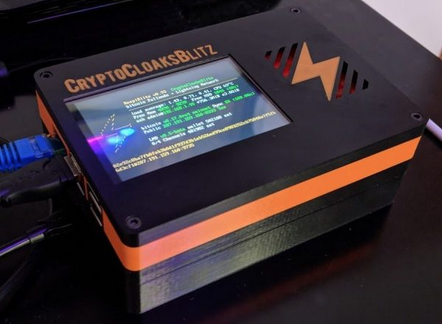
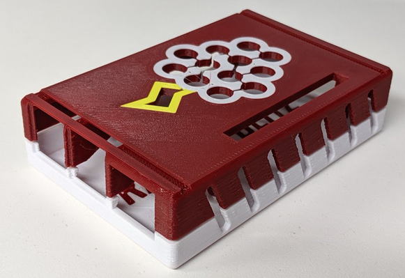

# FAQ - Frequently Asked Questions

## Whats new in Version 1.3 of RaspiBlitz?

Version 1.3 is using the new Raspbian Buster that is ready to use with the RaspberryPi 4 (also still works with RaspberryPi 3).

- update: New Shopping Lists with RaspberryPi 4
- Update: LND version 0.7.1-beta (fix for CVE-2019-12999)
- Update: bitcoin-core version 0.18.1-beta
- Update: RTL (Ride the Lightning) Web UI version 0.4.2 -beta
- Update: Blockchain Index not needed anymore
- Update: New Torrent files
- New: Logo (see folder raspiblitz/logos)
- New: Sync/Validate Blockchain as default for RP4
- New: Switch on TOR during setup
- New: Support Zap Mobile for Android
- New: Repair Options in main menu
- New: UPNP (AutoNAT) support in services menu
- New: LCD rotate 180 degrees in services menu
- Fix: TOR switch on/off
- Fix: Zap iOS Mobile Wallet connect
- Fix: Shango Mobile Wallet connect
- Experimental: LCD Touchscreen Support
- Experimental: UPS support (APC) [details](FAQ.md#how-to-connect-a-ups-to-the-raspiblitz)

For full details see issue list of [Release 1.3 Milestone](https://github.com/rootzoll/raspiblitz/milestone/6?closed=1).

## How to update my RaspiBlitz from v1.2?

The update should be quite simple - you don't need to close any channels:

- Best is to get a second 16GB or 32GB sd card - but you can also reuse your old one
- In SSH main menu of you RaspiBlitz choose `UPDATE` & follow the dialogs until shutdown
- Download the new RaspiBlitz image file from the [GitHub README](https://github.com/rootzoll/raspiblitz/blob/master/README.md#installing-the-software)
- Write the new image to the (new) sd card with a tool like [balena etcher](https://www.balena.io/etcher/)
- RaspiBlitz with new sd card image - it now goes through a recover/update phase - this may take some time.
- Once that's done, login once per SSH and use the password raspiblitz and set a new password A (can be your old one or a new one).

After the final reboot your RaspiBlitz should be ready running the new RaspiBlitz version.

## How to update my RaspiBlitz from v1.0 or v1.1?

For update you DON'T NEED to close any channels, remove funding or download the blockchain again.

Here is a YouTube video tutorial on how to update: https://www.youtube.com/watch?v=Xvn0WQfHUdI

Simply [Download the new RaspiBlitz SD card image](https://github.com/rootzoll/raspiblitz#installing-the-software) to your laptop and have an sd card writer ready. Then login into your RaspiBlitz with SSH and:

- main menu > OFF
- remove power
- remove SD card

Write the new image it to your SD card .. yes you simply overwrite the old one, it's OK, all your personal data is on the HDD. If you want to be extra safe you can make a image backup of your old sd card first - but that is optional. If you made manual changes to your RaspiBlitz with scripts on the sd card you might wanna check on this FAQ question first: [Why do I need to re-burn my SD card for an update?](FAQ.md#why-do-i-need-to-re-burn-my-sd-card-for-an-update).

- insert new sd card image
- power on the RaspiBlitz again

You should see that it switched into recover/backup mode. It's now provisioning the fresh OS on the sd card your old settings and data. This process can take some while especially if you had RTL Web UI activated. Follow the instructions on the display ... if it takes longer then an hour .. [get support](https://github.com/rootzoll/raspiblitz#support).

When update/recover process is ready you will see a `FINAL RECOVER LOGIN NEEDED` message on the display. Login per SSH by using the password `raspiblitz` and set your Password A again. It can be the same as the old one, but maybe use the occasion to make password change for security reasons. If you had auto-unlock activated you might also be asked to enter your old Password C again. Then it wil make a final reboot.

After your RaspiBlitz is done with catching up the latest blockchain data you should see your status screen displaying your funds and channels. Your backup is complete.

## How to verify the sd card image after download?

You can do a quick check if the sha256 hash of the file you downloaded is the same as the sha256 hash mentioned below the download link or use the torrent download which will also check the file for checksum after download. But this does not prove to you that the sd card image was actually build by the lead developer of the RaspiBlitz project.

To verify that the download was actually signed by [rootzoll](https://keybase.io/rootzoll) you need to use GPG and import the following public key:

```
curl https://keybase.io/rootzoll/pgp_keys.asc | gpg --import
```

After this download the "signature file" for the sd card image. It's the same download link as for the image file - just added a `.sig` at the end. You should also find the download link for the signature file always in the README right below the image download link following the `SIGNATURE` link.

If you know have all the three elements needed - the imported public key, the image signature and the image file itself - you can verify the download with:

```
gpg --verify [SIGNATURE-FILE] [IMAGE-FILE]
```

As a result you should see a "correct signature" message with a main fingerprint the same as you can find on the [keybase.io/rootzoll](https://keybase.io/rootzoll) that is ending on `1C73 060C 7C17 6461`. If that fingerprint is correct, the sd card image you downloaded is a original release RaspiBlitz.

## Whats new in Version 1.2 of RaspiBlitz?

Version 1.2 packs some more fixes and enhancements to make the RaspiBlitz more stable, protect HDD data better and support you better in case of data corruption of the blockchain data.

- Update: LND version 0.6-beta
- Update: RTL (Ride the Lightning) Web UI version 0.2.16-beta
- Update: Shopping Lists (new Heatsink Case lowers 10°)
- Update: New Torrent Update file (reducing blockchain sync time)
- Fix: LND scanning stuck on ? (better error handling)
- Fix: Cash out all funds
- Fix: Keep TLS certs stable on update
- New: Support Zeus Mobile Wallet
- New: Show QR codes on LCD
- New: Support LND Static Channel Backup
- New: Remote-Backup of channel.backup file (SCP & Dropbox)
- New: Recover Node from LND rescue backup file
- New: Run Hardware Test on setup and main menu
- New: Run Software Test (DebugLogs) from main menu
- New: SSH-Forward Tunneling (commandline)
- New: Set fixed IP/domain for RaspiBlitz (commandline)
- New: Set DNS server (commandline)
- New: Run LND on different port (commandline)
- New: Ask before formatting HDD
- New: Better Update support (from main menu)
- New: Temp in Fahrenheit on the LCD
- Experimental: Backup Torrent Seeding (Service)

For full details see issue list of [Release 1.2 Milestone](https://github.com/rootzoll/raspiblitz/milestone/5?closed=1).

## Whats new in Version 1.1 of RaspiBlitz?

Version 1.1 packs some first fixes and enhancements to make the RaspiBlitz more stable, protect HDD data better and support you better in case of data corruption of the blockchain data.

- Update: RTL (Ride the Lightning) Web UI version 0.2.15-beta
- Fix: Preventing logs from filling up the sd card
- Fix: Pairing for latest Zap iOS Mobile Wallet
- Fix: Pairing for latest Shango Mobile Wallet
- Fix: Open LND port check when custom port
- New: Undervoltage Reports on LCD
- New: fsk (file system consistency check) of HDD on every boot
- New: Repair Help Menu in case if blockchain data corruption
- New: /config.scripts/lnd.setport.sh (set custom LND port)
- New: /config.scripts/lnd.rescue.sh (backup/replay LND data)
- New: Bootscreen with logo
- Removed: FTP download option for blockchain

For full details see issue list of [Release 1.1 Milestone](https://github.com/rootzoll/raspiblitz/milestone/3?closed=1).

Instructions on how to update see FAQ info below.

## Can I still get version 1.2 of RaspiBlitz?

HTTP: http://wiki.fulmo.org/downloads/raspiblitz-v1.2-2019-05-02.img.gz

Torrent: https://github.com/rootzoll/raspiblitz/raw/v1.2/raspiblitz-v1.2-2019-05-02.torrent

SHA-256: ae9910bb99b7a992d14e920696183b6e494cc9b52db7b9c03dd02fd739d47659

Code: https://github.com/rootzoll/raspiblitz/tree/v1.2

## Can I still get version 1.1 of RaspiBlitz?

Torrent: https://github.com/rootzoll/raspiblitz/raw/v1.1/raspiblitz-v1.1-2019-03-18.torrent

SHA-256: b7a449ce6444f9e7e9fd05156ff09c70a6e200be0b5e580d3317049eefc4f3b7

Code: https://github.com/rootzoll/raspiblitz/tree/v1.1

## How to update a old RaspiBlitz BEFORE v1.0? (LEGACY)

If your old RaspiBlitz if version 0.98 or higher, just follow the update instructions in the README.

If you run a version earlier then 0.98 you basically need to setup a new RaspiBlitz to update - but you can keep the blockchain data on the HDD, so you don't need have that long waiting time again:

1. Close all open lightning channels you have (`lncli closeallchannels --force`) or use the menu option 'CLOSE ALL' if available. Wait until all closing transactions are done.

2. Move all on-chain funds to a wallet outside raspiblitz (`lncli sendcoins --conf_target 3 <ADDRESS> <AMT>`) or use the menu option 'CASHOUT' if available

3. Prepare the HDD for the new setup by running the script `/home/admin/XXcleanHDD.sh` (Blockchain will stay on HDD)

4. then shutdown RaspiBlitz (`sudo shutdown now`), flash SD card with new image, redo a fresh setup of RaspiBlitz, move your funds back in, Re-Open your channels

## Why do I need to re-burn my SD card for an update?

I know it would be nicer to run just an update script and you are ready to go. But then the scripts would need to be written in a much more complex way to be able to work with any versions of LND and Bitcoind (they are already complex enough with all the edge cases) and testing would become even more time consuming than it is now already. That's nothing a single developer can deliver.

For some, it might be a pain point to make an update by re-burning a new sd card - especially if you added your own scripts or made changes to the system - but that's by design. It's a way to enforce a "clean state" with every update - the same state that I tested and developed the scripts with. The reason for that pain: I simply cannot write and support scripts that run on every modified system forever - that's simply too much work.

With the SD card update mechanism I reduce complexity, I deliver a "clean state" OS, LND/Bitcoind and the scripts tightly bundled together exactly in the dependency/combination like I tested them and it's much easier to reproduce bug reports and give support that way.

Of course, people should modify the system, add own scripts, etc ... but if you want to also have the benefit of the updates of the RaspiBlitz, you have two ways to do it:

1. Contribute your changes back to the main project as pull requests so that they become part of the next update - the next SD card release.

2. Make your changes so that they survive an SD card update easily - put all your scripts and extra data onto the HDD AND document for yourself how to activate them again after an update .. maybe even write a small shell script (stored on your HDD) that installs & configures all your additional packages, software and scripts.

*BTW there is a beneficial side effect when updating with a new SD card: You also get rid of any malware or system bloat that happened in the past. You start with a fresh system :)*

## How can I avoid using a prepared blockchain and validate myself?

Since v1.3 if you use a RaspberryPi 4 syncing and validation the full blockchain yourself is the new default.

The torrent download use a prepared blockchain to kick start the RaspiBlitz. If you want to self validate you could do this on another more powerful computer and then transfer your own validated blockchain over to the RaspiBlitz. Check the options `Copying from another Computer` & `Cloning from a 2nd HDD` described in the [README](README.md) for more details.

## I have the full blockchain on another computer. How do I copy it to the RaspiBlitz?

Copying a already synced blockchain from another computer (for example your Laptop) can be a quick way to get the RaspiBlitz started or replacing a corrupted blockchain with a fresh one. Also that way you synced and verified the blockchain yourself and not trusting the RaspiBlitz Torrent downloads (don't trust, verify).

One requirement is that the blockchain is from another bitcoin-core client with version greater or equal to 0.17.1.

But we don't copy the data via USB to the device, because the HDD needs to be formatted in EXT4 and that is usually not read/writable by Windows or Mac computers. So I will explain a way to copy the data through your local network. This should work from Windows, Mac, Linux and even from another already synced RaspiBlitz.

Both computers (your RaspberryPi and the other computer with the full blockchain on) need to be connected to the same local network. Make sure that bitcoin is stopped on the computer containing the blockchain. If your blockchain source is another RaspiBlitz run on the terminal `sudo systemctl stop bitcoind` and then go to the directory where the blockchain data is with `cd /mnt/hdd/bitcoin` - when copy/transfer is done later reboot a RaspiBlitz source with `sudo shutdown -r now`.

If everything of the above is prepared, start the setup of the new RaspiBlitz with a fresh SD card (like explained in the README) - it's OK that there is no blockchain data on your HDD yet - just follow the setup. When you get to the setup-point `Getting the Blockchain` choose the COPY option. Starting from version 1.0 of the RaspiBlitz this will give you further detailed instructions how to transfer the blockchain data onto your RaspiBlitz. In short: On your computer with the blockchain data source you will execute SCP commands, that will copy the data over your Local Network to your RaspiBlitz.

Once you finished all the transfers the Raspiblitz will make a quick-check on the data - but that will not guarantee that everything in detail was OK with the transfer. Check further FAQ answers if you get stuck or see a final sync with a value below 90%.

## How do I generate a Debug Report?

If your RaspiBlitz is not working right and you like to get help from the community, it's good to provide more debug information, so other can better diagnose your problem - please follow the following steps to generate a debug report:

- ssh into your raspiblitz as admin user with your password A
- If you see the menu - use CTRL+C to get to the terminal
- To generate debug report run: `./XXdebugLogs.sh`
- Then copy all output beginning with `*** RASPIBLITZ LOGS ***` and share this

*PLEASE NOTICE: It's possible that this logs can contain private information (like IPs, node IDs, ...) - just share publicly what you feel OK with.*

## Why is my "final sync" taking so long?

First of all if you see a final sync over 90% and you can see from time to time small increase - you should be OK ... this can take some looong time to catch up with the network. Only in the case that you actively choose the `SYNC` option in the `Getting the Blockchain` a final sync under 90% is OK. If you did a torrent or a copy from another computer and seeing under 90% something went wrong and the setup process is ignoring your prepared Blockchain and doing a full sync - which can almost take forever on a raspberryPi.

So if something is wrong (like mentioned above) then try again from the beginning. You need to reset your HDD for a fresh start: SSH in as admin user. Abort the final sync info with CTRL+c to get to the terminal. There run `sudo /home/admin/XXcleanHDD.sh -all` and follow the script to delete all data in HDD. When finished power down with `sudo shutdown now`. Then make a fresh SD card from image and this time try another option to get the blockchain. If you run into trouble the second time, please report an issue on GitHub.

## How to backup my Lightning Node?

There are two ways of Backup:

### 1) Securing your On-Chain- and Channel-Funds during Operation

This is best done by auto backing-up the 'channel.backup' file to a remote location. But it just secures the funds you have in your on-chain wallet or in your channels. On recovery the channels will get closed. For details on how to setup see the README:
https://github.com/rootzoll/raspiblitz/blob/v1.2/README.md#backup-for-on-chain---channel-funds

### 2) Making a complete LND data backup

This backups all your LND data - including all open channels. But it's just intended to use when you move your LND data between computers, during update situations or in rescue recoveries, because replaying out-dated backups can lead to the loss of all channel funds.

How to backup LND data in a rescue situation see next question "How can I recover my coins from a failing RaspiBlitz?".

## How can I recover my coins from a failing RaspiBlitz?

On a RaspiBlitz you have coins in your on-chain wallet (bitcoin wallet) and also coins in lightning channels. First we will try to recover all of them and even trying to keep your channels open with "Recover LND data". This that is not possible you can fall back to the second option "Recover from Wallet Seed".

### 1) Recover LND data

Best to recover all your LND data/channels is when you still can SSH into the RaspiBlitz and the HDD is still usable/reachable (mounted) - even it shows some errors. If this is not possible anymore you should skip to the second option "Recover from Wallet Seed" or try to recover the LND data from the HDD (directory `lnd`) from another computer.

If you still can SSH in and HDD is readable, we can try to rescue/export your LND data (funds and channels) from a RaspiBlitz to then be able to restore it back to a fresh one. For this you can use the following procedure ...

To rescue/export your Lightning data from a RaspiBlitz (since v1.1):

* SSH into your RaspiBlitz and EXIT to terminal from the menu.
* then run: `/home/admin/config.scripts/lnd.rescue.sh backup`
* follow the instructions of the script.

This will create a lnd-rescue file (ends on gz.tar) that contains all the data from the LND. The script offers you a command to transfer the lnd-rescue file to your laptop. If the transfer was successful you can now setup a fresh RaspiBlitz. Do all the setup until you have a clean new Lightning node running - just without any funding or channels.

Then to restore your old LND data and to recover your funds and channels:

* SSH into your new RaspiBlitz and EXIT to terminal from the menu.
* then run: `/home/admin/config.scripts/lnd.rescue.sh restore`
* follow the instructions of the script.

This script will offer you a way to transfer the lnd-rescue file from your laptop to the new RaspiBlitz and will restore the old data. LND gets then restarted for you and after some time it should show you the status screen again with your old funds and channels.

**Be aware that if backup is some hours old, channels could have been closed by the other party and it may take some time until you see funds back on-chain. If backup is somewhat older then 1 day also the channel counter parties may have used your offline time to cheat you with an old state. And if your backup was not the latest state it could also been happening that you are posting an old channel state (seen as cheating) and funds of that channel get lost as punishment. So again .. this backup method can be risky, use with caution. But it's recommended to try in recover and rescue situations - it's not for regular backups.**

### 2) Recover from Wallet Seed

Remember those 24 words you were writing down during the setup? That's your "cipher seed" - now this words are important to recover your wallet. If you don't have them anymore: go back to option "Recover LND data" (see above) and check all possible ways to recover data from the HDD. If you still have the word seed: good, but read the following carefully:

With the word seed you can recover the on-chain funds that LND was managing for you - but it does not contain all the details about the channels you have open - it's mostly the key to your funding wallet. If you were able to close all channels or never opened any channels, then everything should be OK and the best results to recover on-chain funds from wallet seeds are reported to get from installing the Lightning Labs App on your laptop and use the wallet seed (and same wallet passwords): https://github.com/lightninglabs/lightning-app/releases

If you had open channels it would be best to check if you have also the `channel.backup` file (Static-Channel-Backup feature) that is available since LND 0.6 (RaspiBlitz v1.2) and use that in the process below ... for more details on the `channel.backup` file see [README.md on backups](README.md#backup-for-on-chain---channel-funds).

- SetUp a fresh RaspiBlitz (fresh SD-Card image and clean HDD).
- During the new SetUp you get to the point of creating the LND wallet (see image below).
- Choose `OLD - I had a old Node I want to recover/restore`  option and then
- Choose `SEED+SCB - Seed & channel.backup file` option
- and follow the instructions to upload your `channel.backup` file and enter your seed

Then give LND some time to re-scan the blockchain. In the end you will have restored your funding wallet. You maybe need to wait for your old channel counter parts to force close the old channels until you see the coins back displayed.

If you don't have the `channel.backup` file and only the seed words there is another last hope to try - read this article:
https://medium.com/@guggero/did-you-lose-funds-on-the-lightning-network-because-of-a-disk-crash-8971b6a92494

*Important: If you see a zero balance for on-chain funds after restoring from seed ... see details discussed [here](https://github.com/rootzoll/raspiblitz/issues/278) - you might try setup fresh this time with bigger look-ahead number.*

## What is this mnemonic seed word list?

With the 24 word list given you by LND on wallet creation you can recover your private key. You should write it down and store it at a save place. Bear in mind that *this 24 word mnemonic seed is not based on the BIP 39* and therefore cannot be recovered using a Bitcoin wallet.

For more background on the LND mnemonic seed [read this article](https://github.com/lightningnetwork/lnd/blob/master/docs/recovery.md#recovering-funds-from-lnd-funds-are-safu).

## How does PASSWORD D effects the word seed?

On wallet creation you get asked if you want to protect your word seed list with an additional password. If you choose so, RaspiBlitz recommends you to use your PASSWORD D at this point.

To use a an additional password for your seed words is optional. If you choose so, you will need the password to recover your private key from your your seed words later on. Without this password your private key cannot be recovered from your seed words. So the password adds an additional layer of security, if someone finds your written down word list.

## How to move funds & channels from RaspiBlitz to LND Lightning Desktop App?

Before you start - download a LND-data-rescue file from your RaspiBlitz to your laptop `main menu -> UPDATE -> Update Anyway -> Start Update -> Download Backup -> FOLLOW INSTRUCTIONS and press Enter when ready with download -> START UPDATE`. Now your RaspiBlitz will power down.

Now install the LND Lightning Desktop App for your OS: https://github.com/lightninglabs/lightning-app/releases

Then start the App and create a new wallet - it's a throw away wallet (will be deleted afterwards with no funds) - so you don't need to keep seeds safe. To get easy thru the setup just make a photo of the seed with your mobile. If you get asked for funding - just click "done" until you reach the basic wallet screen. Then close the LND Desktop App.

Now find out at with path LND stores the wallet data on your computer.

Linux: [USER-DIRECTORY]/.config/lightning-app/lnd
OSX: [USER-DIRECTORY]/Library/Application Support/lightning-app/lnd
Windows: %USERPROFILE%\AppData\Roaming\lightning-app\lnd

Then open that directory on your local file manager and delete all data in the `lnd` directory.

Now unpack the lnd-rescue you made before and copy all the data from the `mnt/hdd/lnd` directory (including sub directories) into the LND-Path lnd directory. Delete the "lnd.conf" file.

Now start the Lightning App again. Your wallet password should now be your RaspIBlitz PasswordC.

**If it's working and you have access to your funds/channels on the Desktop App ... don't start the RaspiBlitz anymore. Delete sd card and HDD.**

## How do I change the Name/Alias of my lightning node

Use the "Change Name/Alias of Node" option in the main menu. The RaspiBlitz will make a reboot after this.

## What to do when on SSH I see "WARNING: REMOTE HOST IDENTIFICATION HAS CHANGED!"

This means, that he public ssh key of the RaspiBlitz has changed to the one you logged in the last time under that IP.

It's OK when happening during an update - when you changed the sd card image. If it's really happening out of the blue - check your local network setup for a second. Maybe the local IP of your RaspiBlitz changed? Is there a second RaspiBlitz connected? It's a security warning, so at least take some time to check if anything is strange. But also don't get to panic - when it's in your local network, normally it's some network thing - not an intruder.

To fix this and to be able to login with SSH again, you have to remove the old public key for that IP from your local client computer. Just run the following command (with the replaced IP of your RaspiBlitz): `ssh-keygen -R IP-OF-YOUR-RASPIBLITZ` or remove the line for this IP manually from the known_hosts file (see the path to the file in the warning message).

After that, you should be able to login with SSH again.

## When using Auto-Unlock, how much security do I lose?

The idea of the "wallet lock" in general, is that your private key / seed / wallet is stored in a encrypted way on your HDD. On every restart, you have to input the password once manually (unlock your wallet), so that the LND can read and write to the encrypted wallet again. This improves your security if your RaspiBlitz gets stolen or taken away - it loses power and then your wallet is safe - the attacker cannot access your wallet.

When you activate the "Auto-Unlock" feature of the RaspiBlitz, the password of the wallet gets stored on the RaspiBlitz. So if an attacker steals the RaspiBlitz physically, it's now possible for them to find the password and unlock the wallet.

## I connected my HDD but it still says 'Connect HDD' on the display?

Your HDD may have no partitions yet. SSH into the RaspiBlitz as admin (see command and password on display) and you should be offered the option to create a partition. If this is not the case:

Check/Exchange the USB cable. Connect the HDD to another computer and check if it shows up at all.

OSX: https://www.howtogeek.com/212836/how-to-use-your-macs-disk-utility-to-partition-wipe-repair-restore-and-copy-drives/

Windows: https://www.lifewire.com/how-to-open-disk-management-2626080

Linux/Ubuntu (desktop): https://askubuntu.com/questions/86724/how-do-i-open-the-disk-utility-in-unity

Linux/Raspbian (command line): https://www.addictivetips.com/ubuntu-linux-tips/manually-partition-a-hard-drive-command-line-linux/

## How do I shrink the QR code for connecting my Shango/Zap/Zeus mobile phone?

Make the fonts smaller until the QR code fits into your (fullscreen) terminal. In OSX use `CMD` + `-` key. In LINUX use `CTRL`+ `-` key. On WINDOWS Putty go into the settings and change the font size: https://globedrill.com/change-font-size-putty

## Why is my bitcoin IP on the display red?

The bitcoin IP is red, when the RaspiBlitz detects that it cannot reach the port of bitcoin node from the outside. This means the bitcoin node can peer with other bitcoin nodes, but other bitcoin nodes cannot initiate a peering with you. Don't worry, you don't need a publicly reachable bitcoin node to run a (public) lightning node. If you want to change this however, you need to forward port 8333 on your router to the the RaspiBlitz. How to do this is different on every router.

Some routers support a feature called UPnP where devices can automatically request a forwarding to be publicly reachable. By turning on `BTC UPnP` in the main menu `SERVICES` section, you can try if your router supports this feature.

On details how to set port forwarding manually on your router model see: https://portforward.com

## Why is my node address on the display red?

The node address is red, when the RaspiBlitz detects that it cannot reach the port of the LND node from the outside - when the device is behind a NAT or firewall of the the router. Your node is not publicly reachable. This means you can peer+openChannel with other public nodes, but other nodes cannot peer+openChannel with you. To change this you need to forward port 9735 on your router to the the RaspiBlitz. How to do this is different on every router.

Some routers support a feature called UPnP where devices can automatically request a forwarding to be publicly reachable. By turning on `LND UPnP` in the main menu `SERVICES` section, you can try if your router supports this feature.

On details how to set port forwarding manually on your router model see: https://portforward.com

## Why is my node address on the display yellow (not green)?

Yellow is OK. The RaspiBlitz can detect, that it can reach a service on the port 9735 of your public IP - this is in most cases the LND of your RaspiBlitz. But the RaspiBlitz cannot 100% for sure detect that this is its own LND service on that port - that's why it's just yellow, not green.

On details how to set port forwarding on your router model see: https://portforward.com

## Can I run the RaspiBlitz as Backend for BTCPayServer?

BTCPay Server is a solution to be your own payment processor to accept Lightning Payments for your online store: https://github.com/btcpayserver/btcpayserver

You can find setup instructions for a experimental setup here: https://goo.gl/KnTzLu

Thanks to @RobEdb (ask on twitter for more details) running his demo store with RaspiBlitz: https://store.edberg.eu - buy a picture of [him and Andreas](https://store.edberg.eu/produkt/jag-andreas/) :)

## I don't have a LAN port on my Laptop - how to connect to my RaspiBlitz?

You don't need a LAN port on your laptop as long as you can connect over WLAN to the same LAN router/switch the RaspiBlitz is connected to .. and you are on the same local network.

## Is it possible to connect the Blitz over Wifi instead of using a LAN cable?

A LAN cable is recommended because it reduces a possible source of error on the network connection side. But how to setup WLAN when you don't have a LAN-Router/Switch available see here:
https://stadicus.github.io/RaspiBolt/raspibolt_20_pi.html#prepare-wifi

## Can I directly connect the RaspiBlitz with my laptop?

If you have a LAN port on your laptop - or you have a USB-LAN adapter, you can connect the RaspiBlitz directly (without a router/switch) to your laptop and share the WIFI internet connection. You can follow this [guide for OSX](https://medium.com/@tzhenghao/how-to-ssh-into-your-raspberry-pi-with-a-mac-and-ethernet-cable-636a197d055).

In short for OSX:

* make sure all VPN are off (can interfere with local LAN)
* connect with LAN directly
* Settings > Sharing/Freigaben > activate "internet sharing" from WLAN to Ethernet
* Settings > Network > Ethernet-Adapter > set to DHCP
* in terminal > `ifconfig` there you should see the IP of the bridge100
* in terminal > `arp -a` and check for an IP of a client to the bridge
* in terminal > ssh admin@[clientIP]

If anyone has experience on doing this in Linux/Win, please share.

## How do I unplug/shutdown safely without SSH

Just removing power from the RaspiBlitz can lead to data corruption if the HDD is right in the middle of a writing process. The safest way is always to SSH into the RaspiBlitz and use the "POWER OFF" option in the main menu.

But if cannot login with SSH and you need to power off at least remove the LAN cable (network connection)first for sometime (around 10-30 secs - until you can see no more blinking lights on the HDD) and then remove the power cable. This should minimize the risk if data corruption in this situations.

## How can I build an SD card other then the master branch?

There might be a new not released features in development that are not yet in the master branch - but you want to try them out.

To build a sd card image from another branch than master you follow the [Build the SD Card Image](README.md#build-the-sd-card-image) from the README, but execute the build script from the other branch and add the name of that branch as a parameter to the build script.

For example if you want to  make a build from the 'dev' branch you execute the following command:

`wget https://raw.githubusercontent.com/rootzoll/raspiblitz/dev/build_sdcard.sh && sudo bash build_sdcard.sh 'dev'`

## How can I build an SD card from my forked GitHub Repo?

If you fork the RaspiBlitz repo (much welcome) and you want to run that code on your RaspiBlitz, there are two ways to do that:

* The quick way: For small changes in scripts, go to `/home/admin` on your running RaspiBlitz, delete the old git with `sudo rm -r raspiblitz` then replace it with your code `git clone [YOURREPO]` and `/home/admin/XXsyncScripts.sh`

* The long way: If you like to install/remove/change services and system configurations you need to build a SD card from your own code. Prepare like in [Build the SD Card Image](README.md#build-the-sd-card-image) from the README but in the end run the command:

`wget https://raw.githubusercontent.com/[GITHUB-USERNAME]/raspiblitz/[BRANCH]/build_sdcard.sh && sudo bash build_sdcard.sh [BRANCH] [GITHUB-USERNAME]

If you are then working in your forked repo and want to update the scripts on your RaspiBlitz with your latest repo changes, run `/home/admin/XXsyncScripts.sh` - that's OK as long as you don't make changes to the sd card build script - then you would need to build a fresh sd card again from your repo.

## How can I checkout a new branch from the RaspiBlitz repo to my forked repo?

You need to have your forked repo checked out on your laptop. There your should see your forked repo as `origin`, when you run `git remote -v`. If you don't see a additional `upstream` remote yet, then it with the following command `git remote add upstream https://github.com/rootzoll/raspiblitz.git`.

So first checkout the new branch named `BRANCH` from the original RaspBlitz repo to your local computer with: `git fetch upstream` and then `git checkout -b BRANCH upstream/BRANCH`.

Now push the new branch to your forked GitHub repo with `git push -u origin BRANCH`.

Once the branch is available and synced between the RaspiBlitz GitHub repo, your forked GitHub repo and your local computer git repo, you can start developing.

## How can I sync a branch of my forked with my local RaspiBlitz?

You need to know that there is a git copy of the original RaspiBlitz GitHub repo on your physical RaspiBlitz in the folder `/home/admin/raspiblitz`. If you change into that folder and run `git remote -v` you can see the set origin repo.

You need to change that origin repo to your forked repo. You do that with:
```
git remote set-url origin [THE-URL-OF-YOUR-FORKED-REPO]
```

Now to sync your branch namend BRANCH on your forked repo with your RaspiBlitz you always just the run:
```
/home/admin/XXsyncScripts.sh BRANCH
```

So your workflow can go: You write code on your local computer. Commit to your local repo, push it to your forked repo and use the sync-script above to get the code to your RaspiBlitz.

## How contribute a feature/change from my forked branch back to the RaspiBlitz repo?

Like the way above you can build a new feature or test a change. Once you have something ready you want to contribute back, you make sure it's pushed to your forked GitHub repo and start a pull request from the GitHub website there to the RaspiBlitz repo.

See more info: https://yangsu.github.io/pull-request-tutorial/

## How to attach the RaspberryPi to the HDD?

Try some rubber band.

## What other case options do I have?

You can replace the generic case in the shopping lists with a customized 3D printed for the RaspiBlitz called "Lightning Shell" - great work by @CryptoCloaks



https://thecryptocloak.com/product/lightningshell/

Also there is a free & open source case you can 3D print:



https://thecryptocloak.com/file-factory/

## Are those "Under-Voltage detected" warnings a problem?

When your USB power adapter for the RaspiBlitz delivers too low power those messages with "Under-Voltage detected" (under-voltage) are shortly seen on the display. This can lead to data loss/corruption on the HDD. If you see those just one or two times that's not OK, but can be in a tolerant window. Nevertheless it make sure your USB power adapter can deliver at least 3A (big and stable is good). If you still see those warnings maybe get a second USB Power adapter just for the HDD and power the HDD through a Y-Cable - see https://en.wikipedia.org/wiki/Y-cable#USB or put a USB Hub with extra power between the raspberry and the HDD.

## Why do we need to download the blockchain and not syncing it?

*For RaspberryPi 3:* The RaspiBlitz is powered by the RaspberryPi. The processing power of this SingleBoardComputer is too low to make a fast sync of the blockchain from the bitcoin peer to peer network during setup process (validation). To sync and index the complete blockchain could take weeks or even longer. That's why the RaspiBlitz needs to download a prepared blockchain from another source.

*For RaspberryPi 4 and above:* The RaspberryPi is now fast enough and with 2GB RAM and a SSD self syncing and validation is the new default.

## Is using the prepared SD card image secure?

Using pre-built software almost always shifts trust to the one who made the binary. But at least you can check with the SHA checksum after download if the image downloaded is really the one offered by the GitHub Repo. To do so make a quick check if your browser is really in the correct GiutHub page and that your HTTPS of the GitHub page is signed by 'DigiCert'. Then compare the SHA-256 string (always next to the download link of the image on the README) with the result of the command `shasum -a 256 [DOWNLOADED-FILE-TO-CHECK]` (Mac/Linux). Still this is not optimal and if at least some people from the community request it, I will consider signing the download as an author for the future.

The best way would be to build the sd card yourself. You use the script `build_sdcard.sh` for it. Take some minutes to check if you see anything suspicious in that build script and then follow the [README](README.md#build-the-sd-card-image) on this.

## Is downloading the blockchain from a third party secure?

To download a blockchain from a third party (torrent) is not optimal and for the future with more cheap & powerfull SingleBoardComputers we could get rid of this 'patch'.

The downloaded blockchain is pre-indexed and pre-validated. That should be practically secure enough, because if the user gets a "manipulated" blockchain it would not work after setup. The beginning of the downloaded blockchain needs to fit the genesis block (in bitcoind software) and the end of the downloaded blockchain needs not match with the rest of the bitcoin network state - hashes of new block distributed within the peer-2-peer network need to match the downloaded blockchain head. So if you downloaded a manipulated blockchain it simply wouldn't work in practice. As long as you are not in a totally hostile environment where someone would be able to fake a whole network of peers and miners around you - this is secure enough for running a small funded full node to try out the lightning network.

If you don't trust the download or you want to run the RaspiBlitz in a more production like setup (on your own risk) then don't use the torrent download and choose the option to COPY the blockchain data from a more powerful computer (laptop or desktop) where you synced, verified and indexed the blockchain all by your yourself - see [README](README.md#4-copying-from-another-computer) for more details.

## Why is taking my torrent download of the blockchain so long?

Other users reported that opening up and forwarding the following port from their router to the RaspiBlitz helped speed up and getting started the torrent download: 49200-49250

On details how to set port forwarding on your router model see: https://portforward.com

## What is the "Base Torrent File"?

Inspired by the website getbitcoinblockchain.com we use one of their base torrent files to have a basic set of blocks - those blocks will not change for the future. This torrent contains most of the data (the big file) and we dont need to change the torrent for a long time. This way the torrent can get establish a wide spread seeding and the torrent network can take the heavy load.

At the moment (Baseiteration=2) this is just the bitcoin blk and rev files up to the number:
blockchain/blocks/blk00000.dat - blk01357.dat
blockchain/blocks/rev00000.dat - rev01357.dat
(no testnet data)

For litecoin (Baseiteration=2) it's blk and rev files up to the number:
blockchain/blocks/blk00000.dat - blk00150.dat
blockchain/blocks/rev00000.dat - rev00150.dat

The base torrent file should always have the following naming scheme:

`raspiblitz-[CHAINNETWORK][BASEITERATIONNUMBER]-[YEAR]-[MONTH]-[DAY]-base.torrent`

So for example the second version of the base torrent for litecoin created on 2018-10-31 would have this name: raspiblitz-litecoin2-2018-10-31-base.torrent

## What is the "Update Torrent File" and how to create it?

All the rest of the blocks and needed files get packaged into a second torrent file. This file will be updated much more often. The seeding is expected to be not that good and download may be slower, but that's OK because it's a much smaller file.

This way a good balance between good seeding and up-to-date blockchain can be reached.

To create the Update Torrent file, follow the following step ...

Have a almost 100% synced bitcoind MAINNET on a RaspiBlitz
(if you have funds in there, make a backup first and calculate for about 1 day of off-time to repair the blockchain after this)

Stop bitcoind with:
```
sudo systemctl stop bitcoind
```

Delete base torrent files:
```
sudo rm /mnt/hdd/bitcoin/blocks/blk00*.dat
sudo rm /mnt/hdd/bitcoin/blocks/blk0{1000..1357}.dat
sudo rm /mnt/hdd/bitcoin/blocks/rev00*.dat
sudo rm /mnt/hdd/bitcoin/blocks/rev0{1000..1357}.dat
```

Now change to your computer where you package the torrent files and transfer the two directories into your torrent base directory (should be your current working directory):
```
mkdir ./blockchain
scp -r bitcoin@[RaspiBlitzIP]:/mnt/hdd/bitcoin/blocks ./blockchain/blocks
scp -r bitcoin@[RaspiBlitzIP]:/mnt/hdd/bitcoin/chainstate ./blockchain/chainstate
```

(Re-)name the "torrent base directory" to the same name as the torrent UPDATE file itself later (without the .torrent ending). The updated torrent file should always have the following naming schema:

`raspiblitz-[CHAINNETWORK][BASEITERATIONNUMBER]-[YEAR]-[MONTH]-[DAY]-update.torrent`

*So for example an update torrent created on 2018-12-24 for litecoin that is an update to the second base torrent version would have this name: raspiblitz-litecoin2-2018-12-24-update.torrent*

Now open your torrent client (e.g. qTorrent for OSX) and create a new torrent-file with the freshly renamed "torrent base directory" as source directory.

Add this list of trackers to your torrent and start seeding (keep a free/empty line between the three single trackers):
```
udp://tracker.justseed.it:1337

udp://tracker.coppersurfer.tk:6969/announce

udp://open.demonii.si:1337/announce

udp://denis.stalker.upeer.me:6969/announce
```

After successful creation of the torrent file - edit the RaspiBlitz code:
* copy to torrent file to `/home.admin/assets`
* push to git
* change in `50torrentHDD.sh script`
* add to Torrent-[RSS](https://github.com/rootzoll/raspiblitz/blob/master/home.admin/assets/raspiblitz-torrents-rss.xml)
* seed at home and at services like justseed.it
* update [issue](https://github.com/rootzoll/raspiblitz/issues/285#issuecomment-457796120) and ask on twitter for help on seeding

Now to repair your RaspiBlitz Blockchain start mainmenu `./00mainMenu.sh` and choose `REPAIR` > `RESET-CHAIN`.

## What is the process of creating a new sd card image release?

Work notes for the process of producing a new sd card image release:

* Start [`Ubuntu LIVE`](http://releases.ubuntu.com/18.04.3/ubuntu-18.04.3-desktop-amd64.iso) from USB stick on Build Computer (press F12 on startup)
* Connect to a secure WiFi (hardware switch on) or LAN
* Download the latest Raspbian Desktop (without recommended software) from [raspberrypi.org](https://www.raspberrypi.org/downloads/raspbian/)
* From the browser `Show All Downloads` and from the context menu select `Copy Download Link`
* Paste the Download Link into a new browser tab and add ".sig" at the end (also download)
* From the browser `Show All Downloads` and from the context menu select `Open Containing Folder`
* On that file manager open context (right click) on the white space and select `Open in Terminal`
* Compare checksum with: [raspberrypi.org](https://www.raspberrypi.org/downloads/raspbian/) with `shasum -a 256 *.zip`
* Install curl if needed `sudo apt-get update && sudo apt-get install -f curl net-tools`
* Check signature: `curl https://www.raspberrypi.org/raspberrypi_downloads.gpg.key | gpg --import && gpg --verify *.sig`
* The result should say "correct signature" and fingerprint should end with `8738 CD6B 956F 460C`
* Insert an NTFS formatted USB stick and use the file manager to move all files to there
* Use in file manager context on NTFS USB stick `extract here` to unzip
* Connect SD card reader with a 8GB SD card
* In the file manager open context on the .img-file, select `Open With Disk Image Writer` and write the image to the SD card
* In the file manager open context on `boot` drive free space `open in terminal`
* Run the commands: `touch ssh` and `exit`
* Eject the `boot` and the `NTFS` volume
* Connect a RaspiBlitz (without HDD) to network, insert sd card and power up
* Find the IP of the RaspiBlitz (arp -a or check router)
* In terminal `ssh pi@[IP-OF-RASPIBLITZ]`
* Password is `raspberry`
* Run the following command BUT REPLACE `[BRANCH]` with the branch-string of your latest version
* `wget https://raw.githubusercontent.com/rootzoll/raspiblitz/[BRANCH]/build_sdcard.sh && sudo bash build_sdcard.sh '[BRANCH]'`
* Monitor/Check outputs for warnings/errors - install LCD
* Login new with `ssh admin@[IP-OF-RASPIBLITZ]` (pw: raspiblitz) and run `./XXprepareRelease.sh`
* Disconnect WiFi/LAN on build laptop (hardware switch off) and shutdown
* Remove `Ubuntu LIVE` USB stick and cut power from the RaspberryPi
* Connect USB stick with latest `TAILS` (make it stay offline)
* Power on the Build Laptop (press F12 for boot menu)
* Connect USB stick with GPG signing keys
* Open that USB stick in filemanager and on white space context menu --> open terminal
* Run `gpg --import ./sub.key`, check and `exit`
* Disconnect USB stick with GPG keys
* Take the SD card from the RaspberryPi and connect with an external SD card reader to the laptop
* Click on `boot` volume once in the file manger
* Connect the NTFS USB stick, open in file manager and delete old files
* In that file manager in context menu on white space -> open terminal
* Run `df` to check on the SD card device name (`boot` - ignore last partition number)
* `dd if=/dev/[sdcarddevice] | gzip > ./raspiblitz-vX.X-YEAR-MONTH-DAY.img.gz`
* When finished you should see that more then 7GB were copied
* Then run `shasum -a 256 *.gz > sha256.txt`
* Sign with `gpg --output raspiblitz-vX.X-YEAR-MONTH-DAY.img.gz.sig --detach-sign *.gz`
* Shutdown build computer
* Connect the NTFS USB stick to MacOS (it is just read-only)
* Run tests on the new image
* Upload the new image to the Download Server - put sig-file next to it
* Copy SHA256-String into GitHub README and update the download link

## How do I return to the menu after exiting to the command line

Type the command `raspiblitz` to return to the main menu if you exited to the command line.

## Can I run RaspiBlitz on other computers than RaspberryPi?

There is an experimental section in this GitHub that tries to build for other SingleBoardComputers. Feel free to try it out and share your experience: [alternative.platforms/README.md](alternative.platforms/README.md)

## Can I flip the screen?

There is now an option under `SERVICES to rotate the screen.

To do it manually: For the default 3.5" LCD you need to edit the /boot/config.txt. Run `sudo nano /boot/config.txt`
look for the line `dtoverlay=tft35a:rotate=270` towards the end. To flip the screen with 180 degrees change the line to `dtoverlay=tft35a:rotate=90` and reboot with `sudo reboot`. Reference: https://github.com/goodtft/LCD-show/issues/34

## How to setup fresh/clean/reset and not getting into recovery mode?

When you put in a sd card with a new/clean RaspiBlitz image the RaspiBlitz will get into recovery mode because it detects the old data on your HDD and assumes you just want to continue to work with this data.

But there might be cases where you want to start a totally fresh/clean RaspiBlitz from the beginning. To do so you need to delete the old data from the HDD. Those the option `RESET-ALL` under `REPAIR` to delete all data and start fresh.

When the HDD is clean, then flash a new RaspiBlitz sd card and your setup should start fresh.

## My blockchain data is corrupted - what can I do?

You could try to re-index, but that can take some very long time - multiple days or even weeks. But there are other options:

1. Get new Blockchain

Use `REPAIR` in the SSH main menu and then choose `RESET-CHAIN`. Then you get offered multiple options to get new blockchain data.

2. Backup LND Data, make fresh Blitz, Replay LND Data

You can backup your channel and wallet data, make a complete fresh RaspiBlitz and after that one is setup you replace the LND data with your old one. Also make sure to check again on your power supply - it needs to deliver equal or more then 3A and should deliver a stable current. If you think your HDD or SD card is degrading - maybe this is a good time to replace. See for details the FAQ question: [How can I recover my coins from a failing RaspiBlitz?](FAQ.md#how-can-i-recover-my-coins-from-a-failing-raspiblitz)*

## Can I run the RaspiBlitz without a display/LCD?

The display is one of the nice features of the RaspiBlitz but the raspberry can run without it. Maybe not all add-on feature could be used to the full extend, but you can get started without the LCD and even plug it on later.

Normally with the LCD it's easy to see your local IP changes and you can get started quickly. Without it needs a bit more digging thru your network - you can find a good tutorial on that on the RaspiBolt tutorial (origin of RaspiBlitz):

https://stadicus.github.io/RaspiBolt/raspibolt_20_pi.html#connecting-to-the-network

*Please Note: Without a LCD-Hat you cannot simply use the HDMI as alternative, because screen signal is routed to the GPIO pins. On how to switch that back manually - see [waveshare documentation](https://www.waveshare.com/wiki/3.5inch_RPi_LCD_(A)).*

## I have two RaspiBlitz in my network - can they both be public?

Yes but you need to change at least on one RaspiBlitz the port number (for example to 9736) on one of your RaspiBlitzes - see how to change a port below. Then you can forward both ports from your home internet router to the matching RaspiBlitzes.

## How to change the public port LND/Lightning node is running on?

There is a experimental script you can call from the terminal that will make all changes for you ... see details here: https://github.com/rootzoll/raspiblitz/issues/100#issuecomment-466722712

## How to solve a "signature mismatch after caveat verification" error?

If you get this error by LND that means that something is wrong with the macaroons being used to communicate with LND .. see: https://github.com/lightningnetwork/lnd/blob/master/docs/macaroons.md

To fix this depends on where you get this error:

* If you get it in a mobile wallet, then redo the connection with the RaspiBlitz to get fresh macaroons.
* If you get this from RTL or from the scripts of the SSH menus of the RaspiBlitz, then go to "EXPORT Macacroons and TLS.cert" in SSH main menu and choose the the "RESET Macaroons & TLS" option.

Also make sure to check again on your power supply - it needs to deliver equal or more then 3A and should deliver a stable current. If you think your HDD is degrading - maybe this is a good time to replace it. See for details the FAQ question: [How can I recover my coins from a failing RaspiBlitz?](FAQ.md#how-can-i-recover-my-coins-from-a-failing-raspiblitz)

## Why is my node not routing?

1. You don't have inbound liquidity
2. Low uptime
3. Capital is committed to competitive destinations
4. Capital committed to destinations no one wants to send to
5. Fees are too high
6. Your inbound liquidity doesn't have good inbound liquidity itself

## How can I update LND or bitcoind even before the next RaspiBlitz update?

Try updating before a official RaspiBlitz on your very own risk - you can find some info about that here:
https://stadicus.github.io/RaspiBolt/raspibolt_faq.html#how-to-upgrade-bitcoin-core

## I cannot connect per SSH to my RaspiBlitz. What to do?

- Check the command again with how it's on the display  - do you have it typed in correctly?
- Replace `ssh` with `sudo ssh` and try it (laptop admin password might be required).

If that doesn't work, try to ping the IP of the RaspiBlitz with `ping [IP-of-RaspiBlitz]`. If you get no response on the ping requests and the device is not reachable, try this check list:

- Make sure that your RaspiBlitz and your laptop are really on the same local network
- Check if you have a VPN running on your laptop - some VPNs block local network
- Some Routers have `IP Isolation` switched on - not allowing two devices to connect

If that all is not working: Join the conversation on [GitHub Issue #420](https://github.com/rootzoll/raspiblitz/issues/420).

## How to setup port-forwarding with a SSH tunnel?

To use a public server for port-forwarding thru a SSH tunnel you can use the following experimental script on the RaspiBlitz (since v1.2):

`/home/admin/config.scripts/internet.sshtunnel.py`

But first you need to make sure that the public server you are using is supporting SSH reverse tunneling and authentication by public authorized key. Check the `/etc/ssh/sshd_config` on the public server to contain the following settings:

```
RSAAuthentication yes
PubkeyAuthentication yes
GatewayPorts yes
AllowTcpForwarding yes
ClientAliveInterval 60
ClientAliveCountMax=2
```

*Last two parameters were added as used in the ssh tunnel demo at #GPN19 https://media.ccc.de/v/gpn19-76-einen-server-daheim-ohne-ffentliche-ipv4-adresse#t=911*

You can add those at the end of the file, save and reboot.

On the RaspiBlitz you can then setup for example to forward the gRPC port 10009 (internal port) to the port 20009 on the public server (external port) with the user = `test` and server address = `raspiblitz.com` with the following command:

`/home/admin/config.scripts/internet.sshtunnel.py on test@raspiblitz.com "10009<20009"`

You can even set multiple port forwardings like with:

`/home/admin/config.scripts/internet.sshtunnel.py on test@raspiblitz.com "10009<20009" "8080<9090"`

Please beware that after you set such a port forwarding you need to set the domain of the public server as a `DynamicDNS` name (leave update url empty) and then connect mobile wallets fresh or export again the macaroons/certs. When connecting the mobile wallets you may need to adjust ports manually after QR code scan. And if you SSH tunnel the LND node port `9735` you may also need to set the custom LND port script and maybe also a manual set of the domain in the LND service is needed. This all is very experimental at the moment ... better integration will come in the future.

To switch this SSH tunneling off again use:

`/home/admin/config.scripts/internet.sshtunnel.py off` and also deactivate the DynamicDNS again.

To check if a tunnel is running on the tunneling server check: `netstat -tulpn`

## How to setup just a port-forwarding user on my public server?

Make sure the `/etc/ssh/sshd_config` has the following lines at the end:

```
RSAAuthentication yes
PubkeyAuthentication yes
GatewayPorts yes
AllowTcpForwarding yes
AuthorizedKeysFile  /etc/ssh/authorized_keys/%u
```

The last one stores all authorized_keys in one directory with a file per user. See https://serverfault.com/questions/313465/is-a-central-location-for-authorized-keys-a-good-idea#424659 To prepare this run:
```
mkdir /etc/ssh/authorized_keys
groupadd forwardings
```

To add a forwarding user run:
```
useradd -g forwardings -d /home [USERNAME]
echo 'command="date" [CONTENT-OF-RASPIBLITZ-ROOT-SSH-PUBKEY]' > /etc/ssh/authorized_keys/[USERNAME]
```

The `[CONTENT-OF-RASPIBLITZ-ROOT-SSH-PUBKEY]` you get when running the `internet.sshtunnel.py` script on the RaspiBlitz (see above). Now restart the RaspiBlitz. The server should not need restart after adding a additional forwarding user.

To check if a tunnel is running on on server check: `netstat -tulpn`

To check for any errors on RaspiBlitz after restart check logs: `sudo journalctl -f -u autossh-tunnel.service`

## How to connect a UPS to the RaspiBlitz?

A UPS (Uninterruptible Power Supply) is used to protect the RaspiBlitz against power outages. Normally you put it just between your normal power outlet and your RaspiBlitz and you are good. But some UPS offer a way to communicate with devices. This can be very useful for example if on a longer power outage the battery of the UPS runs low the RaspiBlitz could detect this and power down in a clean way - instead of just the power goes out and risking data loss or corruption.

There is an experimental script to connect the RaspiBlitz to a UPS over USB cable build by APC - the Model tested with was [APC Back-UPS BX - BX700U-GR](https://www.amazon.de/APC-Back-UPS-Unterbrechungsfreie-Stromversorgung-BX700U-GR/dp/B00T7BYRCK) but it should work with every APC model offering a USB port.

To turn it on run from terminal: `/home/admin/config.scripts/blitz.ups.sh on apcusb`

If you have other UPS models or ways to connect ... feel free to extend this script.