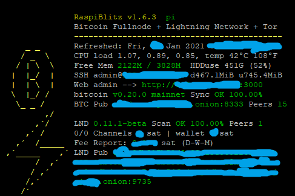

# This forked repo is for implementing changes to Raspiblitz, before they are changed (by pull request) or if they are not gonna be changed officialy and I want a feature
#eg. I don´t know if they would want the B from bitcoin on status, that was on my part

Considerations for the work:
 Need to have an utility goal, facilitating, speeding absorving data, run fast, need to fit on LCD screen and work on HDMI
 

`status` --> `./00infoBlitz.sh`

Problems:
Onion address for LND was below everything and not aligned, done.
There was no scan analysis for LND progress on status, done.
The lightning bolt was not very good configurated, just changed 3 characters and spaces, done.
The lightning bolt was off the LND part, set right now, done.

To do:
I want to have the code here on github for this screen, but Im not finished yet, still thinking about:
  if LND color red for Scanning should be measure by secs/min or blocks behind. If you are reading this and have an idea, pls comment.

 Currently I´ve redesigned `status` screen to be shown like this:

