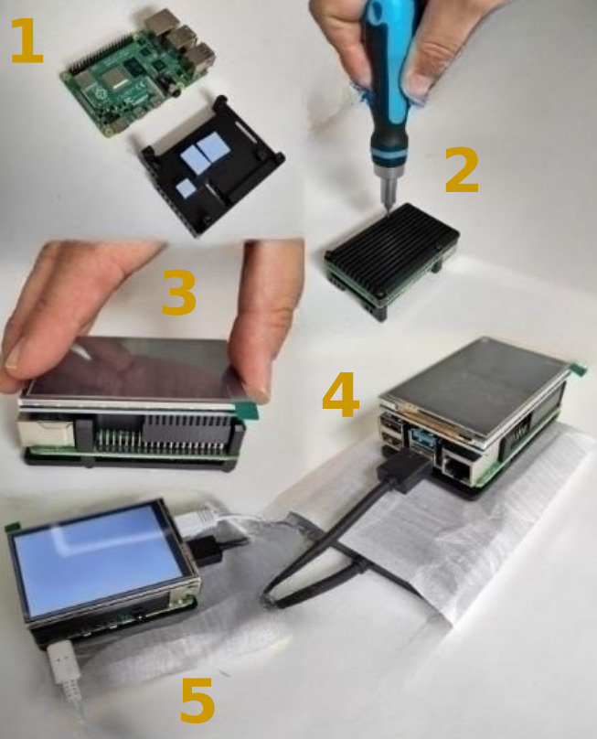
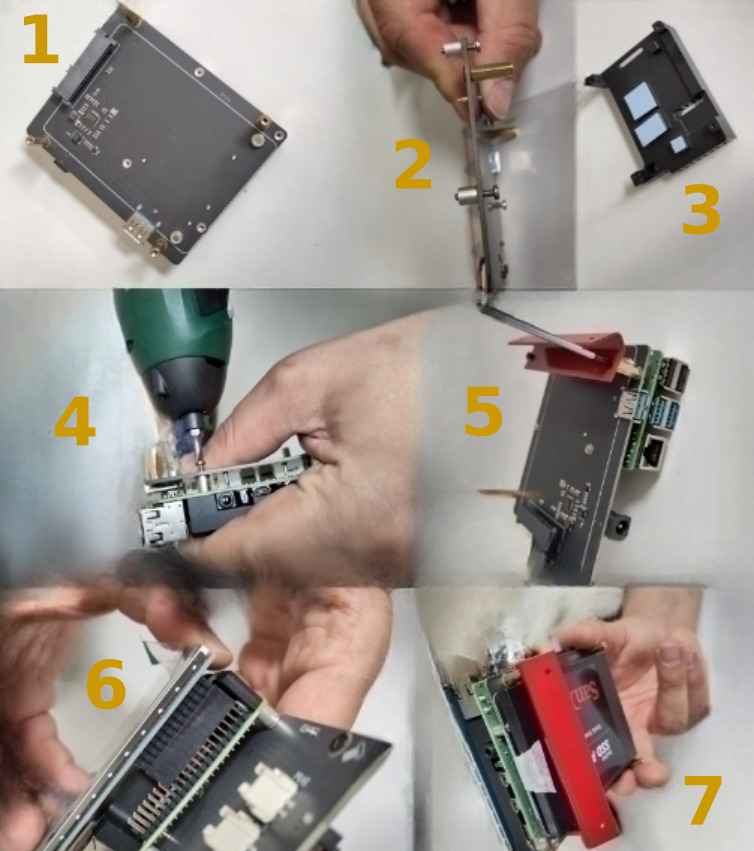
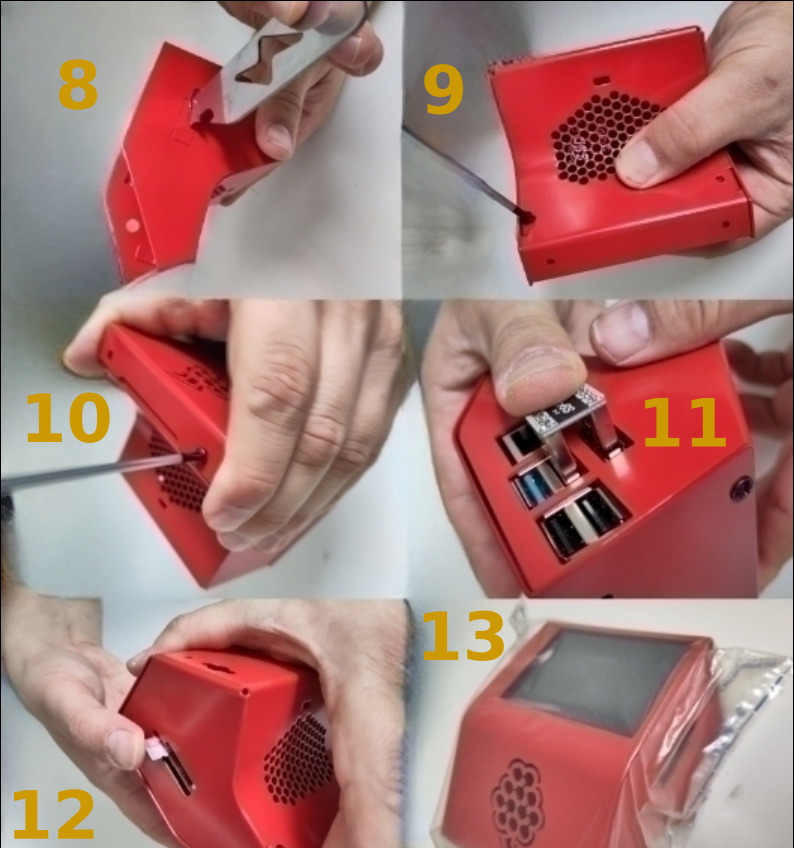

Some good practices for assembling your node's hardware can be found below.

## Table of Contents

  - [Setup with Metal Case](#setup-with-metal-case)
  - [Setup with Heatsink Case](#setup-with-heatsink-case)

## Setup with Metal Case

1. Apply thermal pads.
2. Close the case.
3. Make sure you use the right pins when mounting the display.
4. Connect the SSD with the raspberry pi.
5. Plug your device into power and give it internet access to check if
everything is working as expected.

## Setup with Heatsink Case

1. Put screw mounts on the SSD shield.
2. Prepare screws for mounting the Raspberry PI and corresponding heat sink.
3. Apply thermal pads.
4. Attach the heat sink and raspberry pi.
5. Attach the foot that will later hold things in place.
6. Make sure you use the right pins when mounting the display.
7. Fasten the SSD so that it doesn't shake.

8. Open the SD card slot.
9. Attach everything to the case.
10. Close the case.
11. Connect the SSD with the raspberry pi.
12. Insert the flashed SD card.
13. Remember to use a tamper evident bag before entrusting a third party
with physical access to the device.

