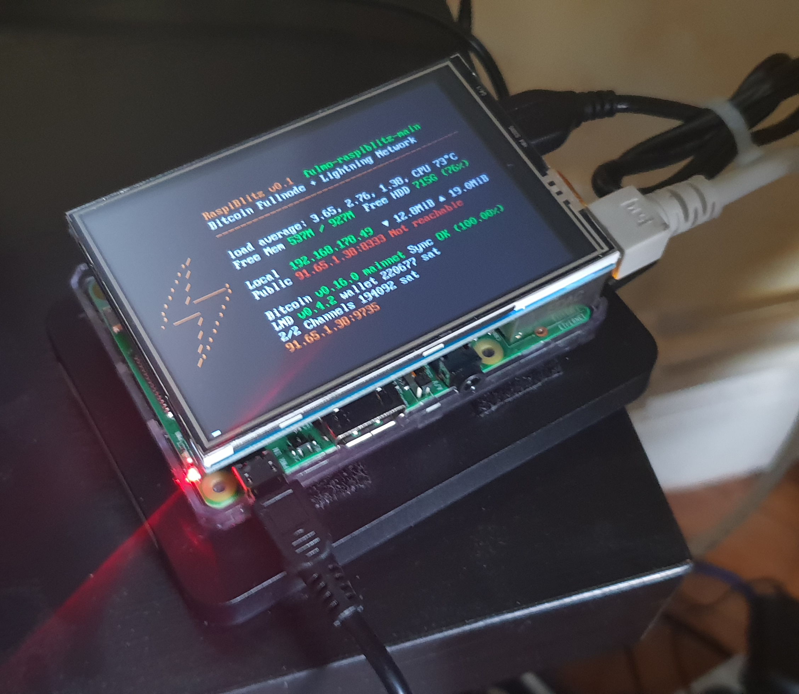
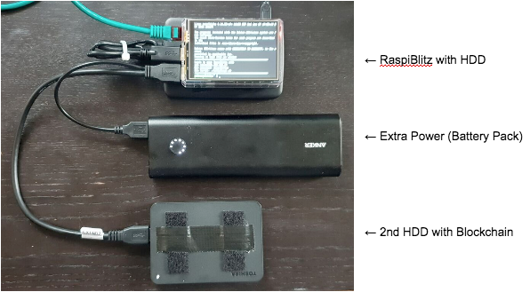

[ [Hardware](#hardware-needed-amazon-shopping-list) ] -- [ [Setup](setup-your-raspiblitz) ] -- [ [Documentation](#documentation) ] -- [ [Education](#educatiuonal-tutorials) ] -- [ [Development](#further-development-of-raspiblitz) ]

-----
# RaspiBlitz
Fastest and cheapest way to get your own Lightning Node running - on a RaspberryPi with a nice LCD.

*This tutorial is based on the RaspiBolt project - you can find in detail here: https://github.com/Stadicus/guides/blob/master/raspibolt The RaspiBlitz serves as a shortcut through this setup process with some changes and an additional LCD display so that you can quickly experiment with a Lightning node and start working on your LApps on a hacking event (or at home). This shortcut is fine for testnet usage and maybe trying some small things on mainnet. But if you choose to go full reckless afterwards … please consider taking the time and work thru the original RaspiBolt project. Don’t trust us, verify.* 

## Table of Contents

* [ [Hardware](#hardware-needed-amazon-shopping-list) ] Shopping Lists and Putting all together  
* [ [Setup](#setup-your-raspiblitz) ] Init and Setup your RaspiBlitz Lightning Node
* [ [Documentation](#documentation) ] Features and Usecases  
* [ [Education](#educatiuonal-tutorials) ] Tutorials with the RaspiBlitz to learn about Lightning
* [ [Development](#further-development-of-raspiblitz) ] Lets work together on the RaspiBlitz

## Hardware Needed (Amazon Shopping List)

*The RaspiBlitz software is build and tested for the following Hardware set that you can buy cheap on Amazon.de:* 

* RaspBerry Pi 3 (31,99 EUR) https://www.amazon.de/dp/B01CD5VC92
* Micro SD-Card 16GB (7,11 EUR) https://www.amazon.de/dp/B0162YQEIE
* Power (9,29 EUR) https://www.amazon.de/dp/B01E75SB2C
* 1TB Hard Drive (49,99 EUR) https://www.amazon.de/dp/B00KWHJY7Q
* Case (9,36 EUR) https://www.amazon.de/dp/B0173GQF8Y
* LCD-Display (19,58 EUR) https://www.amazon.de/dp/B01JRUH0CY

**Total Price: 127,31 EUR** (thats under 150 USD)

Amazon shopping lists for different countries:
[ [USA](shoppinglist_usa.md) ] [ [UK](shoppinglist_uk.md) ]

### Optional Hardware

*Some optional goodies to consider to add to your shopping list for your RaspiBlitz:*

* SD-Card Writer https://www.amazon.de/dp/B01JWFZWUQ
* LAN Cable https://www.amazon.de/dp/B004SUEIE2
* USB-LAN-Adapter https://www.amazon.de/dp/B00NPJV4YY
* Transport Case https://www.amazon.de/dp/B007Y4NWSW
* Y-Cable https://www.amazon.de/dp/B00ZJBIHVY

If you organizing an educational event where you want to support people learning on and with multiple RaspiBlitz, here is a package list of useful hardware to have at that event: [ [Event Package List](shoppinglist_event.md) ]

## Prepare your Hardware

*There are two ways to start:*

### Scenario 1: “At a Hackathon/Event”
If you are at an event, ask for a ready-2-go set or if you have your own hardware ask for assistance to prepare your SD-Card and HDD. Then you are all set and and you can proceed with "SetUp your RaspiBlitz".

### Scenario 2 “Start at Home”
You got all the hardware of the shopping list above and you have no further assistence. Then you need to prepare your SD-Card yourself .. this scenario is still experimental, feedback needed and can take some time. 

1. Download SD-Card image with a [bittorrent client](https://www.utorrent.com/intl/en/downloads/):
https://wiki.fulmo.org/downloads/raspiblitz-2018-07-17b.torrent
or try this HTTP-Link for direct download:
http://wiki.fulmo.org/downloads/raspiblitz-2018-07-17b.img.gz

2. Write the SD-Card image to your SD Card - if you need details, see here:
https://www.raspberrypi.org/documentation/installation/installing-images/

## SetUp your RaspiBlitz

Connect all hardware like on photo and boot it up by connecting the power.

* Make sure to connect the raspberry with a LAN cable to the internet at this point.
* Make sure that your laptop and the raspberry are on the same local network.
* On Mac OSX you can also consider to connect the raspberry directly with your laptop and share your WLAN internet connection over ethernet (thats a nice mobile setup): https://mycyberuniverse.com/mac-os/connect-to-raspberry-pi-from-a-mac-using-ethernet.html

When everything boots up correctly, you should see the local IP address of your RaspiBlitz on the LCD panel. 

So open up a [terminal](https://www.youtube.com/watch?v=5XgBd6rjuDQ) and connect thru SSH:

`ssh admin@[YOURIP]` → use password: `raspiblitz`

Now follow the dialoge in your terminal. This can take some time (prepare some coffee) - but in the end you should have a running Lightning node on your RaspberryPi that you can start to learn and hack on --> see Chapter "Your First Lightning Transaction"

## Documentation

### Setup Process

*The goal is, that all information needed is provided from the interaction with the RaspiBlitz itself during the setup. Documentation in this chapter is for background, comments for educators and help in special edge cases.*

#### Getting the Blockchain

If you want to use the option “COPY” to sync the Blockchain you can simply use the HDD of another RaspiBlitz or you preapre a HDD yourself by:

* format second HDD with exFAT (availbale on Windows and Mac)
* copy an indexed Blockchain into the root folder "bitcoin"
* when youre HDD is ready the content of your folder bitcoin should look like this:

To connect the 2nd HDD to the RaspiBlitz, the use of a Y cable to provide extra power is recommended (see optional shopping list). Because the RaspiBlitz cannot run 2 HDDs without extra power. For extra power you can use a battery pack, like in this picture:

### Features

#### Status Infoscreen

INSERT PHOTO HERE

## Educatiuonal Tutorials

*TODO: Once the SetUp Process is done, the learning and building should begin ... educational content should be added on sub pages in the future - at least "Your first Lightning Transaction"*

## Further Development of RaspiBlitz

The RaspiBlitz was developed on the basis of the RaspiBolt Guide to run LND on a RaspberryPi: https://github.com/Stadicus/guides/blob/master/raspibolt - the idea was to prepare as much as possible and have it on a SD-card ready to startup quickly. The configuration should be automated by scripts combined with some very basic user interaction thru the terminal for adminstration. The LCD should provide basic information, so that the health and state of the RaspiBlitz could be monitored with ease. The LCD has also basic touch support and could be used for direct and fast daily interactions.

The goal of the RaspiBlitz is to provide a out-of-the-box hardware lightning node to learn the basics of being part of the decentralized network and to quickly start building your own applications based on lightning (LApps) - at home or at educational/hacking events. With the well known [GPIO-Pins](https://www.raspberrypi.org/documentation/usage/gpio/) of the RaspberryPi, low-cost entry point and its rich hardware extension ecosystem it seems like the perfect device to foster the communities creativity. Lets keep crypto weird.

Everybody is welcome to join, improve and extend the RaspiBlitz - its a work in progress. Check the issues if you wanna help out or add new ideas. You find the scripts used for RaspiBlitz interactions on the device at `/home/admin` or in this git repo in the subfolder `home.admin`. More to come.

Join me on twitter [@rootzoll](https://twitter.com/rootzoll), visit us at a [#lightninghackday](https://twitter.com/hashtag/LightningHackday?src=hash) in Berlin or drop by the Bitcoin Assembly at the [#35C3](https://twitter.com/hashtag/35C3).
