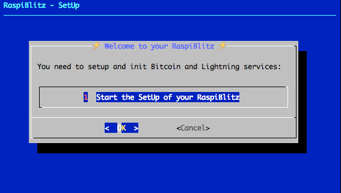
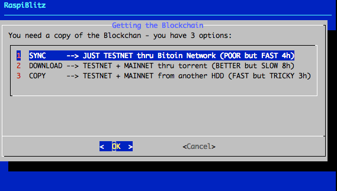
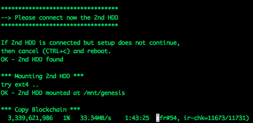
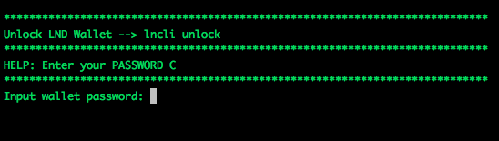
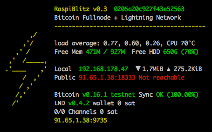

[ [Hardware](#hardware-needed-amazon-shopping-list) ] -- [ [Setup](setup-your-raspiblitz) ] -- [ [Documentation](#documentation) ] -- [ [Education](#educatiuonal-tutorials) ] -- [ [Development](#further-development-of-raspiblitz) ]

-----
# RaspiBlitz
Fastest and cheapest way to get your own Lightning Node running - on a RaspberryPi with a nice LCD.

*This tutorial is based on the RaspiBolt project - you can find in detail here: https://github.com/Stadicus/guides/blob/master/raspibolt The RaspiBlitz serves as a shortcut through this setup process with some changes and an additional LCD display so that you can quickly experiment with a Lightning node and start working on your LApps on a hacking event (or at home). This shortcut is fine for testnet usage and maybe trying some small things on mainnet. But if you choose to go full reckless afterwards … please consider taking the time and work thru the original RaspiBolt project. Don’t trust us, verify.*

## Table of Contents

* [ [Hardware](#hardware-needed-amazon-shopping-list) ] Shopping Lists and Putting all together  
* [ [Setup](#setup-your-raspiblitz) ] Init and Setup your RaspiBlitz Lightning Node
* [ [Documentation](#documentation) ] Features and Usecases  
* [ [Education](#educatiuonal-tutorials) ] Tutorials with the RaspiBlitz to learn about Lightning
* [ [Development](#further-development-of-raspiblitz) ] Lets work together on the RaspiBlitz

## Hardware Needed (Amazon Shopping List)

*The RaspiBlitz software is build and tested for the following Hardware set that you can buy cheap on Amazon.de:*

* RaspBerry Pi 3 (31,99 EUR) https://www.amazon.de/dp/B01CD5VC92
* Micro SD-Card 16GB (7,11 EUR) https://www.amazon.de/dp/B0162YQEIE
* Power (9,29 EUR) https://www.amazon.de/dp/B01E75SB2C
* 1TB Hard Drive (49,99 EUR) https://www.amazon.de/dp/B00KWHJY7Q
* Case (9,36 EUR) https://www.amazon.de/dp/B0173GQF8Y
* LCD-Display (19,58 EUR) https://www.amazon.de/dp/B01JRUH0CY

**Total Price: 127,31 EUR** (thats under 150 USD)

Amazon shopping lists for different countries:
[ [USA](shoppinglist_usa.md) ] [ [UK](shoppinglist_uk.md) ]

You can even pay your RaspiBlitz Amazon Shopping with Bitcoin & Lightning thru [Bitrefill](https://blog.bitrefill.com/its-here-buy-amazon-vouchers-with-bitcoin-on-bitrefill-bb2a4449724a).

### Optional Hardware

*Some optional goodies to consider to add to your shopping list for your RaspiBlitz (Amazon DE/US):*

* SD-Card Writer https://www.amazon.de/dp/B01JWFZWUQ / http://a.co/6e03D7Z
* LAN Cable https://www.amazon.de/dp/B004SUEIE2 /http://a.co/g2IJd6i
* USB-LAN-Adapter https://www.amazon.de/dp/B00NPJV4YY / http://a.co/ccb26nF
* Transport Case https://www.amazon.de/dp/B007Y4NWSW / http://a.co/0c6wyM2
* Y-Cable https://www.amazon.de/dp/B00ZJBIHVY / http://a.co/0WTA7nz

If you organizing an educational event where you want to support people learning on and with multiple RaspiBlitz, here is a package list of useful hardware to have at that event: [ [Event Package List](shoppinglist_event.md) ]

## Prepare your Hardware

*There are two ways to start:*

### Scenario 1: “At a Hackathon/Event”
If you are at an event, ask for a ready-2-go set or if you have your own hardware ask for assistance to prepare your SD-Card and HDD. Then you are all set and and you can proceed with "Setup your RaspiBlitz".

### Scenario 2 “Start at Home”
You got all the hardware of the shopping list above and you have no further assistance. Then you need to prepare your SD-Card yourself .. this scenario is still experimental, feedback needed and can take some time.

1. Download SD-Card image with [bittorrent](https://www.utorrent.com/intl/en/downloads/):
https://wiki.fulmo.org/downloads/raspiblitz-2018-07-17b.torrent
or try this HTTP-Link for direct download:
http://wiki.fulmo.org/downloads/raspiblitz-2018-07-17b.img.gz

2. Write the SD-Card image to your SD Card - if you need details, see here:
https://www.raspberrypi.org/documentation/installation/installing-images/README.md

## Boot your RaspiBlitz

Connect all hardware like on photo and boot it up by connecting the power.

* Make sure to connect the raspberry with a LAN cable to the internet at this point.
* Make sure that your laptop and the raspberry are on the same local network.
* On Mac OS X you can also consider to connect the raspberry directly with your laptop and share your WLAN internet connection over ethernet (thats a nice mobile setup): https://mycyberuniverse.com/mac-os/connect-to-raspberry-pi-from-a-mac-using-ethernet.html

When everything boots up correctly, you should see the local IP address of your RaspiBlitz on the LCD panel.

So open up a [terminal](https://www.youtube.com/watch?v=5XgBd6rjuDQ) and connect thru SSH with the command displayed by the RaspiBlitz:

`ssh admin@[YOURIP]` → use password: `raspiblitz`

**Now follow the dialoge in your terminal. This can take some time (prepare some coffee) - but in the end you should have a running Lightning node on your RaspberryPi that you can start to learn and hack on.**

## Documentation

### Setup Process

*The goal is, that all information needed is provided from the interaction with the RaspiBlitz itself during the setup. Documentation in this chapter is for background, comments for educators and help in special edge cases.*

#### Init

Automatically after login per SSH as admin to the RaspiBlitz, the user sees this welcome menu:

Setting Up the Raspi is the only option at this point, so we go with OK.

*Background: This menu is displayed by the script `00mainMenu.sh` and started automatically on every login of the admin user by admins `.bashrc`. If you want to get to the normal terminal prompt after login, just use CTRL-c. If you press OK in the dialog the script `10setupBlitz.sh` gets started*

First thing to setup is giving your RaspiBlitz an name:

This name is given to the RaspiBlitz as hostname in the local network and later on also for the alias of the lightning node.

*Background: This and the following setup dialogues are part of the script `20initDialog.sh`. The idea is to request much as needed setup information from the user at the start in this dialogs, so after that the setup can just run without many breaks.*

Then the user gets requested to write down 4 passwords:

*Background: The password A,B,C & D idea is directly based in the [RaspiBolt Guide Preperations](https://github.com/Stadicus/guides/blob/master/raspibolt/raspibolt_20_pi.md#write-down-your-passwords)*

Then the user is asked to enter the Password A:

On the next SSH login to the RaspiBlitz as admin, this new password has to be used. Its also set for the user existing user: root, bitcoin & pi. But only admin can be used to login per SSH.

*Background: The bitcoin and lightning processes will run in the background (as daemon) and use the separate user “bitcoin” for security reasons. This user does not have admin rights and cannot change the system configuration.*

Then the user is asked to enter the Password B:

*Background: The other passwords C & D get entered by the lightning wallet setup. This can just happen later ... so they will not get requested at this point.*

After this the setup process needs some time and the user will see a lot of console outputs:

*Background: After the user interaction the following scripts are started to automatically setup the RaspiBlitz:*

* 30initHDD.sh - it checks if the HDD needs to be formatted with Ext4
* 40addHDD.sh - adds the HDD for permanent mounting on /mnt/hdd
* 10setupBlitz.sh - now takes care that the HDD contains the blockchain

The following screen is just shown, if the HDD was not prepared with a copy of the Bitcoin blockchain (as part of a ready-2-go set). The following options are offered to get a copy:

The third option "SYNC" should just be use as a fallback. So normally you have the following two options:

#### Download the Blockchain

This is the recommended way for users that are making the setup at home without any further assistance but can take quite some time.

*Background: The download is done thru bittorrent. So just it should be possible to stop/shutdown the Raspi and continue later - just in case.*

#### Copy the Blockchain

To copy the blockchain from another HDD can be faster - if available. If you choose this option the, the console requests you to connect the second HDD and will autmatically detect it:

You can simply use the HDD of another RaspiBlitz or you prepare a HDD yourself by:

* format second HDD with exFAT (availbale on Windows and Mac)
* copy an indexed Blockchain into the root folder "bitcoin"
* when youre HDD is ready the content of your folder bitcoin should look like this:

To connect the 2nd HDD to the RaspiBlitz, the use of a Y cable to provide extra power is recommended (see optional shopping list). Because the RaspiBlitz cannot run 2 HDDs without extra power. For extra power you can use a battery pack, like in this picture:

**Background: If the blockchain was already on the HDD or was acquired successfully, the script `60finsihHDD.sh` will be called. It will further prepare the HDD and start the bitcoin service.*

#### Lightning

Before the lighting service can be started the Bitcoin service needs to make sure that the blockchain is up to date. The downloaded blockchain data could be several weeks old - this could take some minutes. Then the Lightning Service gets started and a wallet can be created:

The creation of the Lightning Bitcoin Wallet gets done with the command: `lncli create` the RaspiBlitz is calling in the background.

After the wallet was created the Lightning service needs to scan the Blockchain ... this can take some time. If needed the user can close the SSH session with the RaspiBlitz during that time (progress is displayed on the LCD as status). On SSH back in just continue with the setup process.

*Background: Blockchain synup, LND wallet creation and LND scanning is all done within the script `70initLND.sh`*

Now the setup process is almost done and the RaspiBlitz needs a reboot:

After reboot the RaspiBlitz is showing that the Wallet needs to be unlocked on the LCD and its ready to SSH back in:

*Background: The LND wallet needs to get unlocked on every new start of the RaspiBlitz. The status information loop on the LCD is done by the script '00infoBlitz.sh'*

After SSH back in as admin the main menu shows the unlock option:

Once the wallet is unlocked the setup is finally over and the main menu shows the option and features of the RaspiBlitz:

*Background: The script `00mainMenu.sh` is now the place to offer further features und extend the possibilities of the RaspiBlitz. Feel free to come up with ideas. Check out the developer section at the end of this page.*

### Features

But you manually extened your RaspiBlitz with features listed in the RaspiBlot Guide: https://github.com/Stadicus/guides/blob/master/raspibolt/raspibolt_60_bonus.md

Already integrated features of the RaspiBlitz are/willbe listed as part of the main menu after connecting per ssh with the admin user.

#### Status Infoscreen

## Educational Tutorials

*Once the Setup Process is done, the learning and building should begin ... more detailed educational content should be added in this section in the future.*

A good way to start for now is to get some Testnet coins, connect to other peers and make your first transactions. You find tutorials for this at the original RaspiBolt guide: https://github.com/Stadicus/guides/blob/master/raspibolt/raspibolt_40_lnd.md#get-some-testnet-bitcoin

## Further Development of RaspiBlitz

The RaspiBlitz was developed on the basis of the RaspiBolt Guide to run LND on a RaspberryPi: https://github.com/Stadicus/guides/blob/master/raspibolt - the idea was to prepare as much as possible and have it on a SD-card ready to startup quickly. The configuration should be automated by scripts combined with some very basic user interaction thru the terminal for adminstration. The LCD should provide basic information, so that the health and state of the RaspiBlitz could be monitored with ease. The LCD has also basic touch support and could be used for direct and fast daily interactions.

The goal of the RaspiBlitz is to provide a out-of-the-box hardware lightning node to learn the basics of being part of the decentralized network and to quickly start building your own applications based on lightning (LApps) - at home or at educational/hacking events. With the well known [GPIO-Pins](https://www.raspberrypi.org/documentation/usage/gpio/) of the RaspberryPi, low-cost entry point and its rich hardware extension ecosystem it seems like the perfect device to foster the communities creativity. Lets keep crypto weird.

Everybody is welcome to join, improve and extend the RaspiBlitz - its a work in progress. Check the issues if you wanna help out or add new ideas. You find the scripts used for RaspiBlitz interactions on the device at `/home/admin` or in this git repo in the subfolder `home.admin`. More to come.

Join me on twitter [@rootzoll](https://twitter.com/rootzoll), visit us at a [#lightninghackday](https://twitter.com/hashtag/LightningHackday?src=hash) in Berlin or drop by the Bitcoin Assembly at the [#35C3](https://twitter.com/hashtag/35C3).

IRC channel on Freenode `irc://irc.freenode.net/raspiblitz`
