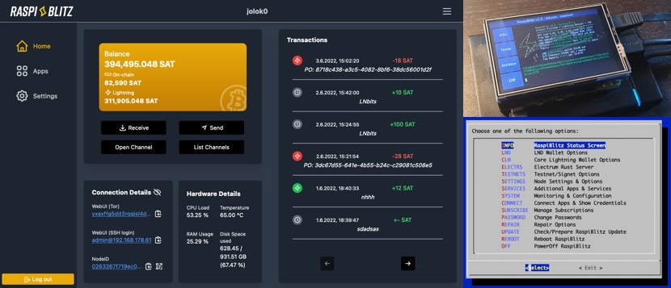
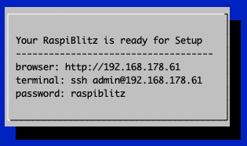
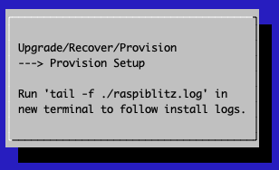

# RaspiBlitz
*Build your own Lightning Node on a RaspberryPi with a nice Display.*

`Version 1.0 with lnd 0.5.1-beta and bitcoin 0.17.0.1 or litecoin 0.16.3.`

*The RaspiBlitz is a all-switches-on Lightning Node based on LND running together with a Bitcoin- or Litecoin-Fullnode running on a RaspberryPi3 with a 1TB HDD and an nice Display for easy setup and monitoring. Its mainly targeted for learning how to run your own decntralized Node from home. Discover & develop the growing ecosystem of the Lightning Network by becoming a part of it.*

## Time Estimate to Setup a RaspiBlitz

The RaspiBlitz is optimized for being Setup during a workshop at hackdays or conference. When it comes ready assembled together with a up-to-date synced HDD containing the blockchain its possible to have it ready in about 2 to 3 hours.

If you start at home ordering the parts from Amazon (see shopping list below) then its a weekend project with a lot of download and syncing time where you can do other stuff while checking on the progress from time to time. 

## Hardware Needed

The RaspiBlitz is build from the following parts:

* RaspBerryPi 3 B+
* Micro SD-Card 16GB
* Strong USB Powersupply >=3A
* 1TB Hard Drive
* Cheap Casing
* LCD-Display

**Total Price: Under 150 USD / 130 EUR (depending on country & shop)**

* [What other case options do I have?](FAQ.md#what-other-case-options-do-i-have)

## Amazon Shopping Lists

These are the community currated shopping lists based in country:

* [Germany](shoppinglist_de.md) *(reference shopping list)*
* [USA](shoppinglist_usa.md)
* [UK](shoppinglist_uk.md)
* [Switzerland](shoppinglist_ch.md)
* [France](shoppinglist_fr.md)
* [China](shoppinglist_cn.md)
* [Australia](shoppinglist_au.md)
* [Czech](shoppinglist_cz.md)

*You can even pay your RaspiBlitz Amazon Shopping with Bitcoin & Lightning thru [Bitrefill](https://blog.bitrefill.com/its-here-buy-amazon-vouchers-with-bitcoin-on-bitrefill-bb2a4449724a).*

## Assemble your RaspiBlitz

If your RaspiBlitz is not assembled yet, put the RaspberryPi board into the case and add the display like in picture below:

*Some cases from the shopping lists contain a topping for smaller displays - you can ignore that topping.*

Connect the HDD to one of the USB ports. In the end your RaspiBlitz should look like this:

## Installing the Software

Your SD-card needs to contain the RaspiBlitz software. You can take the long road by [building the SD-card image yourself](#build-the-sd-card-image) or use the already prepared SD-Card image: 

1. Download SD-Card image - **Version 1.0**:
https://wiki.fulmo.org/downloads/raspiblitz-1.00-2019-02-22.img.gz
SHA-256: 91ef1e5b4e55a5a90e9faf094756461be841ba02591bb41ccf481755977b191b

2. Write the SD-Card image to your SD Card - if you need details, see here:
https://www.raspberrypi.org/documentation/installation/installing-images/README.md

## Boot your RaspiBlitz

Insert the SD card and connect the power plug.

* Make sure to connect the raspberry with a LAN cable to the internet at this point.
* Make sure that your laptop and the raspberry are on the same local network.

When everything boots up correctly, you should see the local IP address of your RaspiBlitz on the LCD panel.

So open up a [terminal](https://www.youtube.com/watch?v=5XgBd6rjuDQ) and connect thru SSH with the command displayed by the RaspiBlitz:

`ssh admin@[YOURIP]` → use password: `raspiblitz`

**Now follow the dialoge in your terminal. This can take some time (prepare some coffee) - but in the end you should have a running Lightning node on your RaspberryPi that you can start to learn and hack on.**

## Support

Fore more details on the setup process see the documentation below. If you run into a problem or you have still a question, follow these steps to get support:

1. Check the [FAQ](FAQ.md) if you can find an answere to this question/problem.

2. Please determine if your problem/question is about RaspiBlitz or for example with LND. For example if you cant route a payment or get an error when opening a channel that is an LND question/problem an is best answered by the LND dev community: https://dev.lightning.community  

3. Go to the GitHub issues of the RaspiBlitz: https://github.com/rootzoll/raspiblitz/issues Do a search there. Also check closed issues by removing 'is:open' from the filter/search-box.

4. If you havent found an answere yet, open a new issue on the RaspiBlitz GitHub. You may have to register an account with GitHub for this. If its a big with the RaspiBlitz, please add (copy+paste) a Debug Report to your issue (see [FAQ](FAQ.md) how to generate) and/or add some screenshots/photios so the community gets more insight into your problem.

## Documentation

### Setup Process

*The goal is, that all information needed is provided from the interaction with the RaspiBlitz itself during the setup. Documentation in this chapter is for background, comments for educators and point special edge cases.*

#### Init

Automatically after login per SSH as admin to the RaspiBlitz, the user can choose if the RaspiBlitz should combine Bitcoin or Litecoin with Lightning:

Setting Up the Raspi is the only option at this point, so we go with OK.

*Background: This menu is displayed by the script `00mainMenu.sh` and started automatically on every login of the admin user by admins `.bashrc`. If you want to get to the normal terminal prompt after login, just use CTRL-c. If you press OK in the dialog the script `10setupBlitz.sh` gets started*

First thing to setup is giving your RaspiBlitz an name:

This name is given to the RaspiBlitz as hostname in the local network and later on also for the alias of the lightning node.

*Background: This and the following setup dialogues are part of the script `20setupDialog.sh`. The idea is to request much as needed setup information from the user at the start in this dialogs, so after that the setup can just run without many breaks.*

Then the user gets requested to write down 4 passwords:

*Background: The password A,B,C & D idea is directly based in the [RaspiBolt Guide Preperations](https://github.com/Stadicus/guides/blob/master/raspibolt/raspibolt_20_pi.md#write-down-your-passwords)*

Then the user is asked to enter the Password A:

On the next SSH login to the RaspiBlitz as admin, this new password has to be used. Its also set for the user existing user: root, bitcoin & pi. But only admin can be used to login per SSH.

*Background: The bitcoin and lightning processes will run in the background (as daemon) and use the separate user “bitcoin” for security reasons. This user does not have admin rights and cannot change the system configuration.*

Then the user is asked to enter the Password B:

*Background: The other passwords C & D get entered by the lightning wallet setup. This can just happen later ... so they will not get requested at this point.*

After this the setup process needs some time and the user will see a lot of console outputs:

*Background: After the user interaction the following scripts are started to automatically setup the RaspiBlitz:*

* 30initHDD.sh - it checks if the HDD needs to be formatted with Ext4
* 40addHDD.sh - adds the HDD for permanent mounting on /mnt/hdd
* 10setupBlitz.sh - now takes care that the HDD contains the blockchain

The following screen is just shown, if the HDD was not prepared with a copy of the Bitcoin blockchain (as part of a ready-2-go set). The following options are offered to get a copy:

The option "SYNC" should just be use as a fallback. So normally you have the following two options:

#### Download the Blockchain

This is the recommended way for users that are making the setup at home without any further assistance but can take quite some time. You can choose to download over TORRENT or FTP-DOWNLOAD. Choose the FTP if the torrent is not working for you.

For more details: [Background on Download Blockchain](background_downloadBlockchain.md)

#### Copy the Blockchain

To copy the blockchain from another HDD can be faster - if available. If you choose this option, the console requests you to connect the second HDD and will autmatically detect it:

You can simply use the HDD of another RaspiBlitz or you prepare a HDD yourself by:

* format second HDD with exFAT (availbale on Windows and Mac)
* copy an indexed Blockchain into the root folder "bitcoin"
* when your HDD is ready the content of your folder bitcoin should look like this:

To connect the 2nd HDD to the RaspiBlitz, the use of a Y cable to provide extra power is recommended (see optional shopping list). Because the RaspiBlitz cannot run 2 HDDs without extra power. For extra power you can use a battery pack, like in this picture:

**Background: If the blockchain was already on the HDD or was acquired successfully, the script `60finishHDD.sh` will be called. It will further prepare the HDD and start the bitcoin service.*

#### Lightning

Before the lighting service can be started, the Bitcoin service needs to make sure that the blockchain is up to date. The downloaded blockchain data could be several weeks old - this could take some minutes. Then the Lightning Service gets started and a wallet can be created:

The creation of the Lightning Bitcoin Wallet gets done with the command: `lncli create` the RaspiBlitz is calling in the background.

After the wallet was created the Lightning service needs to scan the Blockchain ... this can take some time. If needed the user can close the SSH session with the RaspiBlitz during that time (progress is displayed on the LCD as status). On SSH back in just continue with the setup process.

*Background: Blockchain synup, LND wallet creation and LND scanning is all done within the script `70initLND.sh`*

Now the setup process is almost done and the RaspiBlitz needs a reboot:

After reboot the RaspiBlitz is showing that the Wallet needs to be unlocked on the LCD and its ready to SSH back in:

*Background: The LND wallet needs to get unlocked on every new start of the RaspiBlitz. The status information loop on the LCD is done by the script '00infoBlitz.sh'*

After SSH back in as admin the main menu shows the unlock option:

Once the wallet is unlocked the setup is finally over and the main menu shows the option and features of the RaspiBlitz:

And if you scroll down .. you see even more feature options:

*Background: The script `00mainMenu.sh` is now the place to offer further features und extend the possibilities of the RaspiBlitz. Feel free to come up with ideas. Check out the developer section at the end of this page.*

### Features

You can manually extend your RaspiBlitz with features listed in the RaspiBolt Guide: https://github.com/Stadicus/guides/blob/master/raspibolt/raspibolt_60_bonus.md

Already integrated features of the RaspiBlitz are/will be listed as part of the main menu after connecting via ssh as admin user.

*Background: The script `91addBonus.sh` is the place to put your setup of features you want to add to RaspiBlitz. Its run at the end of the automated setup process before final reboot. To make the feature executable for the user, add a new option to the `00mainMenu.sh`*

#### Status Infoscreen

#### Detailed Balances and Channel Info

#### TOR Integration (experimental)

You can use the Switch to TOR option from the main menu to make the node reachable thru TOR. This way you can get thru a NAT without needed to open/forward ports on your router. Bitcoin and LND will have a seperate onion-address displayed on LCD and the Status Info Screen option in menu.

The TOR integration is experimental and at the moment there is no way to switch off TOR again. 

#### Connect to Mobile Wallet

There is now the option to connect and control your LND node with the mobile app called "Shango" - choose option in the main menu.

#### Public Domain with DynamicDNS

This is a way to make your RaspiBlitz publicly reachable from the internet so that other nodes can open channels with you and you can connect with the 

To do so you can register at an DynamicDomain service like freedns.afraid.org, forward the TCP ports 8333 (Bitcoin/mainnet),9735 (LND Node) & 10009 (LND RPC) from your internet router to the local IP of your RaspiBlitz and then activate unter "Services" the "DynamicDNS" option.

You will be asked for your dynamic domain name such like "mynode.crabdance.org" and you can also optionally set an URL that will be called regularly to update your routers IP with the dynnamic domain service. At freedns.afraid.org this URL is called "Direct URL" under the menu "Dynamic DNS" once you added one.

## Auto-unlock LND on startup

This feature is based on https://github.com/Stadicus/guides/blob/master/raspibolt/raspibolt_6A_auto-unlock.md

It can be activated under "Services" -> "Auto-unlock LND". Its recommended to be turned on, when DynamicDNS is used. Because on a public IP change of your router, LND gets restarted automatically and without Auto-Unlock it will stay inactive/unreachbale until you manually unlock it.

But keep in mind that when activated, your Password C will be stored on the RaspiBlitz SD card. That lowers your security in (physical) attack scenarios. On an update you would need to re-enter your password C.

## Updating to new Version

If you have a RaspiBlitz older then verison 0.98 please [see here](FAQ.md).

If you have a RaspiBlitz version 0.98 or newer do the following:

* Main menu > OFF
* Remove power
* Remove SD card

Now download the new RaspiBlitz SD card image and write it to your SD card .. yes you simply overwrite the old one, it's OK, the RaspiBlitz stores all your personal data on the HDD. See details about latest SD card image [here](README.md#installing-the-software).

*If you have done manual changes to the system (installed packages, added scripts, etc) you might need to do some preparations before overwriting your sd card - see [FAQ](FAQ.md#why-do-i-need-to-re-burn-my-sd-card-for-an-update).*

If done successfully, simply put the SD card into the RaspiBlitz and power on again. Then follow the instructions on the display ... and dont worry, you dont need to re-download the blockchain again.

* [Why do I need to re-burn my SD card for an update?](FAQ.md#why-do-i-need-to-re-burn-my-sd-card-for-an-update)

## Build the SD Card Image

A ready to use SD card image of the RaspiBlitz for your RaspberryPi is provided as download by us to get everybody started quickly (see above). But if you want to build that image yourself - here is a quick guide:

* Get a fresh Rasbian RASPBIAN STRETCH WITH DESKTOP card image: [DOWNLOAD](https://www.raspberrypi.org/downloads/raspbian/)
* Write image to a SD card: [TUTORIAL](https://www.raspberrypi.org/documentation/installation/installing-images/README.md) 
* Add a file called `ssh` to the root of the SD card when mounted to enable SSH login
* Start card in Raspi and login per SSH with `ssh pi@[IP-OF-YOUR-RASPI]` password is `raspberry`

Now you are ready to start the SD card build script - copy the following command into your terminal and execute:

`wget https://raw.githubusercontent.com/rootzoll/raspiblitz/master/build.sdcard/raspbianStretchDesktop.sh && sudo bash raspbianStretchDesktop.sh`

As you can see from the URL you find the build script in this Git repo under `build.sdcard/raspbianStretchDesktop.sh`- there you can check what gets installed and configured in detail. Feel free to post improvements as pull requests.

The whole build process takes a while. At the end the LCD drivers get installed and a reboot is needed. A user `admin` is created during the process. Remember the default password is now `raspiblitz`. You can login per SSH again - this time use admin: `ssh admin@[IP-OF-YOUR-RASPI]`. An installer of the SD card image should automatically launch. If you do not want to continue with the installation at this moment and use this sd card as a template for setting up multiple RaspiBlitze, click `Cancel` and run `/home/admin/XXprepareRelease.sh`. Once you see the LCD going white and the activity LED of the pi starts going dark, you can unplug power and remove the SD card. You have now built your own RaspiBlitz SD card image. 

*Note: If you plan to use your self build sd card as a MASTER copy to backup image and distribute it. Use a smaller 8GB card for that. This way its ensured that it will fit on every 16 GB card recommended for RaspiBlitz later on.*

* [How can I build an SD card other then the master branch?](FAQ.md#how-can-i-build-an-sd-card-other-then-the-master-branch)
* [How can I build an SD card from my forked GitHub Repo?](FAQ.md#how-can-i-build-an-sd-card-from-my-forked-github-repo)

## Further Development of RaspiBlitz

The RaspiBlitz was developed on the basis of the RaspiBolt Guide to run LND on a RaspberryPi: https://github.com/Stadicus/guides/blob/master/raspibolt - the idea was to prepare as much as possible and have it on a SD-card ready to startup quickly. The configuration should be automated by scripts combined with some very basic user interaction thru the terminal for adminstration. The LCD should provide basic information, so that the health and state of the RaspiBlitz could be monitored with ease. The LCD has also basic touch support and could be used for direct and fast daily interactions.

The goal of the RaspiBlitz is to provide a out-of-the-box hardware lightning node to learn the basics of being part of the decentralized network and to quickly start building your own applications based on lightning (LApps) - at home or at educational/hacking events. With the well known [GPIO-Pins](https://www.raspberrypi.org/documentation/usage/gpio/) of the RaspberryPi, low-cost entry point and its rich hardware extension ecosystem it seems like the perfect device to foster the communities creativity. Lets keep crypto weird.

Everybody is welcome to join, improve and extend the RaspiBlitz - its a work in progress. Check the issues if you wanna help out or add new ideas. You find the scripts used for RaspiBlitz interactions on the device at `/home/admin` or in this git repo in the subfolder `home.admin`. More to come.

Join me on twitter [@rootzoll](https://twitter.com/rootzoll), visit us at a upcomming [#lightninghackday](https://twitter.com/hashtag/LightningHackday?src=hash)

IRC channel on Freenode `irc://irc.freenode.net/raspiblitz` (unmoderated)
