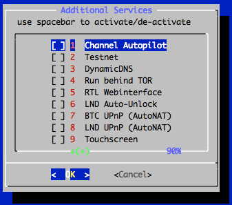
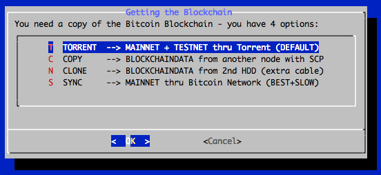
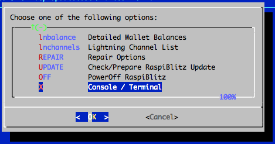
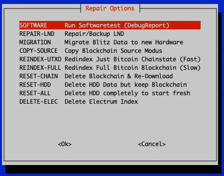

*Build your own Lightning Node on a RaspberryPi with a nice Display.*

`Version 1.3 with lnd 0.7.1-beta and bitcoin 0.18.1 or litecoin 0.16.3.`

**The RaspiBlitz is a all-switches-on Lightning Node based on LND running together with a Bitcoin- or Litecoin-Fullnode on a RaspberryPi 3/4 - with a HDD/SSD and an nice Display for easy setup & monitoring.**

It's mainly targeted for learning how to run your own node decentralized from home. Discover & develop the growing ecosystem of the Lightning Network by becoming a full part of it. Build it as part of a [workshop](WORKSHOP.md) or as a weekend project yourself.

## Feature Overview

This is a quick look at the SSH main menu (once RaspiBlitz is SetUp):

There are additional services that can be switched on:

As an parallel alternative to the SSH menu there is also the RTL WebUI available (LND API Coverage at 57%):

See more details in the [Feature Documentation](#feature-documentation) & of course you have all the [Fullnode APIs](#interface--apis).

## Time Estimate to Setup a RaspiBlitz

The RaspiBlitz is optimized for being setup during a workshop at a hackday or conference (see [detailed workshop tutorial](WORKSHOP.md)). When it comes ready assembled together with a up-to-date synced blockchain it's possible to have it ready in about 2 to 3 hours - most is waiting time.

If you start at home ordering the parts from Amazon (see shopping list below) then it's a weekend project with a lot of download and syncing time where you can do other stuff while checking on the progress from time to time.

## Hardware Needed

The RaspiBlitz is build from the following minimal parts:

* RaspBerryPi 3B/4B
* 500GB USB HDD or SSD
* LCD-Display HAT
* 16GB Micro SD-Card
* Power supply >=3A (stable output is important)

**All parts together are at around 150-200 USD - based on shops and location.**

### Buy a ready-2-go RaspiBlitz (Germany, EU and International)

If you like to support the RaspiBlitz project you can order a ready-2-go RaspiBlitz or a all-you-need-hardware set for yourself or for your RaspiBlitz workshop from [raspiblitz.com](https://raspiblitz.com) *(pay with Bitcoin/Lightning or with deprecated PayPal/CreditCard)*

*To list your local/national RaspiBlitz shop here or on raspiblitz.com, get in contact: christian@fulmo.org*

### International Shopping Lists (buy parts & build it yourself)

The cheapest way is to buy ans assemble the single parts yourself. These are the community curated shopping lists based on country:

* [Germany](shoppinglist_de.md) *(reference shopping list)*
* [USA](shoppinglist_usa.md)
* [Canada](shoppinglist_ca.md)
* [UK](shoppinglist_uk.md)
* [Switzerland](shoppinglist_ch.md)
* [France](shoppinglist_fr.md)
* [China](shoppinglist_cn.md)
* [Australia](shoppinglist_au.md)
* [Czech](shoppinglist_cz.md)
* [Italy](shoppinglist_it.md)

*You can even pay your RaspiBlitz Amazon Shopping with Bitcoin & Lightning through [Bitrefill](https://blog.bitrefill.com/its-here-buy-amazon-vouchers-with-bitcoin-on-bitrefill-bb2a4449724a).*

* [What other case options do I have?](FAQ.md#what-other-case-options-do-i-have)

## Assemble your RaspiBlitz

If you are going with the Standard/Maximal-RaspberryPi4 Setup you need to:

- Assemble the Shim-Fan and connect it to the GPIO pins: [detail instructions](https://learn.pimoroni.com/tutorial/sandyj/getting-started-with-fan-shim)
- Fit the RaspberryPi to the PiBow case: [detail instructions](https://www.youtube.com/watch?v=utk3cjzCLog)
- Put the SSD into the HDD USB & may get some rubber bands

Add the display on top with the pins like in picture below. PlugIn the network cable. In the end your RaspiBlitz should look like this:

*If you are going with the Minimal-RaspberryPi3 Setup just apply the Geekworm Heatsink-Case and connect everything- [detail instructions](https://www.youtube.com/watch?v=2QDlbAorJKw).*

## Installing the Software

Your SD-card needs to contain the RaspiBlitz software. You can take the long road by [building the SD-card image yourself](#build-the-sd-card-image) or use the already prepared SD-Card image:

**Download SD-Card image - Version 1.3:**

HTTP: https://raspiblitz.com/raspiblitz-v1.3-2019-09-05.img.gz

Torrent: https://github.com/rootzoll/raspiblitz/raw/v1.3/raspiblitz-v1.3-2019-09-05.torrent

SHA-256: ab35ca7e8c05a02e26b90bcabe82f3e7c0f0bdf104df2bda3fde574e2ff5a72a or [SIGNATURE](https://raspiblitz.com/raspiblitz-v1.3-2019-09-05.img.gz.sig)

**Write the SD-Card image to your SD Card**

You need to write the downloaded sd card image (the img.gz-file) to your sd card - you can use the very easy tool Balena Etcher for this:
https://www.balena.io/etcher/ .. it's available for Win, Mac & Linux.

* [How to update my RaspiBlitz?](FAQ.md#how-to-update-my-raspiblitz-from-v12)
* [Whats new in Version 1.3 of RaspiBlitz?](FAQ.md#whats-new-in-version-13-of-raspiblitz)
* [How to verify the sd card image after download?](FAQ.md#how-to-verify-the-sd-card-image-after-download)

## Boot your RaspiBlitz

Insert the SD card and connect the power plug.

* Make sure to connect the raspberry with a LAN cable to the internet at this point.
* Make sure that your laptop and the raspberry are on the same local network.

**Troubleshoot:**

* [I don't have a LAN port on my Laptop - how to connect to my RaspiBlitz?](FAQ.md#i-dont-have-a-lan-port-on-my-laptop---how-to-connect-to-my-raspiblitz)
* [Is it possible to connect the Blitz over Wifi instead of using a LAN cable?](FAQ.md#is-it-possible-to-connect-the-blitz-over-wifi-instead-of-using-a-lan-cable)
* [Can I directly connect the RaspiBlitz with my laptop?](FAQ.md#can-i-directly-connect-the-raspiblitz-with-my-laptop)
* [I connected my HDD but it still says 'Connect HDD' on the display?](FAQ.md#i-connected-my-hdd-but-it-still-says-connect-hdd-on-the-display)

When everything boots up correctly, you should see the local IP address of your RaspiBlitz on the LCD panel.

Now open up a terminal ([OSX](https://www.youtube.com/watch?v=5XgBd6rjuDQ)/[Win10](https://www.youtube.com/watch?v=xIfzZXHaCzQ)) and connect through SSH with the command displayed by the RaspiBlitz:

`ssh admin@[YOURIP]` → use password: `raspiblitz`

**Now follow the dialogue in your terminal. This can take some time (prepare some coffee) - but in the end you should have a running Lightning node on your RaspberryPi that you can start to learn and hack on.**

* [I cannot connect per SSH to my RaspiBlitz. What to do?](FAQ.md#i-cannot-connect-per-ssh-to-my-raspiblitz-what-to-do)

## Support

Get get help on RaspiBlitz setup and to exchange on how to best manage/run your node - try the community managed telegram group: https://t.me/raspiblitz

If you run into a problem or you have still a question, follow the steps below to get support. Also check the [setup documentation](#setup-process-detailed-documentation) for details.

1. Lookup the [FAQ](FAQ.md) if you can find an answer to this question/problem.

2. Please determine if your problem/question is about RaspiBlitz or for example with LND. For example if you cant route a payment or get an error when opening a channel that is an LND question/problem an is best answered by the LND dev community: https://dev.lightning.community

3. Go to the GitHub issues of the RaspiBlitz: https://github.com/rootzoll/raspiblitz/issues Do a search there. Also check closed issues by removing 'is:open' from the filter/search-box.

4. Check the RaspiBlot Troubleshoot guide: https://stadicus.github.io/RaspiBolt/raspibolt_70_troubleshooting.html (RaspiBolt is very similar to the RaspiBlitz)

5. There is a Telegram Group of RaspiBlitz users helping each other: https://t.me/raspiblitz

6. If you haven't found an answer yet, open a new issue on the RaspiBlitz GitHub. You may have to register an account with GitHub for this. If it's a bug with the RaspiBlitz, please add (copy+paste) a Debug Report to your issue (see [FAQ](FAQ.md) how to generate) and/or add some screenshots/photos so the community gets more insight into your problem.

## Setup Process (Detailed Documentation)

*The goal is, that all information needed during setup is provided from the interaction with the RaspiBlitz itself during the setup. Documentation in this chapter is for background, comments for educators and to mention edge cases.*

If you are looking for a tutorial on how to organize a workshop to build the RaspiBlitz, [see here](WORKSHOP.md).

### Init

Automatically after login per SSH as admin to the RaspiBlitz, it will run a hardware test.

If you see a warning there, please read carefully, because a lot of things that go wrong later (errors and even loss of funds) relate of problems with the hardware. If you get an OK here ... you are good to go :)

In the beginning you can choose to run on Bitcoin or Litecoin with Lightning:

First thing to setup is giving your RaspiBlitz a name:

This name is given to the RaspiBlitz as hostname in the local network and later on also for the alias of the lightning node.

Then the user gets requested to think of and write down 4 passwords:

*The password A,B,C & D idea is directly based in the [RaspiBolt Guide Preperations](https://github.com/Stadicus/guides/blob/master/raspibolt/raspibolt_20_pi.md#write-down-your-passwords) - check out for more background.*

Then the user is asked to enter the Password A:

This is the new password has to be used for every SSH login after this screen. It's also set for the user existing user: root, bitcoin & pi.

*The bitcoin and lightning services will later run in the background (as daemon) and use the separate user “bitcoin” for security reasons. This user does not have admin rights and cannot change the system configuration.*

Then the user is asked to enter the Password B:

*The other passwords C & D will be needed later on. They will be used during the lightning wallet setup.*

### Running behind TOR

On setup you can now decide if you want to run your RaspiBlitz behind TOR or make your IP public to the lightning network.

Your IP can reveal your location (at least to a certain radius) to everyone and your internet provider has a record of your personal identity tied to your IP. When you choose to run behind the TOR network this personal data is much better protected. But running behind TOR reduces speed and might makes it more difficult to connect to you for other nodes or pairing other devices and apps to it.

You can switch TOR off later on. Also you can switch TOR on also after the setup, but keep in mind that once running your node with your public IP leaves records on the internet connecting your lightning node id to your public IP.

After this the setup process will need some time and the user will see a lot of console outputs:

### Getting the Blockchain

*If you have a HDD with a prepared blockchain (e.g. a ready2go-set or you are at a workshop) you have the option to trust that data and skip to the [next chapter](#setup-lightning). If you started with an empty HDD - you will see the following screen:*

If you connected a fresh Hard Drive Disc to the RaspiBlitz it might now ask you if it's OK to format the HDD.

To get a copy of the blockchain, the RaspiBlitz offers the following options:

The options - and when to choose which - will be explained here shortly:

#### 1. Torrent

*This is the default way to download the blockchain data on old RaspberryPi 3s - for the newer RaspberryPi 4 you might consider the `SYNC` option.*

If you choose `TORRENT` it will show you the following screen:

*This can take a while - normally it should be done if you keep it running over night, but some users reported that it took up to 3 days. If it takes longer than that or you cannot see any progress (downloading starting) for over an hour after you started this option consider to cancel the download and go with the COPY option or retry fresh.*

It is safe to close the terminal window (and shutting down your laptop) while the RaspiBlitz is doing the torrent download. To check on progress and to continue the setup you need to ssh back in again.

You can cancel the torrent download by keeping the key `x` pressed. Then the download will stop and you will be asked if you want to keep the progress so far. This makes sense if you need to shutdown the RaspiBlitz and you want to continue later or when you want to try another download option but want to keep the option to continue on torrent if the other option is slower or not working.

* [I don't trust a torrent blockchain, how can I validate myself?](FAQ.md#how-can-i-avoid-using-a-prepared-blockchain-and-validate-myself)
* [Why is taking my torrent download of the blockchain so long?](FAQ.md#why-is-taking-my-torrent-download-of-the-blockchain-so-long)

#### 2. Copying from another Computer

If you have another computer available (laptop, desktop or another raspiblitz) that already runs a working blockchain you can use this option to copy it over to the RaspiBlitz. This will be done over the local network by SCP (SSH file transfer). Choose this option and follow the given instructions.

This is also the best option if you don't like to run your RaspberryPi 3 with a prepared blockchain by a third party. Then install bitcoin-core (0.18.1 or higher) on a more powerful computer, sync+validate the blockchain there by yourself and copy it over after that through the local network.

More details: [I have the full blockchain on another computer. How do I copy it to the RaspiBlitz?](FAQ.md#i-have-the-full-blockchain-on-another-computer-how-do-i-copy-it-to-the-raspiblitz)

#### 3. Cloning from a 2nd HDD

This is a backup way to transfer a blockchain from another computer if copying over the network is not working. More details on the setup can be found [here](FAQ.md#how-do-i-clone-the-blockchain-from-a-2nd-hdd).

#### 4. Sync from Bitcoin-Network

With the new RaspberryPi 4 (with SSD & min 2GB RAM) this is the best way to go. It will take around 3 days to sync & validate directly with the bitcoin network and then you have done it completely the original `don't trust, verify` way.

*For the old RaspberryPi 3 (Minimal Package) this is not recommended. A RaspberryPi 3 has a very low power CPU and syncing+validating the blockchain directly with the peer2peer network can take multiple weeks - that's why the other options above where invented.*

### Setup Lightning

Lightning is installed and waiting for your setup if you see this screen.

You now decide if you want to setup a fresh new wallet or if you want to recover an old wallet from a RaspiBlitz you had before.

#### Setup a NEW Wallet

This is the default if you setup a RaspiBlitz the first time.

RaspiBlitz will ask you to set your wallet unlock password - use your chosen PASSWORD C here and confirm it by inputting it a second time.

LND will now generate a fresh cipher seed (word list) for you.

WRITE YOUR PERSONAL WORDS DOWN before you continue - without you limit your chances to recover funds in case of failing hardware etc. If you just want to try/experiment with the RaspiBlitz at least take a photo with your smartphone just in case. If you might plan to keep your RaspiBlitz running after trying it out store this word list offline or in a password safe.

#### Recover a OLD Wallet

Choose this option if you had an old RaspiBlitz you want to recover. You have three options to do that:

The RaspiBlitz calling the LND wallet creation command for you:

##### LNDRESCUE LND tar.gz-Backupfile (BEST)

Choose this option if you have made a complete backup of the LND data and have a tar.gz file available. It will recover all your on-chain funds and open channels you had. But you have to be sure, that the LND backup you have is really the latest version - otherwise you might loose channel funds.

##### SEED+SCB Words Seed & channel.backup file (OK)

Next best option is, if you have the channel.backup file and the word seed. This is the best chance to recover your on-chain funds and funds you had in open channels. But all channels you had open before will be closed in this procedure.

##### ONLY SEED Only Seed Word List (Fallback)

If you just have the word list (RaspiBlitz 1.1 and older) you can at least try to recover your on-chain funds. Recover of channel funds is not very likely in this scenario.

### Final LND Setup

It will now make sure your wallet is initialized correctly and may ask you to unlock it with your just set PASSWORD C.

*The LND wallet needs to get unlocked on every new start/reboot of the RaspiBlitz.*

The RaspiBlitz will now do final setup configuration like installing tools, moving the SWAP file to the HDD or activating the firewall. You will see some text moving across the screen until this screen:

The basic setup is done - hooray ... but it can now take still some time before everything is ready and you can play around with your new RaspiBlitz. Press OK to make a reboot. Your terminal session will get disconnected and the raspberry pi restarts.

### First Start: Syncing & Scanning

After the reboot is done it takes a while for all services to start up - wait until you see on the LCD/display that LND wallet needs to get unlocked. Then SSH in again with the same command like in the beginning (check LCD/display) but this time (and every following login) use your PASSWORD A.

After terminal login LND will ask you (like on every start/reboot) to unlock the wallet again - use PASSWORD C:

Now on first start you will have a longer waiting time (between 1 hour and 2-3 days, depending on your initial setup) ... but that's OK, just leave the RaspiBlitz running until it's done. You can even close your terminal now and shutdown your laptop and ssh back in later on. You will see on the Blitz LCD/display that it is ready, when the blue background screen is gone and you see the status screen like further below.

To understand what is taking so long .. it's two things:

1. Blockchain Sync

The blockchain on your HDD is not absolutely up-to-date. Depending how you got it transferred to your RaspiBlitz it will be some hours, days or even weeks behind. Now the RaspiBlitz needs to catch-up the rest by directly syncing with the peer-2-peer network until it reaches almost 100%. But even if you see in the beginning a 99.8% this can take time - gaining 1% can be up to 4 hours (depending on network speed). So be patient here.

2. Lightning Scanning

Automatically if the Blockchain Sync is progressing LND will start to scan the blockchain and collect information. The Lightning scanning alone normally just take around 1 hour until the waiting time is over. Can take much longer if you recover on old wallet from seed.

* [Why is my "final sync" taking so long?](FAQ.md#why-is-my-final-sync-taking-so-long)

Once all is done you should see this status screen on the RaspiBlitz LCD/display like this:

### Main Menu

If you now login by SSH in your RaspiBlitz (or you are still logged in) you will the the Main Menu:

And if you scroll down .. you see even more options. All options of the main menu will be explained below in the feature documentation.

*OK .. so from here on your RaspiBlitz is ready to play with.*

If you need an idea what the most basic next steps to experience Lightning would be:

* Fund on-chain Wallet
* Open a channel
* Make a payment

If you like to do this all from a web browser with a dashboard UI instead from an SSH terminal, go to `SERVICES`, activate the `RTL Webinterface` and after the reboot open in your web browser: http://[LOCAL-IP-OF-YOU-NODE]:3000 (PASSWORD B is your RPC password).

Have fun riding the lightning :D

*BTW always love seeing photos of new RaspBlitzes added to the network on twitter @rootzoll*

* [How can I get further help/support?](#support)

### Feature Documentation

These are the features available through the RaspiBlitz SSH main menu and services. They have the goal to offer some basic/fallback functionality & configurations. More complex or user-friendly tasks are best to be done with wallets, apps and scripts you connect to your Lightning Node via [APIs](#interface--apis) - because you have a full Bitcoin- and Lightning-Node on the RaspiBlitz.

So lets take a look at the SSH main menu (3 pages to scroll down):

#### INFO: Raspiblitz Status Screen

This is the screen that gets displayed on the LCD/display. It's useful to call in a remote situation from SSH if you don't have your RaspiBlitz next to you. But also if you want to copy+paste your nodeID or make a screenshot.

*It's not automatically updating. It's just for one-time info.*

* [Why is my bitcoin IP on the display red?](FAQ.md#why-is-my-bitcoin-ip-on-the-display-red)
* [Why is my node address on the display red?](FAQ.md#why-is-my-node-address-on-the-display-red)
* [Why is my node address on the display yellow (not green)?](FAQ.md#why-is-my-node-address-on-the-display-yellow-not-green)

#### FUNDING: Fund your on-chain Wallet

Before you can open channels with other nodes you need to put some coins onto your LND on-chain wallet. Use this option to generate an address to send funds to.

*Reminder: RaspiBlitz & LND is still experimental software. With funding your LND node you accept the risk of loosing funds. So just play with small amounts - something in then area of 20 EUR/USD should be enough to make your first experiences.*

You can make multiple fundings - so you can start with small amounts first to test. LND will generate always a different address, but all funds you send will get into the same LND on-chain wallet.

#### CONNECT: Connect to a Peer

Before you can open a channel with another node on the network you need to connect this node as a peer to your node.

Opening a channel with a peer is just optional. Having another node a peer helps your node to receive information about the network through the gossip protocol. It will help your node to find better routes through the network.

#### CHANNEL: Open a Channel with Peer

To open a payment channel with another node you can use this option.

Find interesting nodes to open channels with on online directories like [1ML.com](https://1ml.com/) or join the RaspiBlitz NodeManager telegram group to meet people to open channels with: https://t.me/raspiblitz

*This is just a very basic shell script. For more usability try the RTL Webinterface (under Services) or connect a (mobile) wallet with your RaspiBlitz.*

#### SEND: Pay an Invoice/PaymentRequest

Pay an invoice through lightning.

*This is just a very basic shell script. For more usability try the RTL Webinterface (under Services) or connect a (mobile) wallet with your RaspiBlitz.*

#### RECEIVE: Create Invoice/PaymentRequest

Create an invoice to send to someone or a service to be payed through lightnig.

*This is just a very basic shell script. For more usability try the RTL Webinterface (under Services) or connect a (mobile) wallet with your RaspiBlitz.*

#### SERVICES: Activate/Deactivate Services

The RaspiBlitz offers further services and configuration:

When you scroll down you find even more. Here you find more details about those options:

##### Channel Autopilot

The autopilot is a feature of LND that you can switch on. It automatically uses around half of your your on-chain funds (if available) to open channels with other lightning nodes the autopilot thinks can be useful to improve your payment routes.

##### Testnet

You can switch from mainnet to testnet of your blockchain if you want to try things out and play with free test coins.

Please beware that to might take some time to sync the test blockchain and you need to setup a new lnd testnet wallet during the process.

##### DynamicDNS

This is a way to make your RaspiBlitz publicly reachable from the internet so that other nodes can open channels with you and you can connect with your mobile wallet from outside your local network.

To do so you can register at an DynamicDomain service like freedns.afraid.org and forward the TCP ports ...

* 8333 (Bitcoin/mainnet)
* 9735 (LND Node)
* 10009 (LND RPC)
* 8080 (LND REST API)

... from your internet router to the local IP of your RaspiBlitz and then activate under "Services" the "DynamicDNS" option.

You will be asked for your dynamic domain name such like "mynode.crabdance.org" and you can also optionally set an URL that will be called regularly to update your routers IP with the dynamic domain service. At freedns.afraid.org this URL is called "Direct URL" under the menu "Dynamic DNS" once you added one.

*NOTE: DynamicDNS just works if you can forward ports on your router and you have a temporary public IP address (your ISP is not running you behind a NAT - like on most mobile connections). Another solution to make your ports reachable from the public internet is to use reverse ssh tunneling - see FAQ on ['How to setup port-forwarding with a SSH tunnel?'](FAQ.md#how-to-setup-port-forwarding-with-a-ssh-tunnel)*

##### Run behind TOR

You can run your Bitcoin- and Lightning-Node as a TOR hidden service - replacing your IP with an .onion-address

This has some benefits:

* You don't publish your IP running a node so it's much harder to resolve your real name and location.
* You tunnel through the NAT of your router and make Bitcoin and Lightning reachable to all other TOR nodes.
* By using a TOR address it's possible to move the node to a different IPv4 address and keep the existing (=preciously open and funded) channels functional.

But this also comes with the following side effects:

* Mobile wallets don't support connecting over TOR yet
* Lightning nodes that don't run TOR cannot reach you (like behind NAT)

To try it out just switch on the service - you can deactivate later on if it's not working for you.

##### RTL Webinterface

The RTL Webinterface is a LND Control Dashboard you can run in your browser with a nice GUI - it offers much more control over your Lightning node than the RaspiBlitz SSH menus. It's recommended to give it a try.

Read an Intro-Tutorial to RTL: https://medium.com/@suheb.khan/how-to-ride-the-lightning-447af999dcd2

Feedback is welcome by the RTL programmer: https://github.com/ShahanaFarooqui/RTL

##### LND Auto-Unlock

The RaspiBlitz will automatically unlock the LND wallet on every start.

This feature is based on https://github.com/Stadicus/guides/blob/master/raspibolt/raspibolt_6A_auto-unlock.md

It can be activated under "Services" -> "Auto-unlock LND". It's recommended to be turned on, when DynamicDNS is used. Because on a public IP change of your router, LND gets restarted automatically and without Auto-Unlock it will stay inactive/unreachable until you manually unlock it.

* [When using Auto-Unlock, how much security do I lose?](FAQ.md#when-using-auto-unlock-how-much-security-do-i-lose)

##### BTC UPnP (AutoNAT)

Normally in a home setup your RaspiBlitz runs behind your internet router that is providing a NAT. That means that only your router is reachable from the outside with a public IP and all your other devices (like the RaspiBlitz) have just a local network IP and cannot be directly contacted from the open internet. That's the reason why your [bitcoin address on the LCD might be displayed in red](FAQ.md#why-is-my-bitcoin-ip-on-the-display-red).

Some routers support a feature called UPnP where devices can automatically request a forwarding to be publicly reachable. By turning on `BTC UPnP` in the main menu `SERVICES` section, you can try if your router supports this feature.

##### LND UPnP (AutoNAT)

Normally in a home setup your RaspiBlitz runs behind your internet router that is providing a NAT. That means that only your router is reachable from the outside with a public IP and all your other devices (like the RaspiBlitz) have just a local network IP and cannot be directly contacted from the open internet. That's the reason why your [Lightning address on the LCD might be displayed in red](FAQ.md#why-is-my-node-address-on-the-display-red).

Some routers support a feature called UPnP where devices can automatically request a forwarding to be publicly reachable. By turning on `LND UPnP` in the main menu `SERVICES` section, you can try if your router supports this feature.

##### Touchscreen (experimental)

Your RaspiBlitz has an LCD that is touchscreen capable. You can switch on this new experimental feature.

It will give you 4 buttons on the right side. The function of the upper three are still to be determined (maybe for navigating a more complex menu) but the last one will give you a `POWER OFF` button you can use to safely power off your raspiBlitz without any SSH login needed.

*If this feature works for everybody in the v1.3 release, touchscreen will be default and further developed for future releases.*

##### LCD Rotate

If you switch this on you can rotate the LCD of your RaspiBlitz 180 degrees. This can make sense if you want to use it in a special case or wall mount.

#### MOBILE: Connect Mobile Wallet

This feature should support you in connecting your RaspiBlitz to a mobile wallet on your smartphone.

At the moment the following mobile wallets are supported:

* [ZAP (iOS/Android)](https://github.com/LN-Zap/zap-iOS)
* [Shango (iOS/Android)](https://github.com/neogeno/shango-lightning-wallet)
* [Zeus (iOS/Android)](https://github.com/ZeusLN/zeus)

Please keep in mind that if you also want to connect to your smartphone also from the outside (when you are outside of your local network) with your RaspiBlitz you might need to open/forward ports on your router and should look into the DynamicDNS features to handle changing IP of our Home-DSL.

This youtube video explains the "port forwarding" on your router in more detail: https://www.youtube.com/watch?v=KESo7hHXQtg

Basically those mobile wallets work as a remote control app for your RaspiBlitz. First you need to install the apps on your phone - a QR code with the links to the app stores are displayed. And then you need to `pair` them with your RaspiBlitz - also with a QR code displayed on the LCD. If you run your RaspiBlitz without a LCD there is the fallback option to display that QR code on the terminal as ASCII code (might involve lowering your terminal font size).

#### EXPORT: Macaroons and TLS.cert

Offers the following options to get the Macaroon and TLS files to be used in other apps and wallets.

*Macaroons: Access Tokens that allow certain command executions on the LND node.*

*TLS: Certificate to secure/encrypt the communication with the LND node.*

##### Hex-String

The Macaroons and TLS.cert files can be copy+pasted as Hex-Strings from RaspiBlitz to any other app that supports that. If you choose this option RaspiBlitz will all files print for you as Hex-String to do so.

This method is recommended to export to:
* [Joule Browser Wallet](https://lightningjoule.com)

##### SSH Download

SCP is a SSH like command to transfer files. If were able to SSH into the RaspiBlitz also the SCP to transfer the files should work. If you choose these option, RaspiBlitz will print prepared SCP commands you can copy+paste to run in a second terminal.

This method is recommended to export to:
* [Zap Desktop Wallet](https://github.com/LN-Zap/zap-desktop)

##### Browser download

Opens an ad-hoc webserver so that you can download the files in your local network through the browser.

*This is a least secure way to transfer those file - everybody in your local network has access to those file during download. Remember with the Admin-Macaroon somebody could takeover your node and spend all your funds. Just use as last fallback.*

##### Renew Macaroons & TLS

Use if you want to invalidate earlier exported Macaroons & TLS files - e.g. lost mobile wallet.

#### NAME: Change Name/Alias of Node

Change the name of your node.

#### PASSWORD: Change Passwords

Change you passwords for security.

#### CHASHOUT: Remove Funds fro, on-chain Wallet

Use if the want to remove all funds from the RaspiBlitz.

#### lnbalance: Detailed Wallet Balances

#### lnchannels: Lightning Channel List

#### CLOSE ALL: Closing all open Channels

*This option is just available if you have channels open.*

With this feature you can close down all open channels and get funds locked up in those channels back to your on-chain wallet.

It might even offer you to force close some channels where the channel-partner is no longer reachable. Keep in mind that those force closings can take a much longer time until your funds are available again on your on-chain wallet.

#### REPAIR: Options to test, repair and reset your RaspiBlitz

The `REPAIR` menu gives you options to check and reset your RaspiBlitz

The options are explained in detail:

##### HARDWARE: Run Hardware Test

This will start the hardware test and identify if your RaspiBlitz is in good shape and can provide a stable service.

Use this option is you see under-voltage reports on your LCD display or you think your RaspiBlitz gets very hot.

##### SOFTWARE: Run Software Tests (DebugReport)

This will print out a lot of information that can be used to find software problems.

Use this if you want to report a software problem with your RaspiBlitz so that others can have a look at the details and help you better.

##### RESET-CHAIN: Delete Blockchain and Re-Download

Use this if your blockchain data got corrupted. It will keep your LND data. You can even keep your channels open. Just keep in mind that your node will be offline to the network until you re-downloaded the blockchain.

##### RESET-LND: Delete LND data & start new node/wallet

*THIS WILL DELETE ALL YOUR LND DATA WITH FUND AND CHANNELS.
Use this if you have closed all channels and removed all funds.*

Use this if you want to start with a fresh LND nodeid & wallet.

##### RESET-HDD: Delete HDD data but keep blockchain

*THIS WILL DELETE ALL YOUR LND DATA WITH FUND AND CHANNELS.
Use this if you have closed all channels and removed all funds.*

Use this if you want to setup a fresh RaspiBlitz but don't want to re-download the blockchain on setup.

##### RESET-ALL: Delete HDD completely & start fresh

*THIS WILL DELETE ALL YOUR LND DATA WITH FUND AND CHANNELS.
Use this if you have closed all channels and removed all funds.*

Use this if you want to setup a fresh RaspiBlitz with an empty HDD.

#### UPDATE: Check/Prepare RaspiBlitz Update

You can test if a update for RaspiBlitz is available. If so you can follow the instructions to make the update.

#### OFF: PowerOff RaspiBlitz

A safe way to shutdown the RaspiBlitz. If then a reboot/restart is needed - unplug/re-plug the power.

#### X: Console Terminal

Closes the SSH main menu and exits to the terminal - where the user can make use of the CLI clients `bitcoin-cli` & `lncli` directly to make use of the Bitcoin - and Lightning node.

With the command `raspiblitz` it's possible to return to the main menu.

## Interface / APIs

To develop your own scripts/apps and to connect other services/apps to your RaspiBlitz you have multiple interfaces/APIs available:

### Bitcoin

* `bitcoin-cli` command line interface on the terminal
* `bitcoind` running on port 8333 (public)
* `JSON-RPC` running on port 8332 (local) [DOC](https://en.bitcoin.it/wiki/API_reference_%28JSON-RPC%29)

### LND-Lightning

* `lncli` command line interface on the terminal [DOC](https://api.lightning.community/)
* `lnd` running on port 9735 (public)
* `gRPC` running on port 10009 (public) [DOC](https://api.lightning.community/)
* `REST` running on port 8080 (public) [DOC](https://api.lightning.community/rest/index.html)

### Backup for On-Chain- & Channel-Funds

Since LND v0.6 (and RaspiBlitz v1.2) a feature called Static-Channel-Backups is available. Within RaspiBlitz this is used when a `channel.backup` file is mentioned.

It's the best backup to protect the funds you put on your RaspiBlitz and into channel available yet - so it's recommended to make use of it.

To recover your funds you need two things:
- the 24 words seed
- the latest `channel.backup` file

The word seed you got during wallet setup, to write it down and to keep it at a safe (offline) location. The `channel.backup` is stored on the HDD and updated by LND every time a new channel is opened or closed. The latest version of this file is needed to recover all your funds (if possible). In case your HDD gets damaged, RaspiBlitz always keeps a copy of the latest version of the `channel.backup` file on the SD card within the sub-directories of: `/home/admin/.lnd/data/chain/`.

If you want to get one step further in securing your funds against total fall-out of the RaspiBlitz (gets completely damaged, stolen or lost) then you can additional setup an off-location or cloud backup of the `channel.backup` file. The file itself is encrypted by your word seed - so it's OK to store the file to untrusted third parties for backup (if you want). The feature is still new ... here is how you can set it up -a t the moment the following two off-location options are available (and/or):

*For the v1.2 Release this Off-Site Backup options you need to manually edit the raspiblitz config: `nano mnt/hdd/raspiblitz.conf` (CTRL+o = save & CTRL+x = exit) So this is more for expert users at the moment. If this feature is validated as OK by expert users - in the following versions it should be more easy to set these Offsite-Backups by menu. Open to more Off-Site Backup options by PR in the future - but they should work without adding more dependencies on other libraries (that are not part of standard debian).*

#### A) SCP Backup Target

In the `/mnt/hdd/raspiblitz.conf` the parameter `scpBackupTarget='[USER]@[SERVER]:[DIRPATH-WITHOUT-ENDING-/]'` can be set to activate this feature. On that remote server the publickey of the RaspiBlitz root user needs to be part of the authorized keys - so that no password is needed for the background script to make the backup.

The script `/home/admin/config.scripts/internet.sshpubkey.sh` helps on init, show and transfer ssh-pubkey to a remote server.

To test it - open or close a channel and check if you find a copy of `channel.backup` on your remote server. You can check the background-script logs to see details on errors: `sudo journalctl -f -u background`

#### B) DropBox Backup Target

In the `/mnt/hdd/raspiblitz.conf` the parameter `dropboxBackupTarget='YOUR-DROPBOX-AUTHTOKEN'` can be set to your personal a Dropbox-Authtoken.

Go get your Dropbox-Authtoken, go to your web browser, do the following:

1. Go to https://www.dropbox.com/developers/apps/create and sign in

1. Choose **Dropbox Api**

    

1. Choose **App Folder**

    

1. Name your app and click **Create App** to proceed

    

1. On the settings page for your new app, scroll down to **OAuth 2** and click **Generate**

    

1. You will now see a string of letters and numbers appear. This is your **Dropbox-Authtoken**.

To test it - open or close a channel and check if you find a copy of `channel.backup` in your dropbox. You can check the background-script logs to see details on errors: `sudo journalctl -f -u background`

## Updating RaspiBlitz to new Version

If you have a RaspiBlitz v1.2 or higher - just follow the `UPDATE Check/Prepare RaspiBlitz Update` option from the main menu.

If you have a RaspiBlitz older then version v1.0 please [see here](FAQ.md).

If you have a RaspiBlitz v1.0 or v1.1 or newer do the following:

* Main menu > OFF
* Remove power
* Remove SD card

Now download the new RaspiBlitz SD card image and write it to your SD card .. yes you simply overwrite the old one, it's OK, the RaspiBlitz stores all your personal data on the HDD. See details about latest SD card image [here](#installing-the-software).

*If you have done manual changes to the system (installed packages, added scripts, etc) you might need to do some preparations before overwriting your sd card - see [FAQ](FAQ.md#why-do-i-need-to-re-burn-my-sd-card-for-an-update).*

If done successfully, simply put the SD card into the RaspiBlitz and power on again. Then follow the instructions on the display ... and don't worry, you don't need to re-download the blockchain again.

* [Why do I need to re-burn my SD card for an update?](FAQ.md#why-do-i-need-to-re-burn-my-sd-card-for-an-update)

## Build the SD Card Image

A ready to use SD card image of the RaspiBlitz for your RaspberryPi is provided as download by us to get everybody started quickly (see above). But if you want to build that image yourself - here is a quick guide:

* Get a fresh Rasbian RASPBIAN STRETCH WITH DESKTOP card image: [DOWNLOAD](https://www.raspberrypi.org/downloads/raspbian/)
* Write image to a SD card: [TUTORIAL](https://www.raspberrypi.org/documentation/installation/installing-images/README.md)
* Add a file called `ssh` to the root of the SD card when mounted to enable SSH login
* Start card in Raspi and login per SSH with `ssh pi@[IP-OF-YOUR-RASPI]` password is `raspberry`

Now you are ready to start the SD card build script (check the code if every installs and config is OK for you) - copy the following command into your terminal and execute:

`wget https://raw.githubusercontent.com/rootzoll/raspiblitz/master/build_sdcard.sh && sudo bash build_sdcard.sh`

As you can see from the URL you find the build script in this Git repo under `build_sdcard.sh` - there you can check what gets installed and configured in detail. Feel free to post improvements as pull requests.

The whole build process takes a while. At the end the LCD drivers get installed and a reboot is needed. A user `admin` is created during the process. Remember the default password is now `raspiblitz`. You can login per SSH again - this time use admin: `ssh admin@[IP-OF-YOUR-RASPI]`. An installer of the SD card image should automatically launch. If you do not want to continue with the installation at this moment and use this sd card as a template for setting up multiple RaspiBlitze, click `Cancel` and run `/home/admin/XXprepareRelease.sh`. Once you see the LCD going white and the activity LED of the pi starts going dark, you can unplug power and remove the SD card. You have now built your own RaspiBlitz SD card image.

*Note: If you plan to use your self build sd card as a MASTER copy to backup image and distribute it. Use a smaller 8GB card for that. This way it's ensured that it will fit on every 16 GB card recommended for RaspiBlitz later on.*

* [Can I run RaspiBlitz on other computers than RaspberryPi?](FAQ.md#can-i-run-raspiblitz-on-other-computers-than-raspberrypi)
* [How can I build an SD card other then the master branch?](FAQ.md#how-can-i-build-an-sd-card-other-then-the-master-branch)
* [How can I build an SD card from my forked GitHub Repo?](FAQ.md#how-can-i-build-an-sd-card-from-my-forked-github-repo)

## FAQ

Here is a just a short selection of the very frequently asked questions:

* [How to backup my Lightning Node?](FAQ.md#how-to-backup-my-lightning-node)
* [How can I recover my coins from a failing RaspiBlitz?](FAQ.md#how-can-i-recover-my-coins-from-a-failing-raspiblitz)
* [Are those "Under-Voltage detected" warnings a problem?](FAQ.md#are-those-under-voltage-detected-warnings-a-problem)
* [Can I run RaspiBlitz on other computer boards than RaspberryPi?](FAQ.md#can-i-run-raspiblitz-on-other-computers-than-raspberrypi)

You have still more questions? Check the [RaspiBlitz-FAQ-Archive](FAQ.md).

## Community Development

Everybody is welcome to join, improve and extend the RaspiBlitz - it's a work in progress. [Check the issues](https://github.com/rootzoll/raspiblitz/issues) if you wanna help out or add new ideas. You find the scripts used for RaspiBlitz interactions on the device at `/home/admin` or in this git repo in the subfolder `home.admin`.

To start your Deep Dive into the RaspiBlitz project, the following YouTube video from the London Bitcoin Dev Meetup (July 2019) is recommended: [https://youtu.be/R_ggGj7Hk1w](https://youtu.be/R_ggGj7Hk1w)

Also get inspired for a deep-dive with the original "[RaspiBolt](https://stadicus.github.io/RaspiBolt/)" tutorial on how to build a lightning node on the RaspberryPi which was the base work the RaspiBlitz was developed on - so much thx to Stadicus :)

Join me on twitter [@rootzoll](https://twitter.com/rootzoll), visit us at a upcoming [#lightninghackday](https://twitter.com/hashtag/LightningHackday?src=hash) or check by on of our bitcoin meetups in Berlin ... every 1st Thursday evening a month at the room77 bar - feel free to buy me a beer with lightning there :)

* [How can I get further help/support?](#support)
