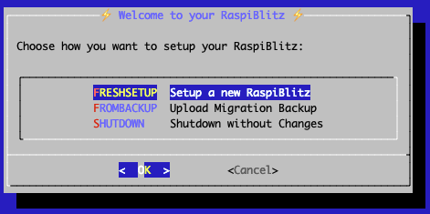
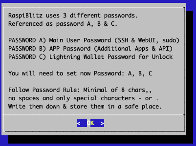
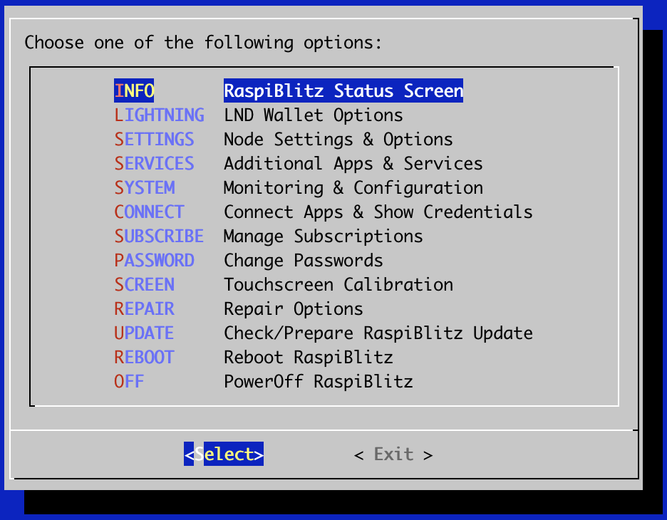
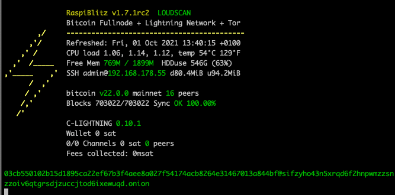

*Build your own Lightning Node on a RaspberryPi with a nice Display.*

`Version 1.7.0 with lnd 0.12.1 and bitcoin 0.21.0 (or litecoin 0.18.1)`

**The RaspiBlitz is a do-it-yourself Lightning Node based on LND running together with a Bitcoin-Fullnode on a RaspberryPi (1TB SSD) and a nice display for easy setup & monitoring.**

RaspiBlitz is mainly targeted for learning how to run your own node decentralized from home - because: Not your Node, Not your Rules. Discover & develop the growing ecosystem of the Lightning Network by becoming a full part of it. Build it as part of a [workshop](WORKSHOP.md) or as a weekend project yourself.

## Feature Overview

There are further Services that can be switched on:

* **Tor** (Run as Hidden Service) [details](https://en.wikipedia.org/wiki/Tor_(anonymity_network)#Onion_services)
* **ElectRS** (Electrum Server in Rust) [details](https://github.com/romanz/electrs)
* **BTCPayServer** (Cryptocurrency Payment Processor) [details](https://btcpayserver.org)
* **BTC-RPC-Explorer** (Bitcoin Blockchain Explorer) [details](https://github.com/janoside/btc-rpc-explorer)
* **LNbits** (Lightning wallet/accounts System) [details](https://twitter.com/lnbits/status/1253700293440741377?s=20)
* **SpecterDesktop** (Multisig Trezor, Ledger, COLDCARDwallet & Specter-DIY) [details](https://github.com/cryptoadvance/specter-desktop)
* **Lightning Terminal (Loop, Pool & Faraday)** (Manage Channel Liquidity) [details](https://github.com/lightninglabs/lightning-terminal#lightning-terminal-lit)
* **JoinMarket** (CoinJoin Service) [details](https://github.com/JoinMarket-Org/joinmarket-clientserver)
* **ThunderHub** (Lightning Node Manager WebUI) [details](https://www.thunderhub.io/)
* **Balance Of Satoshis** (Commands for working with LND balances) [details](https://github.com/alexbosworth/balanceofsatoshis/blob/master/README.md)
* **Kindle Display** (Bitcoin Status Display made with a jailbroken Kindle) [details](https://github.com/dennisreimann/kindle-display)
* **Stacking Sats Kraken** (Auto-DCA script) [details](https://github.com/dennisreimann/stacking-sats-kraken)
* **Circuit Breaker** (Lightning Channel Firewall) [details](https://github.com/lightningequipment/circuitbreaker/blob/master/README.md)
* **PyBlock**  (Python Util & Fun Scripts) [details](https://github.com/curly60e/pyblock/blob/master/README.md)
* **Mempool Explorer** [details](https://github.com/mempool/mempool)
* **Sphinx Chat Relay Server** [details](https://github.com/stakwork/sphinx-relay/blob/master/README.md)
* **Telegraf metrics** [details](https://github.com/rootzoll/raspiblitz/issues/1369)
* **Chantools** (Fund Rescue) [details](https://github.com/guggero/chantools/blob/master/README.md)

You can connect the following Wallet-Apps to your RaspiBlitz:

* **Zeus** (Android & iOS-TestFlight) [details](https://zeusln.app)
* **Fully Noded** (iOS) [details](https://apps.apple.com/us/app/fully-noded/id1436425586)
* **SendMany** (Android) [details](https://github.com/fusion44/sendmany/blob/master/README.md)
* **Sphinx Chat App** (Android & iOS) [details](https://sphinx.chat)

Also many more features like Touchscreen, Channels Autopilot, DynDNS, SSH-Tunneling, UPS Support, ...

## DeepDive Video (July 2020)

 --watch--> https://www.youtube.com/watch?v=QXUGg45CWLo

## Time Estimate to Set Up a RaspiBlitz

The RaspiBlitz is optimized for being setup during a workshop at a hackday or conference (see [detailed workshop tutorial](WORKSHOP.md)). When it comes fully assembled with an up-to-date synced blockchain, it's possible to have it ready in about 2 to 3 hours - most of it is waiting time.

If you start at home ordering the parts from Amazon (see shopping list below) then it's a weekend project with a lot of downloading and syncing time where you can do other stuff while checking on the progress from time to time.

If you already run a Umbrel or myNode you have basically all the hardware needed and you can make the [Migration to RaspiBlitz from Umbrel/myNode](#make-a-raspiblitz-out-of-your-umbrel-or-mynode) under one hour. 

## Hardware Needed

All parts together cost around 180-250 USD - based on shops and location.

### Buy a ready-2-go RaspiBlitz (Germany, EU and International)

If you like to support the RaspiBlitz project you can order a ready-2-go RaspiBlitz or an all-you-need-hardware set for yourself or for your RaspiBlitz workshop from [raspiblitz.com](https://raspiblitz.com)

Find a list of other shops selling a Ready-2-Go RaspiBlitz in your area on [raspiblitz.org](https://raspiblitz.org/).

### Amazon Shopping List (buy parts & build it yourself)

The cheapest way is to buy and assemble the single parts yourself. There are two packages.

*Please try to use the exact hardware models that are recommended in the shopping lists. We have had multiple reports where, for example, other SSD or SSD cases/controllers lead to problems. The idea of the shopping lists is to provide you the best tested hardware components that work together - improvement recommendations are always welcome.*

* RaspberryPi 4 4GB (or 8GB) [amazon referral link](https://geni.us/raspiblitz-4gb-new)
* Power Supply - USB-C, 5V, >=3A [amazon referral link](https://geni.us/raspiblitz-ps)
* 1TB SSD - SanDisk SSD Plus 1TB 2.5" : [amazon referral link](https://geni.us/raspiblitz-1000gb-san) *other 1TB SSD models might cause power issues*
* SSD-case - UGREEN 2.5" External USB 3.0 Hard Disk Case with UASP support : [amazon referral link](https://geni.us/raspiblitz-ssd-case)
* MicroSDCard 32GB - Samsung PRO Endurance 32 GB microSDHC UHS-I U1: [amazon referral link](https://geni.us/raspiblitz-sc-card)
* Heatsink Case for RPi4 : [amazon referral link](https://geni.us/heatsink-raspi4)
* LCD - 3.5" RPi Display, GPIO connection, XPT2046 Touch Controller: [amazon referral link](https://geni.us/raspiblitz-touchscreen)

*If the above mentioned LCD screen is sold out you can also use these different vendors for the screen on Amazon:*
  - Quimat 3,5'' Zoll Inch Touch
  - ELEGOO Display 3.5" Zoll TFT LCD
  - kuman 3.5 Inch Touch Screen TFT Monitor
  - Waveshare 3.5inch Display for Raspberry Pi 

*You can even pay for your RaspiBlitz Amazon Shopping with Bitcoin & Lightning through [Bitrefill](https://blog.bitrefill.com/its-here-buy-amazon-vouchers-with-bitcoin-on-bitrefill-bb2a4449724a).*

[What other case options do I have?](FAQ.md#what-other-case-options-do-i-have)

## Assemble your RaspiBlitz

When you have all parts you need to:

- Assemble the Heatsink-Case on the RaspberryPi (follow the instructions in package).
- Put the SSD/HDD into the Case and connect it per USB to the RaspberryPi (blue ports).
- Add the display on top with the pins like in picture below.
- Plug in the network cable.

In the end your RaspiBlitz should look like this:

## Downloading the Software

There are two ways how you can install the RaspiBlitz software on your RaspberryPi:

|Method|Install the image|Build the sd card|
|------|-----------------|-----------------|   
|Philosophy|Trust|Sovereignty|
|Difficulty level|Easy|Medium|
|Pros|Make Blitz accessible to everyone|You don't need to trust us, build from your own forked repository|
|Cons|You have to trust the mantainer image binaries|You need to read the build_sdcard.sh parameters in order for the customization to suit your needs|
|Instructions|[Download image](https://raspiblitz.fulmo.org/images/raspiblitz-v1.7.0-2021-04-25.img.gz) and [Flash the sd card](README.md#write-the-sd-card-image-to-your-sd-card)|[Build your own sd card image](#build-the-sd-card-image)|
|Verify what?|[Signature file](https://raspiblitz.fulmo.org/images/raspiblitz-v1.7.0-2021-04-25.img.gz.sig) and [verify the Sig](FAQ.md#how-to-verify-the-sd-card-image-after-download) OR SHA-256 (below)|All of the code, don't trust, verify|

If downloading the mantainer sd card image:
* GPG 64-bit: 1C73 060C 7C17 6461
* SHA-256: e6d70ac1662af3e90e57bee8c50e9a7925239431892e1916c2be80e519befc3f

Which verification method should I used: Hash or Signature?
* Signed file prove to you that the SD card image was actually built by the lead developer of the RaspiBlitz project. (Safest)
* Hash function checks file integrity. (Secure)

The mantainer sd card image can also be downloaded via torrent:
* [assets/raspiblitz-v1.7.0-2021-04-25.img.gz.torrent](https://github.com/rootzoll/raspiblitz/raw/v1.7/home.admin/assets/raspiblitz-v1.7.0-2021-04-25.img.gz.torrent)

Useful info:
* [What's new in Version 1.7 of RaspiBlitz?](CHANGES.md#whats-new-in-version-170-of-raspiblitz)
* [How to update my RaspiBlitz?](README.md#updating-raspiblitz-to-new-version)
* [How to migrate to RaspiBlitz from Umbrel/myNode](#make-a-raspiblitz-out-of-your-umbrel-or-mynode)
* [How to verify the SD card image after download?](FAQ.md#how-to-verify-the-sd-card-image-after-download)

## Write the SD-Card image to your SD Card

You need to write the downloaded SD card image (the img.gz-file) to your SD card (16GB minimum) - you can use the very easy tool Balena Etcher for this: https://www.balena.io/etcher/. It's available for Win, Mac & Linux.

## Boot your RaspiBlitz

Insert the SD card and connect the power plug.

* Make sure to connect the raspberry with a LAN cable to the internet at this point.
* Make sure that your laptop and the raspberry are on the same local network.

**Troubleshoot:**

* [I don't have a LAN port on my Laptop - how to connect to my RaspiBlitz?](FAQ.md#i-dont-have-a-lan-port-on-my-laptop---how-do-i-connect-to-my-raspiblitz)
* [Is it possible to connect the Blitz over Wifi instead of using a LAN cable?](FAQ.md#is-it-possible-to-connect-the-blitz-over-wifi-instead-of-using-a-lan-cable)
* [Can I directly connect the RaspiBlitz with my laptop?](FAQ.md#can-i-directly-connect-the-raspiblitz-to-my-laptop)
* [I connected my HDD, but it still says 'Connect HDD' on the display?](FAQ.md#i-connected-my-hdd-but-it-still-says-connect-hdd-on-the-display)

When everything boots up correctly, you should see the local IP address of your RaspiBlitz on the LCD panel.

- [How do I find the IP address when running without a display?](FAQ.md#how-do-i-find-the-ip-address-when-running-without-a-display)

Now open up a terminal ([OSX](https://www.youtube.com/watch?v=5XgBd6rjuDQ)/[Win10](https://www.howtogeek.com/336775/how-to-enable-and-use-windows-10s-built-in-ssh-commands/)) and connect through SSH with the command displayed by the RaspiBlitz:

`ssh admin@[YOURIP]` → use password: `raspiblitz`

**Now follow the dialogue in your terminal. This can take some time (prepare some coffee) - but in the end you should have a running Lightning node on your RaspberryPi that you can start to learn and hack on.**

* [I cannot connect per SSH to my RaspiBlitz. What to do?](FAQ.md#i-cannot-connect-per-ssh-to-my-raspiblitz-what-to-do)

## Support

If you run into a problem or you have still a question, follow the steps below to get support. Also check the [setup documentation](#setup-process-detailed-documentation) for details.

1. Look up the [FAQ](FAQ.md) if you can't find an answer to this question/problem.

2. If you have a hardware problem, please check that your hardware parts are exactly the parts recommended in the shopping list above. Different screens or even SSD-casings can cause problems.

3. There is a Telegram Group of RaspiBlitz users helping each other: https://t.me/raspiblitz

4. Please determine if your problem/question is about RaspiBlitz or for example with LND. For example if you can't route a payment or get an error when opening a channel that is an LND question/problem and is best answered by the LND dev community: https://dev.lightning.community

5. Go to the GitHub issues of the RaspiBlitz: https://github.com/rootzoll/raspiblitz/issues Do a search there. Also check closed issues by removing 'is:open' from the filter/search-box.

6. If you haven't found an answer yet, open a new issue on the RaspiBlitz GitHub. You may have to register an account with GitHub for this. If it's a bug with the RaspiBlitz, please add (copy+paste) a Debug Report to your issue (see [FAQ](FAQ.md) for how to generate them) and/or add some screenshots/photos so the community gets more insight into your problem.

## Setup Process (Detailed Documentation)

*The goal is, that all information needed during setup is provided from the interaction with the RaspiBlitz itself during the setup. Documentation in this chapter is for background, comments for educators and to mention edge cases.*

If you are looking for a tutorial on how to organize a workshop to build the RaspiBlitz, [see here](WORKSHOP.md).

### Init

In the beginning you can choose how to setup your RaspiBlitz, by running on Bitcoin or Litecoin with Lightning. This is also the point where you can import a Migration file from an older RaspiBlitz - read about Migration [further down](README.md#import-a-migration-file). The default choice here is Bitcoin.

First thing to setup is giving your RaspiBlitz a name:

This name is given to the RaspiBlitz as a public alias of the lightning node for everybody to see.

Then the user is requested to think of and write down 4 passwords:

You can use this [RaspiBlitz Password Sheet (PDF)](https://github.com/rootzoll/raspiblitz/raw/v1.4/home.admin/assets/RaspiBlitzRecoverySheet.pdf) to write those passwords down for save storage and also use it later on for your Seed Words.

*The password A,B,C & D idea is directly based on the [RaspiBolt Guide Preparations](https://stadicus.github.io/RaspiBolt/raspibolt_10_preparations.html#write-down-your-passwords) - check out for more background.*

Then the user is asked to enter the Password A:

This is the new password which has to be used for every SSH login after this screen with the user admin. It's also set for the existing user: root, bitcoin & pi.

*The bitcoin and lightning services will later run in the background (as daemon) and use the separate user “bitcoin” for security reasons. This user does not have admin rights and cannot change the system configuration.*

Then the user is asked to enter the Password B - this is internally used for the bitcoin RPC interface. But also as login for additional apps like the RTL-WebGUI or the Blockexplorer:

*The other passwords C & D will be needed later on. They will be used during the lightning wallet setup.*

After this the setup process will need some time and the user will see a lot of console outputs - just wait until it's finished:

### Getting the Blockchain

*If you have a HDD/SSD with a prepared blockchain (e.g. a ready2go-set or you are at a workshop) you have the option to trust that data and skip to the [next chapter](#setup-lightning). If you started with an empty HDD - you will see the following screens:*

If you connected a fresh Hard Drive or SSD to the RaspiBlitz, it might now ask you if it's OK to format it.

*Your HDD/SSD will get formatted with the linux standard file system EXT4. If you want to try out the experimental new [BTRFS](FAQ.md#why-use-btrfs-on-raspiblitz) that RaspiBlitz supports since v1.4 - you need to start the setup with an additional 32GB USB thumb drive connected to the second USB3 port of the RaspberryPi. Then you will unlock this new secret feature.*

After formatting you need to get a copy of the blockchain; the RaspiBlitz offers the following options:

The options - and when to choose which - will be explained here shortly:

#### 1. SYNC - Selfvalidate all Blocks

With the new RaspberryPi 4 (with SSD & min 2GB RAM) this is the best way to go. It will take around 2-3 days to sync & validate directly with the bitcoin network. With this option, you have done it the original `don't trust, verify` way.

*For the old RaspberryPi 3 this is not recommended. A RaspberryPi 3 has a very low power CPU and syncing+validating the blockchain directly with the peer2peer network can take multiple weeks - that's why for a RP3 you should choose the COPY option .*

#### 2. COPY - Copy from Laptop or another RaspiBlitz over Local Network

First you need to download & validate the blockchain on your own computer/laptop. Todo so install bitcoin-core (0.18.1 or higher) from [bitcoin.org](https://bitcoin.org/en/download) and keep it running until blockchain is synced (will need around 320 GB).

Then you can use the COPY option to copy the blockchain over to the RaspiBlitz. This will be done over the local network by SCP (SSH file transfer) - follow the instructions given during the dialog.

It's advised to keep the bitcoin-core & the blockchain data as a backup on the laptop in case you need to re-setup the RaspiBlitz.

More details: [I have the full blockchain on another computer. How do I copy it to the RaspiBlitz?](FAQ.md#i-have-the-full-blockchain-on-another-computer-how-do-i-copy-it-to-the-raspiblitz)

### Setup Lightning

Lightning is installed and waiting for your setup if you see this screen.

You can now decide if you want to setup a fresh new wallet or if you want to recover an old wallet from a RaspiBlitz you had before.

#### Setup a NEW Wallet

This is the default if you setup a RaspiBlitz the first time.

RaspiBlitz will ask you to set your wallet unlock password - use your chosen PASSWORD C here. Confirm by inputting it a second time.

LND will now generate a fresh cipher seed (word list) for you.

WRITE YOUR PERSONAL WORDS DOWN before you continue - without it you limit your chances to recover funds in case of failing hardware etc. If you just want to try/experiment with the RaspiBlitz, at least take a photo with your smartphone just in case. If you plan to keep your RaspiBlitz running, store this word list offline or in a password safe. You can use the [RaspiBlitz Password Sheet (PDF)](https://github.com/rootzoll/raspiblitz/raw/v1.4/home.admin/assets/RaspiBlitzRecoverySheet.pdf) for this.

#### Recover an OLD Wallet

Choose this option if you had an old RaspiBlitz you want to recover. You have three options to do that:

The RaspiBlitz calling the LND wallet creation command for you:

##### LNDRESCUE LND tar.gz-Backupfile (BEST)

Choose this option if you have made a complete backup of the LND data and have a tar.gz file starting with the word 'lnd-rescue' available. It will recover all your on-chain funds and open channels you had. But you have to make sure that the LND backup you have is really the latest version - otherwise you might lose channel funds.

*If you have tar.gz file that starts with 'raspiblitz', that's a migration file. That also includes your old LND wallet, but you import it earlier in the setup process .. see further below for details.*

##### SEED+SCB Words Seed & channel.backup file (OK)

Next best option is, if you have the channel.backup file and the word list seed. This is the best chance to recover the on-chain funds you had in open channels. But all channels you had open before will be closed during this procedure.

##### ONLY SEED Only Seed Word List (Fallback)

If you just have the word list (RaspiBlitz 1.1 and older) you can at least try to recover your on-chain funds. Recovery of channel funds is not very likely in this scenario.

### Final LND Setup

It will now make sure your wallet is initialized correctly and may ask you to unlock it with PASSWORD C.

*The LND wallet needs to get unlocked on every new start/reboot of the RaspiBlitz.*

The RaspiBlitz will now do final setup configuration, such as installing tools, moving the SWAP file to the HDD, or activating the firewall. You will see some text moving across the screen until this screen:

The basic setup is done - hooray ... but it may still take some time before everything is ready and you can play around with your new RaspiBlitz. Press 'OK' to reboot. Your terminal session will get disconnected and the raspberry pi restarts.

### First Start: Syncing & Scanning

After the reboot is done, it will take a while for all services to start up - wait until you see on the LCD/display that LND wallet needs to get unlocked. Then SSH in again with the same command like in the beginning (check LCD/display) but this time (and every following login) use your PASSWORD A.

After terminal login, LND will ask you (like on every start/reboot) to unlock the wallet again - use PASSWORD C:

On first start, you will have a longer waiting time (between 10 minutes and 2-3 days, depending on your initial setup) ... but that's OK, just leave the RaspiBlitz running until it's done.

*You can even close your terminal now and shutdown your laptop and ssh back in later on. You will see on the Blitz LCD/display that it is ready when the blue background screen is gone, and you see a status screen.*

To understand what is taking so long .. it's two things:

1. Blockchain Sync

The blockchain on your HDD is not absolutely up-to-date. Depending on how you got it transferred to your RaspiBlitz it will be some hours, days, or even weeks behind. Now the RaspiBlitz needs to catch-up on the rest by directly syncing with the peer-2-peer network until it reaches almost 100%. Even if you see progress at 99.8%, there can still be waiting time - gaining 1% can take up to 4 hours (depending on network speed), so be patient here.

2. Lightning Scanning

Automatically if the Blockchain Sync is progressing LND will start to scan the blockchain and collect information. The Lightning scanning alone normally just takes around 1 hour until the waiting time is over. Can take much longer if you recover on old wallet from seed.

* [Why is my "final sync" taking so long?](FAQ.md#why-is-my-final-sync-taking-so-long)

Once all is done, you should see a status screen on the RaspiBlitz LCD/display like this:

### Main Menu

If you now login by SSH in your RaspiBlitz (or you are still logged in) you will see the Main Menu:

All options on the main menu will be explained below in the feature documentation.

*OK .. so from here on out, your RaspiBlitz is ready to play with.*

If you need an idea of what the most basic next steps to experience Lightning would be:

* Fund on-chain Wallet
* Open a channel
* Make a payment

If you would prefer to do this from a web browser with a dashboard UI, instead of an SSH terminal, go to `SERVICES`, activate the `RTL Webinterface`, and after the reboot you will see a new `RTL` option in the SSH main menu - it will give you all the information so that you can now open the RTL Webinterface in your browser.

Have fun riding the lightning :D

*BTW always love seeing photos of new RaspBlitzes added to the network on twitter @rootzoll - also there is a [RaspiBlitz Donation Page](https://tallyco.in/s/r5lx23/), why not try to send some satoshis there with your new RaspiBlitz :D *

* [How can I get further help/support?](#support)

### Feature Documentation

These are the features available through the RaspiBlitz SSH menus. They have the goal to offer some basic/fallback functionality & configurations. More complex or user-friendly tasks are best to be done with wallets, apps and scripts you connect to your Lightning Node via [APIs](#interface--apis) - because you have a full Bitcoin- and Lightning-Node on the RaspiBlitz.

So let's take a look at the SSH main in detail:

#### INFO: Raspiblitz Status Screen

This is the screen that gets displayed on the LCD/display. It's useful to call in a remote situation from SSH if you don't have your RaspiBlitz next to you, or if you want to copy+paste your nodeID or make a screenshot.

*It's not automatically updating. It's just for one-time info.*

* [Why is my bitcoin IP on the display red?](FAQ.md#why-is-my-bitcoin-ip-on-the-display-red)
* [Why is my node address on the display red?](FAQ.md#why-is-my-node-address-on-the-display-red)
* [Why is my node address on the display yellow (not green)?](FAQ.md#why-is-my-node-address-on-the-display-yellow-not-green)

#### LIGHTNING (Basic Node Management)

Under `LIGHTNING` you find some basic steps to manage your Lightning node. Those are very simplified in the RaspiBlitz SSH menu for the reason of learning. For more advanced management of your Lightning node see additional apps under 'SERVICES'.

##### FUNDING: Fund your on-chain Wallet

Before you can open channels with other nodes you need to put some coins in your LND on-chain wallet. Use this option to generate an address to send funds to.

*Reminder: RaspiBlitz & LND is still experimental software. With funding your LND node you accept the risk of losing funds. So just play with small amounts - something in the area of 20 EUR/USD should be enough to make your first experiences. Also, it's a good privacy practice to [coinjoin your coins](https://bitcoin-only.com/privacy) before sending them to any Lightning Network wallet.*

You can fund it multiple times - starting with small amounts first to test. LND will always generate a different address, but all funds you send will get into the same LND on-chain wallet.

##### CONNECT: Connect to a Peer

Before you can open a channel with another node on the network, you need to connect this node as a peer to your node.

Opening a channel with a peer is just optional. Having another node as peer helps your node to receive information about the network through the gossip protocol. It will help your node to find better routes through the network.

##### CHANNEL: Open a Channel with Peer

To open a payment channel with another node, you can use this option.

Find interesting nodes to open channels with through online directories like [1ML.com](https://1ml.com/) or join the RaspiBlitz NodeManager telegram group to meet people to open channels with: https://t.me/raspiblitz

Bear in mind that this option will open a public channel that can be seen by everyone in the network. This is good if you want to route payments. If your intention is to use it privately only, you must go to the command line and open the channel with the -private option.

*This is just a very basic shell script. For more usability, try the RTL Webinterface (under Services) or connect a (mobile) wallet with your RaspiBlitz.*

##### SEND: Pay an Invoice/PaymentRequest

Pay an invoice through lightning.

*This is just a very basic shell script. For more usability try the RTL Webinterface (under Services) or connect a (mobile) wallet with your RaspiBlitz.*

If you are looking for something to test payments with Lightning ... why not [donate some satoshis to RaspiBlitz development](https://tallyco.in/s/r5lx23/)? Thanks :)

##### RECEIVE: Create Invoice/PaymentRequest

Create an invoice to send to someone for a service to be paid through lightning.

*This is just a very basic shell script. For more usability try the RTL Webinterface (under Services) or connect a (mobile) wallet with your RaspiBlitz.*

#### lnbalance: Detailed Wallet Balances

#### lnchannels: Lightning Channel List

#### lnfwdreport: Report on your earned fees for Forwarding Payments

If you connected your node well within the Lightning Network you can become a "Routing Node". Other users might select your Node as part of a Lightning Payment and will pay you the fee you set on those channels. This menu point gives you a detailed report over the amount of days you set.

Beware - earning fees as a routing node does not come automatic. It's a bit of hard work of building the right channels to be attractive for other people to route through. Check the internet for tutorials or use tools like "lndmanage" (see under RaspiBlitz SERVICES) to help you analyse and optimize your channel management.

##### NAME: Change name of your Node

Here you can change the alias name of your node as it is shown as part of the Lightning network.

##### CLOSE ALL: Closing all open Channels

*This option is just available if you have channels open.*

With this feature you can close down all open channels and get the funds locked up in those channels back to your on-chain wallet.

You may choose to force-close some channels where the channel partner is no longer reachable. Keep in mind that when you force-close a channel, it can take a much longer time until your funds are available again through your on-chain wallet.

##### CASHOUT: Remove Funds from on-chain Wallet

Use if you want to remove all funds from the RaspiBlitz.

#### SETTINGS: Basic Settings of RaspiBlitz

Here you will find basic settings for your RaspiBlitz:

Activate/Deactivate settings with the space bar and then select 'OK' to activate changes. You can find more details about those options (top to down):

##### Run behind Tor

You can run your Bitcoin- & Lightning-Node, as well as additional Apps, as a Tor hidden service - replacing your IP with an .onion-address

Running your node as a hidden service has some benefits:

* You don't publish your IP running a node so it's much harder to resolve your real name and location.
* You tunnel through the NAT of your router and make Bitcoin and Lightning reachable to all other Tor nodes.
* By using a Tor address it's possible to move the node to a different IPv4 address and keep the existing (i.e. previously opened and funded) channels functional.

But this can also come with the following side effects:

* Some Mobile wallets don't support connecting to RaspiBlitz over Tor yet.
* Lightning nodes that don't run Tor cannot reach you (like behind NAT).

To try it out, just switch on the service - you can deactivate it later on if it's not working for you.

##### Touchscreen (experimental)

Your RaspiBlitz has an LCD that is touchscreen capable. You can switch on this new feature that is still in development.

It will give you 4 buttons on the right side.

- Info - to be defined later
- Node - shows the nodeid/uri as QR code (used to open channels from mobile wallets)
- Invoice - creates an Invoice-QR code that can be used for payments
- Off - Shutdown or Restart the RaspiBlitz

##### LCD Rotate

If you switch this on, you can rotate the LCD of your RaspiBlitz 180 degrees. This might make sense if you have a special case or wall mount.

##### Channels Autopilot

The channels autopilot feature of LND allows to automatically uses around half of your on-chain funds (if available) to open new channels with other lightning nodes. 
Channels autopilot is very useful to get started transacting swiftly if you're a newbie as the channels are generated for you. 
It is very likely that after a while, once you will have a hang of the concept of channels and how they work that you will not need channels autopilot anymore.

Beware that presently toggling the Channels Autopilot setting will trigger a reboot of your Raspiblitz. It is not a problem per se, just a bit of waste of time [Improvement request #1953](https://github.com/rootzoll/raspiblitz/issues/1953)

##### Accept Keysend

Keysend is a feature of LND that allows your node to accept payments without having created an invoice first. This needs to be activated, for example, if you want to use your nodes for experimental messaging over the Lightning Network (see RaspiBlitz MOBILE apps like SendMany).

##### Testnet

It is very convenient to learn and test to play around in a "sandbox" environment. RaspiBlitz allows this through the "Testnet" setting.
You can freely switch from prod environemt (running on BITCOIN MAINNET) to test environment (running on BITCOIN TESTNET) and back using this setting. 
The state of your environments is restored everytime you switch (blockchain, wallets, channels) which is very convenient and safe.
Note however that switching from one environment to the other requires an auto resynchronisation with the corresponding blockchain (MAINNET or TESTNET) and can take some time (e.x. If you switch for the first time to "Testnet" the initial sync of the TESTNET blockchain may take several hours; also if you switch back and forth environment the corresponding blockchain must catchup from where it left before switching.

Of course it would be much more fun and less scary if everyone could afford to own 2 distinct RaspiBlitz, one for each environment, this way your production RaspiBlitz remains online all the time and you can recklessly play around on the other one. 

Once in "TESTNET" environment go ahead! Get hold of some Bitcoin Testnet Faucets (these are worthless bitcoins on testnet) and start playing around with them!
You can get Bitcoin Testnet Faucets from different places on the internet, here are a few links:
* https://coinfaucet.eu/en/btc-testnet/
* https://testnet-faucet.mempool.co/
* https://kuttler.eu/en/bitcoin/btc/faucet/
* https://faucet.lightning.community/

You can read more about TESTNET and Bitcoin Faucets here: https://kuttler.eu/code/bitcoin-testnet-blockchain-size-in-2020/
Have fun.

IMPORTANT: Presently BTCPay Server service is NOT supported on TESTNET (RPC connection error messages). Until this [issue #1724](https://github.com/rootzoll/raspiblitz/issues/1724) is resolved you can [play around with BTCPay Server on TESTNET](https://testnet.demo.btcpayserver.org)

##### Circuitbreaker (LND Firewall)

Not everybody is acting friendly in the Lightning network. Circuitbreaker is a background service you cann activate that acts similar to a firewall to protect your now better. For details see: https://github.com/lightningequipment/circuitbreaker/blob/master/README.md

##### LND Auto-Unlock

The RaspiBlitz will automatically unlock the LND wallet upon every start.

This feature is based on https://github.com/Stadicus/guides/blob/master/raspibolt/raspibolt_6A_auto-unlock.md

It can be activated under "Services" -> "Auto-unlock LND". We recommend that it be turned on, when DynamicDNS is used. If there is a public IP change on your router, LND restarts automatically, and without Auto-Unlock it will stay inactive/unreachable until you manually unlock it.

* [When using Auto-Unlock, how much security do I lose?](FAQ.md#when-using-auto-unlock-how-much-security-do-i-lose)

##### StaticChannelBackup on DropBox

See [below on this README](README.md#backup-for-on-chain---channel-funds) for your Backup options to secure your funds against loss. Storing the encrypted Static Channel Backup file to your Dropbox account is an easy and secure way to do this.

##### StaticChannelBackup on USB Drive

You can connect a small extra USB drive to your RaspiBlitz (choose a small one up to 32GB - don't use second HDD or SSD here, that would drain too much power from the RaspiBlitz). On that USB drive your latest StaticChannelBackup will be stored - just in case your HDD gets an error.

##### ZeroTier 

With ZeroTier you can add your RaspiBlitz to a software defined network - see for details: https://en.wikipedia.org/wiki/ZeroTier

#### SERVICES: Activate/Deactivate Services

The RaspiBlitz offers further Services, Apps and configuration (scroll down to see all options in the RaspiBlitz):

Activate/Deactivate service selection with the space bar and then select 'OK' to trigger Install/Uninstall. You can find more details about those options below (top to bottom):

##### Electrum Rust Server

Enables a user to run his own Electrum server on the RaspiBlitz. The server indexes the entire Bitcoin blockchain saved locally on your HDD/SSD, and the resulting index enables fast queries for any given user wallet, allowing the user to keep real-time track of his balances and his transaction history using the [Electrum wallet](https://electrum.org).

Since Electrum Rust Server runs on the user's own machine, there is no need for the wallet to communicate with external Electrum servers, thus preserving the privacy of addresses and balances.

By contrast, if you use your Trezor Hardware Wallet with the trezor.io wallet, it will tell their third party server your public keys - connecting it with your IP. Now you can use your Trezor with the Electrum Wallet, just talking to your own Electrum Server, preserving your privacy.

Learn how you can use Electrum with your own Server over Tor:

 --watch--> https://www.youtube.com/watch?v=AiosKK_TA7w

[More Details on Service](https://github.com/romanz/electrs)

After install, you will see a new `ELECTRS` option in the SSH main menu - it will give you all the information you need to start using it.

##### RTL Webinterface

The RTL Webinterface is an LND Control Dashboard you can run in your browser with a nice GUI - it offers much more control over your Lightning node than the RaspiBlitz SSH menus. It's recommended to give it a try.

Get all the details on how to mannage your channels with RTL in this video:

 --watch--> https://www.youtube.com/watch?v=pESO_Pm0v10

Read an Intro-Tutorial to RTL: https://medium.com/@suheb.khan/how-to-ride-the-lightning-447af999dcd2

Feedback is welcome by the RTL programmer: https://github.com/ShahanaFarooqui/RTL

After install, you will see a new `RTL` option in the SSH main menu - it will give you all the information you need to start using it.

##### ThunderHub

A Lightning Node Manager WebUI - similar to RTL. 

[Details on Service](https://www.thunderhub.io)

After install, you will see a new `THUB` option in the SSH main menu - it will give you all the information you need to start using it.

##### Lightning Terminal (LIT) with loop, pool & faraday

Lightning Terminal (LiT) is a browser-based interface for managing channel liquidity. It bundles the former single tools called loop, pool & faraday with an easy to use browser interface.

[Details on Service](https://github.com/lightninglabs/lightning-terminal#lightning-terminal-lit)

After install, you will see a new `LIT` option in the SSH main menu - it will give you all the information you need to start using it.

##### BTCPayServer

[BTCPay Server](https://github.com/btcpayserver) is a self-hosted, open-source cryptocurrency payment processor. It's secure, private, censorship-resistant and free.

Find all details on how to use the BTCPay Server on your RaspiBlitz in this great tutorial: https://coincharge.io/en/raspiblitz-btcpay-server/

After install, you will see a new `BTCPAY` option in the SSH main menu - it will give you all the information you need to start using it.

##### LNbits

LNbits is a very simple server that sits on top of your Lightning Wallet.

It can be used together with IP2Tor to provide:
- Lightning Paper Vouchers (Plugin: LNURLw)
- Merchant Onboarding (Plugin: TPOS)

 --watch--> https://www.youtube.com/watch?v=0Bt3tHULAnw

You can also develop your own extensions on it.

[Details on Service](https://github.com/arcbtc/lnbits/blob/master/README.md)

After install, you will see a new `LNBITS` option in the SSH main menu - it will give you all the information you need to start using it.

##### BTC-RPC-Explorer

BTC-RPC-Explorer is a blockchain explorer website you can run on your own RaspiBlitz. See an example running on: https://btc-explorer.com

[Details on Service](https://github.com/janoside/btc-rpc-explorer)

After install, you will see a new `EXPLORE` option in the SSH main menu - it will give you all the information you need to start using it.

##### Cryptoadvance Specter

Bitcoin Core has a very powerful command line interface and a wonderful daemon. Using pre-signed bitcoin transactions (PSBT) and [Hardware Wallet Interface](https://github.com/bitcoin-core/HWI) (HWI), it can also work with hardware wallets. At the moment it is very Linux-focused. The same applies to multi-signature setups.

The goal of SpecterDesktop is to make a convenient and user-friendly GUI around Bitcoin Core, focusing on multi-signature setups with airgapped hardware wallets like Trezor, Ledger, COLDCARD or the Specter-DIY.

After install, you will see a new `SPECTER` option in the SSH main menu - it will give you all the information you need to start using it.

As an alternative to runninf Specter on directly on the RaspiBlitz, there is a Specter Desktop version that runs on your laptop. Here is a [guide to connect the specter laptop app] (https://d11n.net/connect-specter-desktor-with-raspiblitz.html) to your RaspiBlitz Bitcoin fullnode.

##### Mempool Explorer

Mempool is the fully featured visualizer, explorer, and API service running on mempool.space

[Details on Service](https://github.com/mempool/mempool)

After install, you will see a new `MEMPOOL` option in the SSH main menu - it will give you all the information you need to start using it.

##### JoinMarket

JoinMarket is software to create a special kind of bitcoin transaction called a CoinJoin transaction. Its aim is to improve the confidentiality and privacy of bitcoin transactions.

 --watch--> https://www.youtube.com/watch?v=uGHRjilMhwY

A CoinJoin transaction requires other people to take part. The right resources (coins) have to be in the right place, at the right time, in the right quantity. This isn't a software or tech problem, it's an economic problem. JoinMarket works by creating a new kind of market that would allocate these resources in the best way.

For more details see [here](https://github.com/JoinMarket-Org/joinmarket-clientserver).

After install, you will see a new `JMARKET` option in the SSH main menu - it will give you all the information you need to start using it.

##### Balance of Satoshi

Balance of Satoshi gives you enhanced commands for working with LND balances.

[Details on Service](https://github.com/alexbosworth/balanceofsatoshis/blob/master/README.md)

After install, you will see a new `BOS` option in the SSH main menu - it will give you all the information you need to start using it.

##### Sphinx Relay Server

The Sphinx App allows chat over the Lightning Network and ties into the idea of [Podcasting 2.0](https://u.today/father-of-podcasting-integrates-bitcoin-lightning-into-his-app). To use the mobile app with your own RaspiBlitz you need to install the [Sphinx Relay Server](https://github.com/stakwork/sphinx-relay/blob/master/README.md).

After install, you will see a new `SPHINX` option in the SSH main menu - it will give you all the information you need to start using it.

##### PyBlock

https://github.com/curly60e/pyblock/blob/master/README.md

##### Channel Tools (chantools)

This tool provides helper functions that can be used to rescue funds locked in lnd channels in case lnd itself cannot run properly anymore.

https://github.com/curly60e/pyblock/blob/master/README.md

##### Download Bitcoin Whitepaper

Extract the original Bitcoin Whitepaper as PDF directly from the blockchain of your node.

#### SYSTEM: Monitoring & Configuration

#### CONNECT: Connect Apps & Credentials

This feature should support connecting your RaspiBlitz to a mobile wallets or other apps.

##### MOBILE: Mobile Wallet Apps (Smartphone)

At the moment, the following mobile wallets are supported:

* [Zeus (iOS/Android)](https://github.com/ZeusLN/zeus)
* [Fully Noded (iOS over Tor)](https://apps.apple.com/us/app/fully-noded/id1436425586)
* [SendMany (Android)](https://github.com/fusion44/sendmany/blob/master/README.md)
* [Sphinx Chat App (iOS/Android)](https://sphinx.chat/)

Mobile wallets work as a remote control app for your RaspiBlitz. First you need to install the apps on your phone - a QR code with the links to the app stores are displayed. Then you need to `pair` them with your RaspiBlitz - also via a QR code displayed on the LCD. If you run your RaspiBlitz without an LCD, there is the fallback option to display that QR code on the terminal as ASCII code (which might involve lowering your terminal's font size).

##### BTCPAY: Get the connection string for the BTCPay Server

To connect the payment processing BTCPay server to your Lightning node you find here the needed Connection string.

##### bitcoinRPC

If apps need access to the Bitcoin RPC service you can find this here.

##### BISQ: Use your node with BISQ

Here you can activate a hidden service for your bitcoin node so that it can be used for the decentralized exchange called BISQ.

##### EXPORT: Macaroons and TLS.cert

If you want to access your LND APIs (to connect apps and additional services) you need credential files that grant access (Macaroons & the TLS cert).

*Macaroons: Access Tokens that allow certain command executions on the LND node.*
*TLS: Certificate to secure/encrypt communication with the LND node.*

In this menu, you can reset, re-sync, or export them as a file or string so that you can import them to apps and additional services.

Here are the following export options to get the Macaroon and TLS files to be used in other apps and wallets:

###### SSH Download

SCP is a SSH like command to transfer files. If we're able to SSH into the RaspiBlitz, also the SCP to transfer the files should work. If you choose this option, RaspiBlitz will print prepared SCP commands you can copy+paste to run in a second terminal.

This method is recommended to export to:
* [Zap Desktop Wallet](https://github.com/LN-Zap/zap-desktop)

###### Browser download

Opens an ad-hoc webserver so that you can download the files in your local network through the browser.

*This is the least secure way to transfer those files - everybody in your local network has access to those file during download. Remember with the Admin-Macaroon somebody could take over your node and spend all your funds. Just use as last fallback.*

###### Hex-String

The Macaroons and TLS.cert files can be copy+pasted as Hex-Strings from RaspiBlitz to any other app that supports that format. If you choose this option, RaspiBlitz will print all the files for you as Hex-String to do so.

This method is recommended to export to:
* [Joule Browser Wallet](https://lightningjoule.com)

#### SUBSCRIBE: Subscription Services

The RaspiBlitz offers now also Subscriptions .. those are free or paid third-party services.

Under `LIST my Subscriptions` you will always find the list of all your active subscriptions, to get more details or to `CANCEL` them.

At the moment, the following subscription services are available:

##### IP2TOR (paid)

IP2TOR is a tunnel service where you can run your RaspiBlitz anonymously behind TOR but you rent a port on a clearnet IP through which you can make services of your RaspiBlitz easy reachable for everybody on the internet. You don't need to care about your local router or firewall settings. You can pay this service also directly through Lightning from your RaspiBlitz as subscription.

At first you select what service of your RaspiBlitz you like to tunnel thru a IP2TOR bridge. 

You will get a list of available IP2TOR bridge offerings. Select `OK` on an IP2TOR bridge offering and you will see more details on it, such as how many satoshis the subscription will cost you - your node should be funded and have channels open at this point.

Then you get a list of available IP2TOR bridge offerings. By selecting `OK` on a IP2TOR bridge offering you can get more details on it and you will also see how many satoshis the subscription will cost you - your node should be funded and you should have channels open at this point.

If you choose `AGREE` on the details of a IP2TOR bridge offering the RaspiBlitz tries for you to setup the IP2TOR bridge. If everything worked you will find now the subscription under `MAINMENU` > `SUBSCRIBE` > `LIST My Subscriptions` where you can cancel it again.

To try out the IP2TOR tunnel choose in `MAINMENU` the extra menu point of the Service you choose the bridge for and it should give you now an updated URL or try calling the API on the IP and Port that is displayed under the details of the subscription in the `LIST My Subscriptions` section.

##### HTTPS with LetsEncrypt (free)

If you want a Webservice like BTCPay Server or LNbits available to the outside internet (like with IP2TOR) people expect you to offer HTTPS address so that the communication between the client and your RaspiBlitz is encrypted. You could use the self-signed HTTPS certificate that RaspiBlitzis offering you, but this will give users Security Warnings in their browser and is not very user friendly. That's where you can use a LetsEncrypt Subscription to get a free valid HTTPS certificate that is excepted without warning from almost all common browsers. 

Because you also need a domain name for that you will need to open a free account, the following are presently supported, would be good to add more with the help of the community: 
[DuckDNS.org](https://www.duckdns.org)
[DYNU.com](https://www.dynu.com) 

When you create a new LetsEncrypt subscription, you will be asked for your subdomain on DuckDNS and the Auth-Token of your DuckDNS account. Then RaspiBlitz tries to setup everything for you. If everything worked, you will find the subscription under `MAINMENU` > `SUBSCRIBE` > `LIST My Subscriptions`, where you can cancel it at any time if you wish.

To try out the IP2TOR tunnel, go into `MAINMENU` and the extra menu point of the Service you want to use the bridge for. It should give you an updated URL to call your service.

HTTPS can be a hairy topic, you can try using a SSL Checker to help you quickly diagnose problems with your SSL certificate installation: [www.sslshopper.com/ssl-checker.html](https://www.sslshopper.com/ssl-checker.html)

#### PASSWORD: Change Passwords

Change your passwords for security.

#### REPAIR: Options to test, repair and reset your RaspiBlitz

The `REPAIR` menu gives you options to check and reset your RaspiBlitz.

The options are explained in detail below:

##### SOFTWARE: Run Software Tests (DebugReport)

This will print out a lot of information that can be used to find software problems.

Use this if you want to report a software problem with your RaspiBlitz, so that others can have a look and help you better.

##### BACKUP-LND: Backup your LND data (Rescue-File)

This stops your RaspiBlitz and creates an LND-Rescue ZIP file that you can download via SCP to your laptop. This can be used to move your LND id, wallet & channels to another RaspiBlitz.

*NOTICE: If you start your RaspiBlitz after this backup again the backup is outdated and using it can risk losing your channel funds.*

##### MIGRATION: Migrate Blitz Data to new Hardware

This stops your RaspiBlitz and creates a Migration ZIP file you can download/export per SCP to your laptop. This contains all important data of your RaspiBlitz including LND, your Blitz configuration and also data from your installed apps. Can be used to migrate your RaspiBlitz to a new hardware - for example if you want to replace the HDD with a SSD. How to import a Migration File [see here](README.md#import-a-migration-file).

*NOTICE: If you start your RaspiBlitz after exporting the migration file again it is outdated and using it can risk losing your channel funds.*

##### COPY-SOURCE: Offer your Blockchain to another RaspiBlitz for Setup

To expedite the setup process, you can connect another RaspiBlitz and copy over your blockchain data to it. Your RaspiBlitz will be `offline` during that process and it can take between 4 to 6 hours.

Make sure both RaspiBlitzes are connected to the same local network. During setup with the new RaspiBlitz, choose the `COPY` option to get the blockchain data and then select the source computer `RASPIBLITZ`. Now you can activate the `COPY-SOURCE` option, enter the given IP of the new RaspiBlitz and its Password A (not yours) .. then the process should start.

##### RESET-CHAIN: Delete Blockchain and Re-Download

Use this option if your blockchain data got corrupted. It will keep your LND data. You can even keep your channels open. Just keep in mind that your Lightning node will appear offline to the network until you have re-downloaded the blockchain.

##### RESET-LND: Delete LND data & start new node/wallet

*THIS WILL DELETE ALL YOUR LND DATA AND CHANNEL FUNDS.
Use this only if you have closed all channels and removed all funds.*

Use this option if you want to start with a fresh LND node id & wallet.

##### RESET-HDD: Delete HDD data but keep blockchain

*THIS WILL DELETE ALL YOUR LND DATA AND CHANNEL FUNDS.
Use this only if you have closed all channels and removed all funds.*

Use this if you want to setup a fresh RaspiBlitz but don't want to re-download the blockchain.

##### RESET-ALL: Delete HDD completely & start fresh

*THIS WILL DELETE ALL YOUR LND DATA AND CHANNEL FUNDS.
Use this only if you have closed all channels and removed all funds.*

Use this if you want to setup a fresh RaspiBlitz with an empty HDD.

##### DELETE-ELEC: Delete Electrum Index

If you had Electrum installed, you can use this option to make sure also the space consuming electrum index gets deleted to free up space.

##### DELETE-INDEX: Delete Bitcoin TX-Index

If you had the Bitcoin Transaction Index activated you can use this option to make sure that this extra space consuming index gets deleted as well to free up space.

#### UPDATE: Check/Prepare RaspiBlitz Update

The `UPDATE` menu gives you options to update your RaspiBlitz

The options are explained in detail:

*Please note that the RaspiBlitz does not support Auto-Update, to ensure that there is no remote control of your node from a central server.*

##### RELEASE: Update RaspiBlitz to a new Version

This is a common way to update your RaspiBlitz. Choose this option to prepare your RaspiBlitz for a new SD card image containing the new version release.

##### PATCH: Patch RaspiBlitz code

With Patching you have now an easy way to sync your RaspiBlitz code/scripts with the official RaspiBlitz GitHub Repo or even your own forked GitHub Repo. This is an option for people that report bugs and we like to offer them a quick script update (patch) between RaspiBlitz releases or for people who want to develop on the RaspiBlitz and sync code between their IDE, forked GitHub and their RaspiBlitz.

##### LND: Interim LND Update

Sometimes there is a new LND release that has some breaking changes that once you updated the LND database cannot be reversed (like the update from 0.9.2 to 0.10.0). Then RaspiBlitz offers you an optional update ... this is where you then can update LND.

If you choose this you get the option to do this `VERIFIED` that means it offers you the optional LND update we tested the RaspiBlitz with or `RECKLESS` which will just grab the latest LND release from the GitHub releases page (also Release Candidates) and install it with no further guarantees and verification checks - this is for people that run nodes to test new releases and how they work with existing RaspiBlitz apps.

##### BITCOIN: Interim Bitcoin Update

Like with LND you have the possibility to update the bitcoin core version here.

#### REBOOT: Reboot RaspiBlitz

A safe way to restart the RaspiBlitz ... have you tried turning it off and on again?

#### OFF: PowerOff RaspiBlitz

A safe way to shutdown the RaspiBlitz.

#### X: Console Terminal

Closes the SSH main menu and exits to the terminal - where the user can make use of the CLI clients `bitcoin-cli` & `lncli` directly.

With the command `raspiblitz`, it's possible to return to the main menu.

## Import a Migration File

As mentioned above you can export a Migration File from your RaspiBlitz with MAINMENU > REPAIR > MIGRATION and store it on your laptop.

A Migration file contains all the important data from your RaspiBlitz, like your LND data, Bitcoin Wallet, raspiblitz.config, Tor/SSH keys .. and also installed apps. You can use this to migrate your RaspiBlitz to new hardware.

If you want to import it again to a new RaspiBlitz (for example with an updated HDD/SSD), you can choose the `MIGRATION` option on the first setup dialog after the Hardware test (where you normally choose between Bitcoin & Litecoin).

If you start MIGRATION you will need to format your HDD/SSD in the next step.

Normally you choose here the EXT4 format. But you also have the option to choose the BTRFS format which is an experimental feature under RaspiBlitz - see [FAQ for details on BTRFS](FAQ.md#why-use-btrfs-on-raspiblitz).

Then you will be asked to upload the Migration Zip file to the RaspiBlitz. Follow the instructions shown to you.

Then you need to get a copy of the blockchain data again for your RaspiBlitz.

You have the two options: [SYNC](README.md#1-sync---selfvalidate-all-blocks) and [COPY](README.md#2-copy---copy-from-laptop-or-another-raspiblitz-over-local-network), as mentioned in the normal setup.

RaspiBlitz will reboot and start the normal recovery process to install all the services defined by the raspiblitz.config from your Migration File.

Then the blockchain needs to sync up and you should be back to normal.

## Make a RaspiBlitz out of your Umbrel or MyNode

Another kind of migration is when you already run a full node with the Umbrel or myNode software and you like to change it to RaspiBlitz without closing channels. You basically have all the hardware needed and just need to change software. You don't need the [LCD from the shopping list](#amazon-shopping-list-buy-parts--build-it-yourself) - RaspiBlitz can also run without an LCD.

*NOTE: This migration is still experimental. You will still use the terminal to setup & manage your RaspiBlitz. If that is too technical for you please wait for the RaspiBlitz v1.8, which will introduce a WebUI for your browser that make the migration to RaspiBlitz familiar like with your old node user experiences.*

Before you start migration:
* if you have on-chain funds on your old node - make sure to have the backup seed words
* if you have lightning channels open on your old node - make sure to have downloaded the latest Static Channel Backup file to your laptop

Also be aware that at the moment RaspiBlitz can only transfer your blockchain and LND wallet data (including channels) over to RaspiBlitz. Any data/pairing of additional apps cannot be transfered and may get lost.

Instructions for Migration:
* shutdown your old node
* remove the sd card
* [download the latest Raspiblitz sd card image & flash it to your sd card](#downloading-the-software)
* if you like to use a HDMI monitor for status & progress, create a empty file called `hdmi` (without any ending) on the sd card while connected to your laptop 
* [insert sd card, boot up & login per SSH](#boot-your-raspiblitz)

Now RaspiBlitz should show you that old data from your node was detected and offer you todo the migration.

* If you continue it will prepare the data & reboot.
* The RaspiBlitz recover/update modus is starting - that will take a while and finally reboot.
* Login per SSH as before and reset the passwords (`FINAL RECOVERY LOGIN` on LCD). Then a final reboot will happen.
* Login per SSH with your new password A & unlock LND wallet with password C. Now blockchain needs to catch up and then your RaspiBlitz should be ready and show you (under INFO) your on-chain & channel balance.

If you don't have an LCD or HDMI monitor connected it might be a bit difficult to see what state your RaspiBlitz is in. Just (re-)try to login per SSH again after the reboots (might always take some time until it reacts). 

## Interface / APIs

To develop your own scripts/apps and connect other services/apps to your RaspiBlitz, you have multiple interfaces/APIs available:

### Bitcoin

* `bitcoin-cli` command line interface on the terminal
* `bitcoind` running on port 8333 (public)
* `JSON-RPC` running on port 8332 (local) [DOC](https://en.bitcoin.it/wiki/API_reference_%28JSON-RPC%29)

### LND-Lightning

* `lncli` command line interface on the terminal [DOC](https://api.lightning.community/)
* `lnd` running on port 9735 (public)
* `gRPC` running on port 10009 (public) [DOC](https://api.lightning.community/)
* `REST` running on port 8080 (public) [DOC](https://api.lightning.community/rest/index.html)

If you activate Tor, then your LND gRPC & REST APIs will also be reachable publicly as a Hidden Service.

### Backup for On-Chain- & Channel-Funds

Since LND v0.6 (and RaspiBlitz v1.2), a feature called Static-Channel-Backups is available. Within RaspiBlitz this is used when a `channel.backup` file is mentioned.

At this point in time, it is the best way to backup and protect your channel funds on RaspiBlitz - so it's recommended to make use of it.

To recover your funds this way, you will need two things:
- the 24-word seed
- the latest `channel.backup` file

You should have written down the word seed during wallet setup; keep it at a safe (offline) location. The `channel.backup` is stored on the HDD and updated by LND every time a new channel is opened or closed. The latest version of this file is needed to recover all your funds. In case your HDD gets damaged, RaspiBlitz always keeps a copy of the latest version of the `channel.backup` file on the SD card within the sub-directories of: `/home/admin/.lnd/data/chain/`.

If you want to get one step further in securing your funds against total fall-out of the RaspiBlitz (gets completely damaged, stolen or lost) then you can additionally set up an off-location or cloud backup of the `channel.backup` file. The file itself is encrypted by your word seed - so it's OK to store the file to untrusted third parties for backup (if you want). 

This video explains in detail how you can set further back Static Channel information:

 --watch--> https://www.youtube.com/watch?v=5wi6l9jRVQs

The following options are also explained here shortly:

#### A) DropBox Backup Target

Activate the StaticChannelBackup to DropBox in the `SETTINGS` menu of your RaspiBlitz. It will ask you for the Dropbox-Authtoken. This is how you can get this token:

Go to your web browser, do the following:

1. Go to https://www.dropbox.com/developers/apps/create and sign in.

1. Choose **Create App**.

    

    Choose the 'Scoped Access' & 'App Folder' and set a unique name - for example `LNDbackup` with a random number behind it. Agree to Terms of Service and click 'Create App'.

1. Set **Permissions**.

    

    Its important first to select the `Permissions` tab and activate the `files.content.write` permission. Don't forget to `Submit` the change before continue.

1. Generate **OAUth2 Token**.

    

    Now go back to the 'Settings' tab and under 'OAuth2' click the 'Generate' button. You will now see a long string of letters and numbers appear. This is your **Dropbox-Authtoken**. Make sure to copy the complete token string .. there might be more if you scroll to the right in the token field. 

To test it, try opening or closing a channel, and then check if you can find a copy of `channel.backup` in your Dropbox. You can check the background-script logs to see details on errors: `sudo journalctl -f -u background`

#### B) SCP Backup Target

*You can also backup the SCB to your own server, but this needs manual setup:*

In the `/mnt/hdd/raspiblitz.conf` the parameter `scpBackupTarget='[USER]@[SERVER]:[DIRPATH-WITHOUT-ENDING-/]'` can be set to activate this feature. On that remote server the public key of the RaspiBlitz root user needs to be part of the authorized keys - so that no password is needed for the background script to make the backup.

The script `/home/admin/config.scripts/internet.sshpubkey.sh` helps on initialization (init); it will show and transfer ssh-pubkey to a remote server.

To test it, try opening or closing a channel, and then check if you can find a copy of `channel.backup` on your remote server. You can check the background-script logs to see details on errors: `sudo journalctl -f -u background`

#### C) Local Backup Target (USB Thumbdrive)

*You can also backup the SCB to another local drive, e.g. a USB stick:*

You can use a small USB thumb drive (everything over 120MB is fine). Please don't use a second HDD/SSD for this because that might drain too much power and could hurt the security of your data more than it helps.

To activate this feature, go to `MAINMENU` > `SETTINGS` > `StaticChannelBackup on USB Drive` and follow the instructions.

To test it, try opening or closing a channel, and then check if you can find a copy of `channel.backup` in the specified location. You can check the background-script logs to see details on errors: `sudo journalctl -f -u background`

## Updating RaspiBlitz to new Version

If you have a RaspiBlitz older than version v1.0, please [see here](FAQ.md).

If you have a RaspiBlitz v1.2 or higher - just follow the `UPDATE` option from the main menu (choose `RELEASE` if asked) and follow the instructions - see the process in detail in the following video.

 --watch--> https://www.youtube.com/watch?v=Xvn0WQfHUdI

If you have a RaspiBlitz v1.0 or v1.1 or higher do the following:

* Main menu > OFF
* Remove power
* Remove SD card

Now download the new RaspiBlitz SD card image and write it to your SD card. Yes, you simply overwrite the old one, it's OK! The RaspiBlitz stores all your personal data on the HDD. See details about latest SD card image [here](#installing-the-software).

*If you have done manual changes to the system (installed packages, added scripts, etc), you might need to do some preparations before overwriting your SD card - see [FAQ](FAQ.md#why-do-i-need-to-re-burn-my-sd-card-for-an-update).*

If done successfully, simply put the SD card into the RaspiBlitz and power on again. Then follow the instructions on the display ... and don't worry, you don't need to re-download the blockchain again. It is worth noting here that your SSH password will be reset to `raspiblitz`. You will be prompted to change this once the update is finished.

* [Why do I need to re-burn my SD card for an update?](FAQ.md#why-do-i-need-to-re-burn-my-sd-card-for-an-update)

## Build the SD Card Image

A ready-to-use SD card image of RaspiBlitz is provided by us for download, to get everybody started quickly (see above). But if you want to build that image yourself - here is a quick guide:

* Get a latest RaspiOS 64-bit: [DOWNLOAD](https://downloads.raspberrypi.org/raspios_arm64/images).
* Write the image to an SD card: [TUTORIAL](https://www.raspberrypi.org/documentation/installation/installing-images/README.md).
* Add a file called `ssh` to the root of the SD card when mounted on your laptop to enable SSH login.
* Start the card on a Raspi and login via SSH with `ssh pi@[IP-OF-YOUR-RASPI]`. Password is `raspberry`.

Now you are ready to start the SD card build script (check the code to see if the installation and config are OK for you). Copy the following command into your terminal and execute:

`wget https://raw.githubusercontent.com/rootzoll/raspiblitz/v1.7/build_sdcard.sh && sudo bash build_sdcard.sh`

As you can see from the URL, you can find the build script in this Git repo under `build_sdcard.sh`. You can check what gets installed and configured in detail. Feel free to post improvements as pull requests.

The whole build process takes a while. At the end the LCD drivers get installed and a reboot is needed. A user `admin` is created during the process. Remember the default password is now `raspiblitz`. You can login per SSH again - this time use admin: `ssh admin@[IP-OF-YOUR-RASPI]`. The install dialog of the RaspiBlitz should automatically start. If you do not want to continue with the installation at this moment and use this sd card as a template for setting up multiple RaspiBlitzes, click `Cancel` and run `/home/admin/XXprepareRelease.sh`. Once you see the LCD going white and the activity LED of the pi starts going dark, you can unplug power and remove the SD card. You have now built your own RaspiBlitz SD card image.

*Note: If you plan to use your self-build sd card as a MASTER copy and distribute it: Use a smaller 8GB card for that. This way it's ensured that it will fit on every 16 GB card recommended for RaspiBlitz later on.*

* [Can I run RaspiBlitz on other computers than RaspberryPi?](FAQ.md#can-i-run-raspiblitz-on-other-computers-than-raspberrypi)
* [How can I build an SD card other than the master branch?](FAQ.md#how-can-i-build-an-sd-card-other-then-the-master-branch)
* [How can I build an SD card from my forked GitHub Repo?](FAQ.md#how-can-i-build-an-sd-card-from-my-forked-github-repo)

## FAQ

Here is a short selection of the very frequently asked questions:

* [How to backup my Lightning Node?](FAQ.md#how-to-backup-my-lightning-node)
* [How can I recover my coins from a failing RaspiBlitz?](FAQ.md#how-can-i-recover-my-coins-from-a-failing-raspiblitz)
* [Are those "Under-Voltage detected" warnings a problem?](FAQ.md#are-those-under-voltage-detected-warnings-a-problem)
* [Can I run RaspiBlitz on computer boards other than RaspberryPi?](FAQ.md#can-i-run-raspiblitz-on-other-computers-than-raspberrypi)

Do you still have more questions? Check the [RaspiBlitz-FAQ-Archive](FAQ.md).

## Community Development

Everybody is welcome to join, improve, and extend the RaspiBlitz - it's a work in progress. [Check the issues](https://github.com/rootzoll/raspiblitz/issues) if you wanna help out or add new ideas. You find the scripts used for RaspiBlitz interactions on the device at `/home/admin` or in this Git repo's subfolder `home.admin`.

To start your Deep Dive into the RaspiBlitz project, the following YouTube video (July 2020) is recommended: [https://www.youtube.com/watch?v=QXUGg45CWLo](https://www.youtube.com/watch?v=QXUGg45CWLo)

Get all details on "How to contribute to RaspiBlitz Development" on this video:

 --watch--> https://www.youtube.com/watch?v=ZVtZepV3OfM

Also get inspired for a deep-dive with the original "[RaspiBolt](https://stadicus.github.io/RaspiBolt/)" tutorial on how to build a lightning node on the RaspberryPi, the base work on which the RaspiBlitz was developed - so much thx to Stadicus :)

Join me on twitter [@rootzoll](https://twitter.com/rootzoll), visit us at an upcoming [#lightninghackday](https://twitter.com/hashtag/LightningHackday?src=hash) or check by one of our bitcoin meetups in Berlin ... every 1st Thursday evening a month at the room77 bar - feel free to buy me a beer with lightning there :)

* [How can I get further help/support?](#support)
