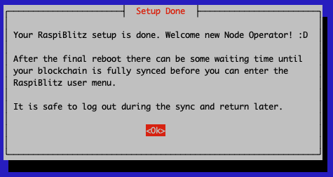
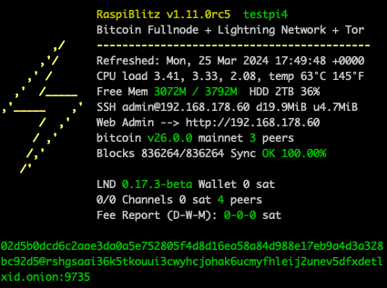
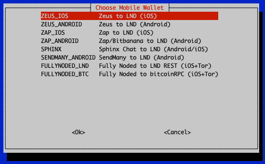

<!-- omit in toc -->
#  

_Build your own Lightning & Bitcoin Fullnode on a RaspberryPi with an optional Display._

`Version 1.9.0 with bitcoin 24.0.1, lnd 0.16.2 & Core Lightning 23.02.2` ([api](https://github.com/fusion44/blitz_api)|[web](https://github.com/cstenglein/raspiblitz-web))

**The RaspiBlitz is a do-it-yourself Lightning Node (LND and/or Core Lightning) running together with a Bitcoin-Fullnode on a RaspberryPi (1TB SSD) and a nice display for easy setup & monitoring.**

RaspiBlitz is mainly targeted for learning how to run your own node decentralized from home - because: Not your Node, Not your Rules.
Discover & develop the growing ecosystem of the Lightning Network by becoming a full part of it.
Build it as part of a [workshop](WORKSHOP.md) or as a weekend project yourself.

---
<!-- omit in toc -->
## Table of Contents

  - [Feature Overview](#feature-overview)
  - [Time Estimate to Set Up a RaspiBlitz](#time-estimate-to-set-up-a-raspiblitz)
  - [Hardware Needed](#hardware-needed)
  - [Assemble your RaspiBlitz](#assemble-your-raspiblitz)
  - [Downloading the Software](#downloading-the-software)
  - [Write the SD-Card image to your SD Card](#write-the-sd-card-image-to-your-sd-card)
  - [Boot your RaspiBlitz](#boot-your-raspiblitz)
  - [Support](#support)
  - [Setup Process (Detailed Documentation)](#setup-process-detailed-documentation)
  - [Import a Migration File](#import-a-migration-file)
  - [Make a RaspiBlitz out of your Umbrel, Citadel or MyNode](#make-a-raspiblitz-out-of-your-umbrel-citadel-or-mynode)
  - [Interface / APIs](#interface--apis)
  - [Updating RaspiBlitz to new Version](#updating-raspiblitz-to-new-version)
  - [Build the SD Card Image](#build-the-sd-card-image)
  - [FAQ](#faq)
  - [Community Development](#community-development)

---

## Feature Overview

Additional Services that can be installed thru WebUI (beginners):

- **Ride the Lightning (RTL)** (LND & CoreLightning Node Manager WebUI) [details](https://github.com/Ride-The-Lightning/RTL)
- **ThunderHub** (LND Node Manager WebUI) [details](https://www.thunderhub.io/)
- **BTC-RPC-Explorer** (Bitcoin Blockchain Explorer) [details](https://github.com/janoside/btc-rpc-explorer)
- **BTCPay Server** (Bitcoin Payment Processor) [details](https://btcpayserver.org)
- **LNbits** (Lightning wallet/accounts System) [details](https://twitter.com/lnbits/status/1253700293440741377?s=20)
- **Mempool Explorer** [details](https://github.com/mempool/mempool)
- **JAM** (JoinMarket Web UI) v0.1.5 [details](https://github.com/joinmarket-webui/joinmarket-webui)

Further Services that are just available thru SSH menu (advanced users):

- **ElectRS** (Electrum Server in Rust) [details](https://github.com/romanz/electrs)
- **SpecterDesktop** (Multisig Trezor, Ledger, COLDCARDwallet & Specter-DIY) [details](https://github.com/cryptoadvance/specter-desktop) [app connection guide](https://d11n.net/connect-specter-desktor-with-raspiblitz.html)
- **Lightning Terminal (Loop, Pool & Faraday)** (Manage Channel Liquidity) [details](https://github.com/lightninglabs/lightning-terminal#lightning-terminal-lit)
- **JoinMarket** (CoinJoin Service) [details](https://github.com/JoinMarket-Org/joinmarket-clientserver)
- **JoinMarket Web UI** (Browser-based interface for JoinMarket) [details](https://github.com/joinmarket-webui/joinmarket-webui)
- **Balance Of Satoshis** (Commands for working with LND balances) [details](https://github.com/alexbosworth/balanceofsatoshis/blob/master/README.m
- **Kindle Display** (Bitcoin Status Display made with a jailbroken Kindle) [details](https://github.com/dennisreimann/kindle-display)
- **Stacking Sats Kraken** (Auto-DCA script) [details](https://github.com/dennisreimann/stacking-sats-kraken)
- **Circuit Breaker** (Lightning Channel Firewall) [details](https://github.com/lightningequipment/circuitbreaker/blob/master/README.md)
- **PyBlock** (Python Util & Fun Scripts) [details](https://github.com/curly60e/pyblock/blob/master/README.md)
- **Sphinx Chat Relay Server** [details](https://github.com/stakwork/sphinx-relay/blob/master/README.md)
- **Telegraf metrics** [details](https://github.com/rootzoll/raspiblitz/issues/1369)
- **Chantools** (Fund Rescue) [details](https://github.com/guggero/chantools/blob/master/README.md)
- **Suez** (Channel Visualization for LND & CL) [details](https://github.com/prusnak/suez#suez)
- **Helipad** (Podcasting 2.0 Boostagram reader) [details](https://github.com/Podcastindex-org/helipad)
- **Homer** (Web Dashboard) [details](https://github.com/bastienwirtz/homer#readme)
- **Squeaknode** [details](https://github.com/yzernik/squeaknode)
- **CL Spark Wallet** (WalletUI with BOLT12 offers) [details](https://github.com/shesek/spark-wallet#progressive-web-app)
- **CL plugin: Sparko** (WalletUI & HTTP-RPC bridge) [details](https://github.com/fiatjaf/sparko#the-sparko-plugin)
- **CL plugin: CLBOSS** (Automated Node Manager) [details](https://github.com/ZmnSCPxj/clboss#clboss-the-c-lightning-node-manager)
- **CL plugin: The Eye of Satoshi** (Watchtower) [details](https://github.com/talaia-labs/rust-teos/tree/master/watchtower-plugin)
- **Tallycoin Connect** (Use Tallycoin with your own node) [details](https://github.com/djbooth007/tallycoin_connect)
- **ItchySats** (Non-custodial peer-to-peer CFD trading) [details](https://github.com/itchysats/itchysats)
- **LNDg** (WebUI analyze/manage lnd with automation) [details](https://github.com/cryptosharks131/lndg)

You can connect the following Wallet-Apps to your RaspiBlitz (thru SSH menu):

- **Zeus** (Android & iOS) [details](https://zeusln.app)
- **Zap** (Android & iOS) [details](https://www.zaphq.io)
- **Fully Noded** (iOS) [details](https://apps.apple.com/us/app/fully-noded/id1436425586)
- **SendMany** (Android) [details](https://github.com/fusion44/sendmany/blob/master/README.md)
- **Sphinx Chat App** (Android & iOS) [details](https://sphinx.chat)
- **Alby** (Desktop) [details](https://getalby.com)

Also many more features like Touchscreen, Channels Autopilot, Backup, DynDNS, SSH-Tunneling, UPS Support, ...

## SECURITY DISCLAIMER

This is Open-Source Software licensed under the [MIT License](LICENSE). This license explicitly excludes the authors & publishers from any legal liabilities including funds you manage with this software. Its use at your own risk - see [LICENSE](LICENSE) legal text for details.

Also the RaspiBlitz offers lots of additional apps for install. With every additional app installed (or preinstalled in a fatpack sd card image) you are trusting also the authors & dependencies of those additional projects with the security of your system & funds (different legal licensed may apply also). To reduce preinstalled apps & features from the start we provide a minimal sd card image for more advanced users (see download section below). For more details on this topic see our [SECURITY](SECURITY.md) documentation.

## Time Estimate to Set Up a RaspiBlitz

The RaspiBlitz is optimized for being setup during a workshop at a hackday or conference (see [detailed workshop tutorial](WORKSHOP.md)).
When it comes fully assembled with an up-to-date synced blockchain, it's possible to have it ready in about 2 to 3 hours.

If you start at home ordering the parts from Amazon (see shopping list below) then it's a weekend project with a lot of downloading and syncing time where you can do other stuff while checking on the progress from time to time.

If you already run a Umbrel, Citadel or myNode you have basically all the hardware needed and you can make the [Migration to RaspiBlitz from Umbrel/Citadel/myNode](#make-a-raspiblitz-out-of-your-umbrel-citadel-or-mynode) under one hour.

## Hardware Needed

All parts together cost around 200-300 USD - based on shops and location.

### Buy a ready-2-go RaspiBlitz (Germany, EU and International)

If you like to support the RaspiBlitz project you can order a plug&play RaspiBlitz from [raspiblitz.com](https://raspiblitz.com)

Find a list of other shops selling a plug&play RaspiBlitz in your area on [raspiblitz.org](https://raspiblitz.org).

### Amazon Shopping List (buy parts & build it yourself)

The cheapest way is to buy and assemble the single parts yourself.
There are two packages.

_Please try to use the exact hardware models that are recommended in the shopping lists.
We have had multiple reports where, for example, other SSD or SSD cases/controllers lead to problems.
The idea of the shopping lists is to provide you the best tested hardware components that work together - improvement recommendations are always welcome._

- RaspberryPi 4 4GB (or 8GB) [amazon referral link](https://geni.us/raspiblitz-4gb-new)
- Power Supply - USB-C, 5V, >=3A [amazon referral link](https://geni.us/raspiblitz-ps)
- 1TB SSD - SanDisk SSD Plus 1TB 2.5" : [amazon referral link](https://geni.us/raspiblitz-1000gb-san) _other 1TB SSD models might cause power issues_
- SSD-case - UGREEN 2.5" External USB 3.0 Hard Disk Case with UASP support : [amazon referral link](https://geni.us/raspiblitz-ssd-case)
- MicroSDCard 32GB - Samsung PRO Endurance 32 GB microSDHC UHS-I U1: [amazon referral link](https://geni.us/raspiblitz-sc-card)
- Heatsink Case for RPi4 : [amazon referral link](https://geni.us/heatsink-raspi4)
- LCD - 3.5" RPi Display, GPIO connection, XPT2046 Touch Controller: [amazon referral link](https://geni.us/raspiblitz-touchscreen)

_If the above mentioned LCD screen is sold out you can also use these different vendors for the screen on Amazon:_

- Quimat 3,5'' Zoll Inch Touch
- ELEGOO Display 3.5" Zoll TFT LCD
- kuman 3.5 Inch Touch Screen TFT Monitor 
- Waveshare 3.5inch Display for Raspberry Pi

With all LCD screen models dont use the ones that have an HDMI port/connector - what you need is a 3.5 inch LCD screen model (resolution of 480×320) that connects only thru the GPIO ports (SPI) and has an XPT2046 touch controller.

_You can even pay for your RaspiBlitz Amazon Shopping with Bitcoin & Lightning through [Bitrefill](https://blog.bitrefill.com/its-here-buy-amazon-vouchers-with-bitcoin-on-bitrefill-bb2a4449724a)._

[What other case options do I have?](FAQ.md#what-other-case-options-do-i-have)

## Assemble your RaspiBlitz

When you have all parts you need to:

- Assemble the Heatsink-Case on the RaspberryPi (follow the instructions in package).
- Put the SSD/HDD into the Case and connect it per USB to the RaspberryPi (blue ports).
- Add the display on top with the pins like in picture below.
- Plug in the network cable.

In the end your RaspiBlitz should look like this:

You now have the hardware ready for your RaspiBlitz - whats missing is the software to run. This is normally done by downloading an image file and then writing it (flashing it) to the sd card. This is a bigger file (multiple GigaBytes) so make sure to have the available storage space on your laptop. If you are a very advanded user who is able to read/verify code or you like to run a self-modified/forked version of RaspiBlitz you can also build the sd card image yourself - see the [Build your own sd card image](#build-the-sd-card-image) section for this.

## Downloading the Software

In this section you find the lastest ready-to-use RaspiBlitz sd card images. Basically you just download, write/flash the image file to an sd card and start your RaspberryPi with it - its the same for first install or updating to a newer version. You can choose from two ready-made sd card images below:

### FATPACK SD Card Image (Beginners - WebUI)

This is the sd card image you should choose if your at the beginning of your RaspiBlitz journey or you are a casual node runner wanna download the next update - with WebUI & fast installing bonus apps.

<!-- *WARNING: THIS IS STILL A RELEASE CANDIDATE VERSION 
JUST USE FOR TESTING, HIGHER RISK OF LOSING FUNDS!* -->

- __FATPACK SD CARD IMAGE ⮕ [raspiblitz-fat-v1.9.0-2023-05-22.img.gz](https://raspiblitz.fulmo.org/images/raspiblitz-fat-v1.9.0-2023-05-22.img.gz)__
- SHA-256: 0972d2bc4bf18d895c2cd8d860779e8c0a1f9c8e5c3675707967077001efe6d6
- GPG 64-bit (main): 1C73 060C 7C17 6461 & (sub): AA9D D1B5 CC56 47DA
- Signature-File: [raspiblitz-fat-v1.9.0-2023-05-22.img.gz.sig](https://raspiblitz.fulmo.org/images/raspiblitz-fat-v1.9.0-2023-05-22.img.gz.sig)
- Torrent: [raspiblitz-fat-v1.9.0-2022-12-21.img.gz.torrent](https://github.com/rootzoll/raspiblitz/raw/dev/home.admin/assets/raspiblitz-fat-v1.9.0-2023-05-22.img.gz.torrent)
- [How to verify the SD card image after download?](FAQ.md#how-to-verify-the-sd-card-image-after-download)

### MINIMAL SD Card Image (Experienced Users - SSH)

This is the sd card image for RaspiBlitz users that are already more experienced and want to use just a limited set of features of the RaspiBlitz. This image has just the bare minimum of features pre-installed - LCD & HDMI output is off by default. Setup, Update or Recovery needs to be done thru SSH login - API & WebUI are later available but are not preinstalled/activated by default. The RaspiBlitz will download & compile just the tools that are in your ´raspiblitz.conf´ - this will take longer but as a tradeoff this RaspiBlitz then just runs with a reduced set of dependencies and so a minimalized attack vector and better performance. Its for the serious & experineced node runners.

<!-- *WARNING: THIS IS STILL A RELEASE CANDIDATE VERSION 
JUST USE FOR TESTING, HIGHER RISK OF LOSING FUNDS!* -->

- __MINIMAL SD CARD IMAGE ⮕ [raspiblitz-min-v1.9.0-2023-05-22.img.gz](https://raspiblitz.fulmo.org/images/raspiblitz-min-v1.9.0-2023-05-22.img.gz)__
- SHA-256: c740d18efd097bd55bb7c6ccf7f08a7972c06180075fa948c1d316f1e62b21f3
- GPG 64-bit (main): 1C73 060C 7C17 6461 & (sub): AA9D D1B5 CC56 47DA
- Signature-File: [raspiblitz-min-v1.9.0-2023-05-22.img.gz.sig](https://raspiblitz.fulmo.org/images/raspiblitz-min-v1.9.0-2023-05-22.img.gz.sig)
- Torrent: [raspiblitz-min-v1.9.0-2022-12-21.img.gz.torrent](https://github.com/rootzoll/raspiblitz/raw/dev/home.admin/assets/raspiblitz-min-v1.9.0-2023-05-22.img.gz.torrent)
- [How to verify the SD card image after download?](FAQ.md#how-to-verify-the-sd-card-image-after-download)

Further Info:

- [What's new in Version 1.9.0 of RaspiBlitz?](CHANGES.md#whats-new-in-version-190-of-raspiblitz)
- [How to update my RaspiBlitz?](README.md#updating-raspiblitz-to-new-version)
- [How to migrate to RaspiBlitz from Umbrel/myNode/Citadel](#make-a-raspiblitz-out-of-your-umbrel-citadel-or-mynode)

## Write the SD-Card image to your SD Card

You need to write the downloaded SD card image (the img.gz-file) to your SD card (32GB minimum) - you can use the very easy tool Balena Etcher for this: <https://www.balena.io/etcher/>.
It's available for Win, Mac & Linux.

## Boot your RaspiBlitz

Insert the SD card and connect the power plug.

- Make sure to connect the raspberry with a LAN cable to the internet at this point.
- Make sure that your laptop and the raspberry are on the same local network.

**Troubleshoot:**

- [I don't have a LAN port on my Laptop - how to connect to my RaspiBlitz?](FAQ.md#i-dont-have-a-lan-port-on-my-laptop---how-do-i-connect-to-my-raspiblitz)
- [Is it possible to connect the Blitz over Wifi instead of using a LAN cable?](FAQ.md#is-it-possible-to-connect-the-blitz-over-wifi-instead-of-using-a-lan-cable)
- [Can I directly connect the RaspiBlitz with my laptop?](FAQ.md#can-i-directly-connect-the-raspiblitz-to-my-laptop)
- [I connected my HDD, but it still says 'Connect HDD' on the display?](FAQ.md#i-connected-my-hdd-but-it-still-says-connect-hdd-on-the-display)

When everything boots up correctly (one reboot is normal), you should finally see the local IP address of your RaspiBlitz on the LCD panel.

- [How do I find the IP address when running without a display?](FAQ.md#how-do-i-find-the-ip-address-when-running-without-a-display)

Now open up a terminal ([OSX](https://www.youtube.com/watch?v=5XgBd6rjuDQ)/[Win10](https://www.howtogeek.com/336775/how-to-enable-and-use-windows-10s-built-in-ssh-commands/)) and connect through SSH with the command displayed by the RaspiBlitz:

`ssh admin@[YOURIP]` → use password: `raspiblitz`

**Now follow the dialogue in your terminal.**

_Further down you will find more [detailed documentation of the setup process](#setup-process-detailed-documentation)._

- [I cannot connect by SSH to my RaspiBlitz. What to do?](FAQ.md#i-cannot-connect-per-ssh-to-my-raspiblitz-what-to-do)

## Support

If you run into a problem or you have still a question, follow the steps below to get support.
Also check the [setup documentation](#setup-process-detailed-documentation) for details.

### Documentation

1. Look up the [FAQ](FAQ.md) if you can't find an answer to this question/problem.

2. If you have a hardware problem, please check that your hardware parts are exactly the parts recommended in the shopping list above. Different screens or even SSD-casings can cause problems.

3. Please determine if your problem/question is about RaspiBlitz or for example with LND or Core Lightning. For example if you can't route a payment or get an error when opening a channel that is an LND/Core Lightning question/problem and is best answered by the [LND dev community](https://dev.lightning.community) or the [Core Lightning documentation](https://lightning.readthedocs.io/)

4. Go to the GitHub issues of the RaspiBlitz: [https://github.com/rootzoll/raspiblitz/issues](https://github.com/rootzoll/raspiblitz/issues) Do a search there. Also check closed issues by removing 'is:open' from the filter/search-box.

5. If you haven't found an answer yet, open a new issue on the RaspiBlitz GitHub. You may have to register an account with GitHub for this. If it's a bug with the RaspiBlitz, please add (copy+paste) a Debug Report to your issue (see [FAQ](FAQ.md) for how to generate them) and/or add some screenshots/photos so the community gets more insight into your problem.

### Groups

There are plenty off rooms you can find Raspiblitz users that can help you:

1. [Telegram English](https://t.me/raspiblitz)

2. [Telegram Deutsch](https://t.me/raspiblitz_DE)

3. [Telegram Spanish](https://t.me/raspiblitz_ES)

4. [Telegram Italian](https://t.me/raspiblitz_IT)

5. [Telegram Russian](https://t.me/raspiblitz_RU)

6. [Keybase](https://keybase.io/team/raspiblitz)

7. [Matrix - Element client](https://element.io/) Channel: #raspiblitz:libera.chat

8. IRC - Libera chat -> irc.libera.chat:6697 -> Channel: #raspiblitz

9. Sphinx Chat -> sphinx.chat://?action=tribe&uuid=YFsuxCApuU-TBIRWeWY_Gl52IOx2clJKZYLxDn78Z9RgcWNx9zUube7mkK4IyXQjLril-tgKZs3wOxDlWqpiyxp8jTbt&host=tribes.sphinx.chat -> [Connection code](YFsuxCApuU-TBIRWeWY_Gl52IOx2clJKZYLxDn78Z9RgcWNx9zUube7mkK4IyXQjLril-tgKZs3wOxDlWqpiyxp8jTbt) --> [QR code](https://github.com/rootzoll/raspiblitz/issues/2089#issuecomment-805789854)

## Setup Process (Detailed Documentation)

_The following documentation will provide more detailed background information on the setup process._

If you are looking for a tutorial on how to organize a workshop to build the RaspiBlitz, [see here](WORKSHOP.md).

### Basic Setup

Every time you start with a fresh SD card image you will be offered different options.
For example this is also the point where you can import a Migration file from an older RaspiBlitz - read about Migration [further down](README.md#import-a-migration-file).
But because you are setting up a brand new RaspiBlitz you will choose here `FRESHSETUP`.

Then you will be asked what to do with the connected hard drive/SSD.

If there is already a blockchain on your hard drive/SSD you will be asked if you want to use this pre-synced/validated data or if its OK to delete it.
If there is no blockchain data this question will be skipped.

Finally you have to agree that all (other) data on the hard drive/SSD will be deleted, except the blockchain if you selected that previously.
This might take some seconds.

First thing to setup is giving your RaspiBlitz a name:

The name you choose for your RaspiBlitz will also be used as your public alias of your lightning node so choose wisely.

Then you can choose which Lightning implementation you want to run on top of your Bitcoin Fullnode.
RaspiBlitz started with `LND` from Lightning Labs which is used by most other RaspberryPi lightning nodes and works with most additional apps.
But you can now also choose `CL` for Core Lightning by Blockstream which is a good choice for more experienced node operators & lightning developers that want to use the highly customizable plugin structure that Core Lightning offers.

It's also possible to use both lightning node implementations in parallel on your RaspiBlitz later on - just pick one to start with for now.

Choose `NONE` if you're only interested in running a Bitcoin full node without Lightning.

_In the following we show the setup with LND - which is very similar to the steps with Core Lightning._

If you chose to use one of the lightning implementations you will now be asked if you want to start a `NEW` wallet/lightning node or if you have an `OLD` lightning wallet/node that you want to re-create.

Normally you just chose `NEW` here, but to recover an old wallet you have the following options if you choose `OLD`:

#### LNDRESCUE LND tar.gz-Backupfile (BEST)

Choose this option if you have made a complete backup of the LND or Core Lightning data and have a tar.gz file starting with the word 'lnd-rescue' or 'cl-rescue' available.
It will recover all your on-chain funds and open channels you had.
But you have to make sure that the rescue backup you have is really the latest version - otherwise you might lose channel funds.

_If you have tar.gz file that starts with 'raspiblitz', that's a migration file.
That also includes your old LND/Core Lightning wallet, but you import that file at the beginning of the setup process with 'FROMBACKUP - Upload Migration Backup' instead choosing FRESHSETUP_

#### SEED+SCB Words Seed & channel.backup file (OK)

The next best option is if you have the channel.backup file and the word list seed.
This allows you to recover all on-chain funds (i.e. "bitcoin balance") in the lightning wallet, and gives you a good chance of recovering the off-chain funds (i.e. "lightning balance") you had in open channels, as long as the remote peer supports `option_data_loss_protect` which is very common since 2020.
All channels you had open before will be closed during this procedure.
See [Bitcoin Optech - Static Channel Backups](https://bitcoinops.org/en/topics/static-channel-backups/) for more background information on this process.

#### ONLY SEED Only Seed Word List (Fallback)

If you only have the seed word list (RaspiBlitz 1.1 and older) you can at least try to recover your on-chain funds.
Recovery of channel funds is not very likely in this scenario.

But normally you are setting up a new node - so simply choose `NEW` in the menu.

Finally you have to set 3 passwords called A, B & C.
For each password please choose unique, single strings, without spaces and special characters, that are at least 8 chars long.

You can use this [RaspiBlitz Recovery Sheet (PDF)](https://github.com/rootzoll/raspiblitz/raw/v1.7/home.admin/assets/RaspiBlitzRecoverySheet.pdf) to write those passwords down for safe storage and also use it later on for your Seed Words.

_The password A,B,C idea is based on the [RaspiBolt Guide Preparations](https://raspibolt.org/guide/raspberry-pi/preparations.html#write-down-your-passwords) - check out for more background._

First, password A is requested - this is the password which will be used for SSH login and it's also set for the existing users: admin, root, bitcoin & pi.

_The bitcoin and lightning services will later run in the background (as daemon) and use the separate user “bitcoin” for security reasons.
This user does not have admin rights and cannot change the system configuration._

Then enter password B - this is internally used for the bitcoin RPC interface.
It is also used as login for additional apps like the RTL-WebGUI or the Blockexplorer.

And finally enter password C - this is used to encrypt/lock the lightning wallet on the hard drive/SSD and is used by LND.
Every time a lightning node is started/rebooted LND needs load the wallet into memory to work with and ask you for password C to "unlock" the wallet.

_In the early RaspiBlitz versions there was also an additional password D, that is no longer in use._

After this the setup process will need some time to set everything up - just wait until it's finished.
This can take from 10 to 30 minutes:

### Final Setup

Once the basic setup has completed your lightning node will be setup & your lightning wallet will be created for you.
As part of this process you will be presented with your lightning node "seed words" which you _MUST_ write down on paper (or engrave into steel) and store in a secure location.
You will need to confirm that you wrote the seed words down before you can continue.

WRITE YOUR SEED WORDS DOWN before you continue - you will need them to recover funds in case of failing hardware etc.
If you just want to try/experiment with the RaspiBlitz, at least take a photo of the seed words with your smartphone, so you have something just in case.
If you plan to keep your RaspiBlitz running store this word list offline or in a password safe.

You can use this [RaspiBlitz Recovery Sheet (PDF)](https://github.com/rootzoll/raspiblitz/raw/v1.7/home.admin/assets/RaspiBlitzRecoverySheet.pdf) to write down your seed words for safe storage.

If you don't have a full copy of the blockchain pre-synced/validated on your hard drive/SSD then you will now be asked how you want to get your copy of the blockchain.
There are two basic options :

#### 1. SYNC - Self validate all Blocks

For the new RaspberryPi 4 (with SSD & min 2GB RAM) this is the best way to go.
It will take around 3-6 days to sync & validate directly with the bitcoin network.
With this option, you have done it the original `don't trust, verify` way.

_For the old RaspberryPi 3 this is not recommended.
A RaspberryPi 3 has a very low power CPU and syncing+validating the blockchain directly with the peer2peer network can take multiple weeks - that's why for a RP3 you should choose the COPY option ._

#### 2. COPY - Copy from Laptop or another RaspiBlitz over Local Network

If you have a friend that is already running a synced RaspiBlitz or you have a laptop with enough free space on the hard drive that can download & validate the Blockchain much faster you can also choose the `COPY` option.
You can then delete existing blockchain your RaspiBlitz already started syncing for you

To copy from another RaspiBlitz choose `BLITZ` and follow the instructions.
Know that the other Blitz will be offline to the lightning network during the copy that will take multiple hours.

To copy from your laptop/computer (`WINDOWS`, `MACOS` & `LINUX` options) you first need to download & validate the blockchain on your own computer/laptop.
To do so, install latest bitcoin-core (0.18.1 or higher) from [bitcoin.org](https://bitcoin.org/en/download) and keep it running until the blockchain is synced (will need around 400 GB).
Then under the `COPY` option choose the Operating System.
The copy will be done over the local network by SCP (SSH file transfer) - follow the instructions given in the dialogues.
It's advised to keep a backup of Bitcoin Core & the blockchain data directory on your laptop/computer in case you need to re-setup the RaspiBlitz.

More details: [I have the full blockchain on another computer. How do I copy it to the RaspiBlitz?](FAQ.md#i-have-the-full-blockchain-on-another-storage-how-do-i-copy-it-to-the-raspiblitz)

If you don't have the Bitcoin blockchain already on another laptop or RaspiBlitz simply choose `SELFSYNC`.

And hooray :D Your RaspiBlitz is ready to go! Welcome new node operator.

If you hit OK, the RaspiBlitz will go into a final reboot.

Just wait a bit and then the SSH command to login again.
Logging in via SSH requires password A that you setup earlier.

If you run LND you will be asked to unlock your wallet - this requires password C.
There is an option to activate auto-unlock of LND if you prefer, this can be found under `SETTINGS` in the main menu.

Your RaspiBlitz might need quite some time to sync and validate the blockchain -- this can be multiple days.
In the beginning you might see fast progress but this gets slower later on as historical blocks start to get fuller.
Your RaspberryPi CPU will likely get quite hot during initial sync.
However this is OK as the RaspberryPi has its own protection against overheating and will ensure the CPU doesn't critically overheat.

### Main Menu

Once the Blockchain is synced you will enter the SSH Main Menu:

All options on the main menu will be explained below in the feature documentation.

_OK ..
so from here on out, your RaspiBlitz is ready to play with._

If you need an idea of what the most basic next steps to experience Lightning would be:

- Fund on-chain wallet
- Open a channel
- Make a payment

If you would prefer to do this from a web browser with a dashboard UI, instead of an SSH terminal, go to `SERVICES`, activate the `RTL Webinterface`, and after install you will find a new menu option for RTL in the SSH main menu - it will give you all the information so that you can now open the RTL web interface in your browser.

Have fun riding the lightning :D

_We always love seeing photos of new RaspBlitzes added to the network, tag [@rootzoll](https://twitter.com/rootzoll) in your pictures on twitter.
There is also a [RaspiBlitz Donation Page](https://raspiblitz.org/#donation), why not try to send some satoshis there with your new RaspiBlitz :D_

- [How can I get further help/support?](#support)

### Feature Documentation

These are the features available through the RaspiBlitz SSH menus.
They have the goal to offer some basic/fallback functionality & configurations.
More complex or user-friendly tasks are best to be done with wallets, apps and scripts you connect to your Lightning Node via [APIs](#interface--apis) - because you have a full Bitcoin- and Lightning-Node on the RaspiBlitz.

So let's take a look at the SSH main menu in detail:

#### INFO: Raspiblitz Status Screen

This is the screen that gets displayed on the LCD/display.
It's useful to call in a remote situation from SSH if you don't have your RaspiBlitz next to you, or if you want to copy+paste your nodeID or make a screenshot.

_It's not automatically updating.
It's just for one-time info._

- [Why is my bitcoin IP on the display red?](FAQ.md#why-is-my-bitcoin-ip-on-the-display-red)
- [Why is my node address on the display red?](FAQ.md#why-is-my-node-address-on-the-display-red)
- [Why is my node address on the display yellow (not green)?](FAQ.md#why-is-my-node-address-on-the-display-yellow-not-green)

#### LIGHTNING (Basic Node Management)

Under `LND/Core Lightning Wallet options` you will find some basic tools for managing your Lightning node.
These are very simplified in the RaspiBlitz SSH menu for learning purposes.
For more advanced management of your Lightning node see additional apps under `SERVICES`.

##### FUNDING: Fund your on-chain Wallet

Before you can open channels with other nodes you need to put some coins in your on-chain wallet (managed by your lightning software).
Use this option to generate an address to send funds to.

_Reminder: RaspiBlitz is still experimental software.
With funding your lightning node you accept the risk of losing funds.
So just play with small amounts - something in the area of 20 EUR/USD should be enough to make your first experiences.
Also, it's a good privacy practice to [coinjoin your coins](https://bitcoin-only.com/privacy) before sending them to any Lightning Network wallet._

You can fund it multiple times - starting with small amounts first to test.
Your lightning node will always generate a different address, but all funds you send will get into the same LND on-chain wallet.

##### CONNECT: Connect to a Peer

Before you can open a channel with another node on the network, you need to connect this node as a peer to your node.

Opening a channel with a peer is just optional.
Having another node as peer helps your node to receive information about the lightning network through the gossip protocol.
It will help your node to find better routes through the network.

##### CHANNEL: Open a Channel with Peer

To open a payment channel with another node, you can use this option.

Find interesting nodes to open channels with through online directories like [1ML.com](https://1ml.com/) or join the RaspiBlitz NodeManager telegram group to meet people to open channels with: [https://t.me/raspiblitz](https://t.me/raspiblitz)

Bear in mind that this option will open a public channel that can be seen by everyone in the network and chosen by them as part of their payment route.
This is good if you want to route payments.
If you do not want to route payments for others, you can use a so-called "private" (i.e. unannounced) channel which others cannot use as part of their payment route.
To do this you must go to the command line and open the channel with the `-private` option.

_This is just a very basic shell script.
For more usability, try the RTL Webinterface (under Services) or connect a (mobile) wallet with your RaspiBlitz._

##### SEND: Pay an Invoice/PaymentRequest

Pay an invoice through lightning.

_This is just a very basic shell script.
For more usability try the RTL Webinterface (under Services) or connect a (mobile) wallet with your RaspiBlitz._

If you are looking for something to test payments with Lightning, why not [donate some satoshis to RaspiBlitz development](https://raspiblitz.org/#donation)? Thanks :)

##### RECEIVE: Create Invoice/PaymentRequest

Create an invoice to send to someone for a service to be paid through lightning.

_This is just a very basic shell script.
For more usability try the RTL Webinterface (under Services) or connect a (mobile) wallet with your RaspiBlitz._

##### NAME: Change name of your Node

Here you can change the alias name of your node as it is shown as part of the Lightning network.

##### CLOSE ALL: Closing all open Channels

_This option is only available if you have channels open._

With this feature you can close down all open channels and get the funds locked up in those channels returned to your on-chain wallet.

You may choose to force-close some channels where the channel partner is no longer reachable.
Keep in mind that when you force-close a channel it can take a much longer time until your funds are available again through your on-chain wallet.

##### CASHOUT: Remove Funds from on-chain Wallet

Use if you want to remove all funds from the RaspiBlitz.

#### SETTINGS: Basic Settings of RaspiBlitz

Here you will find basic settings for your RaspiBlitz:

Activate/Deactivate settings with the space bar and then select 'OK' to activate changes.
You can find more details about those options (top to down):

##### Touchscreen (experimental)

Your RaspiBlitz has an LCD that is touchscreen capable.
You can switch on this new feature that is still in development.

It will enable 4 touch buttons on the left hand side of the screen.

- Info - to be defined later
- Node - shows the nodeID/uri as QR code (used to open channels from mobile wallets)
- Invoice - creates an Invoice-QR code that can be used for payments
- Off - Shutdown or Restart the RaspiBlitz

Please mind that the touchscreen is still experimental and with recent changes is missing certain UI fixes. This might take still until a later version where the touchscreen is planned for a refactor/rewrite.

##### LCD Rotate

If you switch this on you can rotate the LCD of your RaspiBlitz 180 degrees.
This might make sense if you have a special case or wall mount.

##### Run behind Tor

You can run both your Bitcoin & Lightning nodes, as well as additional apps, behind a Tor hidden service.
This replaces your clearnet IP address with an `.onion` style hidden service address.

Running your node as a hidden service has some benefits:

- You don't publish your IP address so it's much harder to resolve your real name and location.
- You tunnel through the NAT of your router and make your Bitcoin and Lightning nodes reachable (i.e. allow _incoming_ connections) from all other Tor nodes on the network(s).
- By using a Tor address it's possible to move the node to a different IPv4 address and keep the existing (i.e. previously opened and funded) channels functional.

But this can also come with the following side effects:

- Some Mobile wallets don't support connecting to RaspiBlitz over Tor yet.
- Lightning nodes that don't run Tor cannot reach you (like behind NAT).

_Using Tor hides your IP address but will possibly increase the [time](https://twitter.com/SeverinAlexB/status/1442138426740981761) it will take for your node to route a payment.
Setting up over clearnet will give you a lower response time when routing payments but your IP address will be freely available to the rest of the network like the node [tippin.me](https://1ml.com/node/03c2abfa93eacec04721c019644584424aab2ba4dff3ac9bdab4e9c97007491dda).
If you need to be private and/or don't want to doxx your home network then Tor might be the option for you.
However if privacy isn't something you need and/or want, or you are trying to set up a service that your node is the back end for, then clearnet might be more advantageous choice._

To try it out, just switch on the service - you can deactivate it later on if it's not working for you.

##### Parallel Testnet/Signet

It is very convenient to learn and test to play around in a "sandbox" environment.
RaspiBlitz allows this through activating "testnet & signet" that run in parallel to the "mainnet".

Once activated you will see an additional option in the SSH Main Menu that will give you more options to operate the Testnet & Signet.

To get some bitcoin testnet coins, you can use "faucets" from different places on the internet, here are a few links:

- <https://coinfaucet.eu/en/btc-testnet/>
- <https://testnet-faucet.mempool.co/>
- <https://kuttler.eu/en/bitcoin/btc/faucet/>
- <https://faucet.lightning.community/>

You can read more about TESTNET and Bitcoin faucets here: <https://kuttler.eu/code/bitcoin-testnet-blockchain-size-in-2020/>

##### ZeroTier

With ZeroTier you can add your RaspiBlitz to a software defined network - see for details: <https://en.wikipedia.org/wiki/ZeroTier>

##### LND LIGHTNING LABS NODE

This needs to be switched on to see the sub-settings options for LND.
If switched on it means the LND lightning node implementation is installed and running on your RaspiBlitz - it can run in parallel to Core Lightning.
If activated you will find an additional option in the SSH Main Menu that offers you more options for operating the LND node.
Also under `SERVICES` some apps might only be available if LND is activated.

##### LND Channel Autopilot

The channel autopilot feature of LND allows an "autopilot" to automatically use around half of your on-chain (i.e. bitcoin) funds, if available, to open new channels with other lightning nodes.
The autopilot can be very useful to get started transacting swiftly if you're a newbie, as channels are opened for you.
It is very likely that after a while, once you will have a hang of the concept of channels and how they work, that you will not need channels autopilot any more.

Beware that currently, toggling the Channels Autopilot setting will trigger a reboot of your RaspiBlitz.
It is not a problem per se, just a bit of waste of time [Improvement request #1953](https://github.com/rootzoll/raspiblitz/issues/1953)

##### LND Accept Keysend

Keysend is a feature of LND that allows your node to accept payments without having created an invoice first.
This needs to be activated, for example, if you want to use your nodes for experimental messaging over the Lightning Network (see RaspiBlitz MOBILE apps like SendMany).

##### LND Circuitbreaker (Firewall for LND)

Not all peers in the Lightning network are necessarily friendly.
Circuitbreaker is a background service you can activate that acts similarly to a firewall to protect your node.
For details see: <https://github.com/lightningequipment/circuitbreaker/blob/master/README.md>

##### LND Auto-Unlock

The RaspiBlitz will automatically unlock the LND wallet upon every start.

This feature is based on [https://raspibolt.org/bonus/lightning/auto-unlock.html#bonus-guide-auto-unlock-lnd-on-startup].

It can be activated under "Services" -> "Auto-unlock LND".
We recommend that it be turned on when DynamicDNS is used.
If there is a public IP change on your router LND restarts automatically, and without Auto-Unlock it will stay inactive/unreachable until you manually unlock it which could be annoying.

- [When using Auto-Unlock, how much security do I lose?](FAQ.md#when-using-auto-unlock-how-much-security-do-i-lose)

##### StaticChannel/Emergency-Backup on Nextcloud

See [below on this README](README.md#backup-for-on-chain---channel-funds) for your Backup options when it comes to securing your funds against accidental loss.
Storing the encrypted Static Channel Backup file to your Nextcloud account is an easy and secure way to do this.

Nextcloud is an open-source project to host your own files: <https://en.wikipedia.org/wiki/Nextcloud> - in its basics it's an open DropBox replacement... but can do much much more.
You can run it yourself or use a hosted Nextcloud server.
Find free Nextcloud providers here to sign up: <https://nextcloud.com/signup/>

##### StaticChannel/Emergency-Backup on USB Drive

You can connect a small extra USB drive to your RaspiBlitz (choose a small one up to 32GB, don't use second HDD or SSD here as that would drain too much power from the RaspiBlitz).
That USB drive will then be used to store your latest StaticChannelBackup, just in case your HDD encounters an error.

##### StaticChannel/Emergency-Backup per SCP/SSH to other server

See [SCP Backup Target](README.md#b-scp-backup-target) for details on how to setup static channel backups using SCP.

##### CORE LIGHTNING NODE

This needs to be switched on to see the sub-settings options for Core Lightning.
If switched on it means the c-lighting node implementation is installed and running on your RaspiBlitz - it can run in parallel to LND.
If activated you will find an additional option in the SSH main menu that offers you more options to operate the Core Lightning node.
Also under `SERVICES` some apps might only be available if Core Lightning is activated.

For more details on this lightning node implementation go to the [Core Lightning FAQ page](FAQ.cl.md).

##### CL CLBOSS Automatic Node Manager

CLBOSS is an automated manager for Core Lightning routing payments nodes.
CLBOSS is effectively a bunch of heuristics modules wired together to a regular clock to continuously monitor your node.

Find more info at the [CLBOSS GitHub](https://github.com/ZmnSCPxj/clboss).

##### CL Wallet Encryption

You can protect your Core Lightning wallet by encrypting it with your password C.
On every system restart you will need to decrypt/unlock with that password before Core Lightning can use the wallet.
This adds some physical security for example in case your node get stolen.

#### SERVICES: Activate/Deactivate Services

The RaspiBlitz offers further Services, Apps and configuration (scroll down to see all options in the RaspiBlitz) also some Apps & Services might just be available if you installed/activated LND or Core Lightning:

Activate/Deactivate service selection with the space bar and then select 'OK' to trigger Install/Uninstall.
You can find more details about those options below (top to bottom):

##### Electrum Rust Server

Enables a user to run their own Electrum server on the RaspiBlitz.
The server indexes the entire Bitcoin blockchain from the copy saved locally on your HDD/SSD, and the resulting index enables fast queries for any given user wallet.
This allows the user to keep real-time track of their balance and transaction history using any wallet which speaks the Electrum Protocol, for example the [Electrum wallet](https://electrum.org).

Since Electrum Rust server runs on the user's own machine there is no need for the wallet to communicate with external Electrum servers, thus preserving the privacy of addresses and balances.

By contrast, if you use your Trezor Hardware Wallet with the trezor.io web-wallet, it will tell their third party server your public keys - connecting them with your IP.
Now you can use your Trezor with the Electrum Wallet by talking to your _own_ Electrum Server, preserving your privacy.

Learn how you can use Electrum with your own Server over Tor:

[More Details on Service](https://github.com/romanz/electrs)

After install, you will see a new `ELECTRS` option in the SSH main menu - it will give you all the information you need to start using it.

##### BTCPayServer

[BTCPay Server](https://github.com/btcpayserver) is a self-hosted, open-source cryptocurrency payment processor.
It's secure, private, censorship-resistant and free.

Find all details on how to use the BTCPay Server on your RaspiBlitz in this great tutorial: <https://coincharge.io/en/btcpay-server-on-the-raspiblitz/>

After install, you will see a new `BTCPAY` option in the SSH main menu - it will give you all the information you need to start using it.

##### BTC-RPC-Explorer

BTC-RPC-Explorer is a blockchain explorer website you can run on your own RaspiBlitz.
See an example running on: <https://btc-explorer.com>

[Details on Service](https://github.com/janoside/btc-rpc-explorer)

After install, you will see a new `EXPLORE` option in the SSH main menu - it will give you all the information you need to start using it.

##### Specter Desktop

Bitcoin Core has a very powerful command line interface and a wonderful daemon.
Using pre-signed bitcoin transactions (PSBT) and [Hardware Wallet Interface](https://github.com/bitcoin-core/HWI) (HWI), it can also work with hardware wallets.
At the moment it is very Linux-focused.
The same applies to multi-signature setups.

The goal of the Specter Desktop wallet is to make a sub and user-friendly GUI around Bitcoin Core, focusing on multi-signature setups with air-gapped hardware wallets like Trezor, Ledger, COLDCARD or the Specter-DIY.

After install, you will see a new `SPECTER` option in the SSH main menu - it will give you all the information you need to start using it.

##### Mempool Space

Mempool Space is the fully featured visualizer, explorer, and API service running on mempool.space

[Details on Service](https://github.com/mempool/mempool)

After install, you will see a new `MEMPOOL` option in the SSH main menu - it will give you all the information you need to start using it.

##### JoinMarket

JoinMarket is software to create a special kind of bitcoin transaction called a CoinJoin transaction.
Its aim is to improve the confidentiality and privacy of bitcoin transactions.

A CoinJoin transaction requires other people to take part.
The right resources (coins) have to be in the right place, at the right time, in the right quantity.
This isn't a software or tech problem, it's an economic problem.
JoinMarket works by creating a new kind of market that would allocate these resources in the best way.

For more details see [here](https://github.com/JoinMarket-Org/joinmarket-clientserver).

After install, you will see a new `JMARKET` option in the SSH main menu - it will give you all the information you need to start using it.

##### Download Bitcoin Whitepaper

Extract the original Bitcoin Whitepaper as PDF directly from the blockchain of your node.

##### Bitcoinminds.org local on RaspiBlitz

make the BitcoinMinds.org educational link collection locally available on your RaspiBlitz.

##### RTL Webinterface

The RTL Webinterface is available as an LND & Core Lightning control dashboard you can run in your browser with a nice GUI.
It offers much more control over your Lightning node than the RaspiBlitz SSH menus.
It's recommended to give it a try.

Get all the details on how to manage your channels with RTL in this video:

Read an Intro-Tutorial to RTL: <https://medium.com/@suheb.khan/how-to-ride-the-lightning-447af999dcd2>

Feedback is welcome by the RTL programmer: <https://github.com/ShahanaFarooqui/RTL>

After install, you will see a new `RTL` option in the SSH main menu - it will give you all the information you need to start using it.

##### ThunderHub

A Lightning Node Manager WebUI - similar to RTL, but just available for LND.

[Details on Service](https://www.thunderhub.io)

After install, you will see a new `THUB` option in the SSH main menu - it will give you all the information you need to start using it.

##### Lightning Terminal (LIT) with loop, pool & faraday

Lightning Terminal (LiT) is a browser-based interface for managing channel liquidity on LND.
It bundles the former single tools called loop, pool & faraday with an easy to use browser interface.

[Details on Service](https://github.com/lightninglabs/lightning-terminal#lightning-terminal-lit)

After install, you will see a new `LIT` option in the SSH main menu - it will give you all the information you need to start using it.

##### LNbits

LNbits is a very simple server that sits on top of your Lightning Wallet.

It can be used together with IP2Tor to provide:

- Lightning Paper Vouchers (Plugin: LNURLw)
- Merchant Onboarding (Plugin: TPOS)

You can also develop your own extensions on it.

[Details on Service](https://github.com/arcbtc/lnbits/blob/master/README.md)

After install, you will see a new `LNBITS` option in the SSH main menu - it will give you all the information you need to start using it.

##### Balance of Satoshi

Balance of Satoshi gives you enhanced commands for working with LND balances.

[Details on Service](https://github.com/alexbosworth/balanceofsatoshis/blob/master/README.md)

After install, you will see a new `BOS` option in the SSH main menu - it will give you all the information you need to start using it.

##### PyBlock

Dashboard Bitcoin information program (needs LND).

<https://github.com/curly60e/pyblock/blob/master/README.md>

##### Channel Tools (chantools)

This tool provides helper functions that can be used to rescue funds locked in LND channels in case LND itself cannot run properly any more.
Also some other useful command line features.

<https://github.com/guggero/chantools>

##### Sphinx Relay Server

The Sphinx App allows chat over the Lightning Network with LND and ties into the idea of [Podcasting 2.0](https://u.today/father-of-podcasting-integrates-bitcoin-lightning-into-his-app).
To use the mobile app with your own RaspiBlitz you need to install the [Sphinx Relay Server](https://github.com/stakwork/sphinx-relay/blob/master/README.md).

After install, you will see a new `SPHINX` option in the SSH main menu - it will give you all the information you need to start using it.

##### Core Lightning RTL Webinterface

The same RTL as above but running with Core Lightning node.
Can run parallel to the LND version.
See details above.

##### Core Lightning Sparko Webwallet

WalletUI & HTTP-RPC bridge for Core Lightning

<https://github.com/fiatjaf/sparko#the-sparko-plugin>

##### Core Lightning Spark Webwallet

WalletUI for Core Lightning with BOLT12 offers

<https://github.com/shesek/spark-wallet#progressive-web-app>

#### SYSTEM: Monitoring & Configuration

Different options to monitor & edit system services.

#### CONNECT: Connect Apps & Credentials

This feature should support connecting your RaspiBlitz to a mobile wallets or other apps.

##### MOBILE: Mobile Wallet Apps (Smartphone)

At the moment the following mobile wallets are supported - some are only available if LND or Core Lightning is activated:

- [Zeus (iOS/Android)](https://github.com/ZeusLN/zeus) (LND & Core Lightning)
- [Zap (iOS/Android)](https://www.zaphq.io/) (only LND)
- [Fully Noded (iOS over Tor)](https://apps.apple.com/us/app/fully-noded/id1436425586)
- [SendMany (Android)](https://github.com/fusion44/sendmany/blob/master/README.md) (only LND)
- [Sphinx Chat App (iOS/Android)](https://sphinx.chat/) (only LND)

Mobile wallets work as a remote control app for your RaspiBlitz.
First you need to install the apps on your phone - a QR code with the links to the app stores are displayed.
Then you need to `pair` them with your RaspiBlitz - also via a QR code displayed on the LCD.
If you run your RaspiBlitz without an LCD, there is the fallback option to display that QR code on the terminal as ASCII code (which might involve lowering your terminal's font size).

##### Electrum Rust Server Instructions

Information how to connect to Electrum Rust Server (if installed).

##### BTCPAY: Get the connection string for the BTCPay Server

To connect the payment processing BTCPay server to your Lightning node you find here the needed Connection string.

##### bitcoinRPC

If apps need access to the Bitcoin RPC service you can find this here.

##### BISQ: Use your node with BISQ

Here you can activate a hidden service for your bitcoin node so that it can be used for the decentralized exchange called BISQ.

##### EXPORT: Macaroons and TLS.cert

If you want to access your LND APIs (to connect apps and additional services) you need credential files that grant access (Macaroons & the TLS cert).

_Macaroons: Access Tokens that allow certain command executions on the LND node._
_TLS: Certificate to secure/encrypt communication with the LND node._

In this menu, you can reset, re-sync, or export them as a file or string so that you can import them to apps and additional services.

Here are the following export options to get the Macaroon and TLS files to be used in other apps and wallets:

###### SSH Download

SCP is a SSH-like command used to transfer files.
If we're able to SSH into the RaspiBlitz then using SCP to transfer files should also work.
If you choose this option, RaspiBlitz will print prepared SCP commands you can copy+paste to run in a second terminal.

This method is recommended to export to:

- [Zap Desktop Wallet](https://github.com/LN-Zap/zap-desktop)

###### Browser download

Opens an ad-hoc web server so that you can download the files in your local network through the browser.

_This is the least secure way to transfer those files - everybody in your local network has access to those file during download.
Remember with the Admin-Macaroon somebody could take over your node and spend all your funds.
Just use as last fallback._

###### Hex-String

The Macaroons and TLS.cert files can be copy+pasted as Hex-Strings from RaspiBlitz to any other app that supports that format.
If you choose this option, RaspiBlitz will print all the files for you as Hex-String to do so.

This method is recommended to export to:

- [Joule Browser Wallet](https://lightningjoule.com)

#### SUBSCRIBE: Subscription Services

The RaspiBlitz offers now also Subscriptions.
These might be free or paid third-party services.

Under `LIST my Subscriptions` you will always find the list of all your active subscriptions, to get more details or to `CANCEL` them.

At the moment, the following subscription services are available:

##### IP2TOR (paid)

IP2TOR is a tunnel service where you can run your RaspiBlitz anonymously behind TOR but you rent a port on a clearnet IP through which you can make services of your RaspiBlitz easy reachable for everybody on the internet.
You don't need to care about your local router or firewall settings.
You can pay for this service directly through Lightning from your RaspiBlitz as subscription.

At first you select what services of your RaspiBlitz you like to tunnel through a IP2TOR bridge.

You will get a list of available IP2TOR shops & bridge offerings.
Select `OK` on an IP2TOR bridge offering and you will see more details on it, such as how many satoshis the subscription will cost you.
Your node should be funded and have channels open already at this point.

If you choose `AGREE` on the details of a IP2TOR bridge offering the RaspiBlitz tries for you to setup the IP2TOR bridge.
If everything worked you will find now the subscription under `MAINMENU` > `SUBSCRIBE` > `LIST My Subscriptions` where you can cancel it again.

To try out the IP2TOR tunnel choose in `MAINMENU` the extra menu point of the Service you choose the bridge for and it should give you now an updated URL or try calling the API on the IP and Port that is displayed under the details of the subscription in the `LIST My Subscriptions` section.

##### HTTPS with LetsEncrypt (free)

If you want a web service, like BTCPay Server or LNbits, to be available to the outside internet (like with IP2TOR) people expect you to offer an HTTPS address so that the communication between the client and your RaspiBlitz is encrypted.
You could use the self-signed HTTPS certificate that RaspiBlitz is offering you, but this will give users Security Warnings in their browser and is not very user friendly.

That's where you can use a LetsEncrypt Subscription to get a free valid HTTPS certificate that is accepted without warning from almost all common browsers

Because you also need a domain name for that you will need to open a free account, the following are presently supported, would be good to add more with the help of the community:
[DuckDNS.org](https://www.duckdns.org)
[DYNU.com](https://www.dynu.com) (AT THE MOMENT NOT AVAILABLE)

When you create a new LetsEncrypt subscription, you will be asked for your subdomain on DuckDNS and the auth-token of your DuckDNS account.
Then RaspiBlitz tries to setup everything for you.
If everything worked, you will find the subscription under `MAINMENU` > `SUBSCRIBE` > `LIST My Subscriptions`, where you can cancel it at any time if you wish.

HTTPS can be a hairy topic, you can try using a SSL Checker to help you quickly diagnose problems with your SSL certificate installation: [www.sslshopper.com/ssl-checker.html](https://www.sslshopper.com/ssl-checker.html)

#### PASSWORD: Change Passwords

Change your passwords for security.

#### REPAIR: Options to test, repair and reset your RaspiBlitz

The `REPAIR` menu gives you options to check and reset your RaspiBlitz.

The options are explained in detail below:

##### SOFTWARE: Run Software Tests (DebugReport)

This will print out a lot of information that can be used to find software problems.

Use this if you want to report a software problem with your RaspiBlitz, so that others can have a look and help you better.

##### BACKUP-LND: Backup your LND data (Rescue-File)

This stops your RaspiBlitz and creates an LND-Rescue ZIP file that you can download via SCP to your laptop.
This can be used to move your LND id, wallet & channels to another RaspiBlitz.

_NOTICE: If you start your RaspiBlitz after this backup again the backup is outdated and using it can risk losing your channel funds._

##### RESET-LND: Delete LND & start a node/wallet

_THIS WILL DELETE ALL YOUR LND DATA AND CHANNEL FUNDS.
Use this only if you have closed all channels and removed all funds._

Use this option if you want to start with a fresh LND node id & wallet.

##### REPAIR-CL: Repair/Backup Core Lightning

Multiple options to repair/backup your c-lightning node:

##### MIGRATION: Migrate Blitz Data to new Hardware

This stops your RaspiBlitz and creates a Migration ZIP file you can download/export per SCP to your laptop.
This contains all the important data from your RaspiBlitz including LND, your Blitz configuration and also data from your installed apps.
Can be used to migrate your RaspiBlitz to a new hardware - for example if you want to replace the HDD with a SSD.
For details on how to import a Migration File [see here](README.md#import-a-migration-file).

_NOTICE: If you start your RaspiBlitz after exporting the migration file again it is outdated and using it can risk losing your channel funds._

##### COPY-SOURCE: Offer your Blockchain to another RaspiBlitz for Setup

To expedite the setup process, you can connect another RaspiBlitz and copy over your blockchain data to it.
Your RaspiBlitz will be `offline` during that process and it can take between 4 to 6 hours.

Make sure both RaspiBlitzes are connected to the same local network.
During setup with the new RaspiBlitz, choose the `COPY` option to get the blockchain data and then select the source computer `RASPIBLITZ`.
Now you can choose the `COPY-SOURCE` option, enter the IP address of the _new_ RaspiBlitz and its Password A (not yours), after which the process should start automatically.

##### RESET-CHAIN: Delete Blockchain and Re-Download

Use this option if your blockchain data got corrupted.
It will keep your LND data.
You can even keep your channels open.
Just keep in mind that your Lightning node will appear offline to the network until you have re-downloaded the blockchain.

##### RESET-HDD: Delete HDD data but keep blockchain

_THIS WILL DELETE ALL YOUR LND DATA AND CHANNEL FUNDS.
Use this only if you have closed all channels and removed all funds._

Use this if you want to setup a fresh RaspiBlitz but don't want to re-download the blockchain.

##### RESET-ALL: Delete HDD completely & start fresh

_THIS WILL DELETE ALL YOUR LND DATA AND CHANNEL FUNDS.
Use this only if you have closed all channels and removed all funds._

Use this if you want to setup a fresh RaspiBlitz with an empty HDD.

##### DELETE-ELEC: Delete Electrum Index

If you had Electrum installed, you can use this option to make sure also the space consuming electrum index gets deleted to free up space.

##### DELETE-INDEX: Delete Bitcoin TX-Index

If you had the Bitcoin Transaction Index activated you can use this option to make sure that this extra space consuming index gets deleted as well to free up space.

#### UPDATE: Check/Prepare RaspiBlitz Update

The `UPDATE` menu gives you options to update your RaspiBlitz and some apps you might have installed.

The options are explained in detail:

_Please note that the RaspiBlitz does not support any form of automatic (over the air) updates.
This is to ensure that there can be no remote control of your node from a central server._

##### RELEASE: Update RaspiBlitz to a new Version

This is a common way to update your RaspiBlitz.
Choose this option to prepare your RaspiBlitz for a new SD card image containing the new version release.

##### PATCH: Patch RaspiBlitz code

With Patching you have now an easy way to sync your RaspiBlitz code/scripts with the official RaspiBlitz GitHub Repo or even your own forked GitHub Repo.
This is an option for people that report bugs and we like to offer them a quick script update (patch) between RaspiBlitz releases or for people who want to develop on the RaspiBlitz and sync code between their IDE, forked GitHub and their RaspiBlitz.

##### LND: Interim LND Update

Sometimes there is a new LND release that has some breaking changes that once you updated the LND database cannot be reversed (like the update from 0.9.2 to 0.10.0).
In these cases RaspiBlitz will offer you an _optional_ update.
This is where you then can update LND.

If you choose this you get the option to do this `VERIFIED` that means it offers you the optional LND update we tested the RaspiBlitz with or `RECKLESS` which will just grab the latest LND release from the GitHub releases page (also Release Candidates) and install it with no further guarantees and verification checks.
The `RECKLESS` option is aimed at people that run nodes to test new releases and how they work with existing RaspiBlitz apps.

##### BITCOIN: Interim Bitcoin Update

Like with LND you have the ability to update the Bitcoin core version here.

#### REBOOT: Reboot RaspiBlitz

A safe way to restart the RaspiBlitz ... have you tried turning it off and on again?

#### OFF: PowerOff RaspiBlitz

A safe way to shutdown the RaspiBlitz.

#### EXIT: Console Terminal

The `EXIT` option next to `OK` closes the SSH main menu and exits to the terminal where the user can make use of the CLI clients, `bitcoin-cli` & `lncli`, directly.

In the terminal running the command `raspiblitz` will return you to the SSH main menu.

## Import a Migration File

As mentioned above you can export a Migration File from your RaspiBlitz with `MAINMENU > REPAIR > MIGRATION` and store it on your laptop.

A Migration file contains all the important data from your RaspiBlitz, like your LND data, Bitcoin Wallet, raspiblitz.config, Tor/SSH keys, and also installed apps.
You can use this to migrate your RaspiBlitz to new hardware.

If you want to import it again to a new RaspiBlitz (for example with an updated HDD/SSD), you can choose the `FROMBACKUP` option on the first setup dialogue of a fresh SD card image.

If you start MIGRATION you be get asked whether you would like to use a existing blockchain on the hard drive/SSD and delete the rest, or whether you'd prefer to format the entire drive.
Once that's done you are shown instructions on how to upload the migration file (use the password `raspiblitz` when asked on executing the upload command):

After this you will be asked to set a new password A, and your RaspiBlitz will go into recovery/provision process.
Then RaspiBlitz might give you the option again to self-sync or copy the blockchain from another computer/blitz, and afterwards a final reboot.

Then the blockchain needs to sync up and you should be back to normal.

## Make a RaspiBlitz out of your Umbrel, Citadel or MyNode

Another kind of migration is when you already run a full node with the Umbrel, Citadel or myNode software and you like to change it to RaspiBlitz without closing channels.
You basically have all the hardware needed and just need to change software.
You don't need the [LCD from the shopping list](#amazon-shopping-list-buy-parts--build-it-yourself) - RaspiBlitz can also run without an LCD.

Before you start migration:

- if you have on-chain funds on your old node - make sure to have the backup seed words
- if you have lightning channels open on your old node - make sure to have downloaded the latest Static Channel Backup file to your laptop

Also be aware that at the moment RaspiBlitz can only transfer your blockchain and LND wallet data (including channels) over to RaspiBlitz.
Any data/pairing of additional apps cannot be transferred and may get lost.

Instructions for Migration:

- shutdown your old node
- remove the SD card
- [download the latest Raspiblitz sd card image & flash it to your sd card](#downloading-the-software)
- if you want to use a HDMI monitor for status & progress, create a empty file called `hdmi` (without any ending) on the SD card while connected to your laptop
- [insert sd card, boot up & login by SSH](#boot-your-raspiblitz)

Now RaspiBlitz should show you that old data from your node was detected and offer to do the migration for you.

- If you choose to continue it will prepare the data & reboot.
- The RaspiBlitz recover/update modus is starting - that will take a while and finally reboot.
- Login by SSH as before and reset the passwords (`FINAL RECOVERY LOGIN` on LCD).
  Then a final reboot will happen.
- Login by SSH with your new password A & unlock LND wallet with password C.
  Now blockchain needs to catch up and then your RaspiBlitz should be ready and show you (under INFO) your on-chain & channel balance.

If you don't have an LCD or HDMI monitor connected it might be a bit difficult to see what state your RaspiBlitz is in.
Just (re-)try to login by SSH again after the reboots.
It can take some time after a reboot before the operating system and SSH service is started, so just keep trying at intervals until successful.

## Interface / APIs

To develop your own scripts/apps and connect other services/apps to your RaspiBlitz you have multiple interfaces/APIs available:

### Bitcoin

- `bitcoin-cli` command line interface on the terminal
- `bitcoind` running on port 8333 (public)
- `JSON-RPC` running on port 8332 (local) [DOC](https://en.bitcoin.it/wiki/API_reference_%28JSON-RPC%29)

### LND-Lightning

- `lncli` command line interface on the terminal [DOC](https://api.lightning.community/)
- `lnd` running on port 9735 (public)
- `gRPC` running on port 10009 (public) [DOC](https://api.lightning.community/)
- `REST` running on port 8080 (public) [DOC](https://api.lightning.community/#lnd-rest-api-reference)

If you activate Tor then your LND gRPC & REST APIs will also be reachable publicly as a Hidden Service.

### Backup for On-Chain- & Channel-Funds

Since LND v0.6 (and RaspiBlitz v1.2), a feature called Static-Channel-Backups is available.
Within RaspiBlitz this is used when a `channel.backup` file is mentioned.

At this point in time it is the best way to backup and protect your channel funds on RaspiBlitz, so it's recommended to make use of it.

To recover your funds this way you will need two things:

- the 24-word seed
- the latest `channel.backup` file

You should have written down the word seed during wallet setup; keep it at a safe (offline) location.
The `channel.backup` is stored on the HDD (under `/mnt/hdd/lnd/data/chain/bitcoin/mainnet/`) and updated by LND every time a new channel is opened or closed.
The latest version of this file is needed to recover all your funds.
In case your HDD gets damaged RaspiBlitz always keeps a copy of the latest version of the `channel.backup` file on the SD card: `/home/admin/backups/scb/`.

If you want to go one step further in securing your funds against total loss of the RaspiBlitz (gets completely damaged, stolen or lost), then you can additionally set up an off-location or cloud backup of the `channel.backup` file.
The file itself is encrypted by your word seed so it's acceptable to store the file with untrusted third parties for backup purposes (if you want)

This video explains in detail how you can set further back Static Channel information:

The following options are also explained here shortly:

#### A) Nextcloud

Nextcloud is an open-source project to host your own files: <https://en.wikipedia.org/wiki/Nextcloud> - in its basics its an open DropBox replacement ... but can do much much more. You can run it yourself or use a hosted Nextcloud server.

Find free Nextcloud providers here to sign up: <https://nextcloud.com/signup/>

#### B) SCP Backup Target

_You can also backup the StaticChannelBackup file to your own server, but this needs manual setup:_

Run the command below to generate root SSH keys:
`sudo /home/admin/config.scripts/blitz.ssh.sh root-get`
The public key is found in the `sshPubKey=` section of the above output. For manual setup, use the value after the = without the single quotes.

Copy the generated keys from above to the remote server (note, if your remote server doesn't allow password authentication, you will have to copy it manually). 
`sudo /home/admin/config.scripts/blitz.ssh.sh root-transfer myuser@myserver`

Note: If you do not copy the public key to your remote server, these backups will not work.

Edit the `/mnt/hdd/raspiblitz.conf` file to include the following:

`scpBackupTarget='[USER]@[SERVER]:[DIRPATH-WITHOUT-ENDING-/]'`

Eg:
`scpBackupTarget='myaccount@10.10.10.100:/home/myaccount/backups'`

and you can optionally set custom options for the SCP command (for example to set a non-default port) with:

`scpBackupOptions='[YOUR-CUSTOM-OPTIONS]'`

If you have done the setup above and want to run this manually, you can run the below command (from the root user):

`scp /home/admin/backups/scb/channel.backup myaccount@10.10.10.100:/home/myaccount/backups`

Alternatively, open or close a channel. The backups get taken on every channel open or close.

You can check the background-script logs to see details on errors: `sudo journalctl -f -u background`

#### C) Local Backup Target (USB Thumbdrive)

_You can also backup the StaticChannelBackup to another local drive, e.g. a USB stick:_

You can use a small USB thumb drive (everything over 120MB is fine).
Please don't use a second HDD/SSD for this because that might drain too much power and could hurt the security of your data more than it helps.

To activate this feature, go to `MAINMENU` > `SETTINGS` > `StaticChannelBackup on USB Drive` and follow the instructions.

To test it, try opening or closing a channel and then check if you can find a copy of `channel.backup` in the specified location.
You can check the background-script logs to see details on errors: `sudo journalctl -f -u background`

## Updating RaspiBlitz to new Version

If you have a RaspiBlitz older than version v1.0, please [see here](FAQ.md).

If you have a RaspiBlitz v1.2 or higher - just follow the `UPDATE` option from the main menu (choose `RELEASE` if asked) and follow the instructions - see the process in detail in the following video:

If you have a RaspiBlitz v1.0 or v1.1 or higher do the following:

- Main menu > OFF
- Remove power
- Remove SD card

Now download the new RaspiBlitz SD card image and write it to your SD card.
Yes, you simply overwrite the old one -- it's OK! The RaspiBlitz stores all your personal data on the HDD.
See details about latest SD card image [here](#installing-the-software).

_If you have done manual changes to the system (installed packages, added scripts, etc.), you might need to take some additional steps before overwriting your SD card - see [FAQ](FAQ.md#why-do-i-need-to-re-burn-my-sd-card-for-an-update)._

If done successfully simply put the SD card into the RaspiBlitz and power on again.
Then follow the instructions on the display ... and don't worry, you don't need to re-download the blockchain again.
It is worth noting here that your SSH password will be reset to `raspiblitz`.
You will be prompted to change this once the update is finished.

- [Why do I need to re-burn my SD card for an update?](FAQ.md#why-do-i-need-to-re-burn-my-sd-card-for-an-update)

## Build the SD Card Image

A ready-to-use SD card image of RaspiBlitz is provided by us for download, to get everybody started quickly (see above).
But if you want to build that image yourself - here is a quick guide:

- Get a latest RaspiOS 64-bit (Desktop): [DOWNLOAD](https://downloads.raspberrypi.org/raspios_arm64/images).
- Write the image to an SD card: [TUTORIAL](https://www.raspberrypi.org/documentation/installation/installing-images/README.md).
- Add a file called `ssh` to the root of the SD card when mounted on your laptop to enable SSH login.
- Newest RasperryOS release did remove the default username therefore you need to create an own user. Add a file called `userconf` next to the empty `ssh` file and add your specified userstring as followed:
  Create a hashed password using command on linux `echo 'raspberry' | openssl passwd -6 -stdin` and copy the output allongside the username for example `pi:$6$6c.o/U6OkN3ST65b$7F3TIamnnQCwQT4h00Vp1mcVMdSg3/ams7yeVGfZbclcScEnRnw9tkgI9btalTCHFI84o3Pr3cDbdpbCXYTmF1` into the userconf file. See also https://www.raspberrypi.com/news/raspberry-pi-bullseye-update-april-2022/
- Start the card on a Raspi and login via SSH with `ssh pi@[IP-OF-YOUR-RASPI]`. Password is `raspberry`.

Now you are ready to start the SD card build script (check the code to see if the installation and config are OK for you).
Copy the following command into your terminal and execute:

`wget https://raw.githubusercontent.com/rootzoll/raspiblitz/v1.9/build_sdcard.sh && sudo bash build_sdcard.sh`

As you can see from the URL, you can find the build script in this Git repo under `build_sdcard.sh`.

You can check what gets installed and configured in detail with optional parameters.
Feel free to post improvements as pull requests.

The whole build process takes a while.
At the end the LCD drivers get installed and a reboot is needed.
A user `admin` is created during the process.
Remember the default password is now `raspiblitz`.
You can login by SSH again - this time use admin: `ssh admin@[IP-OF-YOUR-RASPI]`.
The install dialogue of the RaspiBlitz should automatically start.
If you do not want to continue with the installation at this moment, and use this SD card as a template for setting up multiple RaspiBlitzes, click `Cancel` and run `release`.
Once you see the LCD going white and the activity LED of the pi starts going dark you can unplug power and remove the SD card.
You have now built your own RaspiBlitz SD card image.

_Note: If you plan to use your self-build SD card as a MASTER copy and distribute it: Use a smaller 8GB card for that.
This way it's ensured that it will fit on every 16 GB card recommended for RaspiBlitz later on._

- [Can I run RaspiBlitz on other computers than RaspberryPi?](./alternative.platforms/README.md)
- [How can I build an SD card from another branch?](FAQ.md#how-can-i-build-an-sd-card-from-another-branch)
- [How can I build an SD card from my forked GitHub Repo?](FAQ.md#how-can-i-build-an-sd-card-from-my-forked-github-repo)

## FAQ

Here is a short selection of the very frequently asked questions:

- [How do I backup my Lightning Node?](FAQ.md#how-do-i-backup-my-lightning-node)
- [How can I recover my coins from a failing RaspiBlitz?](FAQ.md#how-can-i-recover-my-coins-from-a-failing-raspiblitz)
- [Are those "Under-Voltage detected" warnings a problem?](FAQ.md#are-those-under-voltage-detected-warnings-a-problem)

Do you still have more questions? Check the [RaspiBlitz-FAQ-Archive](FAQ.md).

## Community Development

Everybody is welcome to join, improve, and extend the RaspiBlitz - it's a work in progress.
[Check the issues](https://github.com/rootzoll/raspiblitz/issues) if you wanna help out or add new ideas.
You find the scripts used for RaspiBlitz interactions on the device at `/home/admin` or in this Git repo's subfolder `home.admin`.

To start your Deep Dive into the RaspiBlitz project, the following YouTube video (July 2020) is recommended: [https://www.youtube.com/watch?v=QXUGg45CWLo](https://www.youtube.com/watch?v=QXUGg45CWLo)

Get all details on "How to contribute to RaspiBlitz Development" on this video:

Also get inspired for a deep-dive with the original "[RaspiBolt](https://raspibolt.github.io/raspibolt/)" tutorial on how to build a lightning node on the RaspberryPi, the base work on which the RaspiBlitz was developed - so much thx to Stadicus :)

Join me on twitter [@rootzoll](https://twitter.com/rootzoll), visit us at an upcoming [#lightninghackday](https://twitter.com/hashtag/LightningHackday?src=hash) or check by one of our bitcoin meetups in Berlin ... every 1st Thursday evening a month at the room77 bar - feel free to buy me a beer with lightning there :)

- [How can I get further help/support?](#support)
