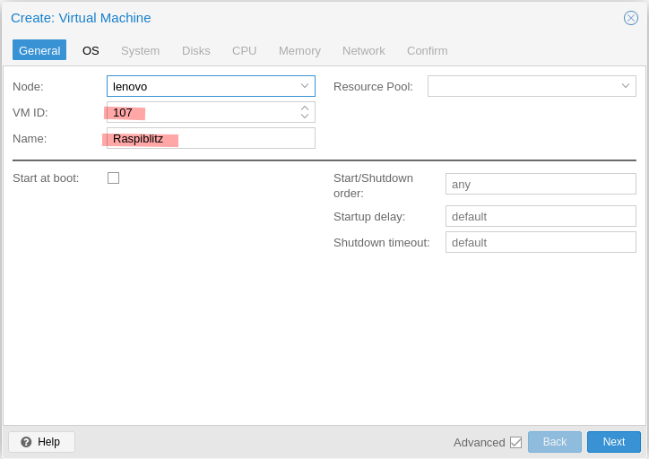

Hier möchte ich euch aufzeigen, wie ihr einen neuen Raspiblitz auf einer Debian VM auf Proxmox installieren und in Betrieb nehmen könnt. Mein Raspiblitz lief sehr lange und stabil auf einem Raspberry Pi 4 mit 8GB RAM. Das würde er sehr wahrscheinlich auch noch länger so tun, jedoch wächst mein Lightning Node immer wie mehr und diverse Apps und Services bauen auf meinem Node auf. So wird das Thema der Verfügbarkeit und des Backups immer wie wichtiger. Deshalb habe ich entschieden, den Raspiblitz auf eine VM in Proxmox zu migrieren. So habe ich bezüglich Backup und Administration viel mehr Spielraum.

Dieser Guide hier wird euch helfen, ein komplett neuer Raspiblitz mit Proxmox aufzusetzen. Der Guide für die Migration folgt demnächst...

### Was wird benötigt?

- [Proxmox Installation](https://cercatrova.blog/proxmox-installieren/) auf einem Intel NUC, Laptop oder Server
- mind. 1TB SSD

Bei der SSD habt ihr mehrere Möglichkeiten: Entweder ihr baut die 1TB SSD im System fix ein und installiert dort drauf auch euer Proxmox Host oder (so wie ich es gemacht habe) ihr habt eine interne SSD (in meinem Fall 500GB M2 SSD) wo sich das Hostbetriebssystem drauf befindet. Die 1TB SSD habe ich anschliessend mittels SATA am Intel NUC bei mir angeschlossen. Diese wird ausschliesslich für das Speichern der Blockchain und Lightning Node bei mir verwendet.

## Debian VM erstellen

Wir installieren Raspiblitz auf einer frischen Debian Maschine. Deshalb müssen wir zuerst das ISO File von Debian herunterladen. Hier einfach die richtige Prozessor Architektur auswählen: (Für mich ist es amd64)

[https://www.debian.org/distrib/netinst](https://www.debian.org/distrib/netinst)

Danach kann diese ISO Datei unter Proxmox hochgeladen werden. Dazu auf den Local Storage klicken, ISO Images und auf Upload:


Nun kann man mittels "Create VM" oben rechts eine neue virtuelle Maschine erstellen. Da klicken wir nun drauf.


Es erscheint ein Einstellungsfenster, wo wir die Eigenschaften der VM nun angeben können. In meinem Beispiel sehen die Eigenschaften wie folgt aus:

VM ID und Name kann selber ausgewählt werden.



Unter dem Punkt "OS" wählen wir nun das vorher heruntergeladene ISO File aus:


Unter "System" können wir die Default Einstellungen belassen. Ich habe hier noch den Hacken bei Qemu Agent gesetzt, damit die VM anschliessend mittels Qemu Agenten mit dem Proxmox Host kommunizieren und Daten übermitteln kann.


Unter "Disks" könnt ihr nun die gewünschte Grösse der VM angeben. Ich habe hier mal die gleiche Grösse (32GB) eingestellt, wie auch meine SD Karten vom Raspiblitz gross sind. Diese kann bei Bedarf zu jeder Zeit in der Zukunft vergrössert werden, falls man doch mehr Platz benötigt und die Host Maschine auch diesen Speicherplatz zur Verfügung hat. Ein weiterer Vorteil warum ich meinen Raspiblitz virtualisiert habe :)


Unter "CPU" könnt ihr die gewünschte Core Anzahl angeben. Dies ist natürlich von eurem Hostbetriebssystem abhängig. Mein Intel NUC hat 4 Kerne, deshalb kann ich hier der VM auch gleich 4 zur Verfügung stellen.


Unter "Memory" müsst ihr die gewünschte RAM Anzahl in MB angeben. Auch dies ist von eurem Host abhängig. Wenn möglich, würde ich hier 8GB oder mehr eintragen. **Kleiner Hinweis: 1GB = 1024 MB. Somit sind 8GB = 8192 MB. (8 x 1024)**


Die VM braucht auch noch einen Netzwerkadapter. Dieser müsst ihr ebenfalls anhand eurer Proxmox Installation entsprechend auswählen. Standard wird vmbr0 sein. Auf meinem Proxmox habe ich diverse VLAN mit konfiguriert, wobei der vmbr3 mein BTC VLAN ist. Dies ist aber nur bei mir so.


Anschliessend könnt ihr auf "Finish" klicken und die VM wird erstellt. Diese taucht auch nun mit Namen auf der linken Seite auf und kann nun gestartet werden. (Rechtsklick -> Start)

Nun könnt ihr die Console (oben rechts) der VM öffnen und die Debian Installationsschritte normal durchführen. Ich habe die Schritte hier ein wenig abgekürzt:

- Install
- Sprache auswählen
- Location auswählen
- Keyboard Sprache auswählen
- Hostname setzen
- Domain setzen (oder einfach leer lassen)
- Root Passwort vergeben
- Neuer User erstellen (meiner heisst hier "pi")
- Passwort für User pi vergeben
- Guided - use entire disk
- SCSI3 Harddisk auswählen
- All files in one partition
- Finish partitioning and write changes to disk
- "Write the changes to disks?" -> Yes
- Scan extra installation media? -> No
- Package manager -> Dein Land auswählen
- Package manager -> deb.debian.org
- http proxy -> leer lassen und continue
- Participate in the package usage survey? -> No
- Software selection: SSH server und standard utilities sollten hier ausreichen
- Install the GRUB boot loader to your primary drive? -> Yes
- /dev/sda auswählen

Die VM ist nun fertig installiert und beginnt zu starten. In der Zwischenzeit kann man nun die ISO Datei entfernen. (VM -> Hardware -> CD/DVD Drive -> Do not use any media -> OK)

## Speicher hinzufügen

Um Raspiblitz nun auf dieser neuen VM zu installieren, müssen wir 2 Sachen machen: Festplatte für die Blockchain Daten anschliessen und der VM durch reichen und das SD Card Builder Script von Raspiblitz installieren. Wir beginnen zuerst mit der Festplatte, wobei es hier 2 Varianten gibt:

### Variante 1: Externe Festplatte

Schliesst nun die Festplatte mittels SATA oder USB beim Hostsystem an. In meinem Beispiel hier benutze ich eine USB Festplatte, welche ich mittels USB 3.1 am Intel NUC angeschlossen habe. Am besten fährt ihr die Raspiblitz VM nun herunter.

Nun müsst ihr euch bei der Konsole auf dem Proxmox Hostsystem anmelden und folgende Schritte ausführen:

https://www.youtube.com/watch?v=U-UTMuhmC1U

Die Befehle aus dem Video hier noch einmal zum kopieren:

```
ls -n /dev/disk/by-id/
/sbin/qm set [VM-ID] -virtio2 /dev/disk/by-id/[DISK-ID]
```

Wichtig ist hier, dass die Festplatte mittels ID durch gereicht wird. Sollte sich mal etwas in Zukunft an der dev sda Reihenfolge ändern, wird immer noch die richtige Festplatte mit der VM verbunden.

### Variante 2: Interner Speicherplatz verwenden

Falls ihr genügend Speicherplatz auf dem Hostbetriebssystem habt, müsst ihr nicht zwingend eine externe Festplatte dazu verwenden. Hier könnt ihr einfach der VM eine zweite Festplatte unter "Hardware -> Add -> Hard Disk" hinzufügen. Ich würde hier mind. 1TB als Speichergrösse empfehlen.

* * *

Egal ob Variante 1 oder 2 ausgeführt wurde, die VM sollte nun in der Hardware Übersicht 2 Festplatten verbunden haben: Eine kleinere (z.B. 32GB) wo das Betriebssystem von Raspiblitz drauf installiert und laufen wird und eine grössere (z.B. 1TB oder mehr) wo die ganzen Daten der Blockchain später abgespeichert werden.


## Raspiblitz installieren

Nun sind wir ready, um Raspiblitz mittels Script zu installieren. Dafür starten wir die Raspiblitz VM und loggen uns als root Benutzer in der Konsole ein. Zuerst einmal alles updaten:

```
apt update
apt upgrade -y
apt install sudo
```

Nun müssen wir das Build SDCard Script von Rootzoll herunterladen. Die Version kann beliebig angepasst werden. Die aktuellste Version (Stand Blockzeit 755125) ist die 1.8.

```
wget https://raw.githubusercontent.com/rootzoll/raspiblitz/v1.8/build_sdcard.sh
```

Und ausführen:

```
sudo bash build_sdcard.sh
```

Das Script zeigt dir nun Informationen von deinem System an. Wenn das alles stimmt, mit "yes" starten.


Nun dauert die Installation einige Minuten. Hier nicht abbrechen oder die VM herunterfahren, sondern einfach installieren lassen. Wenn alles abgeschlossen ist, wird ein reboot benötigt:

```
sudo shutdown -r now
```

Nun könnt ihr im Browser die IP Adresse von eurer VM aufrufen und die ganz normalen Installationsschritte von Raspiblitz durchführen.

* * *

Falls ihr etwas aus dieser Anleitung gelernt habt, würde ich mich über eine Spende extrem freuen:

[BTCPay Donation](https://cercatrova.me/apps/3pCoGbBeYTuNmpH6S5k4yTjgKcUg/pos)

Spende via Lightning Adresse: LN@cercatrova.me
