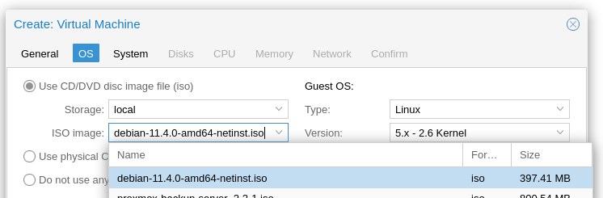

# Install Raspiblitz on proxmox

Here I want to show you how to install a new Raspiblitz on a Debian VM on Proxmox and get it running. My Raspiblitz ran very long and stable on a Raspberry Pi 4 with 8GB RAM. It would very likely continue to do so for a longer time, however my Lightning Node is growing more and more and various apps and services are built on top of my Node. So the issue of availability and backup becomes more and more important. Therefore I decided to migrate the Raspiblitz to a VM in Proxmox. So I have much more room to maneuver regarding backup and administration.

This guide here will help you to set up a completely new Raspiblitz with Proxmox. The guide for the migration will follow soon...

### What is needed?

- Proxmox installation on an Intel NUC, laptop or server
- at least 1TB SSD

You have several options for the SSD: Either you install the 1TB SSD in the system and install your Proxmox host on it or (as I did) you have an internal SSD (in my case 500GB M2 SSD) where the host operating system is located. I connected the 1TB SSD via SATA to my Intel NUC. This is used exclusively for storing the blockchain and Lightning Node.

## Create Debian VM

We install Raspiblitz on a fresh Debian machine. Therefore we have to download the ISO file from Debian first. Here just choose the right processor architecture: (For me it is amd64)

[https://www.debian.org/distrib/netinst](https://www.debian.org/distrib/netinst)

Afterwards this ISO file can be uploaded under Proxmox. To do this, click on the Local Storage, ISO Images and on Upload:


Now you can create a new virtual machine by clicking on "Create VM" in the upper right corner. Now we click on it.


A settings window appears where we can now specify the properties of the VM. In my example, the properties look like this:

VM ID and name can be selected by yourself.


Under the item "OS" we now select the previously downloaded ISO file:



Under "System" we can leave the default settings. I have checked Qemu Agent so that the VM can communicate with the Proxmox host via Qemu Agent and transfer data.


Under "Disks" you can now specify the desired size of the VM. I have set the same size (32GB) as my SD cards from the Raspiblitz are big. This can be increased at any time in the future, if you need more space and the host machine also has this space available. Another advantage why I virtualized my Raspiblitz :)


Under "CPU" you can specify the desired number of cores. Of course, this depends on your host operating system. My Intel NUC has 4 cores, so I can provide 4 cores to the VM.


Under "Memory" you must specify the desired RAM number in MB. This also depends on your host. If possible, I would enter 8GB or more. **Small hint: 1GB = 1024 MB. So 8GB = 8192 MB. (8 x 1024)**


The VM also needs a network adapter. You also have to select this adapter based on your Proxmox installation. Default will be vmbr0. On my Proxmox I have configured several VLAN, where vmbr3 is my BTC VLAN. But this is only the case for me.


After that you can click on "Finish" and the VM will be created. This now also appears with name on the left side and can now be started. (Right click -> Start)

Now you can open the console (top right) of the VM and do the Debian installation steps normally. I have abbreviated the steps a bit here:

- Install
- Select Language
- Select Location
- Select Keyboard Language
- Set Hostname
- Set domain (or just leave it empty)
- Set root password
- Create new user (mine is called "pi")
- Set password for user pi
- Guided - use entire disk
- Select SCSI3 harddisk
- All files in one partition
- Finish partitioning and write changes to disk
- "Write the changes to disks?" -> Yes
- Scan extra installation media? -> No
- Package manager -> Select your country
- Package manager -> deb.debian.org
- http proxy -> leave empty and continue
- Participate in the package usage survey? -> No
- Software selection: SSH server and standard utilities should be sufficient here
- Install the GRUB boot loader to your primary drive? -> Yes
- Select /dev/sda

The VM is now installed and starts to boot. In the meantime you can remove the ISO file. (VM -> Hardware -> CD/DVD Drive -> Do not use any media -> OK)

## Add storage

Now to install Raspiblitz on this new VM we need to do 2 things: Connect the hard disk for the blockchain data and pass it to the VM and install the SD Card Builder Script of Raspiblitz. We start first with the hard disk, where there are 2 variants:

### Variant 1: External hard disk

Now connect the hard drive to the host system using SATA or USB. In my example here I use a USB hard disk, which I connected via USB 3.1 to the Intel NUC. The best thing to do now is to shutdown the Raspiblitz VM.

Now you need to log in to the console on the Proxmox host system and do the following:

https://www.youtube.com/watch?v=U-UTMuhmC1U

The commands from the video here again to copy:

```
ls -n /dev/disk/by-id/
/sbin/qm set [VM-ID] -virtio2 /dev/disk/by-id/[DISK-ID]
```

It is important here that the hard disk is passed through by ID. If something changes in the dev sda order in the future, the correct hard disk is still connected to the VM.

### Variant 2: Use internal storage

If you have enough space on the host operating system, you do not have to use an external hard disk. You can simply add a second hard disk to the VM under "Hardware -> Add -> Hard Disk". I would recommend at least 1TB as storage size.

* * *

Regardless of whether variant 1 or 2 was executed, the VM should now have 2 hard disks connected in the hardware overview: A smaller one (e.g. 32GB) where the operating system of Raspiblitz will be installed and run and a larger one (e.g. 1TB or more) where all the blockchain data will be stored later.


## Install Raspiblitz

Now we are ready to install Raspiblitz via script. For this we start the Raspiblitz VM and log in as root user in the console. First of all update everything:

```
apt update
apt upgrade -y
apt install sudo
```

Now we need to download the Build SDCard Script from Rootzoll. The version can be customized as you like. The latest version (as of block time 768745) is the 1.9.

```
wget https://raw.githubusercontent.com/rootzoll/raspiblitz/v1.9/build_sdcard.sh
```

And run:

```
sudo bash build_sdcard.sh
```

The script now shows you information from your system. If all this is correct, start with "yes".


Now the installation takes a few minutes. Do not abort or shut down the VM here, just let it install. When everything is finished, a reboot is needed:

```
sudo shutdown -r now
```

Now you can call the IP address of your VM in the browser and perform the normal installation steps of Raspiblitz.
