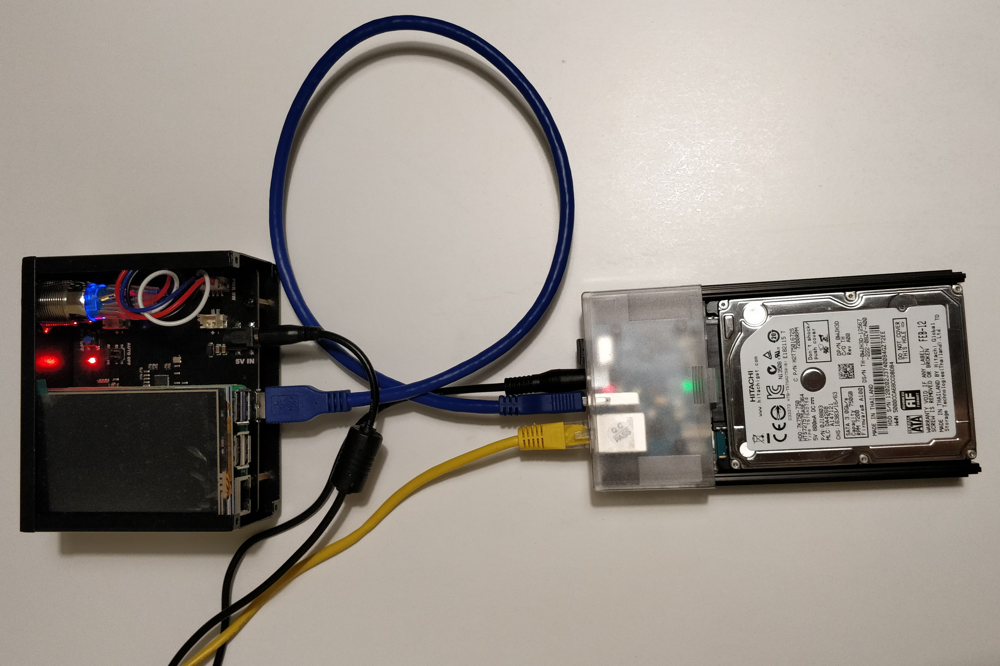
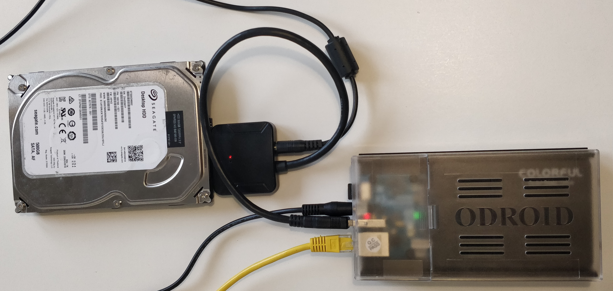

# ⚡️ RaspiBlitz-on-DietPi ⚡️
# For the Odroid HC1 / HC2 / XU3 / XU4

## There are 3 options provided:
* a trusted fully prebuilt SDcard image
* Automated building process.
* Build your own SDcard from the image downloaded from [Dietpi.com](dietpi.com#download)
---
### Download the fully prebuilt RaspiBlitz-on-DietPi SDcard image

* [mega.nz link](https://mega.nz/#F!EVNAAQiB!ZyLHP2dJMRSVjZOTCQMIYA)

sha256sum RaspiBlitz1.0_OdroidHC1_DietPi6.21.1.img: 96ee8700f52a12fb5b13fab3fffcdcf5d364c6dd16c580d969e421cef2cd7cc2

Steps to run:
- download the .img file,
- burn to a 16 GB SD with [Etcher](https://www.balena.io/etcher/)
- extend the rootFS partition with a partition manager (disks, Gparted, etc.)
- boot the Odroid with the SDcard 
- login with `ssh admin@at.your.raspiblitz.ip`  
password: `raspiblitz`

Using this image you can skip the rest of this page.

The setup continues with the [RaspiBlitz Setup Process](https://github.com/rootzoll/raspiblitz/blob/dev/README.md#setup-process-detailed-documentation)

---
### The automated building process:

1) Download the DietPi image for the Odroid HC1 / HC2 / XU3 / XU4:   
https://dietpi.com/downloads/images/DietPi_OdroidXU4-ARMv7-Stretch.7z
2) Burn it to the SD card with [Etcher](https://www.balena.io/etcher/)

3) Right click and download the following two files: [DietPi.txt](https://raw.githubusercontent.com/rootzoll/raspiblitz/master/alternative.platforms/dietpi/boot/dietpi.txt), [Automation_Custom_Script.sh](https://raw.githubusercontent.com/rootzoll/raspiblitz/dev/alternative.platforms/dietpi/boot/Automation_Custom_Script.sh)

4) Copy them to the /boot directory of the DietPi SDcard

    [DietPi.txt](https://raw.githubusercontent.com/rootzoll/raspiblitz/master/alternative.platforms/dietpi/boot/dietpi.txt): Overwrites the default dietpi.txt. Modified the settings to automate the DietPi setup. (see the details [here](https://github.com/rootzoll/raspiblitz/tree/dev/alternative.platforms/dietpi#excerpts-from-the-customized-dietpitxt))

    [Automation_Custom_Script.sh](https://raw.githubusercontent.com/rootzoll/raspiblitz/dev/alternative.platforms/dietpi/boot/Automation_Custom_Script.sh): Runs after DietPi installation is completed. Contains the link to download and run the build_sdcard.sh from the dev branch of @rootzoll.  
    (Optionally open the file with a text editor and uncomment (remove the `#` from the front of) the line with the branch you want to build the SDcard from.) 

5) Assemble and boot the Odroid

    Insert the SDcard, connect the HDD, network cable and power supply to boot.
    
    The automated setup will continue and the Odroid will restart at least twice during the process. 

    To follow the logs during the automated building process login with `root` and press CTRL+C.  
    `tail -n1000 -f /tmp/DietPi-Update/dietpi-update.log` - follow the dietpi-update process  
    `tail -n1000 -f /var/tmp/dietpi/logs/dietpi-automation_custom_script.log` follow the output of the build_sdcard.sh  

    Starting from a v6.14 DietPi image is causing a bootloop after the first restart. See the issue: https://github.com/MichaIng/DietPi/issues/2495. This will be sorted out once a new image version is uploaded for the Odroids to dietpi.com.
    To get past it:
     * Log in with root after the first restart (when the loop is ongoing - without any output to the HDMI screen)
    * CTRL+C, run `dietpi-update` and update
    * `reboot` once finished
    * from then the Automation_Custom_Script.sh is carrying on

6) When the setup is finished log in as `admin`:  
`ssh admin@[IP-OF-RASPIBLITZ]`  
password: `raspiblitz`

    The setup continues with the [RaspiBlitz Setup Process](https://github.com/rootzoll/raspiblitz/blob/dev/README.md#setup-process-detailed-documentation)

---

### Build your own DietPi image:

Watch out this is an ardous process. 
Updating from a v6.14 DietPi image is causing a bootloop after the first restart. See the issue: https://github.com/MichaIng/DietPi/issues/2495.
This will be sorted out once a new image version is uploaded for the Odroids to dietpi.com

* For the Odroid HC1 / HC2 / XU3 / XU4 the start is this image:   
https://dietpi.com/downloads/images/DietPi_OdroidXU4-ARMv7-Stretch.7z  
* Burn it to the SD with [Etcher](https://www.balena.io/etcher/)

* Insert the SD card, connect the HDD, the network cable and power supply to boot up the Odroid: 

* In the desktop terminal on Linux / MacOS or Putty on Windows:  
`ssh root@[IP-OF-DIETPI]`  
password: `dietpi`  
Getting started with DietPi: https://dietpi.com/phpbb/viewtopic.php?f=8&t=9#p9  

* Ok > Cancel > Cancel  
automatic apt update & apt upgrade and asks to reboot
  

* Log back in:
`ssh root@[IP-OF-DIETPI]`  
password: `dietpi`  
* after the update the ssh keys might change:
@@@@@@@@@@@@@@@@@@@@@@@@@@@@@@@  
@ WARNING: REMOTE HOST IDENTIFICATION HAS CHANGED! @  
@@@@@@@@@@@@@@@@@@@@@@@@@@@@@@@  
run (can be copied from the terminal output):   
`ssh-keygen -f "/home/[your-linux-username]/.ssh/known_hosts" -R "dietpi.IP"`  
`ssh root@[IP-OF-DIETPI]`   
yes >   
password: `dietpi`  

* At this point if the DietPi OS was not updated from 6.14 it does not manage to save settings going forward.  
Exit the software installer (press Tab to jump to Exit)
  

* in the bash prompt run:  
`dietpi-update`  
Ok > Cancel the recovery point   
update > Opt out of survey > Ok  
Reboots

* Log back in:  
`ssh root@[IP-OF-DIETPI]`  
password: `dietpi` 
* In the DietPi software menu install fail2ban and make OpenSSH server the default SSH server.  
Ok > Cancel > Cancel  
Search `fail2ban` > Space to select > Enter  
SSH server > switch from Dropbear to the OpenSSH-server  
Install > Ok  
Opt out of survey > Ok  
Reboots again

* Log back in:  
`ssh root@[IP-OF-DIETPI]`  
password: `dietpi`  
Changing the SSH server will change the SSH keys again. To clear:  
`ssh-keygen -f "/home/[your-linux-username]/.ssh/known_hosts" -R "dietpi.IP"`

### Run the RaspiBlitz build_sdcard.sh script

* Run this command to build from the master branch of @rootzoll:  
`wget https://raw.githubusercontent.com/rootzoll/raspiblitz/dev/build_sdcard.sh && sudo bash build_sdcard.sh`  
This will take a couple minutes depending on your internet ceonnection and the processing power of the SBC.

* Format of the command to build the SDcard from an alternative branch:  
`wget https://raw.githubusercontent.com/[GITHUB-USERNAME]/raspiblitz/[BRANCH]/build_sdcard.sh && sudo bash build_sdcard.sh [BRANCH] [GITHUB-USERNAME]`  
If you are working from a forked repo be aware of that the fork needs to be called `raspiblitz` for the git downloads to work.

* Restart when done and log back in now as `admin`:  
`ssh admin@[IP-OF-DROIDBLITZ]`  
password: `raspiblitz`

* From here he setup continues with the [RaspiBlitz Setup Process](https://github.com/rootzoll/raspiblitz/blob/dev/README.md#setup-process-detailed-documentation)

---
###  Examples of copying the blockchain data from a HDD using a powered USB to SATA adapter

