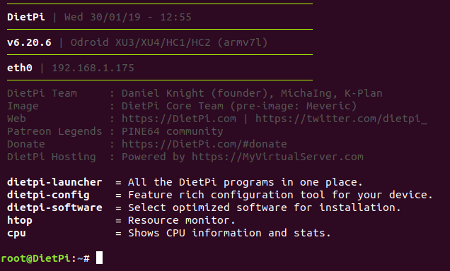

# ⚡️ RaspiBlitz-on-DietPi ⚡️

This guide was tested on:

* Odroid HC1
* Odroid HC2 (the same board with a 3.5" 12V HDD)
* Odroid XU4 (with HDMI screen)
* Raspberry Pi 3 B+ (with the default GPIO or HDMI display)

See the [hardware comparison](/alternative.platforms/hw_comparison.md).

The HDMI screen tested: https://www.aliexpress.com/item/3-5-inch-LCD-HDMI-USB-Touch-Screen-Real-HD-1920x1080-LCD-Display-Py-for-Raspberri/32818537950.html

---
## Specific instructions and downloads:

[Odroid HC1 / HC2 / XU3 / XU4](Odroid_HC1_HC2.md)

[Raspberry Pi](RaspberryPi.md)

[Display install script](/alternative.platforms/display.alternatives.sh)

---

## General guide for the RaspiBlitz-on-DietPi 

### Setting up the DietPi OS

Getting started with DietPi: https://dietpi.com/phpbb/viewtopic.php?f=8&t=9#p9 

* Start with an ARM based Single Board Computer listed on DietPi.com.  
At least 1GB RAM is recommended.  
Look for the SD card image for the specific SBC in the [download section](https://dietpi.com/#download).

* Burn the image to the SDCard with [Etcher](https://www.balena.io/etcher/).

* Insert the SDcard into your SBC.

* Connect the HDD with a suitably powered adapter.   
    Aim to use 2 USB ports or a separate power supply to power the HDD for a more reliable setup.
* Power up and log in with the desktop terminal on Linux / MacOS or Putty on Windows:  
`ssh root@[IP-OF-DIETPI]`  
password: `dietpi`  

* If you are asked about updating DietPi, go ahead with it. This is not always a straightforward process, but it is best to build on the latest version.

* In the DietPi software menu install `fail2ban` and make `OpenSSH server` the default SSH server.  
    If there is a screen installed: within the Dietpi-Config menu set the Autostart to  `7: Automatic login. `

    Changing the SSH server will change the SSH keys again. To clear:  
    `ssh-keygen -f "/home/[your-linux-username]/.ssh/known_hosts" -R "dietpi.IP"`

* After every reboot log back in:  
`ssh root@[IP-OF-DIETPI]`  
password: `dietpi`

* Should end up here on version v6.20.6 or higher: 

### Run the RaspiBlitz build_sdcard.sh script

* Use this format to build the SDcard with the Raspiblitz script:  
`wget https://raw.githubusercontent.com/[GITHUB-USERNAME]/raspiblitz/[BRANCH]/build_sdcard.sh && sudo bash build_sdcard.sh [BRANCH] [GITHUB-USERNAME]`  
If you are working from a forked repo be aware of that the fork needs to be called `raspiblitz` for the git downloads to work.

    Example to run the dev branch of @rootzoll:  
    `wget https://raw.githubusercontent.com/rootzoll/raspiblitz/dev/build_sdcard.sh && sudo bash build_sdcard.sh dev rootzoll`  
    This will take a couple minutes depending on your internet connection and the processing power of the SBC.

* After the automatic restart log back in now as `admin`:  
`ssh admin@[IP-OF-RASPIBLITZ]`  
password: `raspiblitz`

* From here he setup continues with the [RaspiBlitz Setup Process](https://github.com/rootzoll/raspiblitz/blob/dev/README.md#setup-process-detailed-documentation)

---
### Useful commands for debugging:
During the Automated setup:  
`tail -n1000 -f /tmp/DietPi-Update/dietpi-update.log` - follow the dietpi-update process  
`tail -n1000 -f /var/tmp/dietpi/logs/dietpi-automation_custom_script.log` follow the output of the build_sdcard.sh  

During the RaspiBlitz setup process:  
`lsblk` check the disk partitions  
`tail -n1000 -f raspiblitz.log` - debug logs of bootstrap.sh  
`sudo tail -f /mnt/hdd/bitcoin/debug.log` - continuous monitoring of bitcoind
`sudo tail -n100 /mnt/hdd/bitcoin/debug.log` - shows the last 100 lines  
`sudo systemctl status lnd` - status of the lnd service
`sudo journalctl -f -u lnd` 
`./home/admin/XXdebugLogs.sh` - debug log collection on the RaspiBlitz

---

## Excerpts from the [customized dietpi.txt]/alternative.platforms/dietpi/boot/dietpi.txt)
to be used for a fully automatic SDcard building process.

### Automate installation with the dietpi.txt
Need to copy to SDcard /boot/dietpi.txt after burning the image with Etcher.
IMPORTANT:
- Modifications to /boot/dietpi.txt will not be preserved on reboot  .
- Please ensure you edit from the DietPi-RAMdisk location: /DietPi/dietpi.txt 

NB: This is intended for advanced users, unless you know what you are doing, do not edit this file. ease use the DietPi programs instead.  
NB: Do not remove uncommented lines, as the items are scraped by DietPi programs, on demand.
DietPi-Automation settings, applied on the 1st boot of DietPi, ONCE  
Sample:  
https://github.com/Fourdee/DietPi/blob/master/dietpi.txt

#### DietPi-Software to be installed automatically 
Requires `AUTO_SETUP_AUTOMATED=1  `
For a list of software index's (ID's), run '/DietPi/dietpi/dietpi-software list'  
No limit on number entries, add as many as you need and uncomment the line.  
DietPi will automatically install all pre-reqs (eg: ALSA/XSERVER for desktops etc)  
>install fail2ban  
AUTO_SETUP_INSTALL_SOFTWARE_ID=73  
install OpenSSH Client  

#### SSH Server Selection:
>0=none  
-1=dropbear  
-2=opensshserver  
AUTO_SETUP_SSH_SERVER_INDEX=-2

---
## Custom Script (post-networking and post-DietPi install) 
Runs after DietPi installation is completed.  
Allows you to automatically execute a custom script at the end of DietPi installation.  
Option 1 = Copy your script to /boot/Automation_Custom_Script.sh and it will be executed automatically.  
Option 2 = Host your script online, then use AUTO_SETUP_CUSTOM_SCRIPT_EXEC=http://myweb.com/myscript.sh, it will be downloaded and executed automatically. | 0=disabled  
NB: Executed script log /var/tmp/dietpi/logs/dietpi-automation_custom_script.log

Find the Automation_Custom_Script.sh loaded with the build_sdcard.sh [here]/alternative.platforms/dietpi/boot/Automation_Custom_Script.sh)

---
## Guide to clone your SD-cards in Windows, MacOS and Linux and shrink the image in Linux:
https://beebom.com/how-clone-raspberry-pi-sd-card-windows-linux-macos/