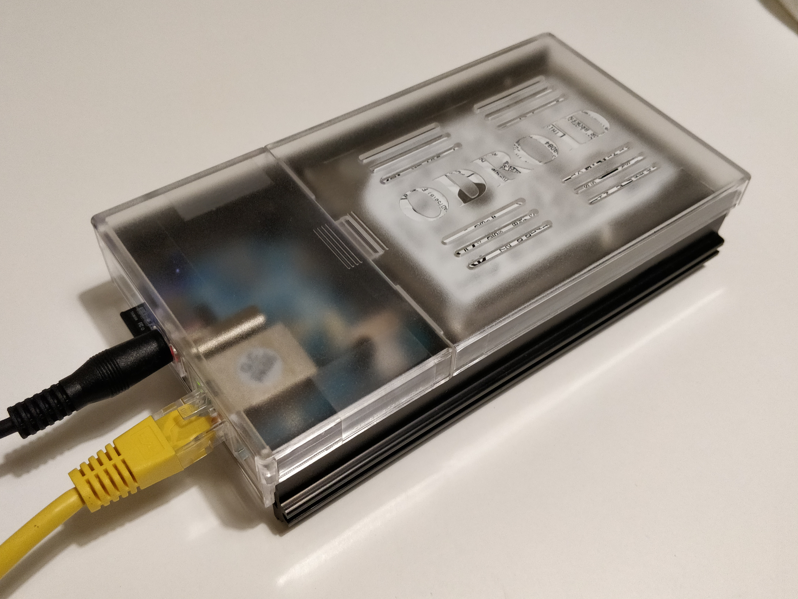
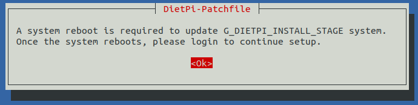
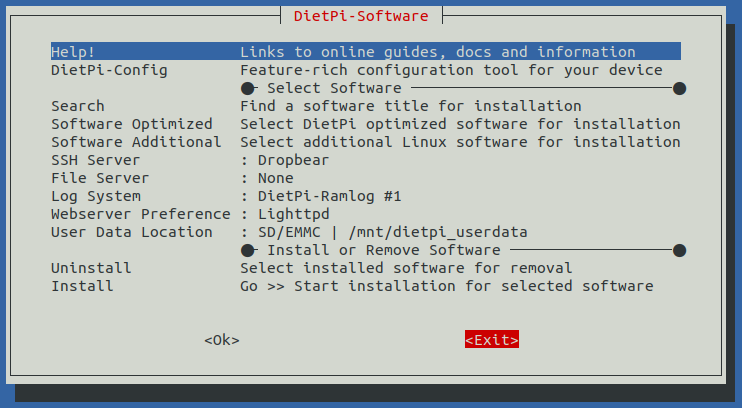

# ⚡️ RaspiBlitz-on-DietPi ⚡️
# For the Odroid HC1 / HC2 / XU3 / XU4

## There are 3 options provided:
* a trusted fully prebuilt SDcard image
* building your own SDcard from an updated DietPi image.
* Build your own SDcard from the image downloaded from [Dietpi.com](dietpi.com#download)
---
### Download the fully prebuilt RaspiBlitz-on-DietPi SDcard image
* [torrent](https://github.com/openoms/raspiblitz/blob/raspiblitz-dev/dietpi/RaspiBlitz1.0_OdroidHC1_DietPi6.21.1.torrent) 
* [mega.nz link](https://mega.nz/#F!EVNAAQiB!ZyLHP2dJMRSVjZOTCQMIYA)

sha256sum RaspiBlitz1.0_OdroidHC1_DietPi6.21.1.img: 96ee8700f52a12fb5b13fab3fffcdcf5d364c6dd16c580d969e421cef2cd7cc2

Steps to run:
- download the .img file,
- burn to a 16 GB SD with [Etcher](https://www.balena.io/etcher/)
- extend the rootFS partition with a partition manager (disks, Gparted, etc.)
- boot the Odroid with the SDcard 
- login with `ssh admin@at.your.raspiblitz.ip`  
password: `raspiblitz`

Using this image you can skip the rest of this guide as it is mostly about how this image was built.

The setup continues with the [RaspiBlitz Setup Process](https://github.com/rootzoll/raspiblitz/blob/master/README.md#setup-process-detailed-documentation)

---
### Download the updated DietPi image

For the Odroid HC1 / HC2 / XU3 / XU4 a v6.20.6 DietPi image with fail2ban installed is uploaded [here](
https://mega.nz/#!AcdVBAbR!O-W3jP5LUgw7lMY8S9XcBWcKX3IhRNAAFmaYzDXIUC0).  
sha256sum DietPi_v6.20.6_OdroidXU4-ARMv7-Stretch.img: 
1459b91f66b9db98f3437c31231e44497b7b7dcd9146d2cc41a3da653f9a9215

* Burn the image to the SDCard with [Etcher](https://www.balena.io/etcher/) and extend the rootfs partition to the size of your card with a partition manager (disks, Gparted, etc).

* Insert the SDcard into the Odroid.

* Power up and continue with [running the RaspiBlitz build_sdcard.sh script](#Run-the-RaspiBlitz-build_sdcard.sh-script)

---

### Build your own DietPi image:

Watch out this is an ardous process. 
Updating from a v6.14 DietPi image is causing a bootloop under some circumstances. Will be sorted once the current, >6.2 version is uploaded for the Odroids.  

* For the Odroid HC1 / HC2 / XU3 / XU4 the start is this image:   
https://dietpi.com/downloads/images/DietPi_OdroidXU4-ARMv7-Stretch.7z  
* Burn it to the SD with [Etcher](https://www.balena.io/etcher/)

* In the desktop terminal on Linux / MacOS or Putty on Windows:  
`ssh root@[IP-OF-DIETPI]`  
password: `dietpi`  
Getting started with DietPi: https://dietpi.com/phpbb/viewtopic.php?f=8&t=9#p9  

* Ok > Cancel > Cancel  
automatic apt update & apt upgrade and asks to reboot
  

* Log back in:
`ssh root@[IP-OF-DIETPI]`  
password: `dietpi`  
* after the update the ssh keys might change:
@@@@@@@@@@@@@@@@@@@@@@@@@@@@@@@  
@ WARNING: REMOTE HOST IDENTIFICATION HAS CHANGED! @  
@@@@@@@@@@@@@@@@@@@@@@@@@@@@@@@  
run (can be copied from the terminal output):   
`ssh-keygen -f "/home/[your-linux-username]/.ssh/known_hosts" -R "dietpi.IP"`  
`ssh root@[IP-OF-DIETPI]`   
yes >   
password: `dietpi`  

* At this point if the DietPi OS was not updated from 6.14 it does not manage to save settings going forward.  
Exit the software installer (press Tab to jump to Exit)
  

* in the bash prompt run:  
`dietpi-update`  
Ok > Cancel the recovery point   
update > Opt out of survey > Ok  
Reboots

* Log back in:  
`ssh root@[IP-OF-DIETPI]`  
password: `dietpi` 
* In the DietPi software menu install fail2ban and make OpenSSH server the default SSH server.  
Ok > Cancel > Cancel  
Search `fail2ban` > Space to select > Enter  
SSH server > switch from Dropbear to the OpenSSH-server  
Install > Ok  
Opt out of survey > Ok  
Reboots again

* Log back in:  
`ssh root@[IP-OF-DIETPI]`  
password: `dietpi`  
Changing the SSH server will change the SSH keys again. To clear:  
`ssh-keygen -f "/home/[your-linux-username]/.ssh/known_hosts" -R "dietpi.IP"`

### Run the RaspiBlitz build_sdcard.sh script

* Format of the command to build the SDcard:  
`wget https://raw.githubusercontent.com/[GITHUB-USERNAME]/raspiblitz/[BRANCH]/build_sdcard.sh && sudo bash build_sdcard.sh [BRANCH] [GITHUB-USERNAME]`  
If you are working from a forked repo be aware of that the fork needs to be called `raspiblitz` for the git downloads to work.

* Run the forked version of @openoms:  
`wget https://raw.githubusercontent.com/openoms/raspiblitz/raspiblitz-dev/build_sdcard.sh && sudo bash build_sdcard.sh raspiblitz-dev openoms`  
This will take a couple minutes depending on your internet ceonnection and the processing power of the SBC.

* Restart when done and log back in now as `admin`:  
`ssh admin@[IP-OF-DROIDBLITZ]`  
password: `raspiblitz`

* From here he setup continues with the [RaspiBlitz Setup Process](https://github.com/rootzoll/raspiblitz/blob/master/README.md#setup-process-detailed-documentation)

---
###  Examples of copying the blockchain data from a HDD using a powered USB to SATA adapter

