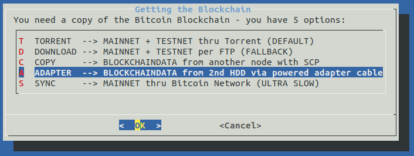

# ⚡️ RaspiBlitz on DietPi ⚡️
#  A hardware agnostic platform

First tested on an Odroid HC1. It has no connection for an LCD, but the [hardware specs](hw_comparison.md) make up for it.

## Setting up the DietPi OS

### Download the updated DietPi image

For the Odroid HC1 / HC2 / XU3 / XU4 a v6.20.6 DietPi image with fail2ban installed is uploaded here:  
https://mega.nz/#!AcdVBAbR!O-W3jP5LUgw7lMY8S9XcBWcKX3IhRNAAFmaYzDXIUC0  

Burn the SDCard with [Etcher](https://www.balena.io/etcher/) and extend the rootfs partition to the size of your card with a partition manager.

Insert the SDcard into the Odroid.

Power up and continue with: [Run the DietPi optimized Raspiblitz SDcard build script](#Run-the-DietPi-optimized-Raspiblitz-SDcard-build-script)

### Build your own DietPi image:

For the Odroid HC1 / HC2 / XU3 / XU4 download this image:   
https://dietpi.com/downloads/images/DietPi_OdroidXU4-ARMv7-Stretch.7z  
and burn it to the SD with [Etcher](https://www.balena.io/etcher/)

Getting started with DietPi: https://dietpi.com/phpbb/viewtopic.php?f=8&t=9#p9  

In the desktop terminal on Linux / MacOS or Putty on Windows:  

`ssh root@[IP-OF-DIETPI]`  
password: `dietpi`  

Ok > Cancel > Cancel  
automatic apt update & apt upgrade and asks to reboot
  

`ssh root@[IP-OF-DIETPI]`  
after the previous update the ssh keys might change:

@@@@@@@@@@@@@@@@@@@@@@@@@@@@@@@  
@ WARNING: REMOTE HOST IDENTIFICATION HAS CHANGED! @  
@@@@@@@@@@@@@@@@@@@@@@@@@@@@@@@  

run (can be copied from the terminal output):   
`ssh-keygen -f "/home/[your-linux-username]/.ssh/known_hosts" -R "dietpi.IP"`

`ssh root@[IP-OF-DIETPI]`   
yes >   
password: `dietpi`  

At this point if the DietPi was not updated from 6.14 it does not manage to save settings going forward.  
Exit the sotware installer (press Tab to jump to Exit)
  

in the bash prompt run:  
`dietpi-update`
>Ok > Cancel the recovery point   
update > >Opt out of survey > Ok  
Reboots

`ssh root@[IP-OF-DIETPI]`  
password: `dietpi` 

>Ok > Cancel > Cancel  
Search `fail2ban` > Space to select > Enter   
> Install > Ok  
>Opt out of survey > Ok  
Reboots again

## Run the DietPi optimized Raspiblitz SDcard build script

In the desktop terminal in Linux / MacOS or Putty in Windows:

`ssh root@[IP-OF-DIETPI]`  
password: `dietpi` 
Should end up here on version v6.20.6 or higher: 

run the SDcard build script in this format:
`wget https://raw.githubusercontent.com/[GITHUB-USERNAME]/raspiblitz/[BRANCH]/build.sdcard/raspbianStretchDesktop.sh && sudo bash raspbianStretchDesktop.sh [BRANCH] [GITHUB-USERNAME]`

Be aware of that the fork needs to be called `raspiblitz` for the git download to work.
if you intend to use @openoms`s forked version:

`wget https://raw.githubusercontent.com/openoms/raspiblitz/raspiblitz-dev/build.sdcard/raspbianStretchDesktop.sh && sudo bash raspbianStretchDesktop.sh raspiblitz-dev openoms`

See my example output on the Odorid HC1: [HC1_sdcard_build_output](logs/HC1_sdcard_build_output)  

`ssh admin@[IP-OF-DROIDBLITZ]`  
password: raspiblitz

### The setup continues as described in the RaspiBlitz setup [README.md](/README.md#documentation)

### Examples of copying the blockchain data from a HDD using a powered USB to SATA adapter

### Useful commands for debugging:
To test a new configuration run XXcleanHDD.sh and strictly restart
(this makes _bootstrap.sh and 00mainMenu.sh run in the right order)

`tail -n1000 -f /var/tmp/dietpi/logs/dietpi-automation_custom_script.log` follow startup setup script log  
`lsblk` see the partitions  
`tail -n1000 -f raspiblitz.log` - debug logs of bootstrap.sh  
`sudo tail -f /mnt/hdd/bitcoin/debug.log` - continuous monitoring  
`sudo tail -n100 /mnt/hdd/bitcoin/debug.log` - shows the last 100 lines  
`sudo systemctl status lnd`  
`sudo journalctl -f -u lnd`  
`./home/admin/XXdebugLogs.sh` - debug log collection on the raspiblitz 

Currently the DietPi update process has a bug causing bootloop if left alone. Will be sorted once the current, >6.2 version is uploaded as the starting image.
Here find some excerpts from the deafult dietpi.txt (https://github.com/Fourdee/DietPi/blob/master/dietpi.txt) to be used once the automatic install is feasible:

### Automate installation with the dietpi.txt
Need to copy to SDcard /boot/dietpi.txt after burning the image with Etcher.
IMPORTANT:
- Modifications to /boot/dietpi.txt will not be preserved on reboot.
- Please ensure you edit from the DietPi-RAMdisk location: /DietPi/dietpi.txt
NB: This is intended for advanced users, unless you know what you are doing, do not edit this file. ease use the DietPi programs instead.
NB: Do not remove uncommented lines, as the items are scraped by DietPi programs, on demand.
DietPi-Automation settings, applied on the 1st boot of DietPi, ONCE
Sample:
https://github.com/Fourdee/DietPi/blob/master/dietpi.txt

### DietPi-Software to automatically install.  
Requires `AUTO_SETUP_AUTOMATED=1  `
For a list of software index's (ID's), run '/DietPi/dietpi/dietpi-software list'  
No limit on number entries, add as many as you need and uncomment the line.  
DietPi will automatically install all pre-reqs (eg: ALSA/XSERVER for desktops etc)  
>install fail2ban  
AUTO_SETUP_INSTALL_SOFTWARE_ID=73  
install OpenSSH Client  
AUTO_SETUP_INSTALL_SOFTWARE_ID=0  
install OpenSSH Server  
AUTO_SETUP_INSTALL_SOFTWARE_ID=105  

### Custom Script (post-networking and post-DietPi install) 
Runs after DietPi installation is completed
Allows you to automatically execute a custom script at the end of DietPi installation.  
Option 1 = Copy your script to /boot/Automation_Custom_Script.sh and it will be executed automatically.  
Option 2 = Host your script online, then use AUTO_SETUP_CUSTOM_SCRIPT_EXEC=http://myweb.com/myscript.sh, it will be downloaded and executed automatically. | 0=disabled  
NB: Executed script log /var/tmp/dietpi/logs/dietpi-automation_custom_script.log
