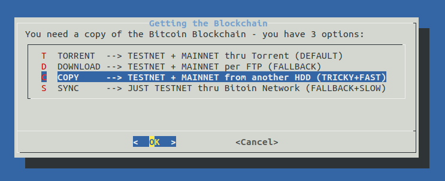

# ⚡️ this setup is tested on an ODroid HC1 ⚡️

there is no LCD, but the [hardware specs](hw_comparison.md) make up for it.

## Setting up the DietPi OS

Download this image: 
https://dietpi.com/downloads/images/DietPi_OdroidXU4-ARMv7-Stretch.7z  
and burn it to the SD with https://www.balena.io/etcher/

Getting started with DietPi: https://dietpi.com/phpbb/viewtopic.php?f=8&t=9#p9  

## On the desktop Linux terminal
`ssh root@[IP-OF-DIETPI]`  
password: `dietpi`  

>Ok > Cancel the recovery point  
Ok > Cancel > Cancel  
automatic apt update & apt upgrade on first logon and reboots  
Opt out of survey > Ok > Ok

`ssh root@[IP-OF-DIETPI]`

@@@@@@@@@@@@@@@@@@@@@@@@@@@@@@@@@@@@@@@@@@@@@@@@@@@@@@@@@@@
@    WARNING: REMOTE HOST IDENTIFICATION HAS CHANGED!     @
@@@@@@@@@@@@@@@@@@@@@@@@@@@@@@@@@@@@@@@@@@@@@@@@@@@@@@@@@@@

run (can be copied from the terminal output): 
`ssh-keygen -f "/home/[your-linux-username]/.ssh/known_hosts" -R "dietpi.IP"`

`ssh root@[IP-OF-DIETPI]` 
yes >   
password: `dietpi`  

At this point if the DietPi was not updated from 6.14 it does not manage to save settings going forward.  
Exit with CTRL + C and run   
`dietpi-update`  
update continue after the reboot.

>Ok > Cancel > Cancel  
Search `fail2ban` > Space to select > Enter   
Search `openssh` > Space to select OpenSSH Client > Enter  
> Install > Ok  

>Opt out of survey > Ok  
Reboots again

`ssh root@[IP-OF-DIETPI]`  
Should end up here on version v6.20.6 or higher: 

run the SDcard build script in this format:
`wget https://raw.githubusercontent.com/[GITHUB-USERNAME]/raspiblitz/[BRANCH]/build.sdcard/raspbianStretchDesktop.sh && sudo bash raspbianStretchDesktop.sh [BRANCH] [GITHUB-USERNAME]`

Be aware of that the fork needs to be called `raspiblitz` for the git download to work.
if you intend to use @openoms`s forked version:

`wget https://raw.githubusercontent.com/openoms/raspiblitz/raspiblitz-dev/build.sdcard/raspbianStretchDesktop.sh && sudo bash raspbianStretchDesktop.sh raspiblitz-dev openoms`

See my example output: [sdcard_build_output](DietPi/sdcard_build_output)  

`ssh admin@[IP-OF-DROIDBLITZ]`  
password: raspiblitz

The setup continues as described in the RaspiBlitz setup [README.md](/README.md#documentation)

## Example of setting up a RaspiBlitz HDD to be copied to the ODroid:

Useful commands for debugging:
`sudo tail -f /mnt/hdd/bitcoin/debug.log` - continuous monitoring
`sudo tail -n 100 /mnt/hdd/bitcoin/debug.log` - shows the last 100 lines
`sudo systemctl status lnd`
`sudo journalctl -f -u lnd`
`./home/admin/XXdebugLogs.sh` - on the raspiblitz
`lsblk` see the partitions
`tail -n1000 -f raspiblitz.log` - debug logs of bootstrap.sh

Samsple dietpi.txt: https://github.com/Fourdee/DietPi/blob/master/dietpi.txt