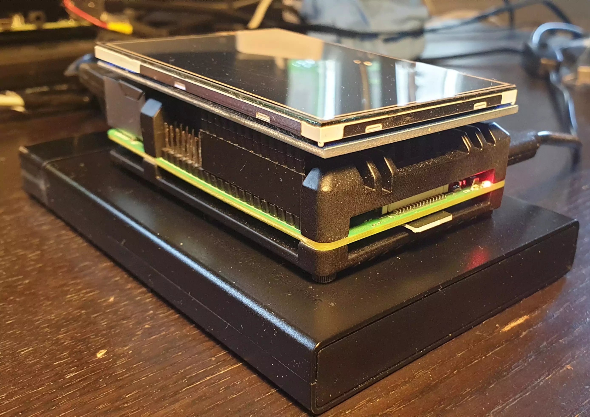

# Hardware

All parts together cost around 200-300 USD - based on shops and location.

### Buy a ready-2-go RaspiBlitz (Germany, EU and International)

If you like to support the RaspiBlitz project you can order a plug&play RaspiBlitz from [raspiblitz.com](https://raspiblitz.com)

Find a list of other shops selling a plug&play RaspiBlitz in your area on [raspiblitz.org](https://raspiblitz.org).

### Amazon Shopping List (buy parts & build it yourself)

The cheapest way is to buy and assemble the single parts yourself.
There are two packages.

_Please try to use the exact hardware models that are recommended in the shopping lists.
We have had multiple reports where, for example, other SSD or SSD cases/controllers lead to problems.
The idea of the shopping lists is to provide you the best tested hardware components that work together - improvement recommendations are always welcome._

- RaspberryPi 4 4GB (or 8GB) [amazon referral link](https://geni.us/raspiblitz-4gb-new)
- Power Supply - USB-C, 5V, >=3A [amazon referral link](https://geni.us/raspiblitz-ps)
- 1TB SSD - SanDisk SSD Plus 1TB 2.5" : [amazon referral link](https://geni.us/raspiblitz-1000gb-san) _other 1TB SSD models might cause power issues_
- SSD-case - UGREEN 2.5" External USB 3.0 Hard Disk Case with UASP support : [amazon referral link](https://geni.us/raspiblitz-ssd-case)
- MicroSDCard 32GB - Samsung PRO Endurance 32 GB microSDHC UHS-I U1: [amazon referral link](https://geni.us/raspiblitz-sc-card)
- Heatsink Case for RPi4 : [amazon referral link](https://geni.us/heatsink-raspi4)
- LCD - 3.5" RPi Display, GPIO connection, XPT2046 Touch Controller: [amazon referral link](https://geni.us/raspiblitz-touchscreen)

_If the above mentioned LCD screen is sold out you can also use these different vendors for the screen on Amazon:_

- Quimat 3,5'' Zoll Inch Touch
- ELEGOO Display 3.5" Zoll TFT LCD
- kuman 3.5 Inch Touch Screen TFT Monitor
- Waveshare 3.5inch Display for Raspberry Pi

With all LCD screen models don't use the ones that have an HDMI port/connector - what you need is a 3.5 inch LCD screen model (resolution of 480×320) that connects only thru the GPIO ports (SPI) and has an XPT2046 touch controller.

_You can even pay for your RaspiBlitz Amazon Shopping with Bitcoin & Lightning through [Bitrefill](https://blog.bitrefill.com/its-here-buy-amazon-vouchers-with-bitcoin-on-bitrefill-bb2a4449724a)._

[What other case options do I have?](../faq/faq.md#what-other-case-options-do-i-have)

## Assemble your RaspiBlitz

When you have all parts you need to:

- Assemble the Heatsink-Case on the RaspberryPi (follow the instructions in package).
- Put the SSD/HDD into the Case and connect it per USB to the RaspberryPi (blue ports).
- Add the display on top with the pins like in picture below.
- Plug in the network cable.

In the end your RaspiBlitz should look like this:

You now have the hardware ready for your RaspiBlitz - whats missing is the software to run. This is normally done by downloading an image file and then writing it (flashing it) to the sd card. This is a bigger file (multiple GigaBytes) so make sure to have the available storage space on your laptop. If you are a very advanced user who is able to read/verify code or you like to run a self-modified/forked version of RaspiBlitz you can also build the sd card image yourself - see the [Build your own sd card image](#build-the-sd-card-image) section for this.
