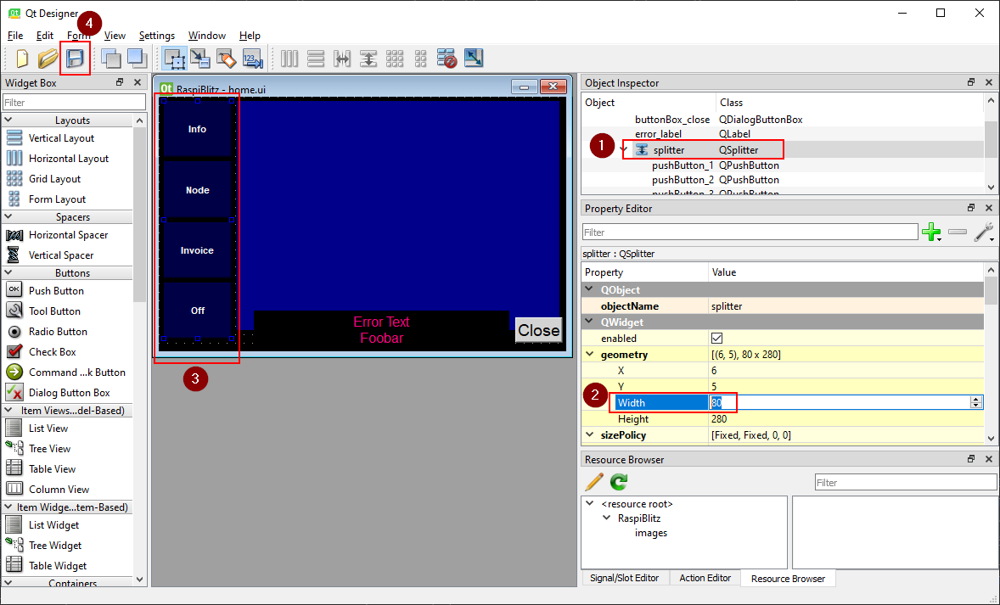

# BlitzTUI Mini-Tutorial

This *Mini-Tutorial* shows the basic workflow for doing changes to the Blitz-Touch-User-Interface.

## What you need

* A physical RaspiBlitz and SSH access to it (to verify your changes on the real screen)
* A Computer (Mac and Windows should work)
* The "Qt Designer" software (https://build-system.fman.io/qt-designer-download)
* A copy of the current RaspiBlitz codebase (`git clone https://github.com/rootzoll/raspiblitz.git`)

## Scenario

Let's assume you want to reduce the width of the button row on the left side.

* Open Qt Designer
* Load the .ui file: `home.admin/BlitzTUI/designer/home.ui`

Your screen should look similar to this:



* (1) for this scenario go to the **Object Inspector** and select **splitter**
* (2) change the **Width** (e.g. from 80 to 60)
* (3) this should be reflected in the preview Window
* (4) save your changes

The next step is to transfer (use sftp or WinSCP) the updated `home.ui` to the RaspiBlitz.

Login to your RaspiBlitz as **admin** (Password A) and change the directory to `~/raspiblitz/home.admin/BlitzTUI`.

Your updated `home.ui` file should be in `designer/` (confirm timestamp with `ls -l designer/home.ui`).

Run `make build-ui`

To quickly check the result run

```
sudo -u pi DISPLAY=:0.0 LD_PRELOAD=/usr/lib/arm-linux-gnueabihf/libatomic.so.1.2.0 /home/admin/python3-env-lnd/bin/python3 /home/admin/raspiblitz/home.admin/BlitzTUI/blitztui/main.py
```

You can also install the current directory as a python package using `pip install -e .` and the run

```
sudo -u pi DISPLAY=:0.0 LD_PRELOAD=/usr/lib/arm-linux-gnueabihf/libatomic.so.1.2.0 /home/admin/python3-env-lnd/bin/blitz-tui
```

