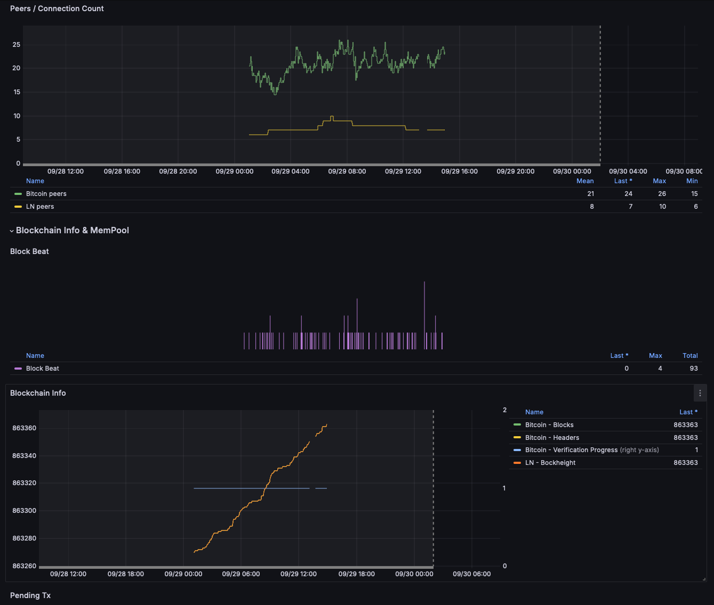

# Monitoring RaspiBlitz with Telegraf
    
[telegraf](https://www.influxdata.com/time-series-platform/telegraf/) is a metric collection tool by influxData. It is opensource and can push performance data of RaspiBlitz to an external [influxDB](https://www.influxdata.com/products/influxdb-overview/) server which then can be used as a datasource for the [Grafana](https://grafana.com/grafana/)WebUI to monitor RaspiBlitz in a Dashboard like this:



InfluxDB & Grafana should run on separate hardware - you might use an old RaspberryPi4 for that and take a look [here](https://github.com/gcgarner/IOTstack) for a nice dockerized installation of influxDB and Grafana.

### Prepare your InfluxDB for RaspiBlitz

Before you can start Teelegraf on RaspiBlitz you need to prepare a InfluxDB database for RaspiBlitz and create a user with password. So on your InfluxDB/Grafana machine follow the steps:

Start the InfluxDB shell:
```
influx
```

If you havent yet create an `admin` user:
```
CREATE USER "admin" WITH PASSWORD '[ADMIN-PASSWORD]' WITH ALL PRIVILEGES;
```

Create database & user:
```
CREATE DATABASE raspiblitz;
SHOW DATABASES;
CREATE USER "raspiblitz" WITH PASSWORD '[RASPIBLITZ-PASSWORD]';
GRANT ALL ON raspiblitz TO raspiblitz;
```

If you havent yet create a read-only user for Grafana:
```
CREATE USER "grafana" WITH PASSWORD '[GRAFANA-PASSWORD]';
GRANT READ ON raspiblitz TO grafana;
```

To check if all is ready:
```
SHOW DATABASES;
SHOW USERS;
```

You should see a database called `raspiblitz` and at least three users `admin, raspiblitz & grafana`.

You can now exit the InfluxDB with:
```
exit
```

Make yure that the InfluxDB configuration file contains the the `[http]` section:
```
auth-enabled = true
```

On our Grafana/InfluxDB machine the config could be edited with:
```
sudo nano /etc/influxdb/influxdb.conf
````
Save the file (Ctrl+O, Enter) and exit (Ctrl+X).

You my need to restart the InfluxDB server:
```
sudo systemctl restart influxdb
```

### Activate Telegraf on RaspiBlitz

Back on your RaspiBlitz you can switch Telegraf service on under `SSH-MAINMENU > SETTINGS > Telegraf`.

Enter the connection details the script asks you for.

_If you want to improve the service as a programmer you find the install script here `/home/admin/config.scripts/bonus.telegraf.sh`_

### Check Incoming Data on Grafana/InfluxDB server

If install on the RaspiBlitz went thru OK you can go back to your Grafana/InfluxDB server and see if it received some basic CPU data:
```
influx -username admin -password '[ADMIN-PASSWORD]'
USE raspiblitz;
SHOW MEASUREMENTS;
```

If data is being written successfully, you should see measurements like cpu, mem, disk, etc.

```
SELECT * FROM cpu LIMIT 5;
```

This should display the first five entries from the cpu measurement. If you see that data you can close the influxDB shell with:
```
exit
```

### Add Grafana Datasource

Now configure Grafana to use the InfluxDB Data Source.

Log In to Grafana. Use your Grafana credentials.

- Click on the Configuration (gear icon) in the left sidebar.
- Click on Data Sources.
- Click Add data source and select InfluxDB.

Configure the InfluxDB Data Source:
```
HTTP: 
  URL: http://localhost:8086
Auth: 
  Leave default unless specific settings are needed.
InfluxDB Details:
  Database: raspiblitz
  User: grafana
  Password: [GRAFANA-PASSWORD]
HTTP Method: POST (recommended)
```

Click the Save & Test button to verify the connection.Now 

We need the datasource UID for later - to get it:

- Click on Data Sources.
- Click on the new created InfluxDB data source.

Find the UID:

In the URL of your browser, you should see something like this:
```
http://<your_vm_ip>:3000/datasources/edit/<data_source_uid>
```

The part after `/edit/` is the UID for your data source. It will be a unique identifier like `cOZgpReMk`

We will need your personal datasource UID in the next step.

### Create Grafana Dashboard

Open the json data for the Dashboard in a new browser tab - following this link: https://raw.githubusercontent.com/raspiblitz/raspiblitz/refs/heads/dev/home.admin/assets/telegraf/raspiblitz-grafana-dashboard.json 

Copy all JSON data (to paste it later).

In your Grafana WebUI: Click on “+” → “Import”.

Now paste the JSON data from above into the field 

_BUT BEFORE YOU SAVE_ 

replace ALL InfluxDB UIDs in that json with your personal one.


