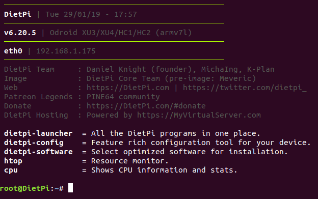

Working with the ODroid HC1 and this image: https://dietpi.com/downloads/images/DietPi_OdroidXU4-ARMv7-Stretch.7z

Getting started with DietPi: https://dietpi.com/phpbb/viewtopic.php?f=8&t=9#p9

`ssh root@[IP-OF-DIETPI]`  
yes>
password: `dietpi`
`sudo dietpi-update`
Ok > Cancel the recovery point
Ok > Cancel > Cancel
automatic apt update & apt upgrade on first logon and reboots
Opt out of survey > Ok > Ok

`ssh root@[IP-OF-DIETPI]`

@@@@@@@@@@@@@@@@@@@@@@@@@@@@@@@@@@@@@@@@@@@@@@@@@@@@@@@@@@@
@    WARNING: REMOTE HOST IDENTIFICATION HAS CHANGED!     @
@@@@@@@@@@@@@@@@@@@@@@@@@@@@@@@@@@@@@@@@@@@@@@@@@@@@@@@@@@@

run (can be copies from the terminal output): 
`ssh-keygen -f "/home/buidl/.ssh/known_hosts" -R "dietpi.IP"`

`ssh root@[IP-OF-DIETPI]` 
yes >   
password: `dietpi`  
Ok > Cancel > Cancel  
Search `fail2ban` > Space to select > Enter 
Search `openssh` > Space to select OpenSSH Client > Enter
> Install > Ok  
Opt out of survey > Ok  
Reboots again

if it starts the DietPi-Software GUI again >
Exit with CTRL + C
run dietpi-update
and reinstall fail2ban and openssh after the reboot

`ssh root@[IP-OF-DIETPI]`  
Should end up here on version v6.20.5 or higher: 

now run the SDcard build in this format: wget https://raw.githubusercontent.com/[GITHUB-USERNAME]/raspiblitz/[BRANCH]/build.sdcard/raspbianStretchDesktop.sh && sudo bash raspbianStretchDesktop.sh [BRANCH] [GITHUB-USERNAME]

`wget https://raw.githubusercontent.com/openoms/HardwareNode/OdroidHC1Debug/build.sdcard/raspbianStretchDesktop.sh && sudo bash raspbianStretchDesktop.sh OdroidHC1Debug openoms`

see my output: [sdcard_build_output](DietPi/sdcard_build_output)  

`ssh admin@[IP-OF-DROIDBLITZ]`  
password: raspiblitz

now the setup continues as described in the RaspiBlitz setup [README.md](README.md#documentation)